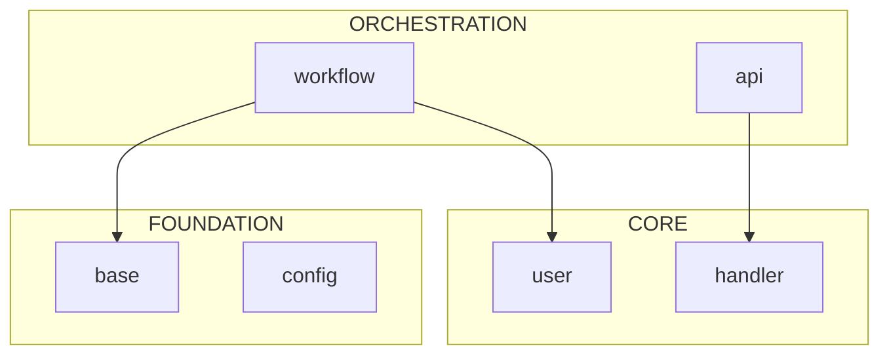

# Repo X-Ray Reference

Detailed API documentation for all X-Ray tools.

## configure.py (NEW)

### Purpose
Automatically detects project structure and generates configuration files. Eliminates manual setup for most repositories.

### Usage
```
python configure.py [directory] [--dry-run] [--backup] [--force]
```

### Arguments
| Argument | Type | Default | Description |
|----------|------|---------|-------------|
| `directory` | string | `.` | Project directory to analyze |
| `--dry-run` | flag | - | Preview without writing files |
| `--backup` | flag | - | Create .bak files before overwriting |
| `--force` | flag | - | Overwrite without prompting |

### Detection Features

| Feature | Method | Fallback |
|---------|--------|----------|
| **Project Root** | .git → pyproject.toml → setup.py | __init__.py density |
| **Root Package** | Import statement analysis | Largest package by file count |
| **Ignore Patterns** | .gitignore + defaults | Comprehensive defaults |
| **Priority Modules** | Folder name heuristics | Generic patterns |

### Output
```
============================================================
REPO X-RAY AUTO-CONFIGURATION
============================================================

[1/4] Detecting project root...
  Found: /path/to/project
  Method: git

[2/4] Detecting root package name...
  Found: mypackage

[3/4] Generating ignore patterns...
  Directories: 25
  Extensions: 21
  Files: 7

[4/4] Generating priority modules...
  critical: 3 patterns
  high: 2 patterns
  medium: 2 patterns
  low: 4 patterns
```

---

## mapper.py

### Purpose
Maps directory structure with token estimates. Identifies large files that may consume excessive context.

### Usage
```
python mapper.py [directory] [--json] [--summary]
```

### Arguments
| Argument | Type | Default | Description |
|----------|------|---------|-------------|
| `directory` | string | `.` | Directory to map |
| `--json` | flag | - | Output as JSON |
| `--summary` | flag | - | Summary only, no tree |

### Output Format (Text)
```
ROOT: src/
    core/
        workflow.py (8.2K tok)
        __init__.py (50 tok)
    models/
        user.py (4.1K tok) [MEDIUM]
        schema.py (12.5K tok) [!LARGE]

============================================================
SUMMARY
  Total files: 156
  Total tokens: 245K
  Context budget: ~122.5% of 200K window

LARGE FILES (>10K tokens) - Consider using skeleton.py instead:
   12.5K tok  models/schema.py
   ...
```

### Output Format (JSON)
```json
{
  "path": "/path/to/project",
  "total_tokens": 245000,
  "file_count": 156,
  "tree": ["ROOT: src/", "    core/", ...],
  "large_files": [
    {"path": "models/schema.py", "tokens": 12500, "formatted": "12.5K"}
  ]
}
```

---

## skeleton.py

### Purpose
Extracts Python file interfaces via AST parsing. Achieves ~95% token reduction by showing only signatures, docstring summaries, Pydantic fields, decorators, and line numbers.

### Usage
```
python skeleton.py <path> [--pattern GLOB] [--priority LEVEL] [--private] [--no-line-numbers] [--json]
```

### Arguments
| Argument | Type | Default | Description |
|----------|------|---------|-------------|
| `path` | string | required | File or directory to analyze |
| `--pattern` | string | - | Glob pattern filter (e.g., `**/base*.py`) |
| `--priority` | choice | - | Filter by priority: critical, high, medium, low |
| `--private` | flag | - | Include _private methods |
| `--no-line-numbers` | flag | - | Omit line number annotations |
| `--json` | flag | - | Output as JSON |

### Priority Levels
Defined in `configs/priority_modules.json` (auto-generated by configure.py):

| Level | Description | Common Folders |
|-------|-------------|----------------|
| critical | Core orchestration | main, app, core, workflow |
| high | Domain logic | models, schemas, api, services |
| medium | Infrastructure | utils, lib, common |
| low | Utilities | tests, docs, examples |

### Enhanced Features

| Feature | What It Shows | Example |
|---------|---------------|---------|
| Pydantic fields | Class attributes | `name: str = Field(...)  # L51` |
| Decorators | `@dataclass`, `@property` | `@dataclass` above class |
| Global constants | Module-level vars | `CONFIG = "value"  # L17` |
| Line numbers | Code location | `def method(): ...  # L42` |

### Output Format (Text)
```
# ============================================================
# FILE: src/core/workflow.py
# Tokens: 8200 -> 410 (95.0% reduction)
# ============================================================
"""Main workflow orchestration..."""

CONFIG = {"timeout": 30}  # L15

@dataclass
class WorkflowConfig:  # L20
    name: str  # L21
    timeout: int = 30  # L22

class Workflow:  # L25
    """Orchestrates the main process..."""

    def __init__(self, config: WorkflowConfig): ...  # L28
        """Initialize the workflow..."""

    async def run(self, goal: str) -> Results: ...  # L35
        """Execute the workflow..."""
```

### Output Format (JSON)
```json
{
  "files": [
    {
      "file": "src/core/workflow.py",
      "original_tokens": 8200,
      "skeleton_tokens": 410,
      "reduction": "95.0%",
      "skeleton": "class Workflow:..."
    }
  ],
  "summary": {
    "file_count": 1,
    "total_original_tokens": 8200,
    "total_skeleton_tokens": 410,
    "overall_reduction": "95.0%"
  }
}
```

---

## dependency_graph.py

### Purpose
Analyzes import relationships between Python modules. Identifies architectural layers and circular dependencies. **Now auto-detects root package from imports.**

### Usage
```
python dependency_graph.py [directory] [--root PACKAGE] [--focus STRING] [--no-auto-detect] [--mermaid] [--json]
```

### Arguments
| Argument | Type | Default | Description |
|----------|------|---------|-------------|
| `directory` | string | `.` | Directory to analyze |
| `--root` | string | auto | Root package name (auto-detected if not specified) |
| `--focus` | string | - | Focus on modules matching this string |
| `--no-auto-detect` | flag | - | Disable auto-detection of root package |
| `--mermaid` | flag | - | Output as Mermaid.js diagram |
| `--json` | flag | - | Output as JSON |

### Architectural Layers
The tool automatically categorizes modules using both import patterns AND naming conventions:

| Layer | Import Pattern | Keyword Hints |
|-------|---------------|---------------|
| **foundation** | High imported_by, low imports | util, utils, base, common, helper, config |
| **core** | Balanced | service, handler |
| **orchestration** | Low imported_by, high imports | manager, orchestrator, coordinator, workflow, pipeline |
| **leaf** | Minimal interaction | - |

### Output Format (Text)
```
======================================================================
DEPENDENCY GRAPH
======================================================================

ARCHITECTURAL LAYERS:
----------------------------------------

  ORCHESTRATION (3 modules):
    mypackage.core.workflow
      imported by: 2 | imports: 12
    mypackage.services.api
      imported by: 1 | imports: 8

  FOUNDATION (5 modules):
    mypackage.utils.base
      imported by: 15 | imports: 2
    mypackage.core.types
      imported by: 12 | imports: 0

CIRCULAR DEPENDENCIES (potential issues):
----------------------------------------
  mypackage.models.user <-> mypackage.models.schema

======================================================================
SUMMARY
  Total modules: 45
  Internal dependencies: 120
  Circular dependencies: 1
  External packages: 15
    Top: asyncio, dataclasses, json, logging, pathlib...
```

### Output Format (Mermaid)


### Output Format (JSON)
```json
{
  "modules": {
    "mypackage.core.workflow": {
      "imports": ["mypackage.utils.base", "mypackage.models.user"],
      "imported_by": ["mypackage.cli.main"]
    }
  },
  "layers": {
    "foundation": ["mypackage.utils.base", "mypackage.core.types"],
    "core": ["mypackage.models.user"],
    "orchestration": ["mypackage.core.workflow"],
    "leaf": ["mypackage.cli.main"]
  },
  "circular_dependencies": [["mypackage.models.user", "mypackage.models.schema"]],
  "external_dependencies": {
    "mypackage.core.workflow": ["asyncio", "logging"]
  },
  "summary": {
    "total_modules": 45,
    "internal_edges": 120,
    "circular_count": 1
  }
}
```

---

## Library Modules

### lib/token_estimator.py

| Function | Signature | Description |
|----------|-----------|-------------|
| `estimate_tokens` | `(text: str) -> int` | Estimate tokens for string |
| `estimate_file_tokens` | `(filepath: str) -> int` | Estimate tokens for file |
| `categorize_size` | `(tokens: int) -> str` | Get size category tag |
| `format_token_count` | `(tokens: int) -> str` | Format for display |

### lib/ast_utils.py

| Function | Signature | Description |
|----------|-----------|-------------|
| `get_skeleton` | `(filepath: str, include_private: bool, include_line_numbers: bool) -> Tuple[str, int, int]` | Extract file skeleton |
| `parse_imports` | `(filepath: str) -> Tuple[List, List]` | Parse absolute/relative imports |
| `get_class_hierarchy` | `(filepath: str) -> Dict[str, List]` | Extract class inheritance |

---

## Configuration Files

### configs/ignore_patterns.json
Auto-generated by `configure.py`. Safe to customize.
```json
{
  "directories": ["__pycache__", ".git", "venv", "node_modules", ...],
  "extensions": [".pyc", ".log", ".pkl", ...],
  "files": ["*.log", "*.jsonl", ".DS_Store", ...],
  "_comment": "Auto-generated by configure.py. Safe to customize."
}
```

### configs/priority_modules.json
Auto-generated by `configure.py` based on folder names. Safe to customize.
```json
{
  "priority_patterns": {
    "critical": {"description": "...", "patterns": ["**/core/**/*.py", ...]},
    "high": {"description": "...", "patterns": ["**/models/**/*.py", ...]},
    "medium": {"description": "...", "patterns": []},
    "low": {"description": "...", "patterns": ["**/tests/**/*.py", ...]}
  },
  "entry_points": {
    "hints": ["Look for classes with 'Workflow' or 'App' in name", ...]
  },
  "architecture_keywords": {
    "class_patterns": ["Workflow", "Manager", "Base", ...],
    "method_patterns": ["run", "execute", "process", ...]
  },
  "_comment": "Auto-generated by configure.py based on folder structure."
}
```
