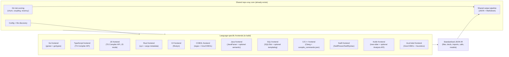
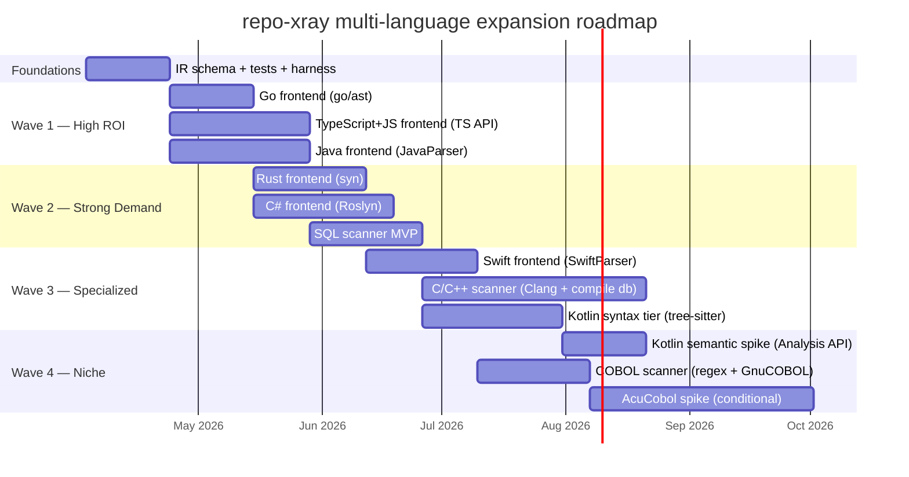

# Multi-Language Analysis Research: Extending repo-xray Beyond Python

## Executive Summary

repo-xray currently analyzes Python codebases using Python's `ast` module — a zero-dependency, deterministic, single-pass approach that extracts 42+ signals from syntax, import graphs, git history, and code patterns. This document evaluates how to replicate that approach for 13 target languages: Go, TypeScript, Rust, C#, COBOL, JavaScript, Java, SQL, C++, C, Swift, Kotlin, and AcuCobol.

**The central finding:** The quality of multi-language analysis hinges entirely on the static analysis foundation available for each language. Python's `ast` module provides a rare sweet spot — built into the language runtime, zero setup, full syntax tree access. No other language has an exact equivalent, but some come remarkably close (Go), while others require significant tradeoffs (C/C++, AcuCobol). The hybrid architecture (shared core + language-specific frontends emitting a standardised JSON IR) remains the best fit across all 13 languages, but the parsability and "pretty-good call graph" ceiling varies dramatically by language family (dynamic vs static; preprocessor-heavy vs not; tooling maturity).

**Recommendation summary:**

| Language | Best Tool | Dependency Model | Semantic Depth | Effort |
|----------|-----------|-----------------|----------------|--------|
| Go | `go/ast` + `go/types` (stdlib) | Zero-dep binary | Highest | Low |
| TypeScript | TypeScript Compiler API | Single npm pkg (`typescript`) | High | Medium |
| Rust | `syn` crate + `cargo metadata` | Compiled binary | Medium | Medium |
| C# | Roslyn (`Microsoft.CodeAnalysis`) | NuGet package | High | Medium-High |
| COBOL | Custom regex/pattern parser | Zero-dep | Low-Medium | High |
| JavaScript | TypeScript Compiler API (JS/JSX mode) | Single npm pkg (`typescript`) | Medium-High | Medium |
| Java | JavaParser + optional symbol solver | JVM + library | High | Medium |
| SQL | SQLGlot + optional SQLFluff | Python package (no deps) | Low-Medium | Medium |
| C++ | Clang tooling + compile db | Clang/LLVM libraries | High | High |
| C | Clang tooling + compile db | Clang/LLVM libraries | High | High |
| Swift | SwiftParser/SwiftSyntax | Swift toolchain | Medium-High | Medium |
| Kotlin | tree-sitter-kotlin + Kotlin Analysis API (K2) | tree-sitter runtime + grammar | Medium | Medium-High |
| AcuCobol | GnuCOBOL compat layer + tolerant heuristics | External compiler/toolchain | Low-Medium | High |

---

## What We Need to Replicate

Before evaluating tools, we must define exactly what signals repo-xray extracts and which are language-universal vs Python-specific.

### Core Signals (Language-Universal)

These signals exist in every language and form the backbone of the scanner output:

| Signal | Source Module | What It Produces |
|--------|-------------|-----------------|
| **Code skeleton** | `ast_analysis.py` | Function/method/class signatures with parameters and return types |
| **Complexity metrics** | `ast_analysis.py` | Cyclomatic complexity per function, hotspot identification |
| **Type annotation coverage** | `ast_analysis.py` | Percentage of functions with type hints |
| **Import/dependency graph** | `import_analysis.py` | Module dependency edges, layers, circular deps, orphans |
| **Cross-module call graph** | `call_analysis.py` | Who calls what across files, fan-in/fan-out, reverse lookup |
| **Side effect detection** | `ast_analysis.py` | I/O, network, DB, subprocess calls flagged by pattern matching |
| **Decorator/attribute inventory** | `ast_analysis.py` | Framework markers (`@app.route`, `#[derive]`, `[HttpGet]`) |
| **Async pattern detection** | `ast_analysis.py` | Async functions, await usage, concurrency patterns |
| **Git risk scores** | `git_analysis.py` | Churn rate, recency, co-modification coupling |
| **Test coverage mapping** | `test_analysis.py` | Which modules have tests, test patterns |
| **Tech debt markers** | `tech_debt_analysis.py` | TODO/FIXME/HACK comments |
| **Data model extraction** | `gap_features.py` | Pydantic, dataclass, TypedDict → struct/interface equivalents |
| **Entry point detection** | `gap_features.py` | Main functions, CLI handlers, HTTP routes |
| **Logic maps** | `gap_features.py` | Control flow visualization for complex functions |
| **Hazard detection** | `gap_features.py` | Large files, high complexity, low test coverage warnings |
| **Security concerns** | `gap_features.py` | eval/exec equivalents, dynamic code execution, injection risks |
| **Silent failures** | `gap_features.py` | Empty catch/except blocks, swallowed errors |
| **Async violations** | `gap_features.py` | Blocking calls inside async contexts, mixed sync/async patterns |
| **SQL string detection** | `gap_features.py` | Raw SQL strings in application code, query builder usage |
| **Deprecation markers** | `gap_features.py` | `@deprecated`, `@obsolete`, language-specific deprecation annotations |

### Language-Specific Signals to Add

Each target language has unique constructs that matter for AI orientation:

| Language | Unique Signals |
|----------|---------------|
| **TypeScript** | Interface vs type alias, union/intersection types, generic constraints, JSX components, module augmentation, declaration merging |
| **Rust** | Ownership/borrowing patterns, `unsafe` blocks, trait implementations, lifetime annotations, macro invocations, derive attributes, error handling patterns (`Result`/`Option`) |
| **Go** | Goroutine spawns, channel usage patterns, interface satisfaction, defer/panic/recover, embedded structs, build tags |
| **C#** | Nullable reference types, LINQ patterns, attribute-driven frameworks (ASP.NET, EF), partial classes, source generators, async state machines |
| **COBOL** | Division structure, level-number hierarchies (01-49, 66, 77, 88), COPY/copybook dependencies, PERFORM call graphs, EXEC SQL/CICS blocks, file I/O declarations |
| **JavaScript** | CommonJS vs ESM module mode, framework routes/components, event-driven "implied calls", JSDoc type annotations |
| **Java** | Annotation-driven endpoints, DI wiring, ORM mappings, reflection hotspots, Lombok-generated members |
| **SQL** | Lineage graph, migration sequencing, dbt model dependencies, query anti-patterns, DML/DDL classification |
| **C++** | Preprocessor footprint, macro-conditioned "variant code", template-heavy hotspots, RAII patterns |
| **C** | Preprocessor footprint, macro-conditioned "variant code", function pointer dispatch, platform-specific entry points |
| **Swift** | Protocol-oriented architecture, property wrappers, actor isolation boundaries, structured concurrency |
| **Kotlin** | `suspend` functions, coroutine builders, sealed hierarchies, extension functions |
| **AcuCobol** | Screen/UI statements, Vision file usage, embedded SQL precompiler markers, ACU-specific extensions |

---

## Design Principles for Multi-Language Support

From INTENT.md, the scanner must be:

1. **Deterministic** — Same input, same output. No LLM calls, no network requests during analysis.
2. **Fast** — 5 seconds on a 500-file codebase. Analysis speed matters because the scanner runs frequently.
3. **Zero/minimal dependencies** — The Python scanner uses only stdlib. Each language scanner should minimize external requirements.
4. **Fault-tolerant** — A single unparseable file must never crash the scan. Partial results are better than no results.
5. **Syntax-first, semantics-optional** — The Python scanner works from AST alone (no type checker, no runtime). Semantic enhancement (type resolution, call graph precision) should be an optional tier, not a requirement.

### Architecture Options

**Option A: One scanner per language (recommended)**
Each language gets its own scanner binary/script written in a language with good tooling for that target. A Go binary analyzes Go code. A Node.js script analyzes TypeScript. A Rust binary analyzes Rust. A C# tool analyzes C#.

*Pros:* Best tooling access, idiomatic analysis, can leverage each language's native AST libraries.
*Cons:* Multiple codebases to maintain, different installation requirements per language.

**Option B: Polyglot scanner using tree-sitter**
A single Python tool (extending xray.py) uses tree-sitter grammars for all languages. Tree-sitter has Python bindings and grammars for every target language.

*Pros:* Single codebase, uniform API, shared infrastructure (git analysis, formatters, config).
*Cons:* Syntax-only analysis (no type resolution for any language), tree-sitter Python bindings are an external dependency (violates zero-dep principle), CST is lower-level than language-native ASTs.

**Option C: Hybrid — shared core + language-specific frontends**
The output format, git analysis, formatters, and config system are shared. Each language has a frontend that produces a standardized intermediate representation (JSON) that feeds into shared formatters.

*Pros:* Reuses the most complex part (formatting/output), allows best-in-class parsing per language.
*Cons:* Must define and maintain a cross-language IR schema.

**Recommendation: Option C (Hybrid).** The git analysis, markdown formatter, JSON formatter, config system, and output pipeline are language-agnostic today. The language-specific part is the AST analysis pipeline (`ast_analysis.py`, `import_analysis.py`, `call_analysis.py`). Each language frontend produces the same JSON structure these modules output, and the rest of the pipeline works unchanged.

---

## Language-by-Language Analysis

---

### 1. Go — The Best Case

**Go is the most favorable language for this approach.** It has first-class AST tooling in its standard library, compiles to a zero-dependency static binary, and its type system is simple enough that static analysis captures nearly everything.

#### Tool Options

| Tool | Type | Semantic Depth | Dependencies | Speed |
|------|------|---------------|--------------|-------|
| `go/ast` + `go/parser` (stdlib) | Syntax AST | Syntax only | Zero | Fast |
| `go/types` (stdlib) | Type checker | Full type resolution | Needs Go toolchain | Moderate |
| `golang.org/x/tools/go/packages` | Package loader | Full (wraps go/types) | Needs Go toolchain | Moderate |
| `golang.org/x/tools/go/callgraph` (VTA) | Call graph | Resolved dispatch | Needs whole program | Slow |
| `golang.org/x/tools/go/ssa` | SSA IR | Data flow | Needs whole program | Slow |
| `tree-sitter-go` | CST parser | Syntax only | C library | Fast |

#### Recommended Approach: `go/ast` + `go/parser` (primary), `go/types` (optional enhancement)

**Why `go/ast` is the direct equivalent of Python's `ast` module:**
- It is part of Go's standard library — `import "go/ast"` with zero external dependencies
- It produces a strongly-typed AST with dedicated node types (`*ast.FuncDecl`, `*ast.GenDecl`, `*ast.TypeSpec`, etc.)
- It includes a built-in walker (`ast.Walk`, `ast.Inspect`) analogous to Python's `ast.NodeVisitor`
- It parses comments and associates them with nodes (unlike many parsers)
- Each file is parsed independently in milliseconds

**What `go/ast` alone provides (syntax-only tier):**

| xray Signal | Go Extraction Method | Quality |
|-------------|---------------------|---------|
| Code skeleton | `*ast.FuncDecl` for functions, `*ast.TypeSpec` for structs/interfaces | Excellent — signatures include parameter names and syntactic types |
| Complexity | Count `*ast.IfStmt`, `*ast.CaseClause`, `*ast.ForStmt`, `*ast.RangeStmt`, `*ast.CommClause` | Excellent |
| Type annotations | Go is statically typed — every parameter has an explicit type in the AST | 100% coverage by definition |
| Import graph | `*ast.ImportSpec` gives import paths directly | Excellent — Go imports are explicit file paths |
| Call sites | `*ast.CallExpr` with function name extraction | Good — unresolved through interfaces |
| Side effects | Pattern-match on known I/O package calls (`os.`, `net/http.`, `database/sql.`) | Good |
| Async/concurrency | `*ast.GoStmt` (goroutines), `*ast.SendStmt`/`*ast.UnaryExpr` with `<-` (channels), `*ast.SelectStmt` | Excellent — all goroutine/channel usage is syntactically visible |
| Decorator equivalents | N/A — Go has no decorators. Struct tags (`json:"name"`) are extractable from `*ast.Field.Tag` | Different but useful |
| Data models | `*ast.StructType` with fields, tags, embedded types | Excellent |
| Entry points | `func main()` in `package main`, `func init()`, HTTP handler signatures | Excellent |

**What `go/types` adds (semantic tier, requires Go toolchain on target):**

- Resolved types for every expression (turns `x` into `*http.Request`)
- Interface satisfaction (knows that `MyHandler` implements `http.Handler`)
- Cross-package reference resolution (follows imports to definitions)
- Method set computation (all methods on a type, including promoted methods from embedded structs)
- Constant evaluation

**What `golang.org/x/tools/go/callgraph/vta` adds (deep tier, expensive):**

- Precise call graph through interfaces (resolves dynamic dispatch)
- Dead code detection (unreachable functions)
- Full fan-in/fan-out with resolved targets

#### Why Go is Easiest

1. **No macros, no code generation, no metaprogramming.** What you see in the source is what runs. Unlike Rust (macros), TypeScript (decorators + build transforms), or C# (source generators), Go's static analysis sees everything.
2. **Explicit types everywhere.** No type inference to resolve (except `:=` short variable declarations, which `go/types` handles). The syntax tree contains complete type information.
3. **Simple module system.** Import paths map directly to directories. No complex module resolution rules like Node.js or Rust.
4. **Single binary deployment.** The analyzer compiles to a static binary with zero runtime dependencies. Users don't need Go installed to run the syntax-only tier.
5. **No inheritance.** Go's composition model (embedding + interfaces) is simpler to analyze statically than deep inheritance hierarchies.

#### Deployment

```
# Build the analyzer
go build -o xray-go ./cmd/xray-go

# Run it (no Go installation needed on target for syntax-only)
./xray-go /path/to/go/project

# Enhanced mode (needs Go toolchain for type resolution)
./xray-go --semantic /path/to/go/project
```

Output: same JSON schema as Python xray → feeds into shared markdown/JSON formatters.

#### Effort Estimate

A Go scanner matching Python xray's signal coverage could be built with approximately:
- `ast_analysis.go`: ~800 lines (skeleton + complexity + side effects + concurrency patterns)
- `import_analysis.go`: ~400 lines (import graph from AST, layer classification)
- `call_analysis.go`: ~300 lines (syntactic call extraction, cross-file matching)
- Shared utilities: ~200 lines
- Total: **~1,700 lines of Go**, zero external dependencies

---

### 2. TypeScript — The Pragmatic Choice

TypeScript analysis has a clear winner: the TypeScript Compiler API. It provides both syntax-only parsing (fast, zero-project-setup) and full semantic analysis (type resolution, cross-module references) through a single dependency.

#### Tool Options

| Tool | Type Resolution | Speed (parse) | Dependencies | AST Quality |
|------|----------------|---------------|--------------|-------------|
| **TypeScript Compiler API** | Full | Moderate | `typescript` npm pkg only | Native, complete |
| ts-morph | Full (wraps TS) | Same as TS API | 3 npm packages | Convenience wrapper |
| @typescript-eslint/parser | Full (via TS) | Same as TS API | 4+ npm packages | ESTree (lossy conversion) |
| SWC | None | Very fast (Rust-based) | Native binary | Custom format |
| Babel parser | None | Fast | Pure JS, light | Babel AST |
| tree-sitter-typescript | None | Fast | C library | CST (verbose) |
| OXC | None | Very fast (Rust-based) | WASM/native | ESTree |

**The clear dividing line:** Only the TypeScript Compiler API (and wrappers around it) provides type resolution. Every other option is syntax-only. Since type resolution is what makes the analysis valuable (resolving imports, following inheritance, building accurate call graphs), the Compiler API is the only serious contender.

#### Recommended Approach: TypeScript Compiler API directly

**Two operating modes:**

1. **`ts.createSourceFile()` — syntax-only, fast, zero project setup**
   - Parses a single file into an AST (~1ms per file)
   - No `tsconfig.json` needed
   - Extracts: function/class/interface declarations, type annotations as written, import statements, decorator syntax, complexity metrics, JSX components

2. **`ts.createProgram()` — full semantic analysis, needs project context**
   - Loads via `tsconfig.json`, builds the type checker
   - 5-30 seconds for a large project (same cost as `tsc --noEmit`)
   - Adds: resolved types, cross-module references, class hierarchy traversal, interface implementation checking, overload resolution, generic instantiation

**What each mode provides:**

| xray Signal | Syntax-only (`createSourceFile`) | Semantic (`createProgram`) |
|-------------|----------------------------------|---------------------------|
| Code skeleton | Declarations with parameter names and written types | + resolved types, inferred return types |
| Complexity | Branch counting (`if`, `switch`, `for`, ternary, `&&`/`||`) | Same |
| Type coverage | Presence of `: Type` annotations | + inferred types for unannotated code |
| Import graph | `import` statements with paths | + resolved module targets |
| Call graph | `CallExpression` nodes with syntactic names | + resolved function targets through interfaces/types |
| Side effects | Pattern matching on `fetch()`, `fs.`, `console.`, DOM mutations | + type-based detection (knows if arg is `WritableStream`) |
| Decorators | `@decorator` syntax nodes | + resolved decorator functions |
| Async patterns | `async`/`await` keywords | + Promise type resolution |
| Data models | `interface`, `type`, `class` declarations | + resolved generic parameters, extended types |
| Entry points | `export default`, named exports, Express/Next.js route patterns | + type-based framework detection |
| JSX components | `<Component>` elements | + prop type resolution |

**Why not ts-morph?** ts-morph wraps the Compiler API with convenience methods (`.getClasses()`, `.getFunctions()`). This is nice for quick scripts but adds a dependency and abstraction layer. For a tool that needs deep, controlled access to the compiler (our use case), you end up calling through to `.compilerNode` frequently anyway. Start with the raw API.

**Why not SWC/Babel/tree-sitter?** These are all syntax-only parsers. They're faster but lack type resolution. The speed advantage is irrelevant — the type checker dominates analysis time anyway, and even syntax-only analysis of a 5,000-file project takes under 5 seconds with the TS Compiler API.

#### The `typescript` Package as Sole Dependency

The `typescript` npm package is the equivalent of Python's `ast` module — it is the language's own tooling. Key facts:
- Pure JavaScript, no native modules, no build step required
- ~45MB installed, zero transitive dependencies
- The analyzer can be a plain `.js` file: `const ts = require("typescript")`
- Runs anywhere Node.js runs (Node 14+)
- Extremely stable — Microsoft ships new releases quarterly, core APIs haven't broken in years

**Minimal setup:**
```
mkdir xray-ts && cd xray-ts
npm init -y && npm install typescript
# Write analyze.js (plain JS, no transpilation needed)
node analyze.js /path/to/ts/project
```

#### Key Gotchas

1. **No built-in visitor pattern.** You write recursive `ts.forEachChild(node, visitor)`. Manageable but less ergonomic than Python's `ast.NodeVisitor`.
2. **The AST is a concrete syntax tree.** Every token (parentheses, semicolons, commas) is a node. More verbose to walk but nothing is lost.
3. **Compiler API is technically "internal."** Microsoft doesn't version it as stable API, but in practice the core surface (`createProgram`, `TypeChecker`, `Node` types) has been stable for years. The ecosystem depends on it.
4. **Memory-heavy for semantic analysis.** Large monorepos can use 1-4 GB for the type checker. Syntax-only mode is lightweight.
5. **Project references and monorepos** add complexity. A monorepo with 50 `tsconfig.json` files requires loading multiple programs or using the project references API.

#### Deployment

```
# Option 1: Ship as Node.js script
node xray-ts.js /path/to/project

# Option 2: Bundle with pkg/nexe for single binary
npx pkg xray-ts.js --target node18-linux-x64

# Option 3: Use Deno for single-file execution
deno run --allow-read xray-ts.ts /path/to/project
```

#### Effort Estimate

- `ast_analysis.ts`: ~1,000 lines (skeleton + complexity + side effects + JSX + decorators)
- `import_analysis.ts`: ~500 lines (import graph, module resolution)
- `call_analysis.ts`: ~400 lines (call expression extraction, cross-file matching)
- `type_analysis.ts`: ~300 lines (type coverage, interface/type alias extraction)
- Total: **~2,200 lines of TypeScript/JavaScript**, single npm dependency

---

### 3. Rust — The Macro Problem

Rust is the trickiest modern language for static analysis. The language itself is richly typed and statically analyzable in theory, but Rust's pervasive macro system means a pure syntax parser sees a meaningfully incomplete picture. The gap between syntax-only and semantic analysis is wider in Rust than in any other language on this list.

#### Tool Options

| Tool | Type Resolution | Macro Expansion | Dependencies | API Stability |
|------|----------------|-----------------|--------------|---------------|
| **`syn`** (crate) | None | None | Pure Rust, compiles to binary | Excellent (v2) |
| **`ra_ap_syntax`** (rust-analyzer syntax) | None | None | Pure Rust | Unstable (weekly releases) |
| **`ra_ap_hir`** (rust-analyzer semantic) | Full | Yes | Heavy dep tree + Rust toolchain | Unstable |
| `rustc` internals (`rustc_private`) | Full + borrow checker | Yes | Nightly Rust only | None (changes weekly) |
| `tree-sitter-rust` | None | None | C library | Good |
| `cargo metadata` (subcommand) | N/A | N/A | Needs `cargo` | Stable JSON format |

#### The Macro Problem — Quantified

This is the key issue. Rust macros generate code that is invisible to any syntax-only parser:

- **Derive macros** (`#[derive(Debug, Clone, Serialize)]`): Generate `impl` blocks. In a typical web service using `serde`, `clap`, `sqlx`, `axum` — derive macros generate 20-40% of the effective code.
- **Attribute macros** (`#[tokio::main]`, `#[test]`, `#[async_trait]`): Transform function signatures and bodies.
- **Declarative macros** (`macro_rules!`): `vec![]`, `println!()`, custom DSLs. The invocation is visible but the expansion is not.
- **Function-like proc macros** (`sqlx::query!("SELECT ...")`, `html! { <div>...</div> }`): Generate entire expression trees.

**Is this a dealbreaker?** No, for the same reason Python's `ast` module works despite metaclasses and decorators generating code at runtime. The scanner extracts *the code humans wrote and read*, which is what an AI assistant needs for orientation. Knowing `#[derive(Serialize)]` is on a struct is more useful for navigation than seeing the generated `impl Serialize` block.

#### Recommended Approach: `syn` crate (primary), `cargo metadata` (complement)

**Why `syn`:**
- The dominant Rust parsing crate — the foundation of the entire proc-macro ecosystem
- Maintained by David Tolnay (one of the most prolific Rust contributors)
- Strongly-typed AST: `ItemFn`, `ItemStruct`, `ItemEnum`, `ItemTrait`, `ImplBlock` — each with typed fields
- Pure Rust, compiles to a static binary with zero runtime requirements
- Stable API (v2 was a careful rewrite)
- Parses any valid Rust syntax including all macro invocations (as opaque token streams)

**Why not `ra_ap_hir` (rust-analyzer)?**
- Full semantic analysis (type resolution, macro expansion, trait resolution, cross-module references)
- BUT: API changes weekly, massive dependency tree, requires Rust toolchain + compiled project for proc-macro expansion
- Setup is ~500+ lines of boilerplate just to create an `AnalysisHost`
- Right choice for a dedicated Rust IDE tool, wrong choice for a lightweight scanner

**Why not `rustc_private`?**
- Everything the compiler knows (types, lifetimes, borrow checker, MIR)
- BUT: nightly-only forever (explicit policy), API breaks weekly, requires full compilation of target project
- Only viable if you're building something that ships with the Rust toolchain (like Clippy)

**What `syn` provides:**

| xray Signal | Extraction Method | Quality |
|-------------|------------------|---------|
| Code skeleton | `ItemFn` (signatures), `ItemStruct`/`ItemEnum` (type defs), `ItemTrait` (interfaces), `ImplBlock` (implementations) | Excellent — full signatures with generics, lifetimes, where clauses |
| Complexity | Count `If`, `Match` arms, `While`, `Loop`, `For`, `?` operator | Good |
| Type annotations | Rust is statically typed — all params and return types in the AST | 100% (explicit types only; `impl Trait` returns stay opaque) |
| Import graph | `UseTree` items give `use` paths; `mod` declarations give module structure | Good — need to implement module resolution (file path conventions) |
| Call graph | `ExprCall` and `ExprMethodCall` with syntactic names | Medium — cannot resolve trait method dispatch |
| Side effects | Pattern match on `std::fs::`, `std::net::`, `tokio::`, `reqwest::` calls | Good |
| Unsafe detection | `unsafe` blocks, `unsafe fn`, `unsafe impl`, `unsafe trait` | Excellent — all syntactically visible |
| Attribute inventory | `#[derive(...)]`, `#[cfg(...)]`, `#[test]`, custom attributes | Excellent |
| Async patterns | `async fn`, `.await` expressions | Excellent |
| Error handling | `Result<T, E>` return types, `?` operator usage, `.unwrap()` calls | Good |
| Data models | `struct` (named, tuple, unit), `enum` with variants | Excellent |
| Lifetime annotations | Lifetime parameters on functions and types | Excellent |

**What `cargo metadata` adds (requires `cargo` on target):**
- Complete dependency graph with versions, features, and sources
- Workspace structure
- Target information (lib, bin, test, example, bench)
- Feature flag configurations
- Stable JSON output format — trivial to parse from any language

**Module resolution (must implement manually):**
`syn` parses individual files. To build a cross-file picture, you must follow `mod` declarations:
- `mod foo;` → look for `foo.rs` or `foo/mod.rs` (Rust 2015) or `foo.rs` with `foo/` subdirectory (Rust 2018+)
- This is ~100 lines of path-walking logic
- `use crate::foo::Bar` → resolve against the module tree you built

#### Key Honest Assessment

Rust syntax-only analysis gives you roughly **70-80% of the useful signals** compared to Python's AST analysis. The 20-30% gap comes from:
- Macro-generated code being invisible (~15% of the gap)
- Trait method dispatch being unresolvable without type info (~10%)
- Generic type instantiation being opaque (~5%)

For an AI coding assistant's orientation needs, this is acceptable. The scanner tells you the structure, the agent layer reads the actual code.

#### Deployment

```
# Build the analyzer (produces a static binary)
cargo build --release
# Binary at target/release/xray-rust (~2-5 MB stripped)

# Run it (no Rust installation needed on target)
./xray-rust /path/to/rust/project
```

#### Effort Estimate

- `ast_analysis.rs`: ~1,200 lines (skeleton + complexity + unsafe + async + attributes + error patterns)
- `module_resolver.rs`: ~200 lines (follow `mod` declarations to build file tree)
- `import_analysis.rs`: ~400 lines (use tree parsing, dependency graph)
- `call_analysis.rs`: ~350 lines (call expression extraction, cross-file name matching)
- `cargo_metadata.rs`: ~150 lines (invoke `cargo metadata`, parse JSON)
- Total: **~2,300 lines of Rust**, `syn` as sole code dependency + `cargo metadata` subprocess

---

### 4. C# — The Roslyn Advantage

C# has Roslyn — the official open-source compiler platform from Microsoft. Roslyn is the most powerful static analysis platform of any language on this list. The challenge is that extracting its full power requires project context that may not always be available.

#### Tool Options

| Tool | Semantic Depth | Dependencies | Needs Project File? | Deployment |
|------|---------------|--------------|--------------------|----|
| **Roslyn SyntaxTree** | Syntax only | `Microsoft.CodeAnalysis.CSharp` NuGet | No | Self-contained .NET binary |
| **Roslyn SemanticModel** | Full type resolution | Same + MSBuild/NuGet | Yes (for full fidelity) | Needs .NET SDK on target |
| Roslyn ad-hoc compilation | Partial (BCL types only) | Same | No | Self-contained .NET binary |
| tree-sitter-c-sharp | Syntax only | C library | No | Small binary |
| Mono.Cecil | IL-level (compiled assemblies) | NuGet | Needs `dotnet build` first | .NET binary |
| NDepend | Everything | Commercial license | Yes | Windows-centric |

#### Recommended Approach: Roslyn syntax-only (primary), ad-hoc compilation (enhancement), MSBuild workspace (optional full fidelity)

**Three-tier architecture:**

**Tier 1 — Syntax-only (`CSharpSyntaxTree.ParseText()`):**
- Parses any `.cs` file as a standalone string — no project file needed
- Zero setup, fast (milliseconds per file), fault-tolerant (Roslyn's parser is error-recovering)
- This is the equivalent of Python's `ast.parse()` — works on any source text

**Tier 2 — Ad-hoc compilation with BCL references:**
- Create a `CSharpCompilation` from all parsed syntax trees + the .NET runtime assemblies
- Resolves standard library types (`string`, `int`, `Task`, `List<T>`, LINQ, etc.)
- NuGet types appear as `ErrorType` — accepted, not crashed on
- Gets you partial type resolution, basic inheritance chains within the codebase

**Tier 3 — MSBuild workspace (if .NET SDK is available):**
- `MSBuildWorkspace.Create().OpenProjectAsync("Foo.csproj")`
- Full type resolution including NuGet packages
- Requires `dotnet restore` to have been run
- 10-30 seconds for a large solution

**Signal extraction by tier:**

| xray Signal | Tier 1 (Syntax) | Tier 2 (Ad-hoc) | Tier 3 (MSBuild) |
|-------------|----------------|-----------------|------------------|
| Code skeleton | Full declarations with written types | + resolved `var` types | + NuGet types resolved |
| Complexity | Branch counting | Same | Same |
| Type annotations | As written (including `var` = unknown) | `var` resolved for BCL types | All types resolved |
| Import graph | `using` directives | Same | + actual symbol usage |
| Call graph | Syntactic method names (ambiguous) | Partially resolved | Fully resolved |
| Side effects | Pattern matching on I/O call names | + type-based detection | + full `IDisposable` tracking |
| Attributes | `[AttributeName]` as text | + resolved attribute types | Same |
| Async patterns | `async`/`await` keywords | + Task type resolution | Same |
| Nullable analysis | `?` annotation syntax | Partial flow analysis | Full flow analysis |
| Data models | Class/record/struct declarations | + inheritance within codebase | + EF entity relationships |
| Entry points | `static void Main`, `[ApiController]`, `Program.cs` top-level | Same | + full ASP.NET routing |
| LINQ patterns | Query syntax and method syntax | Same | + resolved extension methods |
| Partial classes | Each fragment separately | Merged within source files | Fully merged including generated |

#### The Source Generator Problem

Modern C# makes heavy use of source generators — compile-time code generation that produces `.cs` files:
- `System.Text.Json` generates serialization code
- `Microsoft.Extensions.Logging` generates logging methods
- ASP.NET generates endpoint routing
- gRPC generates client/server stubs
- Regex source generator produces optimized matchers

**Impact:** A syntax-only scan of a modern ASP.NET app may miss 10-30% of the type surface. For a console app or class library, the gap is 0-5%.

**Mitigation:** Tier 3 (MSBuild workspace) runs source generators automatically. For Tiers 1-2, flag `partial class` declarations as potentially incomplete and note which source generator attributes are present (e.g., `[GeneratedRegex]`, `[JsonSerializable]`).

#### Additional C#-specific signals worth extracting:

- **Nullable reference type annotations** (`string?` vs `string`, `#nullable enable`)
- **Record types** (C# 9+) — immutable data models with value equality
- **Primary constructors** (C# 12) — constructor parameters on the type declaration
- **Pattern matching** (`is`, `switch` expressions with patterns) — affects complexity metrics
- **Extension methods** — invisible at call sites in syntax-only mode (look like instance methods)
- **`IDisposable` / `using` patterns** — resource management signals
- **Dependency injection registration** (in `Startup.cs` / `Program.cs`) — wiring map

#### Deployment

```bash
# Build self-contained single-file binary
dotnet publish -r linux-x64 --self-contained -p:PublishSingleFile=true -o ./out

# Run (no .NET runtime needed on target for syntax-only)
./out/xray-csharp /path/to/csharp/project

# Full fidelity mode (needs .NET SDK for MSBuild)
./out/xray-csharp --full /path/to/csharp/project
```

Binary size: ~30-50 MB self-contained (syntax-only), ~100-150 MB (with MSBuild support).

#### Effort Estimate

- `SyntaxAnalyzer.cs`: ~1,000 lines (skeleton + complexity + attributes + async + nullable + patterns)
- `ImportAnalyzer.cs`: ~400 lines (using directives, namespace structure, .csproj parsing)
- `CallAnalyzer.cs`: ~400 lines (invocation extraction, cross-file matching)
- `SemanticEnhancer.cs`: ~500 lines (ad-hoc compilation setup, type resolution)
- Total: **~2,300 lines of C#**, `Microsoft.CodeAnalysis.CSharp` as primary dependency

---

### 5. COBOL — The Hard Case

COBOL is a genuinely different beast. The difficulty isn't the language itself (it's syntactically verbose but structurally simple) — it's the ecosystem: dialect fragmentation, preprocessor complexity, and environmental coupling to mainframe subsystems (JCL, DB2, CICS, IMS).

That said, for structural extraction, COBOL is more tractable than most people assume. Its rigidity and verbosity actually make pattern-based parsing viable.

#### Tool Options

| Tool | Parse Quality | Dependencies | COPY Resolution | Dialect Coverage |
|------|--------------|--------------|-----------------|-----------------|
| **Custom regex/pattern parser** | 85-90% | Zero | Manual (if copybooks available) | Configurable |
| **ANTLR COBOL 85 grammar** | 90-95% | ANTLR runtime | Java preprocessor available | COBOL 85 + some IBM |
| **tree-sitter-cobol** | 85-90% | C library | No | COBOL 85 core |
| **GnuCOBOL preprocessor** (`cobc -E`) | N/A (preprocessor only) | GnuCOBOL installation | Yes (primary value) | COBOL 85 + IBM/MF extensions |
| Eclipse Che4z COBOL LSP | 95%+ | Java + LSP | Yes (incl. mainframe) | IBM Enterprise COBOL |
| Micro Focus Enterprise Analyzer | 99% | Commercial license | Yes | All major dialects |

#### Why Regex/Pattern Parsing is Viable for COBOL

Unlike modern languages where metaprogramming, closures, and complex expressions make regex parsing hopeless, COBOL has properties that make line-by-line extraction practical:

- **Fixed-format structure:** Columns 1-6 are sequence numbers, column 7 is an indicator (`*` = comment, `-` = continuation), columns 8-72 are code. This is a machine-readable format by design.
- **Explicit division headers:** `IDENTIFICATION DIVISION.`, `ENVIRONMENT DIVISION.`, `DATA DIVISION.`, `PROCEDURE DIVISION.` are unambiguous markers.
- **Rigid data declarations:** Level numbers (01-49, 66, 77, 88) with PIC clauses follow strict patterns: `01 CUSTOMER-RECORD.` then `05 CUST-NAME PIC X(30).`
- **Simple control flow keywords:** `PERFORM`, `CALL`, `GO TO`, `IF`/`EVALUATE` — all keyword-initiated, period-terminated.
- **No expressions with operator precedence** (mostly). `COMPUTE` has arithmetic but structural analysis doesn't need to parse it.

#### Recommended Approach: Custom regex parser (primary), GnuCOBOL preprocessing (optional enhancement)

**Phase 1 — Column handler and preprocessor:**
```
1. Detect format (fixed vs free) from >>SOURCE FORMAT directive or heuristics
2. Strip columns 1-6 (sequence numbers) and 73-80 (identification area)
3. Check column 7: '*' or '/' = comment, '-' = continuation, 'D' = debug
4. Join continuation lines
5. Normalize to single logical lines
```

**Phase 2 — Division splitting and per-division extraction:**

| COBOL Division | Extractable Signals | Regex Reliability |
|---------------|--------------------|--------------------|
| **IDENTIFICATION** | Program name, author, date | 95%+ |
| **ENVIRONMENT** | SELECT/ASSIGN (file → physical name), SPECIAL-NAMES | 95%+ |
| **DATA** | Level hierarchies, PIC clauses, USAGE, REDEFINES, OCCURS, 88-level conditions, FD/SD entries, WORKING-STORAGE vs LINKAGE vs LOCAL-STORAGE | 90%+ |
| **PROCEDURE** | Paragraph/section names, PERFORM targets, CALL targets, GO TO targets, EXEC SQL/CICS blocks, IF/EVALUATE nesting | 85-90% |

**What the regex approach handles well:**

| xray Signal Equivalent | COBOL Extraction | Reliability |
|----------------------|-----------------|-------------|
| Code skeleton | Paragraph/section names, CALL interface (LINKAGE SECTION) | 90%+ |
| Complexity | Count IF/EVALUATE/PERFORM UNTIL nesting depth | 85% |
| Data models | Level-number hierarchies with PIC clauses = complete data layout | 90%+ |
| Import graph | COPY statement dependencies (copybook names) | 95%+ |
| Call graph | PERFORM paragraph targets + CALL program targets | 85-90% |
| File I/O | SELECT/ASSIGN + FD entries = complete file map | 95%+ |
| Side effects | EXEC SQL (DB), EXEC CICS (transaction), CALL (external), file I/O verbs (READ/WRITE/REWRITE/DELETE) | 90%+ |
| Entry points | PROCEDURE DIVISION header, ENTRY statements | 95%+ |
| External dependencies | EXEC SQL tables/views, CALL program names | 85% |
| Condition names | 88-level items (business rule flags) | 95%+ |

**What the regex approach struggles with:**

- **Inline PERFORM blocks** — `PERFORM ... END-PERFORM` requires scope tracking beyond simple regex
- **Nested IF/EVALUATE** — Counting nesting depth requires a simple state machine
- **COPY REPLACING** with complex patterns — Textual substitution logic
- **PERFORM THRU** — Control flow depends on paragraph ordering in source, not just the target name
- **Reference modification** — `FIELD(start:length)` inside expressions
- **Continuation of string literals** across lines

**GnuCOBOL enhancement (Tier 2):**
If GnuCOBOL is installed, `cobc -E program.cbl` produces copybook-expanded source. This solves the hardest problem (COPY resolution) and gives the regex parser cleaner input. Detection: check if `cobc` is on PATH.

#### COBOL-Specific Signals Worth Extracting

These are unique to COBOL and critical for AI orientation in mainframe codebases:

1. **Data hierarchy as a tree.** COBOL's level numbers (01→05→10→15) define a hierarchical data structure analogous to nested structs. This IS the data model — there are no classes.

2. **88-level condition names.** These are named boolean conditions on data items: `88 IS-ACTIVE VALUE 'A'.` They encode business rules directly in the data division.

3. **COPY dependency graph.** Copybooks are shared data structures. Mapping which programs use which copybooks reveals shared data contracts.

4. **PERFORM call graph.** COBOL programs are structured as paragraphs that PERFORM each other. The paragraph call graph IS the control flow — there are no function calls in the modern sense.

5. **EXEC block inventory.** `EXEC SQL`, `EXEC CICS`, `EXEC DLI` blocks reveal what external subsystems the program interacts with. This is the equivalent of import analysis for mainframe dependencies.

6. **File section mapping.** `SELECT file-name ASSIGN TO dd-name` + `FD file-name` defines the program's I/O interface. The `dd-name` connects to JCL, which connects to physical datasets.

7. **WORKING-STORAGE vs LINKAGE.** WORKING-STORAGE is private state; LINKAGE SECTION is the program's public API (parameters received via CALL). This distinction is the closest COBOL has to public/private visibility.

#### Honest Difficulty Assessment

| Aspect | Difficulty | Notes |
|--------|-----------|-------|
| Parsing standard COBOL | Moderate | Verbose but regular syntax |
| Column handling (fixed format) | Easy | 50 lines of code |
| Continuation lines | Easy-Medium | Known algorithm |
| COPY resolution | Medium-Hard | Need copybook paths, REPLACING logic |
| Data division extraction | Easy-Medium | Level numbers are mechanical |
| PERFORM call graph | Medium | Must handle THRU and inline PERFORM |
| EXEC block extraction | Easy | Delimited by EXEC...END-EXEC |
| Dialect differences | Hard | IBM vs Micro Focus vs GnuCOBOL extensions |
| Full complexity metrics | Medium | Requires scope tracking for nesting |
| Overall effort | **Medium-High** | Higher than any modern language due to format handling |

#### Deployment

Since the zero-dep approach is a custom parser, this could be:
- A Python module (extending xray.py directly — COBOL has no Python AST module, but the regex approach is pure Python)
- A standalone script in any language
- Part of the hybrid architecture, producing the same JSON output schema

#### Effort Estimate

- `cobol_parser.py`: ~600 lines (column handling, continuation joining, division splitting)
- `cobol_data_analysis.py`: ~500 lines (level hierarchies, PIC parsing, 88-levels, REDEFINES)
- `cobol_procedure_analysis.py`: ~500 lines (paragraph extraction, PERFORM graph, CALL targets)
- `cobol_environment_analysis.py`: ~200 lines (SELECT/ASSIGN, EXEC blocks, file descriptions)
- Total: **~1,800 lines of Python**, zero external dependencies

---

### 6. JavaScript — The Largest Addressable Market

JavaScript has the largest addressable market (66% of developers worked with it in the past year) and appears in nearly every polyglot codebase. The core tradeoff: structural signals are readily extractable, but high-quality interprocedural call graphs remain a known research problem due to JavaScript's dynamic nature.

#### Tool Options

| Tool | Type Resolution | Speed | Dependencies | API Stability |
|------|----------------|-------|--------------|---------------|
| **TypeScript Compiler API** (JS/JSX mode) | Yes (optional via JSDoc) | Medium | Node + `typescript` | High (widely used) |
| Babel parser (`@babel/parser`) | No (syntax only) | Fast | Node + Babel packages | Medium |
| Acorn (+ JSX plugin) | No | Very fast | Node + small deps | Medium |
| Espree (ESLint parser) | No (ESTree) | Fast | Node + ESLint ecosystem | Medium |
| tree-sitter-javascript | No | Fast | tree-sitter runtime (native/WASM) | Medium |

#### Recommended Approach: TypeScript Compiler API in JS/JSX mode

**Why reuse the TypeScript Compiler API for JavaScript:**
- TypeScript explicitly supports parsing JavaScript and JSX files
- TypeScript can derive type information from JavaScript via JSDoc annotations when present
- Unifies the JS and TS scanning frontends (one AST model, reduced maintenance)
- `ts.createSourceFile()` works identically on `.js` and `.jsx` files

**Two operating modes (same as TypeScript):**

1. **`ts.createSourceFile()` — syntax-only, fast**
   - Parses JS/JSX into the same AST as TypeScript
   - Functions, classes, arrow functions, exports all visible
   - CommonJS `require()` and ESM `import` both extractable

2. **`ts.createProgram()` with `allowJs` + `checkJs` — partial semantic analysis**
   - Derives types from JSDoc when present (`@param`, `@returns`, `@type`)
   - Provides type inference for many patterns even without annotations
   - Requires project context (`jsconfig.json` or `tsconfig.json` with `allowJs`)

**Signal extraction:**

| xray Signal | Syntax-Only | With Type Resolution | Notes |
|-------------|-------------|---------------------|-------|
| Code skeletons | Excellent | Excellent | Functions/classes visible; arrow functions and exports require conventions |
| Complexity | Excellent | Excellent | Branches, ternaries, logical ops are syntactic |
| Type annotation coverage | Partial | Good | JS lacks types; JSDoc can supply types and TS can derive typings |
| Import/dependency graph | Good | Excellent | ESM imports easy; CommonJS `require()` is syntactic but dynamic requires heuristic |
| Cross-module call graph | Partial | Good | Static call graphs for JS are known-hard; syntax-only misses dynamic dispatch, callbacks, event emitters |
| Side effect detection | Good | Good | Pattern-match `fs`, `fetch`, network libs |
| Security concerns | Excellent | Excellent | `eval`, `Function()`, dynamic import patterns |
| Silent failures | Good | Good | Empty `catch` blocks are syntactic |
| Async/concurrency | Excellent | Excellent | `async/await`, Promises are syntactic; event-driven edges require heuristics |
| Decorators | Partial | Good | Decorators are proposal-dependent; frameworks often use function wrappers instead |
| Data models | Partial | Good | Classes exist; many models are plain objects or external schemas |
| Entry points | Good | Good | `package.json` scripts and framework conventions drive this |
| SQL string detection | Good | Good | Tagged templates and raw strings identifiable |
| Deprecation markers | Partial | Partial | No universal marker; JSDoc `@deprecated` can be parsed |

#### Key Honest Assessment

JavaScript's call graph precision is a known research problem. Syntax-only extraction delivers useful *structural* signals, but interprocedural call graphs suffer from callbacks, event emitters, dynamic `require()`, and prototype-based dispatch. Expect roughly **65% of Python-equivalent signal quality** at the syntax-only tier, improving to **~75% with project metadata** and **~85% with full semantic analysis** (still limited by inherently dynamic features).

For onboarding orientation, the structural signals (skeletons, imports, side effects, entry points) carry most of the value. The imprecise call graph is supplementary, not load-bearing.

#### Deployment

```bash
# Unified with TypeScript frontend
node xray-ts.js --language js /path/to/project

# Or bundled as single binary
npx pkg xray-ts.js --target node18-linux-x64
```

#### Effort Estimate

Incremental on top of the TypeScript frontend:
- JS/JSX-specific handling: ~300 lines (CommonJS detection, JSDoc extraction, module mode detection)
- Framework pattern recognition: ~200 lines (Express routes, React components, event patterns)
- Total incremental: **~500 lines** on top of the TypeScript scanner
- Standalone: **~2,700 lines of JavaScript** including shared TS/JS infrastructure

---

### 7. Java — The Enterprise Workhorse

Java has high enterprise prevalence (29.4% of developers), large codebases, and strong onboarding value. Its robust tooling ecosystem offers a clear syntax-first path with optional semantic enhancement.

#### Tool Options

| Tool | Type Resolution | Speed | Dependencies | API Stability |
|------|----------------|-------|--------------|---------------|
| **JavaParser** | Optional (via symbol solver) | Fast-Medium | JVM + library | Medium |
| javac Tree API (`JavacTask`) | Yes (analyse stage) | Medium | JDK toolchain | Medium (some internals not supported API) |
| Eclipse JDT ASTParser | Optional (bindings recovery) | Medium | JVM + Eclipse libs | Medium |
| tree-sitter-java | No | Fast | tree-sitter runtime + grammar | Medium |

#### Recommended Approach: JavaParser (primary), javac/JDT for optional semantic tier

**Why JavaParser:**
- Explicitly an AST library designed for standalone use (not embedded in an IDE or compiler)
- Parses individual `.java` files without project context
- Optional symbol solving for type resolution when classpath/project info is available
- Active maintenance and community

**Why not javac Tree API?** The javac Tree API supports parse and analyse stages, but some compiler internals are explicitly "not supported API." Suitable as a semantic-tier backend when full JDK context is available, but not ideal as the primary parser.

**Two operating modes:**

1. **JavaParser syntax-only — fast, no project setup**
   - Parses individual files into an AST
   - Extracts declarations, annotations, imports, control flow
   - No classpath or build system needed

2. **JavaParser with symbol solver — semantic tier**
   - Resolves types against classpath
   - Builds accurate cross-module references
   - Requires `javac` or Maven/Gradle output on the classpath

**Signal extraction:**

| xray Signal | Syntax-Only | With Type Resolution | Notes |
|-------------|-------------|---------------------|-------|
| Code skeletons | Excellent | Excellent | Declarations are fully explicit |
| Complexity | Excellent | Excellent | `if/for/while/switch/catch` nodes |
| Type annotation coverage | Good | Excellent | Java is statically typed; `var` inference and lambdas benefit from semantics |
| Import/dependency graph | Excellent | Excellent | `import` and package structure |
| Cross-module call graph | Partial | Excellent | Virtual dispatch and interfaces need semantic model for precision |
| Side effect detection | Good | Good | Identify IO/network/DB APIs; semantics reduces false positives |
| Security concerns | Good | Good | Reflection (`Class.forName`) and dynamic classloading patterns detectable |
| Silent failures | Excellent | Excellent | Empty catches are syntactically visible |
| Async/concurrency | Good | Good | Threads/executors visible; frameworks can abstract concurrency |
| Annotation inventory | Excellent | Excellent | Annotations are syntactic markers central to Spring, JPA, JAX-RS |
| Data models | Excellent | Excellent | Classes/records/enums; Lombok-generated members invisible syntax-only |
| Entry points | Good | Good | `main` method; Spring/framework entry requires annotation heuristics |
| SQL string detection | Good | Good | JDBC strings, query builders, raw strings detectable |
| Deprecation markers | Excellent | Excellent | `@Deprecated` is explicit and universal |

#### Key Honest Assessment

Java syntax-only gives roughly **75% of Python-equivalent signal quality**, rising to **~85% with project metadata** and **~95% with full semantic analysis**. The primary blind spot is reflection and dynamic proxies — well-documented in empirical research as a persistent challenge for static Java analysis. Lombok-generated code is also invisible at the syntax tier.

For enterprise codebases, the annotation inventory alone carries outsized value — `@RestController`, `@Entity`, `@Inject`, `@Transactional` tell an AI assistant more about architecture than most function bodies do.

#### Deployment

```bash
# Build as JAR (requires JVM on target)
mvn package -q
java -jar xray-java.jar /path/to/project

# Or build with GraalVM native-image for a standalone binary
native-image -jar xray-java.jar xray-java
./xray-java /path/to/project
```

#### Effort Estimate

- `AstAnalyzer.java`: ~900 lines (skeleton + complexity + annotations + async + data models)
- `ImportAnalyzer.java`: ~400 lines (import graph, package structure)
- `CallAnalyzer.java`: ~400 lines (invocation extraction, cross-file matching)
- `SemanticEnhancer.java`: ~400 lines (symbol solver setup, type resolution)
- Total: **~2,100 lines of Java**, JavaParser as primary dependency

---

### 8. SQL — The Scope-Dependent Case

SQL is the second most widely used language (58.6% of developers) but poses a unique challenge: it is declarative, not procedural. The 42+ signals defined for procedural languages map differently to SQL. Scope definition (migrations vs dbt vs stored procedures vs embedded SQL) drives both parser choice and which signals are meaningful.

#### Tool Options

| Tool | Type Resolution | Speed | Dependencies | Dialect Coverage |
|------|----------------|-------|--------------|-----------------|
| **SQLGlot** | No (syntax/AST only) | Fast-Medium | Python package (no deps) | Multi-dialect |
| SQLFluff | No (parse tree + lint rules) | Medium | Python package | Multi-dialect, dbt/Jinja support |
| libpg_query (Postgres parser) | Partial (Postgres-specific AST) | Fast | Native library + bindings | PostgreSQL only |
| tree-sitter-sql | No | Fast | tree-sitter runtime + grammar | General SQL |
| sqlparse | No (non-validating) | Fast | Python module | General (limited introspection) |

#### Recommended Approach: SQLGlot as baseline AST, SQLFluff if templating/dbt is in scope

**Why SQLGlot:**
- Declares no external dependencies — close to the "zero-dep" ideal
- Multi-dialect support (PostgreSQL, MySQL, BigQuery, Snowflake, etc.)
- Produces a proper AST, not just token streams
- Deterministic parsing suitable for structural signal extraction

**Why SQLFluff as a complement:** SQLFluff explicitly targets dialect flexibility and dbt/Jinja contexts. If the scanner needs to handle templated SQL (dbt models, Jinja macros), SQLFluff handles the preprocessing that SQLGlot alone cannot.

**Scope decision required before building:** Concretely pick (a) migration-first (Flyway naming and ordering), (b) dbt-first (SQL + project YAML + templating), (c) stored procedure-first (procedural dialect), or (d) a layered approach. The codebase shape differs substantially between dbt projects and migration folders.

**Signal extraction (reframed for SQL):**

| xray Signal | SQL Interpretation | Feasibility | Notes |
|-------------|-------------------|-------------|-------|
| Code skeletons | DDL object definitions: tables, views, functions, procedures | Good | Schema objects ARE the skeletons |
| Complexity | Query complexity proxies: CTE depth, nesting, join count, subquery depth | Partial | Not directly analogous to cyclomatic complexity |
| Type annotation coverage | N/A | N/A | SQL "types" are schema-level, not function annotations |
| Import/dependency graph | Object dependencies: view→table, model ref graphs (dbt) | Good | Structural lineage is high-value |
| Cross-module call graph | N/A — reframed as data lineage graph | N/A | Better modeled as lineage than call graph |
| Side effect detection | DML/DDL classification: SELECT vs INSERT/UPDATE/DELETE/ALTER | Good | Read vs write distinction is the core signal |
| Security concerns | Dynamic SQL in stored procedures, injection-prone patterns | Partial | Mostly a host-language concern |
| Data model extraction | Schema objects are literally the data models | Excellent | This is SQL's primary strength |
| Entry points | Migration ordering (Flyway naming), dbt model selection | Partial | Framework-dependent |
| Git risk scores | Language-agnostic (already implemented) | Excellent | Works unchanged |
| Test coverage mapping | dbt tests exist; elsewhere depends on pipeline | Partial | Convention-dependent |
| Tech debt markers | Language-agnostic (TODO/FIXME) | Excellent | Works unchanged |
| Deprecation markers | Engine-specific deprecations exist but are not uniform | Partial | No universal marker |

#### Key Honest Assessment

SQL is the language where the procedural signal model fits worst. Expect roughly **60% of Python-equivalent signal quality** at the syntax-only tier, improving to **~80% with project metadata** (dbt/migration context) and **~90% with engine-specific semantics**. The value proposition is different — SQL analysis excels at data model extraction, lineage mapping, and migration ordering rather than function-level structural signals.

Peer-reviewed work (SQLCheck, SIGMOD 2020) demonstrates that SQL tooling value often comes from detecting and ranking anti-patterns — query complexity, risky DDL changes, missing indexes — which aligns with the "orientation + risk" goals even though the signals differ from procedural-language scanning.

#### Deployment

```bash
# As a Python module (extends xray.py directly)
python xray.py /path/to/sql/project --language sql

# Or standalone
python xray-sql.py /path/to/migrations
```

#### Effort Estimate

- `sql_parser.py`: ~500 lines (SQLGlot integration, dialect detection, object extraction)
- `sql_dependency_analysis.py`: ~400 lines (lineage graph, object references, migration ordering)
- `sql_complexity.py`: ~300 lines (query complexity heuristics, anti-pattern detection)
- `sql_model_extraction.py`: ~200 lines (schema object extraction, relationship mapping)
- Total: **~1,400 lines of Python**, SQLGlot as primary dependency

---

### 9. C++ — The Preprocessor Problem

C++ is widely used in high-value domains (systems, HPC, games, finance) with 23.5% developer prevalence. The fundamental challenge: the C/C++ preprocessor makes zero-setup scanning unreliable. Real-world C++ code requires compile configuration for robust parsing.

#### Tool Options

| Tool | Type Resolution | Speed | Dependencies | API Stability |
|------|----------------|-------|--------------|---------------|
| **Clang libclang** | Yes (via AST + compilation flags) | Medium | Clang/LLVM libraries | Medium-High |
| Clang tooling with `compile_commands.json` | Yes | Medium | Clang + compilation database | High (standard in ecosystem) |
| tree-sitter-cpp | No | Fast | tree-sitter runtime + grammar | Medium |

#### Recommended Approach: Clang tooling with compilation database

**Why Clang tooling:**
- Clang provides a C interface for parsing into AST
- The compilation database (`compile_commands.json`) is the standard mechanism for correct flags and include resolution — a JSON array of compile commands per translation unit
- This is the approach the entire C++ tooling ecosystem (clangd, clang-tidy, etc.) relies on

**Why `compile_commands.json` should be the expected happy path, not an optional extra:** The preprocessor (`#include`, `#ifdef`, `#define`) means that parsing without compile flags produces unreliable results. Headers cannot be resolved, conditional compilation is guessed at, and macros remain unexpanded. Treat "project metadata available" as the default expectation.

**Signal extraction:**

| xray Signal | Syntax-Only (tree-sitter) | With Compile DB (Clang) | Notes |
|-------------|--------------------------|------------------------|-------|
| Code skeletons | Good | Excellent | Headers, templates, macros complicate pure syntax-only |
| Complexity | Excellent | Excellent | Control flow nodes visible once parsed |
| Type annotations | Good | Excellent | Types exist but `auto`, templates require semantic resolution |
| Import/dependency graph | Partial | Good | `#include` requires preprocessing; compile db resolves paths |
| Cross-module call graph | Partial | Good | Virtual dispatch requires semantic; templates and macros hide edges |
| Side effect detection | Good | Good | Pattern-match IO/syscalls |
| Security concerns | Good | Good | `system()`, unsafe functions, format string usage |
| Async/concurrency | Good | Good | `std::thread`, `std::async`, mutexes detectable |
| Data models | Excellent | Excellent | Classes/structs/enums; templates complicate representation |
| Entry points | Good | Good | `main`; platform-specific entry points exist |
| SQL string detection | Good | Good | String literals passed to DB libs |
| Deprecation markers | Good | Good | `[[deprecated]]` attribute is syntactic (C++14+) |

#### Key Honest Assessment

C++ syntax-only analysis gives roughly **45% of Python-equivalent signal quality** — the lowest of any language on this list. The preprocessor is the root cause: empirical research repeatedly identifies it as a major source of complexity for code analysis. With a compilation database, quality jumps to **~80%**, and with full semantic analysis to **~90%** (templates and macros remain hard even then).

This means C++ scanning is practical but not "zero-setup." CI environments that already produce `compile_commands.json` (CMake does this natively with `-DCMAKE_EXPORT_COMPILE_COMMANDS=ON`) will get excellent results. Developers scanning ad-hoc without build context will get degraded output.

#### Deployment

```bash
# Build the analyzer (uses Clang libraries)
cmake -B build && cmake --build build

# Run with compile database (recommended)
./xray-cpp /path/to/project --compile-db /path/to/compile_commands.json

# Degraded mode without compile database (tree-sitter fallback)
./xray-cpp /path/to/project --syntax-only
```

#### Effort Estimate

- `clang_ast_analysis.cpp`: ~1,200 lines (skeleton + complexity + templates + attributes)
- `include_analysis.cpp`: ~500 lines (include graph resolution, header vs source classification)
- `call_analysis.cpp`: ~400 lines (call expression extraction, virtual dispatch detection)
- `compile_db_loader.cpp`: ~200 lines (JSON compilation database parsing)
- Total: **~2,300 lines of C++**, Clang/LLVM libraries as dependency

---

### 10. C — The Preprocessor Problem (Simpler Language, Same Tooling Challenge)

C shares C++'s preprocessor challenge but has a simpler language model (no templates, no classes, no overloading). Developer prevalence is 22.0%. The same Clang tooling applies, and `pycparser` offers a constrained alternative for simple cases.

#### Tool Options

| Tool | Type Resolution | Speed | Dependencies | API Stability |
|------|----------------|-------|--------------|---------------|
| **Clang tooling with `compile_commands.json`** | Yes | Medium | Clang + compilation database | High |
| Clang libclang | Yes (via AST + flags) | Medium | Clang/LLVM libraries | Medium-High |
| tree-sitter-c | No | Fast | tree-sitter runtime + grammar | Medium |
| pycparser (C only) | No | Fast (after preprocessing) | Python package + C preprocessor | Medium |

#### Recommended Approach: Clang tooling with compilation database; pycparser only for constrained subsets

**Why Clang:** Same rationale as C++. The compilation database provides correct flags and include paths. C's simpler type system means the gap between syntax-only and semantic analysis is smaller than in C++.

**Why pycparser is limited:** pycparser's own documentation warns that realistic C code typically requires running the C preprocessor before parsing, making it unsuitable for a "no-setup" tier unless preprocessing is already available or the code targets a constrained subset (e.g., no platform-specific headers).

**Signal extraction:**

| xray Signal | Syntax-Only (tree-sitter) | With Compile DB (Clang) | Notes |
|-------------|--------------------------|------------------------|-------|
| Code skeletons | Good | Excellent | Macros and includes impede raw parsing |
| Complexity | Excellent | Excellent | Straightforward once parsed |
| Type annotations | Good | Excellent | Types explicit; macro types and typedef webs benefit from semantics |
| Import/dependency graph | Partial | Good | `#include` requires preprocessor and flags |
| Cross-module call graph | Partial | Good | Function pointers and macros reduce precision |
| Side effect detection | Good | Good | Syscalls, file IO detectable |
| Security concerns | Good | Good | Unsafe libc functions, buffer patterns |
| Async/concurrency | Partial | Good | Platform/threading API dependent |
| Data models | Good | Excellent | `struct/enum/typedef`; macros affect |
| Entry points | Good | Good | `main` plus embedded/platform entry points |
| SQL string detection | Good | Good | Strings passed to DB clients |
| Deprecation markers | Partial | Partial | Compiler attributes vary |

#### Key Honest Assessment

C syntax-only gives roughly **55% of Python-equivalent signal quality**, jumping to **~80% with a compilation database** and **~90% with full semantic analysis**. The gap from C++ is smaller because C has no templates, no classes, and no overloading — but the preprocessor remains the same fundamental obstacle.

The practical advice is the same: treat `compile_commands.json` as required for production use. Syntax-only mode (tree-sitter) is a useful degraded fallback.

#### Deployment

```bash
# Same tooling as C++ (Clang handles both)
./xray-c /path/to/project --compile-db /path/to/compile_commands.json

# Degraded mode
./xray-c /path/to/project --syntax-only
```

#### Effort Estimate

Incremental on C++ scanner (shared Clang infrastructure):
- C-specific patterns: ~300 lines (function pointer detection, C-specific idioms)
- Total standalone: **~1,800 lines of C**, Clang libraries as dependency
- If built alongside C++ scanner: **~600 incremental lines**

---

### 11. Swift — The Protocol-Oriented Case

Swift has a smaller market (5.4% of developers) but high codebase complexity in iOS/macOS ecosystems. SwiftParser/SwiftSyntax provides reliable structural extraction, and Swift's modern concurrency features (async/await, actors) are cleanly detectable at the syntax level.

#### Tool Options

| Tool | Type Resolution | Speed | Dependencies | API Stability |
|------|----------------|-------|--------------|---------------|
| **SwiftParser + SwiftSyntax** | No (syntax tree) | Fast-Medium | Swift toolchain / SwiftPM deps | Medium |
| SourceKit/Swift compiler services | Yes (semantic indexing) | Medium-Slow | Toolchain + indexing | Medium |
| tree-sitter-swift | No | Fast | tree-sitter runtime | Varies |

#### Recommended Approach: SwiftParser/SwiftSyntax

**Why SwiftParser/SwiftSyntax:**
- SwiftParser produces SwiftSyntax syntax trees — source-accurate, lossless representation
- SwiftSyntax is foundational to Swift's macro system, ensuring long-term maintenance
- Parses individual files without project context
- Reliable error recovery for partial files

**Why defer semantic resolution:** SourceKit provides type resolution and cross-module references, but requires the full Swift toolchain and project compilation context. The syntax tier captures the structural signals needed for orientation. Semantic enhancement should wait for a clear operational requirement.

**Signal extraction:**

| xray Signal | Syntax-Only | With Type Resolution | Notes |
|-------------|-------------|---------------------|-------|
| Code skeletons | Excellent | Excellent | Syntax tree supports all declarations; source-accurate |
| Complexity | Excellent | Excellent | `if/guard/switch/for/while/catch` are syntactic |
| Type annotation coverage | Good | Excellent | Swift inference means many annotations missing; semantic tier helps |
| Import/dependency graph | Excellent | Excellent | `import` statements visible |
| Cross-module call graph | Partial | Good | Protocol dispatch and extensions need semantics for precision |
| Side effect detection | Good | Good | File/network/DB APIs identifiable |
| Security concerns | Partial | Partial | Less direct `eval`; dangerous patterns are API-dependent |
| Silent failures | Good | Good | Empty catches; Swift has `try?` patterns that silently discard errors |
| Async/concurrency | Excellent | Excellent | `async/await`, actors, structured concurrency all syntactic |
| Attribute inventory | Good | Good | `@MainActor`, `@Published`, property wrappers are syntactic |
| Data models | Excellent | Excellent | structs/enums/classes/protocols |
| Entry points | Good | Good | `@main`, App entry for SwiftUI; project metadata helps |
| SQL string detection | Good | Good | Raw strings and DB client patterns |
| Deprecation markers | Good | Good | `@available(*, deprecated, ...)` is explicit |

#### Key Honest Assessment

Swift syntax-only gives roughly **70% of Python-equivalent signal quality**, rising to **~80% with project metadata** and **~90% with full toolchain semantic analysis**. The gap comes from Swift's extensive type inference (many annotations absent in source) and protocol-oriented dispatch (implementations scattered across extensions). Swift's concurrency model is a bright spot — `async`, `await`, `actor`, `@MainActor` are all syntactically visible, unlike many languages where concurrency is library-driven.

#### Deployment

```bash
# Build with Swift Package Manager
swift build -c release

# Run (requires Swift runtime on target)
.build/release/xray-swift /path/to/swift/project
```

#### Effort Estimate

- `SyntaxAnalyzer.swift`: ~900 lines (skeleton + complexity + attributes + async + protocols)
- `ImportAnalyzer.swift`: ~300 lines (import statements, module structure)
- `CallAnalyzer.swift`: ~350 lines (call expression extraction, cross-file matching)
- `ModelExtractor.swift`: ~250 lines (struct/enum/class/protocol extraction)
- Total: **~1,800 lines of Swift**, SwiftSyntax as primary dependency

---

### 12. Kotlin — The Improving Tooling Story

Kotlin has 10.8% developer prevalence, concentrated in Android and JVM server-side applications. Parsing is solvable at the syntax tier; stable semantic access is improving with K2 and the Kotlin Analysis API, but integration effort is non-trivial.

#### Tool Options

| Tool | Type Resolution | Speed | Dependencies | API Stability |
|------|----------------|-------|--------------|---------------|
| **tree-sitter-kotlin** | No | Fast | tree-sitter runtime + grammar | Medium |
| Kotlin compiler PSI via `kotlin-compiler-embeddable` | Partial/Optional | Medium | Large compiler jar + IntelliJ PSI | Low-Medium (version-sensitive) |
| **Kotlin Analysis API** (K2-era) | Yes | Medium | Kotlin tooling (IDE-linked) | Improving (explicitly positioned as stable API) |

#### Recommended Approach: tree-sitter-kotlin for syntax tier, Kotlin Analysis API for semantic tier

**Why tree-sitter-kotlin for syntax:**
- Deterministic, fast parsing without JVM overhead
- No dependency on compiler version
- Produces a concrete syntax tree suitable for structural extraction

**Why Kotlin Analysis API for semantics:**
- JetBrains explicitly positions the Kotlin Analysis API as a documented, stable abstraction for semantic access
- K2 compiler provides performance improvements for analysis phases
- Avoids depending on compiler internals (the historical pain point with `kotlin-compiler-embeddable` and PSI)
- Designed to provide predictable semantic access without IDE context

**Signal extraction:**

| xray Signal | Syntax-Only | With Type Resolution | Notes |
|-------------|-------------|---------------------|-------|
| Code skeletons | Excellent | Excellent | Declarations are syntactic |
| Complexity | Excellent | Excellent | Control flow nodes are syntactic |
| Type annotation coverage | Partial | Excellent | Kotlin inference is extensive; many types omitted in source |
| Import/dependency graph | Good | Excellent | Imports visible; Gradle/project model improves mapping |
| Cross-module call graph | Partial | Good | Extension functions and dispatch benefit from semantics |
| Side effect detection | Good | Good | Pattern-match IO/HTTP/DB |
| Security concerns | Partial | Partial | `kotlin.reflect` exists; risks are application-specific |
| Silent failures | Good | Good | Empty catches, `runCatching` patterns |
| Async/concurrency | Excellent | Excellent | `suspend`, coroutine builders, channels identifiable |
| Annotation inventory | Excellent | Excellent | Annotations are central to DI and Android frameworks |
| Data models | Excellent | Excellent | `data class`, sealed hierarchies, objects |
| Entry points | Good | Good | `main`, Android manifests/Gradle are metadata-dependent |
| SQL string detection | Good | Good | Raw strings, Exposed/Room patterns |
| Deprecation markers | Excellent | Excellent | `@Deprecated` is explicit |

#### Key Honest Assessment

Kotlin syntax-only gives roughly **65% of Python-equivalent signal quality**, rising to **~75% with project metadata** and **~90% with the Analysis API (K2)**. The gap comes from Kotlin's extensive type inference (more aggressive than Java's `var`) and extension functions that are invisible at call sites without type resolution.

The Kotlin Analysis API's stability is improving but still evolving. A practical strategy: ship the syntax tier first, add semantic enhancement as a separate milestone when the API stabilizes further.

#### Deployment

```bash
# Syntax tier (lightweight, no JVM)
./xray-kotlin /path/to/project --syntax-only

# With semantic analysis (requires Kotlin toolchain)
./xray-kotlin /path/to/project --semantic
```

#### Effort Estimate

- `syntax_analyzer.py`: ~700 lines (tree-sitter integration, skeleton + complexity + annotations)
- `import_analyzer.py`: ~300 lines (import graph, Gradle metadata parsing)
- `call_analyzer.py`: ~350 lines (call extraction, extension function detection)
- `semantic_enhancer.kt`: ~500 lines (Kotlin Analysis API integration, type resolution)
- Total: **~1,850 lines** (mixed Python for syntax tier, Kotlin for semantic tier)

---

### 13. AcuCobol — The High-Risk Niche

AcuCobol (ACUCOBOL-GT) is the highest-risk, lowest-ROI language on this list. It is a dialect of COBOL with vendor-specific extensions (screen handling, Vision files, embedded SQL via AcuSQL). Open-source tooling support exists but is incomplete. This should be treated as a customer-driven build.

#### Tool Options

| Tool | Type Resolution | Speed | Dependencies | Dialect Coverage |
|------|----------------|-------|--------------|-----------------|
| **GnuCOBOL** (dialect support incl. ACUCOBOL-GT terminal format) | Partial (compiler-level) | Medium | External compiler/toolchain | Partial — supports terminal format and many extensions, but not all (notably GUI/screen syntax) |
| tree-sitter COBOL85 grammars | None | Fast | tree-sitter runtime + grammar | COBOL 85 core only |
| Strumenta COBOL parser (partial ACUCOBOL-GT support) | Optional (product-dependent) | Unknown | External product/library | Partial |
| Vendor precompilers (e.g., Rocket AcuSQL) | N/A (precompile) | Medium | Vendor tool | AcuCobol-specific |

#### Recommended Approach: GnuCOBOL as compatibility layer, tolerant heuristic parsing as fallback

**Why GnuCOBOL as the highest-leverage path:**
- GnuCOBOL supports ACUCOBOL-GT terminal source format and many extensions
- Acts as a preprocessor/compatibility layer for standard COBOL signals
- Active project with ongoing development
- However: coverage is incomplete for some ACU extensions — GUI/screen syntax, certain Vision file operations, and some vendor-specific clauses may not parse

**Fallback strategy:** For constructs GnuCOBOL cannot handle, use tolerant heuristic token patterns (similar to the regex approach in section 5 for standard COBOL). Accept "best effort" results with explicit quality flags.

**Signal extraction:**

| xray Signal | Syntax-Only | With GnuCOBOL Preprocessing | Notes |
|-------------|-------------|----------------------------|-------|
| Code skeletons | Good | Good | COBOL divisions/paragraphs; ACU extensions may not parse in general grammars |
| Complexity | Good | Good | IF/EVALUATE/PERFORM sequences |
| Type annotation coverage | N/A | N/A | Data models are data division declarations |
| Import/dependency graph | Good | Good | COPY/copybook resolution is critical; toolchain support varies |
| Cross-module call graph | Good | Good | CALL and PERFORM graph; inline PERFORM and THRU need careful modelling |
| Side effect detection | Good | Good | File IO verbs; embedded SQL via AcuSQL precompiler |
| Data model extraction | Excellent | Excellent | Level-number structures and PIC clauses (once parsed) |
| Entry points | Good | Good | Procedure division; runtime/environment entry points |
| SQL string detection | N/A | N/A | Better addressed as embedded SQL blocks (`EXEC SQL ... END-EXEC`) |

#### Key Honest Assessment

AcuCobol is the language where the risk/reward ratio is worst. Expect roughly **55% of Python-equivalent signal quality** at the syntax-only tier, **~70% with GnuCOBOL preprocessing**, and **~80% with vendor tooling**. The gap comes from dialect-specific extensions that no single parser handles completely, embedded SQL precompilation requirements (Rocket AcuSQL scans COBOL source for SQL statements and translates them for ACUCOBOL-GT compilation), and the narrow user base that limits community tooling investment.

**Build this only if a specific customer need exists.** The standard COBOL scanner (section 5) covers the majority of signals; AcuCobol-specific work is incremental but carries sustained maintenance burden from dialect variance.

#### Deployment

```bash
# Extends the COBOL scanner with ACU-specific patterns
python xray-cobol.py /path/to/acucobol/project --dialect acucobol

# With GnuCOBOL preprocessing
python xray-cobol.py /path/to/project --dialect acucobol --preprocess
```

#### Effort Estimate

Incremental on top of the COBOL scanner (section 5):
- ACU dialect patterns: ~400 lines (screen section, Vision file operations, ACU-specific clauses)
- AcuSQL embedded SQL detection: ~200 lines (EXEC SQL block extraction and classification)
- GnuCOBOL integration: ~200 lines (dialect flag handling, preprocessing)
- Total incremental: **~800 lines** on top of the COBOL scanner
- Total standalone: **~2,600 lines of Python** including shared COBOL infrastructure

---

## Cross-Cutting Concerns

### The Shared Output Schema

All language frontends should produce the same JSON intermediate format that feeds into the existing markdown/JSON formatters. The schema maps naturally:

```json
{
  "files": {
    "path/to/file.ext": {
      "line_count": 250,
      "language": "go",
      "structures": [
        {
          "kind": "function|method|class|struct|interface|trait|enum|paragraph",
          "name": "ProcessOrder",
          "signature": "func ProcessOrder(ctx context.Context, order *Order) error",
          "visibility": "public",
          "line": 42,
          "complexity": 8,
          "is_async": false,
          "decorators_or_attributes": ["#[test]", "[HttpGet]"],
          "side_effects": ["db", "file"],
          "parameters": [...],
          "return_type": "error"
        }
      ],
      "imports": ["fmt", "net/http", "internal/models"],
      "data_models": [...],
      "constants": [...]
    }
  },
  "dependency_graph": { "edges": [...], "layers": [...], "circular": [...] },
  "call_graph": { "edges": [...], "fan_in": {...}, "fan_out": {...} },
  "entry_points": [...],
  "concurrency_patterns": { "goroutines": [...], "channels": [...], "async_functions": [...] }
}
```

This schema is language-agnostic but extensible. Language-specific fields (e.g., `unsafe_blocks` for Rust, `level_hierarchy` for COBOL) live under a `language_specific` key that formatters can optionally render.

### The tree-sitter Fallback Strategy

For languages where building a dedicated scanner isn't justified (low demand or niche languages), tree-sitter provides a "good enough" universal fallback:

- tree-sitter has grammars for 100+ languages
- Python bindings exist (`pip install tree-sitter`)
- Syntax-only but consistent API across languages
- Error-tolerant (produces partial trees for broken files)

This could be a `--language auto` mode that uses tree-sitter for any language without a dedicated frontend. Quality: ~60-70% of the signals, but better than nothing.

### Git Analysis is Already Language-Agnostic

The existing `git_analysis.py` module (risk scores, co-modification coupling, freshness, author expertise) works on file paths and git history — it doesn't parse code. This module works unchanged for any language.

### Test Detection Needs Language-Specific Patterns

| Language | Test File Patterns | Test Function Patterns |
|----------|-------------------|----------------------|
| Python | `test_*.py`, `*_test.py` | `def test_*`, `class Test*` |
| Go | `*_test.go` | `func Test*(t *testing.T)`, `func Benchmark*` |
| TypeScript | `*.test.ts`, `*.spec.ts`, `__tests__/` | `describe()`, `it()`, `test()` |
| Rust | `#[cfg(test)] mod tests`, `tests/` dir | `#[test] fn test_*` |
| C# | `*.Tests.csproj`, `*Tests.cs` | `[Test]`, `[Fact]`, `[Theory]`, `[TestMethod]` |
| COBOL | No standard convention | N/A (tested via JCL job streams) |
| JavaScript | `*.test.js`, `*.spec.js`, `__tests__/` | `describe()`, `it()`, `test()` |
| Java | `*Test.java`, `*Tests.java`, `src/test/` | `@Test`, `@ParameterizedTest` |
| SQL | dbt tests (`tests/`), framework-specific | `SELECT` assertions, dbt `schema.yml` tests |
| C++ | `*_test.cpp`, `*_tests.cpp` | `TEST()`, `TEST_F()` (gtest), `TEST_CASE()` (Catch2) |
| C | `test_*.c`, `*_test.c` | Framework-dependent (Unity, Check) |
| Swift | `*Tests.swift` | `func test*()`, XCTest conventions |
| Kotlin | `*Test.kt`, `*Tests.kt`, `src/test/` | `@Test`, Kotest conventions |
| AcuCobol | No standard convention | External harness/job control |

---

## Priority Ranking

The priority ranking uses a structured score: `(market_demand x feasibility x signal_quality) / effort`. Each factor is scored 1-5 as an ordinal planning heuristic, grounded in market data (Stack Overflow 2025 Developer Survey, GitHub Octoverse 2025) and the tooling constraints documented above.

| Language | Market Demand (1-5) | Feasibility (1-5) | Signal Quality (1-5) | Effort (1-5) | Score |
|----------|---:|---:|---:|---:|---:|
| Go | 3 | 5 | 5 | 1.5 | 50.0 |
| JavaScript | 5 | 4 | 3.5 | 3 | 23.3 |
| TypeScript | 4.5 | 4.5 | 4 | 2.5 | 32.4 |
| Java | 4 | 4 | 4 | 3.5 | 18.3 |
| SQL | 5 | 3.5 | 3 | 3 | 17.5 |
| Rust | 3 | 3.5 | 3.5 | 2.5 | 17.2 |
| C# | 3.5 | 4 | 4 | 3 | 18.7 |
| C | 3 | 3 | 3.5 | 4 | 7.9 |
| Swift | 2 | 3.5 | 3.5 | 3.5 | 7.0 |
| C++ | 3 | 2.5 | 4 | 4.5 | 6.7 |
| Kotlin | 2 | 3 | 3.5 | 4 | 5.3 |
| COBOL | 1.5 | 2.5 | 3 | 4 | 2.8 |
| AcuCobol | 1 | 2.5 | 3 | 4.5 | 1.7 |

Market demand is anchored in survey prevalence (JavaScript/SQL highest; Java and C-family significant; Kotlin/Swift smaller; COBOL niche). Go scores highest overall due to its exceptional feasibility (stdlib tooling) and minimal effort.

---

## The 80% Scanner Concept

Estimated percentage of Python repo-xray "signal quality" achievable under three tiers. These percentages reflect documented structural limits: dynamic JS call graphs, C/C++ preprocessor complexity, Kotlin/Swift type inference, SQL conceptual mismatch, Rust macro opacity, COBOL dialect fragmentation.

| Language | Syntax-Only | Syntax + Project Metadata | Full Semantic Analysis |
|----------|---:|---:|---:|
| Go | ~90% | ~95% | ~98% |
| Python (current) | ~85% | N/A | N/A |
| TypeScript | ~75% | ~85% | ~95% |
| COBOL | ~85% | ~90% | ~92% |
| Java | ~75% | ~85% | ~95% (reflection remains a blind spot) |
| C# | ~70% | ~80% | ~95% |
| Rust | ~70% | ~80% | ~90% (macros remain partially opaque) |
| Swift | ~70% | ~80% | ~90% (toolchain-dependent) |
| JavaScript | ~65% | ~75% | ~85% (still limited vs dynamic features) |
| Kotlin | ~65% | ~75% | ~90% (K2/Analysis API) |
| SQL | ~60% | ~80% (dbt/migration context) | ~90% (engine-specific semantics) |
| C | ~55% | ~80% (compile db) | ~90% (macro configurations still complex) |
| C++ | ~45% | ~80% (compile db) | ~90% (templates/macros remain hard) |
| AcuCobol | ~55% | ~70% | ~80% (dialect + vendor tooling constraints) |

The "80% scanner" concept: for most languages, the syntax-only tier plus project metadata gets you to 75-85% of Python's signal quality. Full semantic analysis adds another 5-15% but at significantly higher deployment cost. The syntax + metadata tier is the sweet spot for a general-purpose scanner.

---

## Shared Infrastructure Opportunities

The hybrid architecture (Option C) maximizes shared infrastructure. The greatest cross-language leverage lies in:

1. **A minimal but extensible IR schema.** The schema should represent *files → declarations → relationships* (imports, calls, data-model relations) and permit language-specific "extensions" without breaking the shared formatter contract. The JSON schema shown above in "The Shared Output Schema" is the starting point.

2. **A shared "pattern vocabulary" layer for side-effect detection and security hazards.** Even when call graphs are imprecise, pattern-matched APIs (`eval`, IO, subprocess, network) are useful and consistent across languages. A shared registry of hazardous API patterns — organized by category (IO, network, subprocess, dynamic execution) — reduces per-language effort.

3. **tree-sitter as a universal fallback.** tree-sitter is explicitly designed as a parsing library producing concrete syntax trees. Its common interface and grammar ecosystem provide a consistent baseline for any language without a dedicated frontend. This is the "better than nothing" tier.

4. **Language-agnostic modules already exist.** Git analysis, tech debt markers (TODO/FIXME), config loading, file discovery, and the output pipeline (markdown + JSON formatters) are already language-agnostic. These represent ~40% of the current codebase and require zero changes for new languages.

5. **Test detection as a shared framework.** While test file/function patterns differ per language, the detection framework (pattern registry → file matching → coverage mapping) is shared. Each language adds patterns to a registry; the infrastructure is written once.



---

## Implementation Roadmap

### Phase 1: Foundations (Weeks 1-3)

**Scope:** IR schema specification, golden tests, benchmark harness

Before building any language frontend, stabilize the cross-language JSON output schema. Extract the Python output schema used today and formalize the minimal required fields and extension mechanism. Build a benchmark harness (same 500-file, 5-second target) with representative repos per language.

**Key risk:** Schema churn; "one schema fits all" tension. Mitigate by starting with the existing Python output and extending conservatively.

### Phase 2: Go Scanner (Highest ROI, Lowest Risk)
- **Why first:** Best stdlib tooling, simplest type system, zero-dep binary, growing demand, highest priority score
- **Scope:** Full signal parity with Python scanner using `go/ast`
- **Timeline driver:** ~1,700 lines of Go
- **Deliverable:** `xray-go` binary that produces JSON feeding into existing formatters

### Phase 3: TypeScript + JavaScript Scanner (Largest User Base)
- **Why second:** Biggest combined user base (TypeScript + JavaScript), single well-understood dependency (`typescript` npm package), JS frontend is incremental on TS
- **Scope:** Syntax-only tier + optional semantic tier via `ts.createProgram()`, JS/JSX mode
- **Timeline driver:** ~2,700 lines of JS/TS (unified)
- **Deliverable:** `xray-ts` Node.js tool or bundled binary, handles both TS and JS

### Phase 4: Java Scanner (Enterprise Demand)
- **Why third:** High enterprise prevalence, large codebases, strong onboarding value, robust tooling
- **Scope:** JavaParser syntax tier + optional symbol solver semantic tier
- **Timeline driver:** ~2,100 lines of Java
- **Deliverable:** `xray-java` JAR or GraalVM native binary

### Phase 5: Rust Scanner (Growing Demand)
- **Why fourth:** Growing systems-programming adoption, `syn` is a strong foundation, macro opacity is manageable
- **Scope:** Syntax extraction via `syn` + `cargo metadata` for dependency graphs
- **Timeline driver:** ~2,300 lines of Rust
- **Deliverable:** `xray-rust` static binary

### Phase 6: C# Scanner (Enterprise Demand)
- **Why fifth:** Large enterprise user base, Roslyn is powerful but deployment is heavier
- **Scope:** Three-tier approach (syntax → ad-hoc compilation → MSBuild)
- **Timeline driver:** ~2,300 lines of C#
- **Deliverable:** `xray-csharp` self-contained .NET binary

### Phase 7: SQL Scanner (Scope-Selected MVP)
- **Why here:** Huge ubiquity but scope must be defined first. Build after foundational languages prove the IR schema.
- **Scope:** SQLGlot baseline, scope selected between migrations/dbt/stored procedures
- **Timeline driver:** ~1,400 lines of Python
- **Deliverable:** SQL module integrated into `xray.py` or standalone script

### Phase 8: Swift Scanner
- **Why here:** Smaller market but high codebase complexity, good tooling via SwiftParser
- **Scope:** SwiftSyntax syntax tier, defer semantic resolution
- **Timeline driver:** ~1,800 lines of Swift
- **Deliverable:** `xray-swift` binary

### Phase 9: C/C++ Scanner (Compile-DB Required)
- **Why later:** Material demand but compile configuration makes zero-setup scanning unreliable
- **Scope:** Clang tooling with compilation database, degradation mode without it
- **Timeline driver:** ~2,300 lines of C++ (shared C/C++ infrastructure)
- **Deliverable:** `xray-cpp` binary handling both C and C++

### Phase 10: Kotlin Scanner
- **Why later:** Parsing solvable but semantic tier (Analysis API) is still maturing
- **Scope:** tree-sitter syntax tier first, Analysis API semantic spike as separate milestone
- **Timeline driver:** ~1,850 lines (mixed Python/Kotlin)
- **Deliverable:** `xray-kotlin` with syntax tier, semantic tier added when API stabilizes

### Phase 11: COBOL Scanner (Niche but Unique Value)
- **Why near last:** Smallest user base, but AI-assisted COBOL comprehension has outsized value (millions of lines of underdocumented mainframe code). This is where repo-xray could be genuinely transformative — no other tool does this.
- **Scope:** Regex/pattern parser in Python, optional GnuCOBOL enhancement
- **Timeline driver:** ~1,800 lines of Python
- **Deliverable:** `xray-cobol` Python script or module integrated into existing `xray.py`

### Phase 12: AcuCobol Scanner (Conditional — Customer-Driven)
- **Why last:** Highest-risk niche, build only if driven by explicit user demand
- **Scope:** Incremental on COBOL scanner, GnuCOBOL compatibility + vendor precompile recognition
- **Timeline driver:** ~800 incremental lines
- **Deliverable:** AcuCobol dialect mode within `xray-cobol`

### Cross-Phase Work
- Define and stabilize the cross-language JSON output schema (Phase 1)
- Refactor markdown formatter to accept language-agnostic JSON (Phase 1-2)
- Add `--language` flag to the main `xray.py` entry point that dispatches to the appropriate scanner (Phase 2+)
- tree-sitter fallback mode for unsupported languages (Phase 3+)



---

## Comparative Summary

### Static Analysis Quality by Language

How much of the code's "truth" can a syntax-only scanner capture?

| Language | Syntax-Only Coverage | Why |
|----------|---------------------|-----|
| **Go** | ~90% | No macros, explicit types everywhere, simple module system |
| **Python** | ~85% | Dynamic typing means types are often unknown; decorators/metaclasses generate code |
| **COBOL** | ~85% | What you see is what you get — no metaprogramming, but COPY inclusion is a gap |
| **TypeScript** | ~75% | `type` inference means many types are invisible; decorators and build transforms |
| **Java** | ~75% | Explicit types; Lombok and annotation processors generate invisible code |
| **C#** | ~70% | `var` inference, source generators, partial classes, extension methods |
| **Rust** | ~70% | Macro-generated code invisible, trait dispatch unresolvable, generics opaque |
| **Swift** | ~70% | Type inference means many annotations absent; protocol dispatch scattered |
| **JavaScript** | ~65% | No types, dynamic dispatch, callbacks and events hide control flow |
| **Kotlin** | ~65% | Extensive type inference, extension functions invisible at call sites |
| **SQL** | ~60% | Declarative language; signal model maps differently than procedural |
| **C** | ~55% | Preprocessor hides includes/macros; function pointers obscure dispatch |
| **C++** | ~45% | Preprocessor + templates + macros; lowest syntax-only coverage |
| **AcuCobol** | ~55% | Dialect extensions unparseable by general tools; vendor tooling gaps |

### Dependency Weight

| Language | Scanner Written In | External Dependencies | Runtime Requirement |
|----------|-------------------|----------------------|-------------------|
| Go | Go | None (stdlib only) | None (static binary) |
| TypeScript | JavaScript | `typescript` (npm) | Node.js |
| JavaScript | JavaScript | `typescript` (npm) | Node.js (shared with TS) |
| Rust | Rust | `syn` (crate) | None (static binary) |
| C# | C# | `Microsoft.CodeAnalysis` (NuGet) | None (self-contained publish) or .NET runtime |
| COBOL | Python | None | Python 3.8+ |
| Java | Java | JavaParser (Maven/Gradle) | JVM (or GraalVM native) |
| SQL | Python | SQLGlot (pip) | Python 3.8+ |
| C++ | C++ | Clang/LLVM libraries | Clang runtime |
| C | C++ | Clang/LLVM libraries (shared with C++) | Clang runtime |
| Swift | Swift | SwiftSyntax (SwiftPM) | Swift runtime |
| Kotlin | Python + Kotlin | tree-sitter-kotlin + Analysis API | Python + JVM (semantic tier) |
| AcuCobol | Python | None (+ optional GnuCOBOL) | Python 3.8+ |
| Python (current) | Python | None (stdlib only) | Python 3.8+ |

### The Honest Take

**Go is the slam dunk.** Best tooling, simplest language, zero dependencies, highest analysis quality. Build this first.

**TypeScript is the highest impact.** Largest potential user base, well-understood tooling, single dependency. Build this second.

**JavaScript rides for free.** Unified with the TypeScript frontend, JS support is incremental. The call-graph ceiling is real but the structural signals carry most of the onboarding value.

**Java is the enterprise play.** JavaParser provides clean syntax-first access, annotations carry outsized architectural signal, and enterprise codebases have the strongest onboarding need.

**Rust is doable but imperfect.** The macro gap is real but manageable. The `syn` crate is excellent. Worth building for the growing Rust ecosystem.

**C# is powerful but heavy.** Roslyn gives you everything if you can accept the .NET dependency. The three-tier approach makes it practical. Enterprise demand justifies the effort.

**SQL is valuable but different.** The procedural signal model doesn't map cleanly. Define scope first, then build. The data model and lineage signals alone justify the effort.

**Swift is solid but niche.** SwiftParser/SwiftSyntax provides reliable extraction. The smaller market means lower priority, but iOS/macOS codebases have genuine complexity.

**C/C++ require compile context.** The preprocessor makes zero-setup scanning unreliable. Practical for CI environments that already produce `compile_commands.json`, degraded without it.

**Kotlin is improving.** The syntax tier is straightforward; the semantic tier depends on the Kotlin Analysis API maturing. Build the syntax tier, plan the semantic tier.

**COBOL is the sleeper.** Tiny user base but massive untapped value. Millions of lines of critical mainframe code with no modern tooling for AI-assisted comprehension. A COBOL scanner, even at 85% accuracy, would be genuinely novel and valuable. The regex approach is unsexy but practical — and it's how most real-world COBOL analysis tools started.

**AcuCobol is customer-driven.** Build only on demand. The standard COBOL scanner covers most signals; AcuCobol-specific work is incremental but carries sustained maintenance burden.

**The tree-sitter universal fallback** handles everything else (Ruby, PHP, Scala, Haskell...) at 60-70% quality. Not great, not terrible, better than nothing. Good enough for the long tail of languages.
