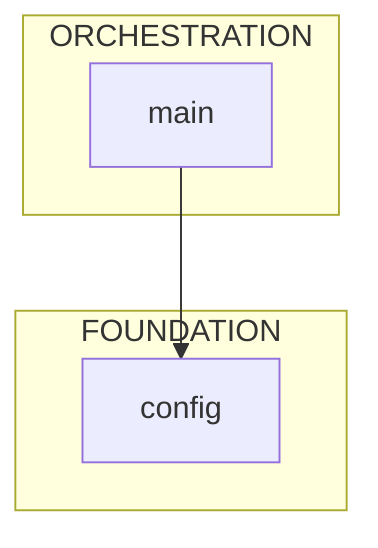

# repo-xray

AST-based Python codebase analysis for AI coding assistants.

## The Problem

AI coding assistants face a cold start problem: a 200K token context window cannot directly ingest a codebase that may span millions of tokens, yet the assistant must understand the architecture to work effectively.

## The Solution

repo-xray solves this by using AST parsing to extract structural information—class signatures, method signatures, type annotations, Pydantic fields, and import relationships—without loading implementation details, typically achieving 95% token reduction. The result is that an AI assistant can survey an entire codebase's architecture, identify entry points, and understand data flow within its context budget before reading any full source files.

Optimized for Claude Code via skills and agents, or manual command-line use.

## Tools
- `mapper.py` - Directory tree with token estimates per file
- `skeleton.py` - Interface extraction (classes, methods, fields, decorators, line numbers)
- `dependency_graph.py` - Import analysis with architectural layer detection and Mermaid output
- `configure.py` - Auto-detection of project structure, root package, and ignore patterns

## Installation

### Option 1: Global (Claude Code)

Install once, available in all projects:

```bash
git clone https://github.com/yourusername/repo-xray.git
cd repo-xray

mkdir -p ~/.claude/skills ~/.claude/agents
cp -r .claude/skills/repo-xray ~/.claude/skills/
cp .claude/agents/repo_architect.md ~/.claude/agents/
```

Verify:
```bash
python ~/.claude/skills/repo-xray/scripts/mapper.py --help
```

### Option 2: Project-Local

Install to a specific project:

```bash
git clone https://github.com/yourusername/repo-xray.git
cd repo-xray

cp -r .claude /path/to/your/project/

cd /path/to/your/project
python .claude/skills/repo-xray/scripts/configure.py .
```

Or use the installer:
```bash
./install.sh /path/to/your/project
```

### Option 3: Claude Code Assisted

Paste into Claude Code:
```
Install repo-xray from /path/to/repo-xray:
1. mkdir -p ~/.claude/skills ~/.claude/agents
2. cp -r /path/to/repo-xray/.claude/skills/repo-xray ~/.claude/skills/
3. cp /path/to/repo-xray/.claude/agents/repo_architect.md ~/.claude/agents/
4. Verify: python ~/.claude/skills/repo-xray/scripts/mapper.py --help
```

## Usage

### Global Installation

```bash
# Survey codebase
python ~/.claude/skills/repo-xray/scripts/mapper.py /path/to/project --summary

# Extract critical interfaces
python ~/.claude/skills/repo-xray/scripts/skeleton.py src/ --priority critical

# Generate architecture diagram
python ~/.claude/skills/repo-xray/scripts/dependency_graph.py src/ --mermaid
```

### Project-Local Installation

```bash
python .claude/skills/repo-xray/scripts/mapper.py . --summary
python .claude/skills/repo-xray/scripts/skeleton.py src/ --priority critical
python .claude/skills/repo-xray/scripts/dependency_graph.py src/ --mermaid
```

### Claude Code Agent

```
@repo_architect generate     # Create WARM_START.md
@repo_architect refresh      # Update existing documentation
@repo_architect query "X"    # Answer specific architecture questions
```

## Commands

### mapper.py

```
mapper.py [directory]        Directory tree with token estimates
  --summary                  Stats only, no tree output
  --json                     Machine-readable output
```

### skeleton.py

```
skeleton.py <path>           Extract class/method signatures
  --priority LEVEL           Filter: critical, high, medium, low
  --pattern GLOB             Filter by filename pattern
  --private                  Include _private methods
  --no-line-numbers          Omit L{n} annotations
  --json                     Machine-readable output
```

### dependency_graph.py

```
dependency_graph.py [dir]    Analyze import relationships
  --root PACKAGE             Set root package explicitly
  --focus STRING             Filter to modules containing string
  --mermaid                  Output Mermaid diagram
  --json                     Machine-readable output
```

### configure.py

```
configure.py [directory]     Detect project structure
  --dry-run                  Preview without writing
  --backup                   Backup existing configs
  --force                    Overwrite without prompt
```

## Output

### skeleton.py

```python
@dataclass
class User:  # L34
    id: int  # L36
    name: str  # L37
    email: str = Field(...)  # L38

class UserService:  # L45
    def __init__(self, db: Database): ...  # L47
    async def get_user(self, user_id: int) -> User: ...  # L52
```

### dependency_graph.py --mermaid



## Token Budget

| Operation | Tokens |
|-----------|--------|
| mapper.py --summary | ~500 |
| skeleton.py (1 file) | ~200-500 |
| skeleton.py --priority critical | ~5K |
| dependency_graph.py | ~3K |
| dependency_graph.py --mermaid | ~500 |

## Auto-Detection

configure.py detects:

**Project root**: .git > pyproject.toml > setup.py > __init__.py density

**Root package**: Most common first-level import across all Python files

**Priority levels**: Folder names mapped to importance
- critical: main, app, core, workflow, server
- high: models, schemas, api, services, db
- medium: utils, lib, common, helpers
- low: tests, docs, examples

## Files

```
repo-xray/
├── README.md
├── install.sh
├── WARM_START.example.md
└── .claude/
    ├── agents/
    │   └── repo_architect.md
    └── skills/
        └── repo-xray/
            ├── SKILL.md
            ├── CHEATSHEET.md
            ├── reference.md
            ├── configs/
            ├── scripts/
            ├── templates/
            └── lib/
```

## Requirements

- Python 3.8+
- No external dependencies (stdlib only)

## License

MIT
