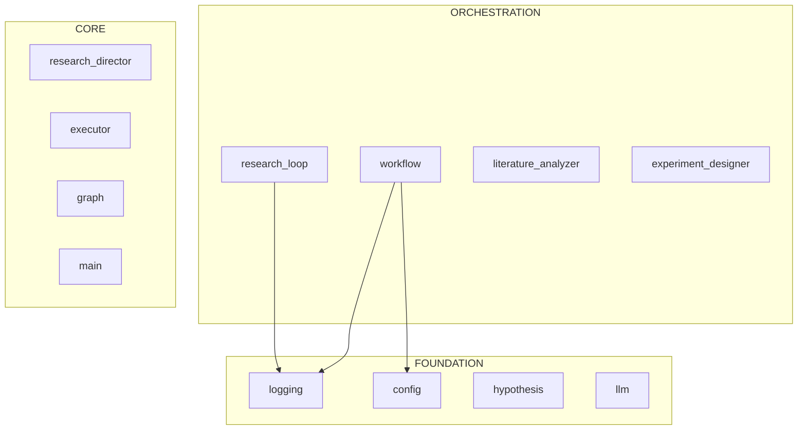

# repo-xray

AST-based Python codebase analysis for AI coding assistants.

> **Quick start**: See [Usage](#usage) below. Need to install first? Jump to [Installation](#installation).

## The Problem

AI coding assistants face a cold start problem: a 200K token context window cannot directly ingest a codebase that may span millions of tokens, yet the assistant must understand the architecture to work effectively.

## The Solution

A two-pass analysis system that extracts 18 signals from 14 metadata sources:

**Pass 1: Structural Analysis (WARM_START.md)**
- Architecture layers and module classification
- Dependency graph and import relationships
- Entry points (CLI, API)
- Class interfaces and type signatures
- Git history risk analysis
- Test coverage mapping

**Pass 2: Behavioral Analysis (HOT_START.md)**
- Mermaid architecture diagrams with layer classification
- Cyclomatic complexity scoring
- Control flow logic maps
- Method signatures with docstrings
- Import weight (which modules are most depended upon)
- Git analysis: risk scores, coupling pairs, freshness
- External dependencies, circular dependencies, orphan detection
- Side effect detection
- Developer Activity section (placeholder for Claude Code behavioral metrics)

Together, these produce a comprehensive reference (~15-50K tokens depending on codebase size) that helps an AI effectively understand a multimillion token repository within a limited context window.

## Example Output

See the generated analysis for the [Kosmos](https://github.com/jimmc414/Kosmos) codebase (159M tokens, 633 Python files):
- [WARM_START.md](WARM_START.md) - Pass 1: Structural analysis (~20KB)
- [HOT_START.md](HOT_START.md) - Pass 2: Behavioral analysis (~48KB, 1231 lines)
- [examples/WARM_START.md](examples/WARM_START.md) - Additional example output

## Limitations

Uses Python's built-in AST parser, so currently Python-only. If there's interest, I'll expand it to use tree-sitter for multi-language support.

---

## Usage

### Claude-Driven Analysis (Recommended)

The easiest way to use repo-xray is to let Claude run the analysis. Paste one of these prompts into Claude Code:

**Generate complete onboarding documentation:**
```
Analyze this codebase and generate a WARM_START.md using the repo-xray skill.
Run: python .claude/skills/repo-xray/scripts/generate_warm_start.py . --debug -v
```

**Explore architecture interactively:**
```
Use the repo-xray skill to help me understand this codebase:
1. Run mapper.py --summary to see the size
2. Run dependency_graph.py --mermaid to see the architecture
3. Run skeleton.py --priority critical to see core interfaces
4. Explain what you found
```

**Analyze code health:**
```
Use repo-xray to analyze this codebase's health:
1. Run git_analysis.py --risk to find volatile files
2. Run git_analysis.py --coupling to find hidden dependencies
3. Run dependency_graph.py --orphans to find dead code
4. Summarize the findings and recommend improvements
```

### Agent Commands

If installed globally, you can use the `@repo_architect` agent:
```
@repo_architect generate     # Create WARM_START.md
@repo_architect refresh      # Update existing documentation
@repo_architect query "X"    # Answer specific architecture questions
```

### Manual Execution

#### Run All Analysis (Single Command)

```bash
# Generate complete WARM_START.md with all analyses combined
python .claude/skills/repo-xray/scripts/generate_warm_start.py . -v

# With debug output (raw JSON for each section)
python .claude/skills/repo-xray/scripts/generate_warm_start.py . --debug -v
```

#### Run Individual Tools

For targeted analysis or debugging, run tools individually:

```bash
# 1. Survey codebase size and find large files
python .claude/skills/repo-xray/scripts/mapper.py . --summary

# 2. Extract core class interfaces
python .claude/skills/repo-xray/scripts/skeleton.py . --priority critical

# 3. Generate architecture diagram
python .claude/skills/repo-xray/scripts/dependency_graph.py . --mermaid

# 4. Analyze code health
python .claude/skills/repo-xray/scripts/git_analysis.py . --risk
python .claude/skills/repo-xray/scripts/git_analysis.py . --coupling
```

---

## Tools

Each tool has a specific strategy for what it extracts, why, and how.

### mapper.py

**What it looks for**: Every file in the directory tree with token count estimates.

**Why**: Before diving into code, you need to know the codebase size and identify files that would consume too much context if read in full.

**How**: Walks the directory tree, calculates tokens per file (characters ÷ 4), flags files >10K tokens as hazards.

**Raw output**: `{path, total_tokens, file_count, tree[], large_files[]}`

```
mapper.py [directory]        Directory tree with token estimates
  --summary                  Stats only, no tree output
  --json                     Machine-readable output
```

### skeleton.py

**What it looks for**: Class definitions, method signatures, Pydantic/dataclass fields, decorators, global constants, with line numbers.

**Why**: Understanding interfaces doesn't require reading implementations. A 10K token file often has a 500 token skeleton that reveals the same API.

**How**: AST-parses Python files, extracts structural elements, preserves docstring summaries and type annotations. Achieves ~95% token reduction.

**Raw output**: `{files[{file, original_tokens, skeleton_tokens, skeleton}], summary}`

```
skeleton.py <path>           Extract class/method signatures
  --priority LEVEL           Filter: critical, high, medium, low
  --pattern GLOB             Filter by filename pattern
  --private                  Include _private methods
  --no-line-numbers          Omit L{n} annotations
  --json                     Machine-readable output
```

### dependency_graph.py

**What it looks for**: Import statements between modules, then classifies modules into architectural layers.

**Why**: Understanding which modules depend on which reveals the architecture without reading any code. Layers show what's foundational vs. orchestration.

**How**: Parses imports, builds directed graph, classifies by import patterns:
- **Foundation**: High `imported_by`, low `imports` (utilities, config)
- **Core**: Balanced (business logic)
- **Orchestration**: Low `imported_by`, high `imports` (entry points)

**Raw output**: `{modules{name: {imports[], imported_by[]}}, layers{}, circular[], external{}}`

```
dependency_graph.py [dir]    Analyze import relationships
  --root PACKAGE             Set root package explicitly
  --focus STRING             Filter to modules containing string
  --orphans                  Find files with zero importers (dead code)
  --impact FILE              Calculate blast radius for a file
  --source-dir PATH          Override source root detection
  --mermaid                  Output Mermaid diagram
  --json                     Machine-readable output
```

### git_analysis.py

**What it looks for**: Commit history patterns—churn, hotfix keywords, author counts, co-modification pairs, last-modified dates.

**Why**: Static analysis shows structure; temporal analysis shows behavior. Files with high churn and many hotfixes are risky. Files that always change together have hidden coupling.

**How**: Parses `git log` output, counts commits per file, detects "fix/bug/hotfix" keywords, tracks co-occurrence in commits.

**Raw output**: `{risk[{file, risk_score, churn, hotfixes, authors}], coupling[{file_a, file_b, count}], freshness{active[], aging[], stale[], dormant[]}}`

```
git_analysis.py [dir]        Analyze git history
  --risk                     Risk scores (churn, hotfixes, authors)
  --coupling                 Find co-modification pairs
  --freshness                Categorize: Active/Aging/Stale/Dormant
  --json                     Combined JSON output
  --months N                 History period (default: 6)
```

### configure.py

**What it looks for**: Project structure indicators—.git, pyproject.toml, setup.py, __init__.py files, import patterns.

**Why**: Auto-detects project configuration so other tools work without manual setup.

**How**: Scans directory for markers, analyzes import statements to find root package, generates ignore patterns and priority configs.

**Raw output**: `configs/ignore_patterns.json`, `configs/priority_modules.json`

```
configure.py [directory]     Detect project structure
  --dry-run                  Preview without writing
  --backup                   Backup existing configs
  --force                    Overwrite without prompt
```

### generate_warm_start.py

**What it looks for**: Everything—runs all tools and combines their output.

**Why**: Single command to generate complete onboarding documentation. No manual orchestration needed.

**How**: Imports functions from mapper, skeleton, dependency_graph, git_analysis. Collects all data, renders into markdown template.

**Raw output**: All tool outputs combined. Use `--debug` to save raw JSON in `WARM_START_debug/` for inspection.

```
generate_warm_start.py [dir] Generate WARM_START.md documentation
  -o, --output FILE          Output file path (default: WARM_START.md)
  --debug                    Output raw JSON to WARM_START_debug/
  --json                     Output raw data as JSON
  -v, --verbose              Show progress messages
```

### generate_hot_start.py

**What it looks for**: Behavioral patterns—complexity hotspots, control flow, side effects, git history, module relationships.

**Why**: Pass 2 analysis focuses on *how* code behaves rather than *what* it declares. Identifies risky files, hidden coupling, and generates logic maps for complex methods.

**How**: Combines cyclomatic complexity analysis with git history (risk, coupling, freshness), dependency graph analysis, and AST-based logic map generation.

**Raw output**: Priority-ranked files with complexity scores, logic maps, verification status, hidden dependencies.

```
generate_hot_start.py [dir]  Generate HOT_START.md documentation
  -o, --output FILE          Output file path (default: HOT_START.md)
  --detail LEVEL             Detail level: 1/compact, 2/normal, 3/verbose, 4/full
  --top N                    Number of priority files to analyze (default: 10)
  --debug                    Output raw JSON to HOT_START_debug/
  -v, --verbose              Show progress messages
```

**Detail levels:**
- `1/compact`: Priority table only (~500 tokens)
- `2/normal`: Standard with logic maps (~2,700 tokens)
- `3/verbose`: Preserve literals (~5,000 tokens)
- `4/full`: Add signatures and docstrings (~8,000+ tokens)

### Test Coverage Analysis (Section 13)

**What it looks for**: Test file counts, test function estimates, pytest fixtures, and source-to-test directory mapping.

**Why**: Tests are typically 2-5x larger than source code but provide derivative information. Reading test content consumes significant context for low architectural signal. However, *metadata about tests* reveals coverage gaps and available fixtures without the token cost.

**How**: Scans `tests/`, `test/`, `testing/` directories. Counts files by test type (unit, integration, e2e). Extracts `@pytest.fixture` names from conftest.py files. Maps test subdirectories to source directories to identify untested modules.

**Raw output**: `{test_file_count, test_function_count, coverage_by_type{}, tested_dirs[], untested_dirs[], fixtures[]}`

**Token cost**: ~100-200 tokens for complete test metadata vs ~50K+ tokens to read actual test files.

**Example output**:
```markdown
## 13. Test Coverage

**205** test files, **~3897** test functions

### Tests by Type
| Type | Files |
|------|-------|
| `unit/` | 98 |
| `integration/` | 32 |
| `e2e/` | 12 |

### Tested Modules
`agents`, `cli`, `core`, `execution`, `knowledge`...

### Potentially Untested
`api/`, `config/`...

### Key Fixtures (conftest.py)
`mock_anthropic_client`, `e2e_artifacts_dir`, `event_loop`...
```

---

## Installation

### Option 1: Global (Claude Code)

Install once, available in all projects:

```bash
git clone https://github.com/jimmc414/repo-xray.git
cd repo-xray

mkdir -p ~/.claude/skills ~/.claude/agents
cp -r .claude/skills/repo-xray ~/.claude/skills/
cp .claude/agents/repo_architect.md ~/.claude/agents/
```

Verify:
```bash
python ~/.claude/skills/repo-xray/scripts/mapper.py --help
```

### Option 2: Project-Local

Install to a specific project:

```bash
git clone https://github.com/jimmc414/repo-xray.git
cd repo-xray

cp -r .claude /path/to/your/project/

cd /path/to/your/project
python .claude/skills/repo-xray/scripts/configure.py .
```

### Option 3: Claude-Assisted Install

Paste into Claude Code:
```
Install repo-xray from /path/to/repo-xray:
1. mkdir -p ~/.claude/skills ~/.claude/agents
2. cp -r /path/to/repo-xray/.claude/skills/repo-xray ~/.claude/skills/
3. cp /path/to/repo-xray/.claude/agents/repo_architect.md ~/.claude/agents/
4. Verify: python ~/.claude/skills/repo-xray/scripts/mapper.py --help
```

---

## Example Output

### skeleton.py

```python
# From kosmos/models/hypothesis.py (3275 -> 1538 tokens, 53% reduction)

class ExperimentType(str, Enum):  # L15
    COMPUTATIONAL = "computational"  # L17
    DATA_ANALYSIS = "data_analysis"  # L18
    LITERATURE_SYNTHESIS = "literature_synthesis"  # L19

class HypothesisStatus(str, Enum):  # L22
    GENERATED = "generated"  # L24
    UNDER_REVIEW = "under_review"  # L25
    TESTING = "testing"  # L26
    SUPPORTED = "supported"  # L27
    REJECTED = "rejected"  # L28

class Hypothesis(BaseModel):  # L32
    id: Optional[str] = None  # L50
    research_question: str = Field(...)  # L51
    statement: str = Field(...)  # L52
    rationale: str = Field(...)  # L53
    domain: str = Field(...)  # L55
    status: HypothesisStatus = Field(...)  # L56
    testability_score: Optional[float] = Field(...)  # L59
    novelty_score: Optional[float] = Field(...)  # L60
    suggested_experiment_types: List[ExperimentType] = Field(...)  # L65
```

### dependency_graph.py --mermaid



### git_analysis.py --risk

```
RISK   FILE                                    FACTORS
0.96   kosmos/config.py                        churn:23 hotfix:14 authors:4
0.82   kosmos/agents/research_director.py      churn:17 hotfix:13 authors:3
0.71   kosmos/core/llm.py                      churn:11 hotfix:5 authors:3
0.68   kosmos/execution/executor.py            churn:9 hotfix:5 authors:3
0.67   kosmos/cli/commands/run.py              churn:11 hotfix:9 authors:2
```

---

## Token Budget

| Operation | Tokens | Use Case |
|-----------|--------|----------|
| mapper.py --summary | ~500 | First exploration |
| skeleton.py (1 file) | ~200-500 | Understanding one interface |
| skeleton.py --priority critical | ~5K | Core architecture overview |
| dependency_graph.py | ~3K | Full import analysis |
| dependency_graph.py --mermaid | ~500 | Documentation diagrams |
| dependency_graph.py --orphans | ~1K | Dead code detection |
| git_analysis.py --risk | ~1K | Identify volatile files |
| git_analysis.py --coupling | ~500 | Hidden dependencies |
| git_analysis.py --freshness | ~500 | Maintenance activity |
| Test coverage (Section 13) | ~100-200 | Test metadata without reading tests |
| generate_warm_start.py | ~8-20K | Pass 1 complete documentation |
| generate_hot_start.py --detail 1 | ~500 | Pass 2 compact (priority table only) |
| generate_hot_start.py --detail 4 | ~8-50K | Pass 2 full (logic maps, git analysis) |

---

## Files

```
repo-xray/
├── README.md
├── WARM_START.md                  # Example Pass 1 output (Kosmos)
├── HOT_START.md                   # Example Pass 2 output (Kosmos)
├── examples/
│   └── WARM_START.md              # Additional example
└── .claude/
    ├── agents/
    │   └── repo_architect.md
    └── skills/
        ├── repo-xray/             # Pass 1 tools
        │   ├── SKILL.md
        │   ├── scripts/
        │   │   ├── mapper.py
        │   │   ├── skeleton.py
        │   │   ├── dependency_graph.py
        │   │   ├── git_analysis.py
        │   │   ├── configure.py
        │   │   └── generate_warm_start.py
        │   └── lib/
        └── repo-investigator/     # Pass 2 tools
            └── scripts/
                ├── generate_hot_start.py
                ├── complexity.py
                ├── smart_read.py
                └── verify.py
```

### Example Output Details

Example files are generated from the [Kosmos](https://github.com/jimmc414/kosmos) codebase (159M tokens):

| File | Size | Description |
|------|------|-------------|
| `WARM_START.md` | ~20KB | Pass 1: Architecture, layers, dependencies, entry points |
| `HOT_START.md` | ~48KB | Pass 2: Complexity, logic maps, git analysis, risk scores |

## Requirements

- Python 3.8+
- No external dependencies (stdlib only)

## License

MIT
