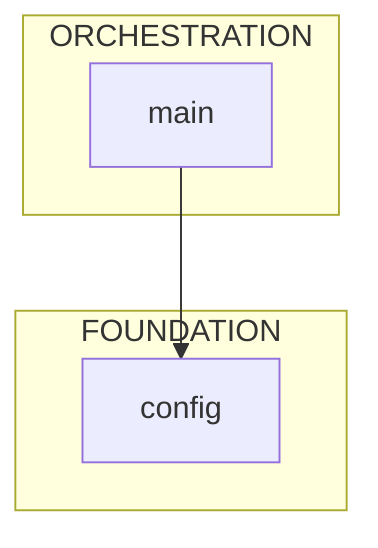

# repo-xray

AST-based Python codebase analysis for AI coding assistants.

> **Quick start**: See [Usage](#usage) below. Need to install first? Jump to [Installation](#installation).

## The Problem

AI coding assistants face a cold start problem: a 200K token context window cannot directly ingest a codebase that may span millions of tokens, yet the assistant must understand the architecture to work effectively.

## The (Attempted) Solution

repo-xray atempts to solve this quickly and efficiently by using AST parsing to extract structural information; class signatures, method signatures, type annotations, Pydantic fields, and import relationships without loading implementation details, typically achieving 95% token reduction. The result is that an AI assistant can survey an entire codebase's architecture, identify entry points, and understand data flow within its context budget before reading any full source files.

Optimized for Claude Code via skills and agents, or manual command-line use.

## Limitations

Uses Python's built-in AST parser, so currently Python-only. If there's interest, I'll expand it to use tree-sitter for multi-language support.

## Tools
- `mapper.py` - Directory tree with token estimates per file
- `skeleton.py` - Interface extraction (classes, methods, fields, decorators, line numbers)
- `dependency_graph.py` - Import analysis with architectural layer detection, orphan detection, and impact analysis
- `git_analysis.py` - Git history analysis for risk scoring, hidden coupling, and freshness tracking
- `configure.py` - Auto-detection of project structure, root package, and ignore patterns
- `generate_warm_start.py` - Generate complete WARM_START.md documentation

## Usage

### Command Line (after installation)

```bash
# Survey codebase structure and token usage
python ~/.claude/skills/repo-xray/scripts/mapper.py /path/to/project --summary

# Extract critical class interfaces (95% token reduction)
python ~/.claude/skills/repo-xray/scripts/skeleton.py src/ --priority critical

# Generate architecture diagram
python ~/.claude/skills/repo-xray/scripts/dependency_graph.py src/ --mermaid

# Analyze risk and code health
python ~/.claude/skills/repo-xray/scripts/git_analysis.py src/ --risk

# Generate complete WARM_START.md
python ~/.claude/skills/repo-xray/scripts/generate_warm_start.py /path/to/project
```

### Project-Local Installation

```bash
python .claude/skills/repo-xray/scripts/mapper.py . --summary
python .claude/skills/repo-xray/scripts/skeleton.py src/ --priority critical
python .claude/skills/repo-xray/scripts/dependency_graph.py src/ --mermaid
```

### Claude Code Agent

```
@repo_architect generate     # Create WARM_START.md
@repo_architect refresh      # Update existing documentation
@repo_architect query "X"    # Answer specific architecture questions
```

## Installation

### Option 1: Global (Claude Code)

Install once, available in all projects:

```bash
git clone https://github.com/yourusername/repo-xray.git
cd repo-xray

mkdir -p ~/.claude/skills ~/.claude/agents
cp -r .claude/skills/repo-xray ~/.claude/skills/
cp .claude/agents/repo_architect.md ~/.claude/agents/
```

Verify:
```bash
python ~/.claude/skills/repo-xray/scripts/mapper.py --help
```

### Option 2: Project-Local

Install to a specific project:

```bash
git clone https://github.com/yourusername/repo-xray.git
cd repo-xray

cp -r .claude /path/to/your/project/

cd /path/to/your/project
python .claude/skills/repo-xray/scripts/configure.py .
```

Or use the installer:
```bash
./install.sh /path/to/your/project
```

### Option 3: Claude Code Assisted

Paste into Claude Code:
```
Install repo-xray from /path/to/repo-xray:
1. mkdir -p ~/.claude/skills ~/.claude/agents
2. cp -r /path/to/repo-xray/.claude/skills/repo-xray ~/.claude/skills/
3. cp /path/to/repo-xray/.claude/agents/repo_architect.md ~/.claude/agents/
4. Verify: python ~/.claude/skills/repo-xray/scripts/mapper.py --help
```

## Commands

### mapper.py

```
mapper.py [directory]        Directory tree with token estimates
  --summary                  Stats only, no tree output
  --json                     Machine-readable output
```

### skeleton.py

```
skeleton.py <path>           Extract class/method signatures
  --priority LEVEL           Filter: critical, high, medium, low
  --pattern GLOB             Filter by filename pattern
  --private                  Include _private methods
  --no-line-numbers          Omit L{n} annotations
  --json                     Machine-readable output
```

### dependency_graph.py

```
dependency_graph.py [dir]    Analyze import relationships
  --root PACKAGE             Set root package explicitly
  --focus STRING             Filter to modules containing string
  --orphans                  Find files with zero importers (dead code)
  --impact FILE              Calculate blast radius for a file
  --mermaid                  Output Mermaid diagram
  --json                     Machine-readable output
```

### git_analysis.py

```
git_analysis.py [dir]        Analyze git history
  --risk                     Risk scores (churn, hotfixes, authors)
  --coupling                 Find co-modification pairs
  --freshness                Categorize: Active/Aging/Stale/Dormant
  --json                     Combined JSON output
  --months N                 History period (default: 6)
```

### configure.py

```
configure.py [directory]     Detect project structure
  --dry-run                  Preview without writing
  --backup                   Backup existing configs
  --force                    Overwrite without prompt
```

### generate_warm_start.py

```
generate_warm_start.py [dir] Generate WARM_START.md documentation
  -o, --output FILE          Output file path (default: WARM_START.md)
  --debug                    Output raw JSON to WARM_START_debug/
  --json                     Output raw data as JSON
  -v, --verbose              Show progress messages
```

## Output

### skeleton.py

```python
@dataclass
class User:  # L34
    id: int  # L36
    name: str  # L37
    email: str = Field(...)  # L38

class UserService:  # L45
    def __init__(self, db: Database): ...  # L47
    async def get_user(self, user_id: int) -> User: ...  # L52
```

### dependency_graph.py --mermaid



## Token Budget

| Operation | Tokens |
|-----------|--------|
| mapper.py --summary | ~500 |
| skeleton.py (1 file) | ~200-500 |
| skeleton.py --priority critical | ~5K |
| dependency_graph.py | ~3K |
| dependency_graph.py --mermaid | ~500 |
| dependency_graph.py --orphans | ~1K |
| dependency_graph.py --impact | ~500 |
| git_analysis.py --risk | ~1K |
| git_analysis.py --coupling | ~500 |
| git_analysis.py --freshness | ~500 |
| git_analysis.py --json | ~3K |
| generate_warm_start.py | ~8-20K |

## Auto-Detection

configure.py detects:

**Project root**: .git > pyproject.toml > setup.py > __init__.py density

**Root package**: Most common first-level import across all Python files

**Priority levels**: Folder names mapped to importance
- critical: main, app, core, workflow, server
- high: models, schemas, api, services, db
- medium: utils, lib, common, helpers
- low: tests, docs, examples

## Files

```
repo-xray/
├── README.md
├── install.sh
├── WARM_START.example.md
└── .claude/
    ├── agents/
    │   └── repo_architect.md
    └── skills/
        └── repo-xray/
            ├── SKILL.md
            ├── COMMANDS.md
            ├── reference.md
            ├── configs/
            ├── scripts/
            │   ├── mapper.py
            │   ├── skeleton.py
            │   ├── dependency_graph.py
            │   ├── git_analysis.py
            │   ├── configure.py
            │   └── generate_warm_start.py
            ├── templates/
            ├── tests/
            └── lib/
```

## Requirements

- Python 3.8+
- No external dependencies (stdlib only)

## License

MIT
