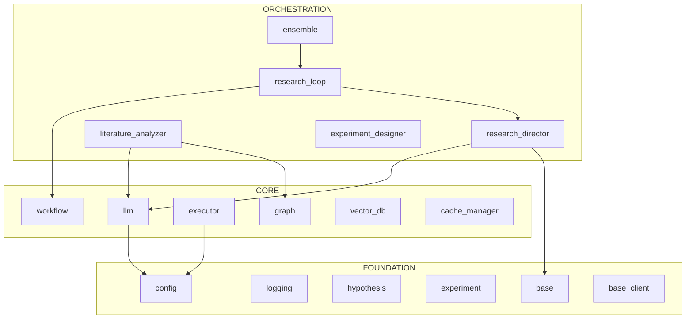

# Kosmos: Developer Warm Start

> **Claude-processed** - Python tool output reviewed, corrected, and filtered for usefulness.
> May be smaller than raw output due to noise removal (test utilities, redundant details).
> Raw tool output: `WARM_START.python-only.md`

> Context-efficient onboarding guide for AI programmers.
> Generated: 2025-12-12
> Codebase: ~188 Python files in `kosmos/`, ~692K tokens

---

## 1. System Context

**Kosmos** is an autonomous AI scientist that conducts iterative research cycles:
**Hypothesis → Experiment Design → Execution → Analysis → Refinement → Convergence**

### Architecture View


> Generated with: `python .claude/skills/repo-xray/scripts/dependency_graph.py kosmos/ --root kosmos --mermaid`

---

## 2. Architecture Overview

**kosmos** is a Python application with agent-based architecture and workflow orchestration.

The codebase contains ~535 modules organized in three architectural layers:

- **Foundation** (92 modules): `config`, `models/*`, `agents/base`, `core/logging`, `literature/base_client`
- **Core** (297 modules): `core/llm`, `execution/*`, `knowledge/*`, `safety/*`
- **Orchestration** (146 modules): `workflow/*`, `agents/research_director`, `agents/*_analyzer`

**Key architectural patterns:**
- **State Machine Workflow** - `WorkflowState` enum controls research lifecycle
- **Multi-Agent Coordination** - `BaseAgent` + async message passing via `AgentMessage`
- **Pydantic Models** - All data structures use validated Pydantic models
- **Async-first** - Core operations are async with sync wrappers
- **Sandbox Execution** - Code runs in Docker containers for safety

---

## 3. Critical Classes

### Entry Points
| Class | Location | Line | Purpose |
|-------|----------|------|---------|
| `ResearchWorkflow` | `kosmos/workflow/research_loop.py` | L30 | **Main orchestrator** - call `run()` |
| `EnsembleRunner` | `kosmos/workflow/ensemble.py` | L727 | Multi-run convergence analysis |
| CLI | `kosmos/cli/main.py` | - | Command-line interface (Typer) |

### Core Components

**WorkflowState** (`kosmos/core/workflow.py:L18`) - Research lifecycle states
```python
class WorkflowState(str, Enum):  # L18
    INITIALIZING = "initializing"  # L21
    GENERATING_HYPOTHESES = "generating_hypotheses"  # L22
    DESIGNING_EXPERIMENTS = "designing_experiments"  # L23
    EXECUTING = "executing"  # L24
    ANALYZING = "analyzing"  # L25
    REFINING = "refining"  # L26
    CONVERGED = "converged"  # L27
    PAUSED = "paused"  # L28
    ERROR = "error"  # L29
```

**ResearchWorkflow** (`kosmos/workflow/research_loop.py:L30`) - Main orchestrator
```python
class ResearchWorkflow:  # L30
    def __init__(self, research_objective: str, anthropic_client=None,
                 artifacts_dir: str='artifacts', world_model=None,
                 max_cycles: int=20, seed: Optional[int]=None,
                 temperature: Optional[float]=None): ...  # L55
    async def run(self, num_cycles: int=5, tasks_per_cycle: int=10) -> Dict: ...  # L138
    async def generate_report(self) -> str: ...  # L406
    def get_statistics(self) -> Dict: ...  # L458
```

**BaseAgent** (`kosmos/agents/base.py:L97`) - Agent framework
```python
class BaseAgent:  # L97
    def __init__(self, agent_id: Optional[str]=None, agent_type: Optional[str]=None,
                 config: Optional[Dict[str, Any]]=None): ...  # L113
    def start(self): ...  # L159
    def stop(self): ...  # L177
    async def send_message(self, to_agent: str, content: Dict[str, Any], ...) -> AgentMessage: ...  # L246
    async def receive_message(self, message: AgentMessage): ...  # L329
    def execute(self, task: Dict[str, Any]) -> Dict[str, Any]: ...  # L485
```

### Data Models

**Hypothesis** (`kosmos/models/hypothesis.py:L32`)
```python
class Hypothesis(BaseModel):  # L32
    id: Optional[str] = None  # L50
    research_question: str = Field(...)  # L51
    statement: str = Field(...)  # L52
    rationale: str = Field(...)  # L53
    domain: str = Field(...)  # L55
    status: HypothesisStatus = Field(...)  # L56
    testability_score: Optional[float] = Field(...)  # L59
    novelty_score: Optional[float] = Field(...)  # L60
```

**AgentMessage** (`kosmos/agents/base.py:L45`)
```python
class AgentMessage(BaseModel):  # L45
    id: str = Field(...)  # L60
    type: MessageType  # REQUEST, RESPONSE, NOTIFICATION, ERROR
    from_agent: str  # L62
    to_agent: str  # L63
    content: Dict[str, Any]  # L64
    correlation_id: Optional[str] = None  # L65
    timestamp: datetime = Field(...)  # L66
```

### Execution Layer
| Class | Location | Purpose |
|-------|----------|---------|
| `CodeExecutor` | `kosmos/execution/executor.py` | Runs Python code in sandbox |
| `DockerManager` | `kosmos/execution/docker_manager.py` | Container lifecycle |
| `ProductionExecutor` | `kosmos/execution/production_executor.py` | Production execution |

---

## 4. Data Flow

```
User Research Question
    │
    ▼
[1] ResearchWorkflow.__init__(research_objective)
    │
    ▼
[2] ResearchWorkflow.run(num_cycles, tasks_per_cycle)
    │
    ├──▶ [3] WorkflowState: INITIALIZING → GENERATING_HYPOTHESES
    │
    ├──▶ [4] HypothesisGeneratorAgent.generate_hypotheses()
    │         └──▶ Claude LLM via kosmos.core.llm
    │
    ├──▶ [5] ExperimentDesignerAgent.design_experiment()
    │
    ├──▶ [6] CodeExecutor.execute() → DockerSandbox
    │
    ├──▶ [7] DataAnalystAgent.analyze() → Scholar evaluation
    │
    ├──▶ [8] ContextCompressor.compress_cycle_results()
    │
    └──▶ [9] WorkflowState: CONVERGED or repeat cycle
              │
              ▼
         Research Results + Report
              │
              ▼
    [Optional] EnsembleRunner.run() for multi-run convergence
```

---

## 5. Entry Points

### CLI Commands
```bash
kosmos run "research objective" --cycles 5    # Run research workflow
kosmos run "objective" --stream               # With streaming output
kosmos doctor                                 # Health check
kosmos interactive                            # Interactive mode
```

### Python API
```python
from kosmos.workflow.research_loop import ResearchWorkflow

async def main():
    workflow = ResearchWorkflow(
        research_objective="Investigate the relationship between X and Y",
        max_cycles=20
    )
    results = await workflow.run(num_cycles=5)
    report = await workflow.generate_report()
    return results
```

### Key Imports
```python
from kosmos.workflow.research_loop import ResearchWorkflow
from kosmos.workflow.ensemble import EnsembleRunner, run_ensemble
from kosmos.agents.base import BaseAgent, AgentMessage, AgentState
from kosmos.models.hypothesis import Hypothesis, HypothesisStatus
from kosmos.models.experiment import Experiment
from kosmos.config import KosmosConfig
```

---

## 6. Context Hazards

**DO NOT READ** - consume context without architectural insight:

### Large Data Directories
`artifacts/`, `data/`, `.literature_cache/`, `kosmos-reference/`, `logs/`, `neo4j_*`, `postgres_data/`, `redis_data/`

### Large Files (>10K tokens)
| File | Tokens | Alternative |
|------|--------|-------------|
| `agents/research_director.py` | 21.3K | `skeleton.py --priority critical` |
| `workflow/ensemble.py` | 10.7K | `skeleton.py` |
| `execution/data_analysis.py` | 10.6K | `skeleton.py` |

### Skip Extensions
`.jsonl`, `.pkl`, `.log`, `.h5`, `.parquet`, `.csv`

---

## 7. Quick Verification

```bash
kosmos doctor

python -c "from kosmos.workflow.research_loop import ResearchWorkflow; print('✓')"
python -c "from kosmos.agents.base import BaseAgent; print('✓')"
python -c "from kosmos.models.hypothesis import Hypothesis; print('✓')"
python -c "from kosmos.config import KosmosConfig; print('✓')"

pytest tests/ -k "sanity" --tb=short -q
```

---

## 8. X-Ray Commands

```bash
# Survey codebase size
python .claude/skills/repo-xray/scripts/mapper.py kosmos/ --summary

# Extract interfaces (95% token reduction)
python .claude/skills/repo-xray/scripts/skeleton.py kosmos/ --priority critical

# Architecture diagram
python .claude/skills/repo-xray/scripts/dependency_graph.py kosmos/ --root kosmos --mermaid

# Focus on workflow
python .claude/skills/repo-xray/scripts/dependency_graph.py kosmos/ --root kosmos --focus workflow

# Risk analysis
python .claude/skills/repo-xray/scripts/git_analysis.py kosmos/ --risk
```

---

## 9. Architecture Layers

### Foundation (Most Imported)
| Module | Imported By | Purpose |
|--------|-------------|---------|
| `kosmos.core.logging` | 136 | Structured logging |
| `kosmos.config` | 51 | Configuration management |
| `kosmos.models.hypothesis` | 46 | Core hypothesis model |
| `kosmos.literature.base_client` | 34 | Literature search base |
| `kosmos.models.experiment` | 27 | Experiment model |
| `kosmos.core.llm` | 26 | LLM client wrapper |

### Core (Business Logic)
| Module | Imported By | Imports | Purpose |
|--------|-------------|---------|---------|
| `research_director` | 20 | 16 | Master orchestrator |
| `vector_db` | 9 | 4 | Vector database |
| `executor` | 8 | 5 | Code execution |
| `graph` | 8 | 3 | Knowledge graph |
| `code_validator` | 8 | 4 | Safety validation |

### Orchestration (Coordination)
| Module | Imported By | Imports | Purpose |
|--------|-------------|---------|---------|
| `workflow` | 23 | 2 | State machine |
| `research_loop` | 10 | 9 | Main workflow |
| `literature_analyzer` | 4 | 11 | Paper analysis |
| `experiment_designer` | 3 | 10 | Experiment design |

---

## 10. Risk Assessment

### High-Risk Files (volatile in past 6 months)
| File | Risk | Factors |
|------|------|---------|
| `kosmos/config.py` | 0.96 | churn:23 hotfix:14 authors:4 |
| `kosmos/agents/research_director.py` | 0.82 | churn:17 hotfix:13 authors:3 |
| `kosmos/core/llm.py` | 0.71 | churn:11 hotfix:5 authors:3 |
| `kosmos/execution/executor.py` | 0.68 | churn:9 hotfix:5 authors:3 |
| `kosmos/cli/commands/run.py` | 0.67 | churn:11 hotfix:9 authors:2 |

**Interpretation:** `config.py` and `research_director.py` are hotspots. Expect complexity; review changes carefully.

---

## 11. Hidden Coupling

| File A | File B | Co-changes |
|--------|--------|------------|
| `config.py` | `providers/anthropic.py` | 5 |
| `providers/anthropic.py` | `providers/openai.py` | 4 |
| `config.py` | `providers/litellm_provider.py` | 4 |
| `validation/__init__.py` | `world_model/artifacts.py` | 3 |
| `research_director.py` | `cli/commands/run.py` | 3 |

**Interpretation:** Provider files (anthropic, openai, litellm) change together - consider abstracting common logic. `config.py` couples with many files - expected for configuration.

---

## 12. Potential Dead Code

### Orphan Files (zero importers)
| File | Notes |
|------|-------|
| `examples/03_placeholder.py` - `examples/10_placeholder.py` | Placeholder files |
| `alembic/versions/*.py` | DB migrations (expected) |

### Freshness
| Category | Count |
|----------|-------|
| Active (30 days) | 682 |
| Aging (30-90 days) | 122 |
| Stale/Dormant | 0 |

**Interpretation:** No dormant files - active development across entire codebase.

---

*Claude-enhanced from repo-xray output. To regenerate: `python .claude/skills/repo-xray/scripts/generate_warm_start.py . -v`*
