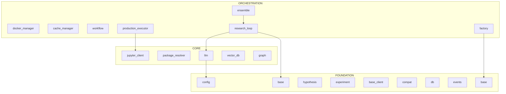

# Kosmos: Developer Warm Start

> Context-efficient onboarding guide for AI programmers.
> Generated: 2025-12-12 (Enhanced with Pydantic fields, decorators, line numbers)
> Token budget: ~692K tokens total (use X-Ray tools to stay under budget)

---

## 1. System Context

### Architecture View


### Workflow-Centric View (Optional)
*Use `dependency_graph.py --focus workflow` for a focused view of the research pipeline.*

> Generated with: `python .claude/skills/repo-xray/scripts/dependency_graph.py kosmos/ --root kosmos --mermaid`

---

## 2. Architecture Overview

Kosmos is an **autonomous scientific research framework** that operates in iterative cycles:

1. **Hypothesis Generation** - AI generates testable scientific hypotheses
2. **Experiment Design** - Designs computational/data experiments
3. **Execution** - Runs experiments in sandboxed environments
4. **Analysis** - Evaluates results with scholar scoring
5. **Refinement** - Iterates based on findings
6. **Convergence** - Multi-run ensemble analysis for replication

**Key Design Patterns:**
- **State Machine Workflow** - `WorkflowState` enum controls research lifecycle
- **Agent Architecture** - `BaseAgent` provides messaging and lifecycle management
- **Pydantic Models** - All data structures use validated Pydantic models
- **Async-first** - Core operations are async with sync wrappers for compatibility

---

## 3. Critical Classes

### Entry Points
| Class | File | Line | Description |
|-------|------|------|-------------|
| `ResearchWorkflow` | `kosmos/workflow/research_loop.py` | L30 | Main orchestrator - call `run()` |
| `EnsembleRunner` | `kosmos/workflow/ensemble.py` | L727 | Multi-run convergence analysis |
| CLI | `kosmos/cli/main.py` | - | Command-line interface |

### Core Components

**ResearchWorkflow** (`kosmos/workflow/research_loop.py:L30`)
```python
class ResearchWorkflow:  # L30
    def __init__(self, research_objective: str, anthropic_client=None,
                 artifacts_dir: str='artifacts', world_model=None,
                 max_cycles: int=20, seed: Optional[int]=None,
                 temperature: Optional[float]=None): ...  # L55
    async def run(self, num_cycles: int=5, tasks_per_cycle: int=10) -> Dict: ...  # L138
    async def generate_report(self) -> str: ...  # L406
    def get_statistics(self) -> Dict: ...  # L458
```

**BaseAgent** (`kosmos/agents/base.py:L97`)
```python
class BaseAgent:  # L97
    def __init__(self, agent_id: Optional[str]=None, agent_type: Optional[str]=None,
                 config: Optional[Dict[str, Any]]=None): ...  # L113
    def start(self): ...  # L159
    def stop(self): ...  # L177
    async def send_message(self, to_agent: str, content: Dict[str, Any], ...) -> AgentMessage: ...  # L246
    async def receive_message(self, message: AgentMessage): ...  # L329
    def execute(self, task: Dict[str, Any]) -> Dict[str, Any]: ...  # L485
```

### Data Models

**Hypothesis** (`kosmos/models/hypothesis.py`)
```python
class Hypothesis(BaseModel):
    id: Optional[str] = None
    research_question: str = Field(...)
    statement: str = Field(...)
    rationale: str = Field(...)
    domain: str = Field(...)
    status: HypothesisStatus = Field(...)
    testability_score: Optional[float] = Field(...)
    novelty_score: Optional[float] = Field(...)
```

**AgentMessage** (`kosmos/agents/base.py:L45`)
```python
class AgentMessage(BaseModel):  # L45
    id: str = Field(...)  # L60
    type: MessageType  # REQUEST, RESPONSE, NOTIFICATION, ERROR
    from_agent: str  # L62
    to_agent: str  # L63
    content: Dict[str, Any]  # L64
    correlation_id: Optional[str] = None  # L65
    timestamp: datetime = Field(...)  # L66
```

### Execution Layer (if present)
| Class | Location | Purpose |
|-------|----------|---------|
| `CodeExecutor` | `kosmos/execution/executor.py` | Runs Python code in sandbox |
| `DockerManager` | `kosmos/execution/docker_manager.py` | Container lifecycle management |
| `ProductionExecutor` | `kosmos/execution/production_executor.py` | Production experiment execution |

---

## 4. Data Flow

```
User Goal/Research Question
    │
    ▼
[1] ResearchWorkflow.__init__(research_objective)
    │
    ▼
[2] ResearchWorkflow.run(num_cycles, tasks_per_cycle)
    │
    ├──▶ [3] WorkflowState transitions: INITIALIZING → GENERATING_HYPOTHESES
    │
    ├──▶ [4] HypothesisGeneratorAgent.generate_hypotheses()
    │         │
    │         └──▶ Claude LLM via kosmos.core.llm
    │
    ├──▶ [5] ExperimentDesignerAgent.design_experiment()
    │
    ├──▶ [6] CodeExecutor / DockerSandbox execution
    │
    ├──▶ [7] DataAnalystAgent.analyze() → Scholar evaluation
    │
    └──▶ [8] WorkflowState: CONVERGED
              │
              ▼
         Research Results + Report
              │
              ▼
[Optional] EnsembleRunner.run() for multi-run convergence
              │
              ▼
         ConvergenceAnalyzer.analyze() → FindingMatch list
```

---

## 5. Entry Points

### CLI Commands
```bash
# Run a research workflow
kosmos run "research objective" --cycles 5

# Run with streaming output
kosmos run "objective" --stream

# Health check
kosmos doctor

# Interactive mode
kosmos interactive
```

### Python API
```python
from kosmos.workflow.research_loop import ResearchWorkflow

async def main():
    workflow = ResearchWorkflow("Your research question")
    results = await workflow.run(num_cycles=5)
    report = await workflow.generate_report()
```

### Key Imports
```python
# Main workflow
from kosmos.workflow.research_loop import ResearchWorkflow

# Ensemble analysis
from kosmos.workflow.ensemble import EnsembleRunner, run_ensemble

# Agent framework
from kosmos.agents.base import BaseAgent, AgentMessage, AgentState

# Data models
from kosmos.models.hypothesis import Hypothesis, HypothesisStatus

# Configuration
from kosmos.config import config
```

---

## 6. Context Hazards

**DO NOT READ these directories/files** - they consume context without providing architectural insight:

### Large Data Directories
| Directory | Reason |
|-----------|--------|
| `artifacts/` | Runtime outputs, experiment data |
| `data/` | Test datasets, raw data files |
| `.literature_cache/` | PDF caches |
| `kosmos-reference/` | Reference PDFs and external projects |
| `logs/` | Execution logs |
| `neo4j_*` | Database files |
| `postgres_data/`, `redis_data/` | Service data |

### Large Files
| Tokens | File | Note |
|--------|------|------|
| 21.3K | `agents/research_director.py` | Use skeleton view |
| 10.7K | `workflow/ensemble.py` | Use skeleton view |
| 10.6K | `execution/data_analysis.py` | Use skeleton view |

### File Extensions to Skip
`.jsonl`, `.pkl`, `.log`, `.h5`, `.h5ad`, `.parquet`

---

## 7. Quick Verification

```bash
# Check system health
kosmos doctor

# Verify imports
python -c "from kosmos.workflow.research_loop import ResearchWorkflow; print('✓ Workflow')"
python -c "from kosmos.agents.base import BaseAgent; print('✓ BaseAgent')"
python -c "from kosmos.models.hypothesis import Hypothesis; print('✓ Hypothesis')"
python -c "from kosmos.config import config; print('✓ Config')"

# Verify database
python -c "from kosmos.db import get_engine; print('✓ DB')"
```

---

## 8. X-Ray Commands

Use these scripts to explore further without consuming full context:

```bash
# Map directory structure with token estimates
python ~/.claude/skills/repo-xray/scripts/mapper.py kosmos/ --summary

# Extract class/method skeletons (95% token reduction)
python ~/.claude/skills/repo-xray/scripts/skeleton.py kosmos/

# Filter by priority level (critical, high, medium, low)
python ~/.claude/skills/repo-xray/scripts/skeleton.py kosmos/ --priority critical

# Analyze import dependencies
python ~/.claude/skills/repo-xray/scripts/dependency_graph.py kosmos/ --root kosmos

# Generate Mermaid diagram for documentation
python ~/.claude/skills/repo-xray/scripts/dependency_graph.py kosmos/ --root kosmos --mermaid

# Focus on specific area
python ~/.claude/skills/repo-xray/scripts/dependency_graph.py kosmos/ --root kosmos --focus workflow
```

### Enhanced Skeleton Features
The skeleton output includes:
- **Pydantic/dataclass fields** - `name: str = Field(...)` visible
- **Decorators** - `@dataclass`, `@property`, `@tool`
- **Global constants** - `CONFIG_VAR = "value"`
- **Line numbers** - `def method(): ...  # L42`

### Token Budget Reference
| Operation | Tokens | Use When |
|-----------|--------|----------|
| mapper.py --summary | ~500 | First exploration |
| skeleton.py (1 file) | ~200-500 | Understanding interface |
| skeleton.py --priority critical | ~5K | Core architecture |
| dependency_graph.py | ~3K | Import relationships |
| dependency_graph.py --mermaid | ~500 | Documentation diagrams |

---

## 9. Architecture Layers

### Foundation (Most Imported)
| Module | Imported By | Purpose |
|--------|-------------|---------|
| `kosmos.config` | 48 modules | Configuration management |
| `kosmos.models.hypothesis` | 26 modules | Core hypothesis data model |
| `kosmos.literature.base_client` | 20 modules | Literature search base class |
| `kosmos.models.experiment` | 17 modules | Experiment data model |
| `kosmos.utils.compat` | 15 modules | Compatibility utilities |
| `kosmos.cli.utils` | 14 modules | CLI helper functions |
| `kosmos.experiments.templates.base` | 13 modules | Experiment template base |
| `kosmos.db` | 11 modules | Database connection |
| `kosmos.core.events` | 9 modules | Event system |
| `kosmos.core.providers.base` | 9 modules | LLM provider base class |

### Core
| Module | Imported By | Imports | Purpose |
|--------|-------------|---------|---------|
| `kosmos.core.llm` | 12 | 8 | LLM client wrapper |
| `kosmos.knowledge.vector_db` | 6 | 3 | Vector database operations |
| `kosmos.knowledge.graph` | 5 | 2 | Knowledge graph |
| `kosmos.literature.unified_search` | 4 | 6 | Unified literature search |
| `kosmos.world_model.interface` | 4 | 1 | World model interface |

### Orchestration (Most Imports)
| Module | Imports | Purpose |
|--------|---------|---------|
| `kosmos.agents.research_director` | 18 | Master research orchestrator |
| `kosmos.core.providers.anthropic` | 11 | Anthropic/Claude provider |
| `kosmos.workflow.research_loop` | - | Main research workflow |
| `kosmos.workflow.ensemble` | - | Multi-run convergence |
| `kosmos.core.providers.factory` | 4 | Provider factory |
| `kosmos.knowledge.semantic_search` | 4 | Semantic search |

---

*This document was generated by the repo_architect agent using the repo-xray skill.*
*To refresh: `@repo_architect refresh`*
