# kosmos-ai-scientist: Developer Warm Start

> **This is Python-only output** - generated entirely by `generate_warm_start.py` without Claude enhancement.
> Compare with `WARM_START.example.md` which shows a Claude-enhanced version of the same repo.

> Context-efficient onboarding guide for AI programmers.
> Generated: 2025-12-12
> Token budget: ~160.0M tokens

---

## 1. System Context

### Architecture View

```mermaid
graph TD
    subgraph ORCHESTRATION
        kosmos_core_workflow[workflow]
        kosmos_workflow_research_loop[research_loop]
        kosmos_world_model_factory[factory]
        kosmos_agents_literature_analyzer[literature_analyzer]
        kosmos_core_cache_manager[cache_manager]
        kosmos_hypothesis_novelty_checker[novelty_checker]
        kosmos_agents_experiment_designer[experiment_designer]
        kosmos_claude_skills_kosmos-e2e-testing_lib_config_manager[config_manager]
        kosmos_core_feedback[feedback]
        kosmos_core_memory[memory]
    end
    subgraph CORE
        kosmos_agents_research_director[research_director]
        kosmos_knowledge_vector_db[vector_db]
        kosmos_execution_executor[executor]
        kosmos_knowledge_graph[graph]
        kosmos_safety_code_validator[code_validator]
        kosmos_core_providers_anthropic[anthropic]
        kosmos_agents_hypothesis_generator[hypothesis_generator]
        kosmos_cli_main[main]
        kosmos_core_async_llm[async_llm]
        kosmos_literature_unified_search[unified_search]
    end
    subgraph FOUNDATION
        kosmos_core_logging[logging]
        kosmos_config[config]
        kosmos_models_hypothesis[hypothesis]
        kosmos_literature_base_client[base_client]
        kosmos[kosmos]
        kosmos_models_experiment[experiment]
        kosmos_core_llm[llm]
        kosmos_models_result[result]
        kosmos-reference_kosmos-agentic-data-scientist_src_agentic_data_scientist[agentic_data_scientist]
        kosmos_world_model_models[models]
    end
    kosmos_core_workflow --> kosmos_core_logging
    kosmos_core_workflow --> kosmos_config
    kosmos_workflow_research_loop --> kosmos_core_logging
    kosmos_workflow_research_loop --> kosmos_compression
    kosmos_workflow_research_loop --> kosmos_world_model_artifacts
    kosmos_workflow_research_loop --> kosmos_orchestration
    kosmos_workflow_research_loop --> kosmos_validation
    kosmos_world_model_factory --> kosmos_core_logging
    kosmos_world_model_factory --> kosmos_world_model_interface
    kosmos_world_model_factory --> kosmos_config
    kosmos_world_model_factory --> kosmos_world_model_simple
    kosmos_agents_literature_analyzer --> kosmos_core_logging
    kosmos_agents_literature_analyzer --> kosmos_agents_base
    kosmos_agents_literature_analyzer --> kosmos_core_llm
    kosmos_agents_literature_analyzer --> kosmos_knowledge_graph
    kosmos_agents_literature_analyzer --> kosmos_knowledge_vector_db
    kosmos_core_cache_manager --> kosmos_core_logging
    kosmos_core_cache_manager --> kosmos_core_cache
    kosmos_core_cache_manager --> kosmos_config
    kosmos_world_model <-.-> kosmos_world_model_artifacts
    kosmos_core_llm <-.-> kosmos_core_providers_anthropic
```


### Workflow-Centric View (Optional)
*Use `dependency_graph.py --focus workflow` for a focused view*

> Generated with: `python .claude/skills/repo-xray/scripts/dependency_graph.py . --mermaid`

---

## 2. Architecture Overview

**kosmos-ai-scientist** is a Python application with agent-based architecture, workflow orchestration.

The codebase contains 541 modules organized in three architectural layers:

- **Foundation** (94 modules): Core utilities, configuration, data models
- **Core** (301 modules): Business logic and domain services
- **Orchestration** (146 modules): High-level coordination and entry points

**Key architectural patterns:**
- **Agent Architecture** - Specialized agents handle different concerns
- **Workflow Orchestration** - Coordinated multi-step processes
- **Data Models** - Pydantic/dataclass models for validation
- **CLI Interface** - Command-line entry points
- **API Layer** - HTTP/REST endpoints
- **Data Persistence** - Database integration


---

## 3. Critical Classes

### Entry Points
| Class/Module | File | Description |
|--------------|------|-------------|
| `dependency_graph` | `dependency_graph.py` | Has __main__ block |
| `mapper` | `mapper.py` | Has __main__ block |
| `skeleton` | `skeleton.py` | Has __main__ block |
| `config_manager` | `config_manager.py` | Has __main__ block |
| `provider_detector` | `provider_detector.py` | Has __main__ block |
| `report_generator` | `report_generator.py` | Has __main__ block |
| `test_runner` | `test_runner.py` | Has __main__ block |
| `benchmark` | `benchmark.py` | Has __main__ block |
| `e2e-runner` | `e2e-runner.py` | Has __main__ block |
| `sanity-test` | `sanity-test.py` | Has __main__ block |

### Core Components
**kosmos.core.workflow** (`workflow.py`)
```python
"""Research workflow state machine for autonomous iteration (Phase 7)...."""

class WorkflowState(str, Enum):  # L18
    """States in the autonomous research workflow...."""
    INITIALIZING = "initializing"  # L21
    GENERATING_HYPOTHESES = "generating_hypotheses"  # L22
    DESIGNING_EXPERIMENTS = "designing_experiments"  # L23
    EXECUTING = "executing"  # L24
    ANALYZING = "analyzing"  # L25
    REFINING = "refining"  # L26
    CONVERGED = "converged"  # L27
    PAUSED = "paused"  # L28
    ERROR = "error"  # L29

class NextAction(str, Enum):  # L32
    """Possible next actions for the research director...."""
    GENERATE_HYPOTHESIS = "generate_hypothesis"  # L35
    DESIGN_EXPERIMENT = "design_experiment"  # L36
    EXECUTE_EXPERIMENT = "execute_experiment"  # L37
    ANALYZE_RESULT = "analyze_result"  # L38
    REFINE_HYPOTHESIS = "refine_hypothesis"  # L39
    CONVERGE = "converge"  # L40
    PAUSE = "pause"  # L41
    ERROR_RECOVERY = "error_recovery"  # L42

class WorkflowTransition(BaseModel):  # L45
    """A transition between workflow states...."""
    model_config = ConfigDict(...)  # L48
    from_state: WorkflowState  # L50
    to_state: WorkflowState  # L51
# ... (truncated)
```

**kosmos.workflow.research_loop** (`research_loop.py`)
```python
"""Research Workflow Integration for Kosmos...."""

class ResearchWorkflow:  # L30
    """Complete autonomous research workflow...."""
    def __init__(self, research_objective: str, anthropic_client = None, artifacts_dir: str = 'artifacts', world_model = None, max_cycles: int = 20, seed: Optional[int] = None, temperature: Optional[float] = None): ...  # L55
        """Initialize Research Workflow...."""
    async def run(self, num_cycles: int = 5, tasks_per_cycle: int = 10) -> Dict: ...  # L138
        """Run autonomous research workflow...."""
    async def generate_report(self) -> str: ...  # L406
        """Generate research report from findings...."""
    def get_statistics(self) -> Dict: ...  # L458
        """Get comprehensive statistics...."""

```

**kosmos.agents.literature_analyzer** (`literature_analyzer.py`)
```python
"""Literature Analyzer Agent with knowledge graph integration...."""

@dataclass
class PaperAnalysis:  # L34
    """Complete paper analysis result...."""
    paper_id: str  # L36
    executive_summary: str  # L37
    key_findings: List[Dict[str, Any]]  # L38
    methodology: Dict[str, Any]  # L39
    significance: str  # L40
    limitations: List[str]  # L41
    confidence_score: float  # L42
    analysis_time: float  # L43
    def to_dict(self) -> Dict[str, Any]: ...  # L45

class LiteratureAnalyzerAgent(BaseAgent):  # L49
    """Intelligent literature analysis agent with knowledge graph integration...."""
    def __init__(self, agent_id: Optional[str] = None, agent_type: Optional[str] = None, config: Optional[Dict[str, Any]] = None): ...  # L81
        """Initialize Literature Analyzer Agent...."""
    def execute(self, task: Dict[str, Any]) -> Dict[str, Any]: ...  # L153
        """Execute analysis task...."""
    def summarize_paper(self, paper: PaperMetadata) -> PaperAnalysis: ...  # L231
        """Generate comprehensive paper summary using Claude...."""
    def extract_key_findings(self, paper: PaperMetadata, max_findings: int = 5) -> List[Dict[str, Any]]: ...  # L293
        """Extract structured key findings using Claude...."""
    def extract_methodology(self, paper: PaperMetadata) -> Dict[str, Any]: ...  # L348
        """Identify research methods and techniques...."""
    def analyze_citation_network(self, paper_id: str, depth: int = 2, build_if_missing: bool = True) -> Dict[str, Any]: ...  # L415
        """Analyze citation network around a paper...."""
    def score_relevance(self, papers: List[PaperMetadata], query: str, reference_papers: Optional[List[PaperMetadata]] = None) -> List[Tuple[PaperMetadata, float]]: ...  # L498
# ... (truncated)
```


### Data Models
**kosmos.models.hypothesis** (classes: ExperimentType, HypothesisStatus, Hypothesis, HypothesisGenerationRequest, HypothesisGenerationResponse)
```python
"""Hypothesis data models for runtime use...."""

class ExperimentType(str, Enum):  # L15
    """Types of experiments that can test a hypothesis...."""
    COMPUTATIONAL = "computational"  # L17
    DATA_ANALYSIS = "data_analysis"  # L18
    LITERATURE_SYNTHESIS = "literature_synthesis"  # L19

class HypothesisStatus(str, Enum):  # L22
    """Hypothesis lifecycle status...."""
    GENERATED = "generated"  # L24
    UNDER_REVIEW = "under_review"  # L25
    TESTING = "testing"  # L26
    SUPPORTED = "supported"  # L27
    REJECTED = "rejected"  # L28
    INCONCLUSIVE = "inconclusive"  # L29

class Hypothesis(BaseModel):  # L32
    """Runtime hypothesis model...."""
    id: Optional[str] = None  # L50
    research_question: str = Field(...)  # L51
    statement: str = Field(...)  # L52
    rationale: str = Field(...)  # L53
    domain: str = Field(...)  # L55
    status: HypothesisStatus = Field(...)  # L56
# ... (truncated)
```

**kosmos.models.experiment** (classes: VariableType, StatisticalTest, Variable, ControlGroup, ProtocolStep)
```python
"""Experiment data models for runtime use...."""

class VariableType(str, Enum):  # L16
    """Types of variables in an experiment...."""
    INDEPENDENT = "independent"  # L18
    DEPENDENT = "dependent"  # L19
    CONTROL = "control"  # L20
    CONFOUNDING = "confounding"  # L21

class StatisticalTest(str, Enum):  # L24
    """Common statistical tests...."""
    T_TEST = "t_test"  # L26
    ANOVA = "anova"  # L27
    CHI_SQUARE = "chi_square"  # L28
    CORRELATION = "correlation"  # L29
    REGRESSION = "regression"  # L30
    MANN_WHITNEY = "mann_whitney"  # L31
    KRUSKAL_WALLIS = "kruskal_wallis"  # L32
    WILCOXON = "wilcoxon"  # L33
    CUSTOM = "custom"  # L34

class Variable(BaseModel):  # L37
    """A variable in an experiment...."""
    name: str = Field(...)  # L52
    type: VariableType  # L53
# ... (truncated)
```


### Execution Layer (if present)
*Use skeleton.py to find Executor/Runner classes*

---

## 4. Data Flow

```
User Input
    │
    ▼
[1] dependency_graph.__init__(...)
    │
    ▼
[2] dependency_graph.run(...)
    │
    ├──▶ [3] Initialize state/context
    │
    ├──▶ [4] Core processing
    │         │
    │         └──▶ Sub-components
    │
    ├──▶ [5] Validation/Analysis
    │
    └──▶ [6] Generate output
              │
              ▼
         Final Results
```

---

## 5. Entry Points

### CLI Commands
```bash
# Run the main entry point
python -m kosmos-ai-scientist
```

### Python API
```python
from kosmos-ai-scientist import main
# See entry points above for specific imports
```

### Key Imports
```python
from kosmos-ai-scientist import *
```

---

## 6. Context Hazards

**DO NOT READ these directories/files** - they consume context without providing architectural insight:

### Large Data Directories
- `__pycache__/`, `.git/`, `venv/`, `node_modules/`
- `artifacts/`, `data/`, `logs/`

### Large Files
| Tokens | File | Note |
|--------|------|------|
| 67108.9K | `neo4j_data/transactions/neo4j/neostore.transaction.db.0` | Use skeleton view |
| 67108.9K | `neo4j_data/transactions/system/neostore.transaction.db.0` | Use skeleton view |
| 3745.9K | `kosmos-figures/Figure_5_SSR1_T2D/science10-rep2-r35/MASTER_SNP_GENE_LEVEL_FINAL.csv` | Use skeleton view |
| 3403.3K | `neo4j_plugins/apoc.jar` | Use skeleton view |
| 1141.3K | `kosmos-figures/Figure_4_neural_network/r1_scalings/FlyWire_LocalDensity_AggregatedData.csv` | Use skeleton view |
| 1141.3K | `kosmos-figures/Figure_4_neural_network/r3_lognormals/FlyWire_LocalDensity_AggregatedData.csv` | Use skeleton view |
| 1141.3K | `kosmos-figures/Figure_4_neural_network/r5_normalization/FlyWire_LocalDensity_AggregatedData.csv` | Use skeleton view |
| 1141.3K | `kosmos-figures/Figure_4_neural_network/r9_PowerLaw/FlyWire_LocalDensity_AggregatedData.csv` | Use skeleton view |
| 361.9K | `kosmos-figures/Figure_4_neural_network/r1_scalings/notebook.ipynb` | Use skeleton view |
| 298.5K | `coverage.xml` | Use skeleton view |

### File Extensions to Skip
`.pyc`, `.pkl`, `.log`, `.jsonl`, `.csv`, `.h5`

---

## 7. Quick Verification

```bash
# Check system health (customize for your project)
python -m kosmos-ai-scientist --help

# Run quick sanity tests
pytest tests/ -x -q

# Verify imports
python -c "import kosmos-ai-scientist; print('OK')"
```

---

## 8. X-Ray Commands

Use these scripts to explore further without consuming full context:

```bash
# Map directory structure with token estimates
python .claude/skills/repo-xray/scripts/mapper.py . --summary

# Extract class/method skeletons (95% token reduction)
python .claude/skills/repo-xray/scripts/skeleton.py .

# Filter by priority level (critical, high, medium, low)
python .claude/skills/repo-xray/scripts/skeleton.py . --priority critical

# Analyze import dependencies
python .claude/skills/repo-xray/scripts/dependency_graph.py .

# Generate Mermaid diagram for documentation
python .claude/skills/repo-xray/scripts/dependency_graph.py . --mermaid

# Focus on specific area
python .claude/skills/repo-xray/scripts/dependency_graph.py . --focus core
```

### Enhanced Skeleton Features
The skeleton output includes:
- **Pydantic/dataclass fields** - `name: str = Field(...)` visible
- **Decorators** - `@dataclass`, `@property`, `@tool`
- **Global constants** - `CONFIG_VAR = "value"`
- **Line numbers** - `def method(): ...  # L42`

### Token Budget Reference
| Operation | Tokens | Use When |
|-----------|--------|----------|
| mapper.py --summary | ~500 | First exploration |
| skeleton.py (1 file) | ~200-500 | Understanding interface |
| skeleton.py --priority critical | ~5K | Core architecture |
| dependency_graph.py | ~3K | Import relationships |
| dependency_graph.py --mermaid | ~500 | Documentation diagrams |

---

## 9. Architecture Layers

### Foundation (Most Imported)
| Module | Imported By | Imports |
|--------|-------------|---------|
| `logging` | 136 | 1 |
| `config` | 51 | 1 |
| `hypothesis` | 46 | 1 |
| `base_client` | 34 | 1 |
| `kosmos` | 27 | 2 |
| `experiment` | 27 | 2 |
| `llm` | 26 | 7 |
| `result` | 25 | 1 |
| `agentic_data_scientist` | 20 | 0 |
| `models` | 16 | 0 |

### Core
| Module | Imported By | Imports |
|--------|-------------|---------|
| `research_director` | 20 | 16 |
| `vector_db` | 9 | 4 |
| `executor` | 8 | 5 |
| `graph` | 8 | 3 |
| `code_validator` | 8 | 4 |
| `anthropic` | 7 | 8 |
| `hypothesis_generator` | 6 | 10 |
| `main` | 6 | 9 |
| `async_llm` | 6 | 4 |
| `unified_search` | 6 | 7 |

### Orchestration (Most Imports)
| Module | Imported By | Imports |
|--------|-------------|---------|
| `workflow` | 23 | 2 |
| `research_loop` | 10 | 9 |
| `factory` | 6 | 4 |
| `literature_analyzer` | 4 | 11 |
| `cache_manager` | 4 | 3 |
| `novelty_checker` | 4 | 8 |
| `experiment_designer` | 3 | 10 |
| `config_manager` | 2 | 1 |
| `feedback` | 2 | 4 |
| `memory` | 2 | 5 |

---

## 10. Risk Assessment

### High-Risk Files (volatile in past 6 months)
| File | Risk | Churn | Hotfixes | Authors |
|------|------|-------|----------|---------|
| kosmos/config.py | 0.96 | 23 | 14 | 4 |
| kosmos/agents/research_director.py | 0.82 | 17 | 13 | 3 |
| kosmos/core/llm.py | 0.71 | 11 | 5 | 3 |
| kosmos/execution/executor.py | 0.68 | 9 | 5 | 3 |
| kosmos/cli/commands/run.py | 0.67 | 11 | 9 | 2 |
| kosmos/core/providers/anthropic.py | 0.66 | 8 | 4 | 3 |
| kosmos/cli/main.py | 0.65 | 10 | 6 | 2 |
| kosmos/core/async_llm.py | 0.62 | 6 | 3 | 3 |
| kosmos/core/providers/openai.py | 0.62 | 8 | 4 | 2 |
| kosmos/execution/sandbox.py | 0.62 | 6 | 3 | 3 |

*Risk factors: churn (commit frequency), hotfixes (bug-fix commits), author entropy (coordination overhead)*

> Generated with: `python .claude/skills/repo-xray/scripts/git_analysis.py . --risk`

---

## 11. Hidden Coupling

### Files That Change Together
*No significant coupling pairs detected in recent history.*

This indicates clean module boundaries - files are generally modified independently.

*These files have no import relationship but are historically coupled. Changes to one often require changes to the other.*

> Generated with: `python .claude/skills/repo-xray/scripts/git_analysis.py . --coupling`

---

## 12. Potential Dead Code

### Orphan Files (zero importers)
| File | Confidence | Notes |
|------|------------|-------|
| /mnt/c/python/kosmos/examples/03_placeholder.py | 0.95 | Name suggests superseded |
| /mnt/c/python/kosmos/examples/04_placeholder.py | 0.95 | Name suggests superseded |
| /mnt/c/python/kosmos/examples/05_placeholder.py | 0.95 | Name suggests superseded |
| /mnt/c/python/kosmos/examples/06_placeholder.py | 0.95 | Name suggests superseded |
| /mnt/c/python/kosmos/examples/07_placeholder.py | 0.95 | Name suggests superseded |
| /mnt/c/python/kosmos/examples/10_placeholder.py | 0.95 | Name suggests superseded |
| /mnt/c/python/kosmos/.claude/export/kosmos-xray/lib/token_estimator.py | 0.90 | No imports, not entry point pattern |
| /mnt/c/python/kosmos/.claude/skills/kosmos-e2e-testing/lib/__init__.py | 0.90 | No imports, not entry point pattern |
| /mnt/c/python/kosmos/.claude/skills/kosmos-xray/lib/token_estimator.py | 0.90 | No imports, not entry point pattern |
| /mnt/c/python/kosmos/.claude/skills/kosmos-xray/lib/__init__.py | 0.90 | No imports, not entry point pattern |

### Dormant Files (no changes in 180+ days)
*No dormant files detected - all files active within 180 days*

### Freshness Summary
| Category | File Count | Description |
|----------|------------|-------------|
| Active | 682 | Changed in last 30 days |
| Aging | 122 | Changed 30-90 days ago |
| Stale | 0 | Changed 90-180 days ago |
| Dormant | 0 | Not changed in 180+ days |

*Candidates for removal or archival. Verify before deleting.*

> Generated with: `python .claude/skills/repo-xray/scripts/dependency_graph.py . --orphans`
> Generated with: `python .claude/skills/repo-xray/scripts/git_analysis.py . --freshness`

---

*This document was generated by the repo_architect agent using the repo-xray skill.*
*To refresh: `@repo_architect refresh`*
