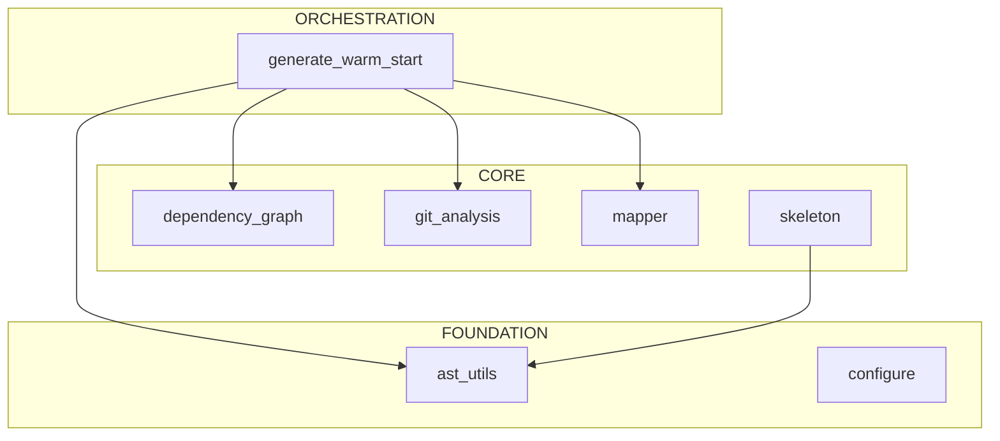
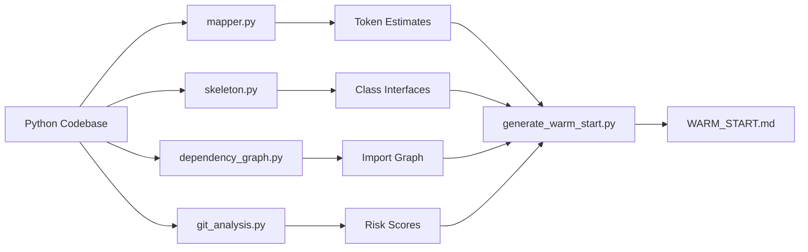

# repo-xray: Developer Warm Start

> Context-efficient onboarding guide for AI programmers.
> Generated: 2025-12-12 (Agent-Enhanced)
> Token budget: ~95K tokens

---

## 1. System Context

### Architecture View


### Data Pipeline View


---

## 2. Architecture Overview

**repo-xray** is a Python AST analysis toolkit that solves the cold start problem for AI coding assistants. When an AI assistant needs to understand a million-token codebase within a 200K context window, repo-xray extracts structural information (classes, methods, signatures, imports) without loading implementation details, achieving ~95% token reduction.

The codebase contains **8 modules** organized in three architectural layers:

- **Foundation** (2 modules): AST parsing utilities and project configuration detection
- **Core** (5 modules): Individual analysis tools (mapper, skeleton, dependency_graph, git_analysis, tests)
- **Orchestration** (1 module): `generate_warm_start.py` combines all tools into unified documentation

**Key architectural patterns:**
- **Tool Pipeline** - Each script is standalone CLI + importable library
- **AST-First** - Uses Python's `ast` module, no external dependencies
- **Layer Detection** - Automatically classifies modules by import patterns
- **Sibling Imports** - Scripts use `sys.path.insert()` for cross-module imports

---

## 3. Critical Classes

### Entry Points (CLI Scripts)
| Script | Purpose | Key Function |
|--------|---------|--------------|
| `mapper.py` | Directory tree + token estimates | `map_directory()` |
| `skeleton.py` | Class/method extraction | `get_skeleton()` |
| `dependency_graph.py` | Import analysis + layers | `build_dependency_graph()` |
| `git_analysis.py` | Risk, coupling, freshness | `analyze_risk()` |
| `configure.py` | Auto-detect project structure | `detect_project_root()` |
| `generate_warm_start.py` | Unified documentation | `collect_all_data()` |

### Core Components

**generate_warm_start.py** (Orchestrator)
```python
def collect_all_data(directory: str, verbose: bool = False) -> Dict[str, Any]: ...  # L117
def detect_entry_points(directory: str, graph: Dict, layers: Dict) -> List[Dict]: ...  # L187
def generate_architecture_overview(data: Dict) -> Tuple[str, float]: ...  # L325
def render_template(data: Dict) -> str: ...  # L602
```

**dependency_graph.py** (Import Analysis)
```python
def build_dependency_graph(directory, root_package, auto_detect, source_dir) -> Dict: ...  # L275
def identify_layers(graph: Dict) -> Dict[str, List[str]]: ...  # L312
def detect_source_root(directory: str) -> Optional[str]: ...  # L202
def find_orphans(graph: Dict) -> List[Dict]: ...  # L526
```

**lib/ast_utils.py** (Foundation)
```python
def get_skeleton(filepath: str) -> Tuple[str, int, int]: ...
    # Returns: (skeleton_text, original_tokens, skeleton_tokens)
```

### Data Models
*No Pydantic/dataclass models - uses plain dicts for simplicity*

---

## 4. Data Flow

```
User: python generate_warm_start.py /path/to/repo
    │
    ▼
[1] collect_all_data()
    │
    ├──▶ [2] detect_project_name() → pyproject.toml / setup.py / dirname
    │
    ├──▶ [3] map_directory() → token estimates, large files
    │
    ├──▶ [4] build_dependency_graph() → modules, imports, layers
    │         │
    │         ├── detect_source_root() → handle nested structures
    │         ├── identify_layers() → foundation/core/orchestration
    │         └── find_orphans() → dead code candidates
    │
    ├──▶ [5] Git Analysis
    │         ├── analyze_risk() → churn, hotfixes, authors
    │         ├── analyze_coupling() → co-modification pairs
    │         └── analyze_freshness() → active/aging/stale/dormant
    │
    ├──▶ [6] detect_entry_points() → CLI scripts, __main__ blocks
    │
    └──▶ [7] extract_critical_classes() → skeleton code
              │
              ▼
[8] render_template() → WARM_START.md
```

---

## 5. Entry Points

### CLI Commands
```bash
# Generate complete WARM_START.md
python .claude/skills/repo-xray/scripts/generate_warm_start.py /path/to/repo

# With debug output (raw JSON per section)
python .claude/skills/repo-xray/scripts/generate_warm_start.py /path/to/repo --debug

# Individual tools
python .claude/skills/repo-xray/scripts/mapper.py /path/to/repo --summary
python .claude/skills/repo-xray/scripts/skeleton.py src/ --priority critical
python .claude/skills/repo-xray/scripts/dependency_graph.py src/ --mermaid
python .claude/skills/repo-xray/scripts/git_analysis.py src/ --risk
```

### Python API
```python
# Import from scripts (after adding to path)
from generate_warm_start import collect_all_data, render_template
from dependency_graph import build_dependency_graph, identify_layers
from mapper import map_directory, estimate_tokens
from git_analysis import analyze_risk, analyze_coupling
from lib.ast_utils import get_skeleton
```

### Claude Code Integration
```
@repo_architect generate     # Uses generate_warm_start.py
@repo_architect refresh      # Regenerates existing WARM_START.md
```

---

## 6. Context Hazards

**DO NOT READ these directories/files** - they consume context without providing architectural insight:

### Large Data Directories
- `__pycache__/`, `.git/`, `venv/`, `node_modules/`
- `artifacts/`, `data/`, `logs/`, `WARM_START_debug/`

### Large Files
| Tokens | File | Recommendation |
|--------|------|----------------|
| 10.4K | `Phase2_Implementation_plan.md` | Skip (planning doc) |
| 7.6K | `generate_warm_start.py` | Use skeleton view |
| 6.5K | `dependency_graph.py` | Use skeleton view |

### File Extensions to Skip
`.pyc`, `.pkl`, `.log`, `.jsonl`, `.csv`, `.h5`, `.json` (debug output)

---

## 7. Quick Verification

```bash
# Check tool availability
python .claude/skills/repo-xray/scripts/mapper.py --help

# Run validation tests
pytest .claude/skills/repo-xray/tests/ -v

# Verify imports work
python -c "
import sys
sys.path.insert(0, '.claude/skills/repo-xray/scripts')
from dependency_graph import build_dependency_graph
from mapper import map_directory
print('OK')
"
```

---

## 8. X-Ray Commands

```bash
# Map directory structure with token estimates
python .claude/skills/repo-xray/scripts/mapper.py . --summary

# Extract class/method skeletons (95% token reduction)
python .claude/skills/repo-xray/scripts/skeleton.py .claude/skills/repo-xray/scripts/

# Filter by priority level (critical, high, medium, low)
python .claude/skills/repo-xray/scripts/skeleton.py . --priority critical

# Analyze import dependencies
python .claude/skills/repo-xray/scripts/dependency_graph.py . --json

# Generate Mermaid diagram
python .claude/skills/repo-xray/scripts/dependency_graph.py . --mermaid

# Focus on specific area
python .claude/skills/repo-xray/scripts/dependency_graph.py . --focus lib
```

### Token Budget Reference
| Operation | Tokens | Use When |
|-----------|--------|----------|
| mapper.py --summary | ~500 | First exploration |
| skeleton.py (1 file) | ~200-500 | Understanding interface |
| skeleton.py --priority critical | ~5K | Core architecture |
| dependency_graph.py --json | ~3K | Import relationships |
| dependency_graph.py --mermaid | ~500 | Documentation diagrams |
| generate_warm_start.py | ~8-20K | Full documentation |

---

## 9. Architecture Layers

### Foundation (Most Imported)
| Module | Imported By | Purpose |
|--------|-------------|---------|
| `lib.ast_utils` | 2 | AST parsing, skeleton extraction |
| `configure` | 0 | Project structure detection |

### Core (Business Logic)
| Module | Imported By | Purpose |
|--------|-------------|---------|
| `dependency_graph` | 2 | Import analysis, layer detection |
| `git_analysis` | 1 | Risk scoring, coupling, freshness |
| `mapper` | 1 | Token estimates, large file detection |
| `skeleton` | 0 | Class/method extraction |

### Orchestration (Entry Points)
| Module | Imports | Purpose |
|--------|---------|---------|
| `generate_warm_start` | 4 | Combines all tools, generates docs |

---

## 10. Risk Assessment

### High-Risk Files (volatile in past 6 months)
| File | Risk | Churn | Hotfixes | Why |
|------|------|-------|----------|-----|
| `dependency_graph.py` | 0.61 | 2 | 1 | Recent sibling import fixes |
| `mapper.py` | 0.61 | 2 | 1 | Added exports |
| `generate_warm_start.py` | 0.37 | 1 | 1 | New file, initial bugs |
| `git_analysis.py` | 0.37 | 1 | 1 | New file |

*Risk formula: (Churn × 0.4) + (Hotfixes × 0.4) + (AuthorEntropy × 0.2)*

---

## 11. Hidden Coupling

### Files That Change Together
*No significant coupling pairs detected in recent history.*

This indicates clean module boundaries - each tool is independent and can be modified without affecting others.

---

## 12. Potential Dead Code

### Orphan Files (zero importers)
| File | Confidence | Status |
|------|------------|--------|
| `lib/token_estimator.py` | 0.90 | Utility, may be used in future |
| `lib/__init__.py` | 0.90 | Package marker (required) |
| `tests/__init__.py` | 0.90 | Package marker (required) |

### Freshness Summary
| Category | Count | Description |
|----------|-------|-------------|
| Active | 11 | Changed in last 30 days |
| Aging | 0 | Changed 30-90 days ago |
| Stale | 0 | Changed 90-180 days ago |
| Dormant | 0 | Not changed in 180+ days |

*All files actively maintained - healthy codebase.*

---

## Key Insights (Agent-Enhanced)

1. **No external dependencies** - Uses only Python stdlib (`ast`, `json`, `os`, `pathlib`)
2. **Sibling import pattern** - Scripts add their directory to `sys.path` for cross-imports
3. **Nested source detection** - Handles code in `.claude/skills/` via `detect_source_root()`
4. **Hybrid automation** - `generate_warm_start.py` produces baseline, agent can enhance
5. **Debug mode** - `--debug` outputs JSON per section for validation

---

*This document was enhanced by Claude using the repo-xray skill.*
*Pure Python version: `WARM_START_python.md`*
*To regenerate: `python .claude/skills/repo-xray/scripts/generate_warm_start.py . -o WARM_START.md`*
