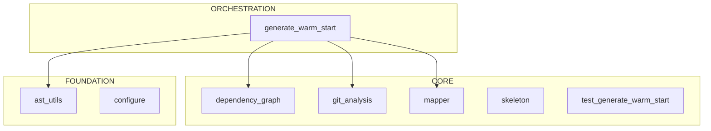

# claude-repo-xray: Developer Warm Start

> Context-efficient onboarding guide for AI programmers.
> Generated: 2025-12-12
> Token budget: ~95K tokens

---

## 1. System Context

### Architecture View


### Workflow-Centric View (Optional)
*Use `dependency_graph.py --focus workflow` for a focused view*

> Generated with: `python .claude/skills/repo-xray/scripts/dependency_graph.py . --mermaid`

---

## 2. Architecture Overview

<!-- CONFIDENCE: 0.5 - Pattern-based generation, may benefit from enhancement -->

**claude-repo-xray** is a Python application.

The codebase contains 8 modules organized in three architectural layers:

- **Foundation** (2 modules): Core utilities, configuration, data models
- **Core** (5 modules): Business logic and domain services
- **Orchestration** (1 modules): High-level coordination and entry points

**Key architectural patterns:**
- Standard Python package structure


<!-- /CONFIDENCE -->

---

## 3. Critical Classes

### Entry Points
| Class/Module | File | Description |
|--------------|------|-------------|
| `configure` | `configure.py` | Has __main__ block |
| `dependency_graph` | `dependency_graph.py` | Has __main__ block |
| `generate_warm_start` | `generate_warm_start.py` | Has __main__ block |
| `git_analysis` | `git_analysis.py` | Has __main__ block |
| `mapper` | `mapper.py` | Has __main__ block |
| `skeleton` | `skeleton.py` | Has __main__ block |
| `test_generate_warm_start` | `test_generate_warm_start.py` | Has __main__ block |

### Core Components
*Use skeleton.py to extract critical class interfaces*

### Data Models
*No Pydantic/dataclass models detected*

### Execution Layer (if present)
*Use skeleton.py to find Executor/Runner classes*

---

## 4. Data Flow

```
User Input
    │
    ▼
[1] configure.__init__(...)
    │
    ▼
[2] configure.run(...)
    │
    ├──▶ [3] Initialize state/context
    │
    ├──▶ [4] Core processing
    │         │
    │         └──▶ Sub-components
    │
    ├──▶ [5] Validation/Analysis
    │
    └──▶ [6] Generate output
              │
              ▼
         Final Results
```

---

## 5. Entry Points

### CLI Commands
```bash
# Run the main entry point
python -m claude-repo-xray
```

### Python API
```python
from claude-repo-xray import main
# See entry points above for specific imports
```

### Key Imports
```python
from claude-repo-xray import *
```

---

## 6. Context Hazards

**DO NOT READ these directories/files** - they consume context without providing architectural insight:

### Large Data Directories
- `__pycache__/`, `.git/`, `venv/`, `node_modules/`
- `artifacts/`, `data/`, `logs/`

### Large Files
| Tokens | File | Note |
|--------|------|------|
| 10.4K | `Phase2_Implementation_plan.md` | Consider skeleton |

### File Extensions to Skip
`.pyc`, `.pkl`, `.log`, `.jsonl`, `.csv`, `.h5`

---

## 7. Quick Verification

```bash
# Check system health (customize for your project)
python -m claude-repo-xray --help

# Run quick sanity tests
pytest tests/ -x -q

# Verify imports
python -c "import claude-repo-xray; print('OK')"
```

---

## 8. X-Ray Commands

Use these scripts to explore further without consuming full context:

```bash
# Map directory structure with token estimates
python .claude/skills/repo-xray/scripts/mapper.py . --summary

# Extract class/method skeletons (95% token reduction)
python .claude/skills/repo-xray/scripts/skeleton.py .

# Filter by priority level (critical, high, medium, low)
python .claude/skills/repo-xray/scripts/skeleton.py . --priority critical

# Analyze import dependencies
python .claude/skills/repo-xray/scripts/dependency_graph.py .

# Generate Mermaid diagram for documentation
python .claude/skills/repo-xray/scripts/dependency_graph.py . --mermaid

# Focus on specific area
python .claude/skills/repo-xray/scripts/dependency_graph.py . --focus core
```

### Enhanced Skeleton Features
The skeleton output includes:
- **Pydantic/dataclass fields** - `name: str = Field(...)` visible
- **Decorators** - `@dataclass`, `@property`, `@tool`
- **Global constants** - `CONFIG_VAR = "value"`
- **Line numbers** - `def method(): ...  # L42`

### Token Budget Reference
| Operation | Tokens | Use When |
|-----------|--------|----------|
| mapper.py --summary | ~500 | First exploration |
| skeleton.py (1 file) | ~200-500 | Understanding interface |
| skeleton.py --priority critical | ~5K | Core architecture |
| dependency_graph.py | ~3K | Import relationships |
| dependency_graph.py --mermaid | ~500 | Documentation diagrams |

---

## 9. Architecture Layers

### Foundation (Most Imported)
| Module | Imported By | Imports |
|--------|-------------|---------|
| `ast_utils` | 2 | 0 |
| `configure` | 0 | 0 |

### Core
| Module | Imported By | Imports |
|--------|-------------|---------|
| `dependency_graph` | 2 | 0 |
| `git_analysis` | 1 | 0 |
| `mapper` | 1 | 0 |
| `skeleton` | 0 | 1 |
| `test_generate_warm_start` | 0 | 1 |

### Orchestration (Most Imports)
| Module | Imported By | Imports |
|--------|-------------|---------|
| `generate_warm_start` | 0 | 4 |

---

## 10. Risk Assessment

### High-Risk Files (volatile in past 6 months)
| File | Risk | Churn | Hotfixes | Authors |
|------|------|-------|----------|---------|
| .claude/skills/repo-xray/scripts/dependency_graph.py | 0.61 | 2 | 1 | 2 |
| .claude/skills/repo-xray/scripts/mapper.py | 0.61 | 2 | 1 | 2 |
| .claude/skills/repo-xray/scripts/generate_warm_start.py | 0.37 | 1 | 1 | 1 |
| .claude/skills/repo-xray/scripts/git_analysis.py | 0.37 | 1 | 1 | 1 |
| .claude/skills/repo-xray/tests/__init__.py | 0.37 | 1 | 1 | 1 |
| .claude/skills/repo-xray/tests/test_generate_warm_start.py | 0.37 | 1 | 1 | 1 |
| .claude/skills/repo-xray/lib/__init__.py | 0.24 | 1 | 0 | 1 |
| .claude/skills/repo-xray/lib/ast_utils.py | 0.24 | 1 | 0 | 1 |
| .claude/skills/repo-xray/lib/token_estimator.py | 0.24 | 1 | 0 | 1 |
| .claude/skills/repo-xray/scripts/configure.py | 0.24 | 1 | 0 | 1 |

*Risk factors: churn (commit frequency), hotfixes (bug-fix commits), author entropy (coordination overhead)*

> Generated with: `python .claude/skills/repo-xray/scripts/git_analysis.py . --risk`

---

## 11. Hidden Coupling

### Files That Change Together
*No significant coupling pairs detected in recent history.*

This indicates clean module boundaries - files are generally modified independently.

*These files have no import relationship but are historically coupled. Changes to one often require changes to the other.*

> Generated with: `python .claude/skills/repo-xray/scripts/git_analysis.py . --coupling`

---

## 12. Potential Dead Code

### Orphan Files (zero importers)
| File | Confidence | Notes |
|------|------------|-------|
| ./.claude/skills/repo-xray/lib/token_estimator.py | 0.90 | No imports, not entry point pattern |
| ./.claude/skills/repo-xray/lib/__init__.py | 0.90 | No imports, not entry point pattern |
| ./.claude/skills/repo-xray/tests/__init__.py | 0.90 | No imports, not entry point pattern |

### Dormant Files (no changes in 180+ days)
*No dormant files detected - all files active within 180 days*

### Freshness Summary
| Category | File Count | Description |
|----------|------------|-------------|
| Active | 11 | Changed in last 30 days |
| Aging | 0 | Changed 30-90 days ago |
| Stale | 0 | Changed 90-180 days ago |
| Dormant | 0 | Not changed in 180+ days |

*Candidates for removal or archival. Verify before deleting.*

> Generated with: `python .claude/skills/repo-xray/scripts/dependency_graph.py . --orphans`
> Generated with: `python .claude/skills/repo-xray/scripts/git_analysis.py . --freshness`

---

*This document was generated by the repo_architect agent using the repo-xray skill.*
*To refresh: `@repo_architect refresh`*
