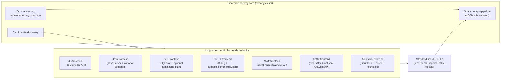
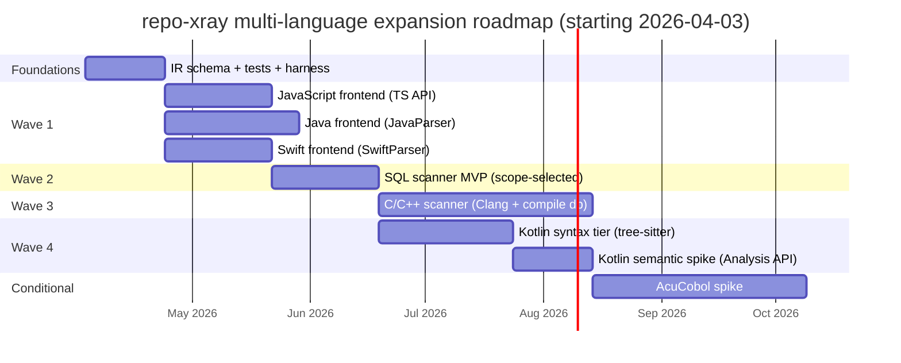

# Feasibility Analysis for Extending repo-xray to AcuCobol, JavaScript, SQL, Java, C++, C, Swift, and Kotlin

## Executive summary

This report analyses (a) the provided deep-research prompt and (b) the provided reference document, then executes the requested research for expanding repo-xray’s deterministic, syntax-first scanning approach to eight additional languages. fileciteturn0file0 fileciteturn0file1

The strongest overall finding is that the **hybrid architecture (shared core + language-specific frontends emitting a standardised JSON IR)** remains the best fit for these eight languages, but the **parsability and “pretty-good call graph” ceiling varies dramatically** by language family (dynamic vs static; preprocessor-heavy vs not; tooling maturity). fileciteturn0file0 fileciteturn0file1

The most practical, high-impact build order (based on a structured score using market demand × feasibility × signal quality / effort) is:

1) **JavaScript** (highest demand; viable parser choices; accept call-graph ceiling) citeturn0search0turn0search8turn7search0turn0search21  
2) **Java** (high demand; robust parser options; semantics as an opt-in tier) citeturn0search0turn1search1turn1search12turn13search9  
3) **SQL** (huge ubiquity but scope must be sharply defined: migrations vs dbt vs stored procedures; “signals” differ from procedural languages) citeturn0search0turn6search0turn5search1turn6search34turn8search6  
4) **C and C++** (material demand, but **compile configuration + preprocessing** make zero-setup scanning unreliable; treat as “project-metadata-needed” by default) citeturn0search0turn2search0turn3search0turn13search10turn13search3  
5) **Swift** (tooling exists via SwiftSyntax/SwiftParser; semantic resolution is feasible but toolchain-heavy) citeturn0search0turn1search3turn1search15turn8search12  
6) **Kotlin** (parsing is solvable; stable semantic access is improving via K2 + Analysis API, but integration effort is non-trivial) citeturn0search0turn4search1turn4search9turn4search6turn8search21  
7) **AcuCobol** (highest-risk niche; workable paths exist, but dialect variance, embedded languages, and vendor tool access create sustained maintenance burden) citeturn6search3turn12search7turn12search1turn12search3turn12search23  

Key points that materially affect feasibility and ROI:

- **JavaScript’s call graph precision is a known research problem**; syntax-only extraction can deliver useful *structural* signals, but high-quality interprocedural call graphs generally require heavier analyses with known scalability limits, especially for modern Node.js ecosystems. citeturn13search0turn13search18turn13search23  
- **C/C++ require compile commands** (or an equivalent “compilation database”) for robust parsing and include resolution in real code; this is standard practice in the Clang tooling ecosystem. citeturn2search0turn3search0turn3search4  
- **SQL scope definition is currently unspecified** in the prompt (migrations vs dbt vs stored procedures vs embedded SQL), and this drives both parser choice and which of the 17 repo-xray signals are meaningful. fileciteturn0file0 citeturn8search6turn8search3  
- For **AcuCobol**, there is evidence that open-source COBOL tooling (notably entity["organization","GnuCOBOL","cobol compiler project"]) supports ACUCOBOL-GT terminal source formats and various extensions, but also evidence of patchy extension coverage and dialect-specific gaps (especially UI/“screen” syntax). citeturn12search7turn12search1turn12search11  

## Prompt and reference document synthesis

The provided deep-research prompt asks for a feasibility + usefulness analysis to extend repo-xray’s deterministic, AST-based scanning model to **AcuCobol, JavaScript, SQL, Java, C++, C, Swift, and Kotlin**, replicating a defined set of structural “signals” and preserving strict constraints (deterministic; fast; minimal dependencies; fault-tolerant; syntax-first). fileciteturn0file0

The prompt also constrains the architecture: it states that research already recommends **a hybrid model**—shared core (git analysis, config, output pipeline) + **language frontends** emitting a standardised JSON intermediate representation (IR). fileciteturn0file0

The reference document (existing research) already covers **Go, TypeScript, Rust, C#, and COBOL** and argues that multi-language scanner quality depends primarily on the **static analysis foundation** available for each language; it recommends the same hybrid approach and describes an illustrative language-agnostic JSON schema and a tree-sitter fallback concept. fileciteturn0file1

### Explicit research questions extracted from the prompt

The prompt’s per-language deliverables imply the following explicit research questions:

| Theme | Research question (explicit) | Why it is load-bearing |
|---|---|---|
| Parser selection | What is the best parsing tool per language, and can it parse single files without project context? fileciteturn0file0 | Determines “zero-setup tier” feasibility and fault tolerance. |
| Signal parity | For each of the 17 signals, what is feasible syntax-only vs requiring semantic resolution? fileciteturn0file0 | Drives expected value and design of optional semantic tier. |
| Dependency envelope | What is the minimum viable dependency set and runtime requirement per language? fileciteturn0file0 | Determines packaging, adoption friction, and maintainability. |
| Performance | Can the scanner realistically meet the target (≈5s/500 files), and if not, what is the floor? fileciteturn0file0 | Constraints determine whether “always-on” scanning is plausible. |
| Deployment | Can it be shipped as a single binary / minimal runtime, and what will users need installed? fileciteturn0file0 | Adoption and CI integration hinge on this. |
| ROI | Is there meaningful market demand and differentiating value versus existing tooling? fileciteturn0file0 | Prevents building scanners with low incremental value. |

### Implicit assumptions and risk-bearing ambiguities

The prompt and reference doc jointly rely on several implicit assumptions that should be made explicit:

| Implicit assumption | Why it matters | Risk if false |
|---|---|---|
| “17 signals” are broadly meaningful across all eight languages (including declarative SQL). fileciteturn0file0 | Signal definition affects usefulness. | SQL may require a different signal model; forcing parity could lower value. citeturn6search0turn6search34 |
| A single standard JSON IR can represent all language constructs with minimal loss. fileciteturn0file0 | IR schema stability underpins shared core. | Over-complex schema slows iteration; under-specified schema loses key constructs. |
| “Minimal dependencies” can be interpreted as “minimal for the language’s ecosystem”, not “stdlib-only like Python”. fileciteturn0file0 | Some languages lack a stdlib parser analogue. | Overly strict constraint may make parsing infeasible (e.g., JS, Kotlin, Swift). |
| Syntax-only call graphs are “good enough” for onboarding. fileciteturn0file0 | Call graphs are part of the signal set. | Dynamic languages (JS) have known static call-graph limitations. citeturn13search18turn13search0turn13search23 |
| SQL parsing tool note: “sqlparse … stdlib-compatible” (as written in the prompt) implies very low dependency cost. fileciteturn0file0 | Influences SQL tool choice. | sqlparse is a third-party, non-validating parser with limited introspection. citeturn6search34 |

### Missing information that should be treated as unspecified (not assumed)

Several details are explicitly required to make tool and deployment recommendations precise, but are not specified in the prompt:

| Missing detail (unspecified) | Why it changes the recommended approach |
|---|---|
| Target OS/CPU constraints for scanner distribution (Linux-only? macOS? Windows?). fileciteturn0file0 | Drives feasibility of distributing a single binary (especially for Swift toolchain and Clang bundling). |
| Required language versions / dialects: ECMAScript target, Java language level, Kotlin version (K1 vs K2), Swift toolchain version, C/C++ standards/compilers, SQL dialect set, ACUCOBOL-GT version. fileciteturn0file0 | Parser compatibility and maintenance burden hinge on version targets. |
| Scope of “SQL scanning”: migrations, dbt, stored procedures, embedded SQL in host languages, or all. fileciteturn0file0 | Determines schema: dependency graph vs procedural constructs; parser choice differs. citeturn8search6turn8search3 |
| Whether semantic enhancement tier is allowed to invoke build tools (Gradle/Maven, clang, Swift build, etc.) or must stay file-only. fileciteturn0file0 | Type resolution in Java/Kotlin/C++ often requires project configuration. citeturn2search0turn1search1 |
| Expected integration between scanners in polyglot repos (e.g., Java + SQL migrations + JS frontend): cross-language linking requirements. fileciteturn0file0 | Impacts IR schema and “entry point” modelling. |

## Evidence base and methodology

All web research was conducted in English and prioritised: (1) official documentation and maintainers’ repositories, (2) reputable industry reports and surveys, (3) peer-reviewed papers and major conference publications, (4) secondary technical articles for operational details.

Market relevance was triangulated primarily through the **2025 Stack Overflow Developer Survey** technology results (broad developer population) and a **GitHub Octoverse 2025** summary post for languages in new repositories. citeturn0search0turn0search8

Evidence strength rubric used in this report:

| Evidence type | Typical strength | Examples used here |
|---|---|---|
| Official/vendor docs; primary project docs | High | Clang libclang docs; JSON compilation database spec; SwiftParser docs. citeturn3search0turn2search0turn1search15 |
| Peer-reviewed papers / major conference papers | High | SQLCheck (SIGMOD 2020); Java reflection challenges; C preprocessor empirical studies; TAJS. citeturn6search0turn13search9turn13search10turn13search0 |
| Major OSS repos/readmes of core tools | Medium–High | SQLGlot; libpg_query; tree-sitter grammar repos; SwiftSyntax repo. citeturn5search1turn5search2turn3search2turn1search3 |
| Reputable industry posts (vendor blogs) | Medium | JetBrains on Kotlin Analysis API; Kotlin K2 migration guide; Apple/Swift blog. citeturn4search9turn4search1turn8search12 |
| Community posts/forums | Low–Medium | Used sparingly for “known pain points” when primary sources were unavailable. citeturn12search1 |

image_group{"layout":"carousel","aspect_ratio":"16:9","query":["Clang AST libclang example","SwiftSyntax SwiftParser syntax tree","Tree-sitter parse tree example JavaScript","TypeScript Compiler API AST visualization"],"num_per_query":1}

## Findings by language

The tables below keep the prompt’s required dimensions (market relevance, parser landscape, signal feasibility, deployment, effort) but consolidate presentation to reduce repetition, while explicitly flagging where the prompt remains underspecified. fileciteturn0file0

### High-level language verdicts and recommended parsing foundation

| Language | One-line verdict | Primary recommended parser/tool | Notes on why |
|---|---|---|---|
| AcuCobol | Questionable ROI (unless a specific customer need exists) | Use open COBOL tooling as a compatibility layer (GnuCOBOL where possible), else COBOL grammar + tolerant heuristics | Evidence shows GnuCOBOL supports ACUCOBOL-GT terminal format and many extensions but not all (notably GUI/screen syntax). citeturn12search7turn12search1turn12search11 |
| JavaScript | Feasible with tradeoffs | Reuse TypeScript Compiler API to parse JS/JSX + optional JSDoc typing | TypeScript supports generating typings from JS + JSDoc, signalling a practical path to “some type info” even for JS. citeturn0search21turn7search3turn0search2 |
| SQL | Feasible with tradeoffs (scope-dependent) | SQLGlot as baseline SQL AST; add SQLFluff if templating/dbt is in-scope | SQLGlot is “no-dependency” and multi-dialect. SQLFluff emphasises dialect flexibility and dbt/Jinja use cases. citeturn5search1turn6search13turn5search8turn8search6 |
| Java | Feasible with tradeoffs | JavaParser for syntax-only + optional symbol solving; consider javac Tree API as “official” semantic tier | JavaParser is explicitly an AST library; javac Tree API supports parse/analyse but some compiler internals are not supported API. citeturn1search12turn1search1turn1search25 |
| C++ | Challenging but possible | Clang tooling/libclang with compilation database | Clang provides a C interface for parsing into AST; compilation database is the standard mechanism for correct flags/includes. citeturn3search0turn2search0 |
| C | Challenging but possible | Clang tooling/libclang with compilation database; pycparser only for constrained subsets | pycparser documentation warns realistic C requires preprocessing, limiting “zero-setup” viability. citeturn2search3turn3search0turn2search0 |
| Swift | Feasible with tradeoffs | SwiftParser/SwiftSyntax | SwiftParser produces SwiftSyntax trees; SwiftSyntax is core to Swift’s macro system and source-accurate trees. citeturn1search15turn1search3 |
| Kotlin | Challenging but possible | Syntax: tree-sitter-kotlin; Semantic tier: Kotlin Analysis API (K2) | JetBrains positions Kotlin Analysis API as a documented stable semantic interface; K2 improves analysis performance. citeturn4search9turn4search1turn4search6 |

### Market relevance and typical codebase shape

Market relevance is grounded in the Stack Overflow 2025 Survey usage percentages (proxy for broad demand) and GitHub’s Octoverse framing of “core stacks” for new repositories. citeturn0search0turn0search8

| Language | “Worked with in past year” (all respondents) | Practical implication for repo-xray ROI |
|---|---:|---|
| JavaScript | 66.0% citeturn0search0 | Largest addressable market; many repos include JS even if not “JS-first”. |
| SQL | 58.6% citeturn0search0 | SQL analysis is broadly valuable but must be scoped (migrations vs analytics). |
| Java | 29.4% citeturn0search0 | High enterprise prevalence; large codebases; strong onboarding value. |
| C++ | 23.5% citeturn0search0 | High-value domains (systems/HPC); but parsing requires compile context. |
| C | 22.0% citeturn0search0 | Embedded/systems prevalence; similar tool constraints to C++. |
| Kotlin | 10.8% citeturn0search0 | Android + JVM services; strong framework/Gradle ties. |
| Swift | 5.4% citeturn0search0 | iOS/macOS concentration; smaller market but high codebase complexity. |
| COBOL (proxy for AcuCobol niche) | 1.0% citeturn0search0 | Niche but “high value per repo” where present; AcuCobol subset likely smaller. |

### Parser landscape comparison tables

These satisfy the prompt’s “comparison table” requirement, but focus on parsers realistically usable in a deterministic scanning frontend. fileciteturn0file0

#### AcuCobol parsing tool landscape

| Tool | Type Resolution | Speed | Dependencies | API Stability | Actively Maintained? |
|---|---|---|---|---|---|
| GnuCOBOL (dialect support incl. ACUCOBOL-GT terminal format) | Partial (compiler-level) | Medium (compiler) | External compiler/toolchain | Medium | Yes (project active) citeturn12search7turn12search17 |
| tree-sitter COBOL85 grammars | None | Fast | tree-sitter runtime + grammar | Medium | Varies by grammar repo citeturn9search3turn9search10 |
| Strumenta COBOL parser (partial ACUCOBOL-GT support) | Optional (product-dependent) | Unknown | External product/library | Medium | Yes (vendor) citeturn12search23 |
| Vendor precompilers for embedded SQL (e.g., Rocket AcuSQL) | N/A (precompile) | Medium | Vendor tool | Unknown | Yes (vendor) citeturn12search3 |

**Recommendation (AcuCobol):** Treat as a **customer-driven build**. If pursued, use **GnuCOBOL as the highest-leverage compatibility layer** (parsing + preprocessing) and fall back to tolerant syntax parsing for what cannot be parsed. Evidence for dialect coverage exists, but coverage is incomplete for some ACU extensions. citeturn12search7turn12search1turn12search11

#### JavaScript parsing tool landscape

| Tool | Type Resolution | Speed | Dependencies | API Stability | Actively Maintained? |
|---|---|---|---|---|---|
| TypeScript Compiler API (parsing JS/JSX; optional Program) | Yes (optional) | Medium | Node + `typescript` | High (widely used) citeturn0search2 | Yes |
| Babel parser (`@babel/parser`) | No (syntax only) | Fast | Node + Babel packages | Medium | Yes citeturn7search0 |
| Acorn (+ JSX plugin) | No | Very fast | Node + small deps | Medium | Yes citeturn0search10turn0search3 |
| Espree (ESLint parser) | No (ESTree) | Fast | Node + ESLint ecosystem | Medium | Yes citeturn7search21turn7search1 |
| tree-sitter-javascript | No | Fast | tree-sitter runtime (native/WASM) | Medium | Yes citeturn7search2turn7search10 |

**Recommendation (JavaScript):** Reuse the **TypeScript Compiler API** for JS/JSX parsing and optionally enable semantic info on projects that provide config/context. TypeScript explicitly supports deriving typings from JavaScript via JSDoc. citeturn0search21turn7search3

#### SQL parsing tool landscape

| Tool | Type Resolution | Speed | Dependencies | API Stability | Actively Maintained? |
|---|---|---|---|---|---|
| SQLGlot | No (syntax/AST only) | Fast–Medium | Python package (declares no deps) | Medium | Yes citeturn5search1 |
| SQLFluff | No (parse tree + lint rules) | Medium | Python package | Medium (parser evolves) | Yes citeturn6search13turn5search4turn6search1 |
| libpg_query (Postgres parser) | Partial (dialect-specific AST) | Fast | Native library + bindings | Medium (format changes across PG versions) | Yes citeturn5search2turn5search30turn6search18 |
| tree-sitter-sql (general grammar) | No | Fast | tree-sitter runtime + grammar | Medium | Yes citeturn5search3turn5search7 |
| sqlparse | No (non-validating) | Fast | Python module | Medium | Yes/ongoing | Postgres wiki describes limited introspection. citeturn6search34 |

**Recommendation (SQL):** Baseline on **SQLGlot** for deterministic AST across many dialects, but treat **templating/dbt** as a decision gate. SQLFluff explicitly targets dialect flexibility and dbt/Jinja contexts. citeturn5search1turn6search13turn8search6

#### Java parsing tool landscape

| Tool | Type Resolution | Speed | Dependencies | API Stability | Actively Maintained? |
|---|---|---|---|---|---|
| JavaParser | Optional (via symbol solver) | Fast–Medium | JVM + library | Medium | Yes citeturn1search12turn1search0turn1search36 |
| javac Tree API (`JavacTask`) | Yes (analyse stage) | Medium | JDK toolchain | Medium | Yes (as part of JDK) citeturn1search1turn1search17 |
| Eclipse JDT ASTParser | Optional (bindings recovery etc.) | Medium | JVM + Eclipse libs | Medium | Yes citeturn1search2turn1search10 |
| tree-sitter-java | No | Fast | tree-sitter runtime + grammar | Medium | Yes (grammar maintained) citeturn3search29turn3search10 |

**Recommendation (Java):** Use **JavaParser** for syntax-first scanning, with an optional semantic tier using either JavaParser’s symbol solving or javac/JDT when project context is available. Javac does support parsing in a structured Tree API, but parts of the compiler internals are explicitly “not supported API”. citeturn1search1turn1search25turn1search12

#### C++ and C parsing tool landscape

| Tool | Type Resolution | Speed | Dependencies | API Stability | Actively Maintained? |
|---|---|---|---|---|---|
| Clang libclang | Yes (via AST + compilation flags) | Medium | Clang/LLVM libraries | Medium–High | Yes citeturn3search0turn3search4 |
| Clang tooling with `compile_commands.json` | Yes | Medium | Clang + compilation database | High (standard in ecosystem) | Yes citeturn2search0turn2search24 |
| tree-sitter-c / tree-sitter-cpp | No | Fast | tree-sitter runtime + grammars | Medium | Yes citeturn3search2turn3search3turn3search10 |
| pycparser (C only) | No | Fast (after preprocessing) | Python package + C preprocessor | Medium | Yes; but requires preprocessing for realistic code citeturn2search3turn2search11 |

**Recommendation (C/C++):** Use **Clang tooling** (libclang or LibTooling) as the correctness baseline and make “project metadata available (compile db)” the default expectation. A compilation database is explicitly defined as a JSON array of compile commands per translation unit. citeturn2search0turn3search0

#### Swift parsing tool landscape

| Tool | Type Resolution | Speed | Dependencies | API Stability | Actively Maintained? |
|---|---|---|---|---|---|
| SwiftParser + SwiftSyntax | No (syntax tree) | Fast–Medium | Swift toolchain / SwiftPM deps | Medium | Yes citeturn1search15turn1search3 |
| SourceKit/Swift compiler services (semantic indexing) | Yes | Medium–Slow | Toolchain + indexing | Medium | Yes (toolchain) |
| tree-sitter-swift (not assessed deeply here) | No | Fast | tree-sitter runtime | Medium | Varies |

**Recommendation (Swift):** Use **SwiftParser/SwiftSyntax** for syntax-first scanning; it produces a SwiftSyntax syntax tree and is foundational to Swift’s macro system. citeturn1search15turn1search3

#### Kotlin parsing tool landscape

| Tool | Type Resolution | Speed | Dependencies | API Stability | Actively Maintained? |
|---|---|---|---|---|---|
| tree-sitter-kotlin | No | Fast | tree-sitter runtime + grammar | Medium | Yes citeturn4search6turn5search7 |
| Kotlin compiler PSI via kotlin-compiler-embeddable | Partial/Optional | Medium | Large compiler jar + IntelliJ PSI infra | Low–Medium | Yes but version-sensitive citeturn4search12turn4search16turn4search0 |
| Kotlin Analysis API (K2-era) | Yes | Medium | Kotlin tooling (IDE-linked) | Improving (explicitly positioned as stable API) | Yes citeturn4search9turn4search13 |

**Recommendation (Kotlin):** Use **tree-sitter-kotlin** for a deterministic, fast syntax tier, and plan a separate semantic tier around the **Kotlin Analysis API** as it is explicitly designed to provide predictable semantic access without depending on compiler internals. citeturn4search9turn4search13turn4search6

### Signal extraction feasibility

The prompt requires rating extraction feasibility for 17 signals. The tables below use the prompt’s rating vocabulary: **Excellent**, **Good**, **Partial**, **Not Applicable**, **Requires Semantic**. fileciteturn0file0

Because the 17 signals are originally framed around procedural languages, SQL’s table notes where the concept meaningfully differs (e.g., “code skeletons” become DDL object skeletons). citeturn6search34turn6search0

#### JavaScript feasibility matrix (TypeScript Compiler API as parser)

| Signal | Syntax-Only | With Type Resolution | Language-specific notes |
|---|---|---|---|
| Code skeletons | Excellent | Excellent | Functions/classes visible; arrow functions and exports require conventions. citeturn7search0turn0search2 |
| Cyclomatic complexity | Excellent | Excellent | Branches, ternaries, logical ops are syntactic. |
| Type annotation coverage | Partial | Good | JS lacks types; JSDoc can supply types and TS can derive typings from JS. citeturn0search21 |
| Import/dependency graph | Good | Excellent | ESM imports easy; CommonJS `require()` is syntactic but dynamic requires heuristic. |
| Cross-module call graph | Partial | Good | Static call graphs for JS are known-hard; research shows limitations. citeturn13search18turn13search0turn13search23 |
| Side effect detection | Good | Good | Pattern-match `fs`, `fetch`, network libs; type info helps but not essential. |
| Security concerns (eval/exec equivalents) | Excellent | Excellent | `eval`, `Function`, dynamic import patterns. |
| Silent failures | Good | Good | Empty `catch` blocks syntactic. |
| Async/concurrency patterns | Excellent | Excellent | `async/await`, Promises are syntactic; event-driven edges require heuristics. citeturn13search34 |
| Decorator/annotation inventory | Partial | Good | Decorators are proposal-dependent; frameworks often use function wrappers. citeturn7search0 |
| Data model extraction | Partial | Good | Classes exist; many models are plain objects / schemas external. |
| Entry point detection | Good | Good | `package.json` scripts (metadata) and framework conventions drive this; prompt doesn’t specify whether metadata is in scope. citeturn0search8 |
| Git risk scores | Excellent | Excellent | Language-agnostic (already implemented). fileciteturn0file0 |
| Test coverage mapping | Good | Good | Jest/Mocha conventions; file naming and `describe/it` patterns. |
| Tech debt markers | Excellent | Excellent | Language-agnostic. fileciteturn0file0 |
| SQL string detection | Good | Good | Identify tagged templates or raw strings. |
| Deprecation markers | Partial | Partial | No universal marker; JSDoc `@deprecated` can be parsed. citeturn0search21 |

#### Java feasibility matrix (JavaParser / javac)

| Signal | Syntax-Only | With Type Resolution | Language-specific notes |
|---|---|---|---|
| Code skeletons | Excellent | Excellent | Declarations are explicit. citeturn1search12turn1search1 |
| Cyclomatic complexity | Excellent | Excellent | `if/for/while/switch/catch` nodes. |
| Type annotation coverage | Good | Excellent | Java is statically typed, but inference (`var`) and lambdas benefit from semantics. |
| Import/dependency graph | Excellent | Excellent | `import` and package structure. |
| Cross-module call graph | Partial | Excellent | Virtual dispatch, interfaces; best with semantic model. |
| Side effect detection | Good | Good | Identify IO/network/db APIs; semantics can reduce false positives. |
| Security concerns | Good | Good | Reflection + dynamic classloading patterns exist (e.g., `Class.forName`). |
| Silent failures | Excellent | Excellent | Empty catches visible. |
| Async/concurrency patterns | Good | Good | Threads/executors visible; frameworks can abstract concurrency. |
| Decorator/annotation inventory | Excellent | Excellent | Annotations are syntactic markers central to frameworks. |
| Data model extraction | Excellent | Excellent | Classes/records/enums; Lombok-generated members are invisible syntax-only. |
| Entry point detection | Good | Good | `main` method; frameworks (Spring) require annotation heuristics. |
| Git risk scores | Excellent | Excellent | Language-agnostic. fileciteturn0file0 |
| Test coverage mapping | Good | Good | JUnit annotations and naming patterns. |
| Tech debt markers | Excellent | Excellent | Language-agnostic. fileciteturn0file0 |
| SQL string detection | Good | Good | Detect JDBC/query builders and raw strings. |
| Deprecation markers | Excellent | Excellent | `@Deprecated` is explicit. |

A core limitation for “semantic tier” Java analysis is the prevalence of reflection and dynamic proxies in real Java code, which is well-documented in empirical research on Java reflection challenges. citeturn13search9

#### SQL feasibility matrix (SQLGlot baseline; scope-dependent)

| Signal | Syntax-Only | With Type Resolution | Language-specific notes |
|---|---|---|---|
| Code skeletons | Good | Good | Interpreted as DDL: tables/views/functions; migrations/models. citeturn8search3turn8search6 |
| Cyclomatic complexity | Partial | Partial | Use query complexity proxies (CTE depth, nesting, joins). citeturn6search0 |
| Type annotation coverage | Not Applicable | Not Applicable | SQL “types” are schema-level, not function annotations. |
| Import/dependency graph | Good | Good | Object dependencies: view→table; model ref graphs (dbt). citeturn8search6turn5search1 |
| Cross-module call graph | Not Applicable | Not Applicable | Better reframed as lineage graph. |
| Side effect detection | Good | Good | DML/DDL classification: SELECT vs INSERT/UPDATE/DELETE/ALTER. |
| Security concerns | Partial | Partial | Injection is mostly host-language; in SQL itself, risky patterns include dynamic SQL in stored procs. |
| Silent failures | Partial | Partial | Procedural SQL dialects may have exception handling (PL/pgSQL, T-SQL). |
| Async/concurrency patterns | Not Applicable | Not Applicable | Not a core SQL property. |
| Decorator/annotation inventory | Not Applicable | Not Applicable | Equivalent is dialect directives or comments (dbt `config()` etc). citeturn8search6 |
| Data model extraction | Excellent | Excellent | Schema objects are the “data models”. citeturn8search3turn5search1 |
| Entry point detection | Partial | Partial | Migration ordering (Flyway naming; dbt model selection). citeturn8search7turn8search10 |
| Git risk scores | Excellent | Excellent | Language-agnostic. fileciteturn0file0 |
| Test coverage mapping | Partial | Partial | dbt tests exist; elsewhere depends on pipeline. citeturn8search30 |
| Tech debt markers | Excellent | Excellent | Language-agnostic. fileciteturn0file0 |
| SQL string detection | Not Applicable | Not Applicable | SQL scanner doesn’t need to detect SQL-in-strings; host language scanners do. |
| Deprecation markers | Partial | Partial | Engine-specific deprecations exist but are not uniform. |

Peer-reviewed work (SQLCheck) demonstrates that SQL tooling value often comes from detecting and ranking anti-patterns, which aligns with “orientation + risk” goals even though the signals differ from procedural-language scanning. citeturn6search0

#### C++ feasibility matrix (Clang tooling with compile db)

| Signal | Syntax-Only | With Type Resolution | Language-specific notes |
|---|---|---|---|
| Code skeletons | Good | Excellent | Headers, templates, and macros complicate pure syntax-only without preprocessing. citeturn13search3turn13search10 |
| Cyclomatic complexity | Excellent | Excellent | Control flow nodes visible once parsed. |
| Type annotation coverage | Good | Excellent | Types exist but templates + `auto` require semantic resolution. |
| Import/dependency graph | Partial | Good | `#include` requires preprocessing; compile db helps resolve include paths. citeturn2search0turn13search10 |
| Cross-module call graph | Partial | Good | Virtual dispatch requires semantic; templates/macros can hide edges. |
| Side effect detection | Good | Good | Pattern-match IO/syscalls; semantics can improve. |
| Security concerns | Good | Good | `system()`, unsafe functions, format string usage; better with semantic types. |
| Silent failures | Partial | Partial | Exception swallowing patterns exist but exceptions optional; macros hide. |
| Async/concurrency patterns | Good | Good | Detect `std::thread`, `async`, mutexes; semantics helps. |
| Decorator/annotation inventory | Not Applicable | Not Applicable | No annotations; use attributes (C++11 `[[...]]`) as analogue. |
| Data model extraction | Excellent | Excellent | Classes/structs/enums; templates complicate representation. |
| Entry point detection | Good | Good | `main`; but platform-specific entry points exist. |
| Git risk scores | Excellent | Excellent | Language-agnostic. fileciteturn0file0 |
| Test coverage mapping | Good | Good | gtest/catch2 naming; build metadata helps. |
| Tech debt markers | Excellent | Excellent | Language-agnostic. fileciteturn0file0 |
| SQL string detection | Good | Good | Detect string literals passed to DB libs. |
| Deprecation markers | Good | Good | `[[deprecated]]` attribute is syntactic. |

The C/C++ preprocessor is repeatedly shown in research as a major source of complexity for understanding, maintaining, and analysing code, supporting a “metadata-needed” stance for robust results. citeturn13search10turn13search3turn13search25

#### C feasibility matrix (Clang tooling; pycparser as constrained alternative)

| Signal | Syntax-Only | With Type Resolution | Language-specific notes |
|---|---|---|---|
| Code skeletons | Good | Excellent | Macros and includes impede raw parsing; compile db helps. citeturn2search0turn13search10 |
| Cyclomatic complexity | Excellent | Excellent | Straightforward if parsed. |
| Type annotation coverage | Good | Excellent | Types explicit; macro types and typedef webs benefit from semantics. |
| Import/dependency graph | Partial | Good | `#include` requires preprocessor and flags. |
| Cross-module call graph | Partial | Good | Function pointers and macros reduce precision. |
| Side effect detection | Good | Good | Syscalls, file IO; semantics helps. |
| Security concerns | Good | Good | Unsafe libc functions; buffer patterns. |
| Silent failures | Partial | Partial | Error-code conventions vary. |
| Async/concurrency patterns | Partial | Good | Depends on platform/threading APIs. |
| Decorator/annotation inventory | Not Applicable | Not Applicable | No annotations. |
| Data model extraction | Good | Excellent | `struct/enum/typedef`; macros affect. |
| Entry point detection | Good | Good | `main` plus embedded entry points. |
| Git risk scores | Excellent | Excellent | Language-agnostic. fileciteturn0file0 |
| Test coverage mapping | Partial | Good | Framework dependent. |
| Tech debt markers | Excellent | Excellent | Language-agnostic. fileciteturn0file0 |
| SQL string detection | Good | Good | Strings passed to DB clients. |
| Deprecation markers | Partial | Partial | Compiler attributes vary. |

pycparser explicitly notes that **realistic C typically requires running the C preprocessor** before parsing, making it unsuitable for a “no-setup” tier unless preprocessing is already available or constrained subsets are targeted. citeturn2search3turn2search11

#### Swift feasibility matrix (SwiftParser/SwiftSyntax)

| Signal | Syntax-Only | With Type Resolution | Language-specific notes |
|---|---|---|---|
| Code skeletons | Excellent | Excellent | Syntax tree supports declarations; SwiftSyntax is source-accurate. citeturn1search3turn1search15 |
| Cyclomatic complexity | Excellent | Excellent | `if/guard/switch/for/while/catch` are syntactic. |
| Type annotation coverage | Good | Excellent | Swift inference means many annotations missing; semantic tier helps. |
| Import/dependency graph | Excellent | Excellent | `import` statements visible. |
| Cross-module call graph | Partial | Good | Protocol dispatch and extensions need semantics for precision. |
| Side effect detection | Good | Good | Identify file/network/db APIs; actor isolation semantics could enhance. |
| Security concerns | Partial | Partial | Less direct `eval`; dangerous patterns are API-dependent. |
| Silent failures | Good | Good | Empty catches possible; Swift has `try?` patterns. |
| Async/concurrency patterns | Excellent | Excellent | Swift supports async/await, actors, structured concurrency. citeturn8search0turn8search12 |
| Decorator/annotation inventory | Good | Good | Attributes (e.g., `@MainActor`, property wrappers) are syntactic. citeturn8search12 |
| Data model extraction | Excellent | Excellent | structs/enums/classes/protocols. |
| Entry point detection | Good | Good | `@main`, App entry for SwiftUI; project metadata helps. |
| Git risk scores | Excellent | Excellent | Language-agnostic. fileciteturn0file0 |
| Test coverage mapping | Good | Good | XCTest conventions. |
| Tech debt markers | Excellent | Excellent | Language-agnostic. fileciteturn0file0 |
| SQL string detection | Good | Good | Identify raw strings and DB clients. |
| Deprecation markers | Good | Good | `@available(*, deprecated, ...)` is explicit. |

#### Kotlin feasibility matrix (tree-sitter syntax tier + K2 semantic tier)

| Signal | Syntax-Only | With Type Resolution | Language-specific notes |
|---|---|---|---|
| Code skeletons | Excellent | Excellent | Declarations are syntactic; PSI/trees capture them. |
| Cyclomatic complexity | Excellent | Excellent | Control flow nodes are syntactic. |
| Type annotation coverage | Partial | Excellent | Kotlin inference is extensive; semantic tier helps. |
| Import/dependency graph | Good | Excellent | Imports visible; Gradle/project model improves mapping. |
| Cross-module call graph | Partial | Good | Extension functions and dispatch benefit from semantics. |
| Side effect detection | Good | Good | Pattern-match IO/HTTP/DB; semantics improves. |
| Security concerns | Partial | Partial | Reflection exists (`kotlin.reflect`); risks app-specific. |
| Silent failures | Good | Good | Empty catches / `runCatching` patterns. |
| Async/concurrency patterns | Excellent | Excellent | `suspend`, builders, channels are identifiable; semantics improves flows. citeturn8search21turn8search5turn8search9 |
| Decorator/annotation inventory | Excellent | Excellent | Annotations are central (DI, Android). |
| Data model extraction | Excellent | Excellent | `data class`, sealed hierarchies, objects. |
| Entry point detection | Good | Good | `main`, Android manifests/Gradle are metadata-dependent (unspecified). |
| Git risk scores | Excellent | Excellent | Language-agnostic. fileciteturn0file0 |
| Test coverage mapping | Good | Good | JUnit/Kotest conventions. |
| Tech debt markers | Excellent | Excellent | Language-agnostic. fileciteturn0file0 |
| SQL string detection | Good | Good | Identify raw strings + Exposed/Room patterns. |
| Deprecation markers | Excellent | Excellent | `@Deprecated` is explicit. |

Kotlin’s semantic tier feasibility is improving: JetBrains describes the Kotlin Analysis API as a stable documented abstraction and provides performance claims for K2 compiler analysis phases. citeturn4search9turn4search1turn4search13

#### AcuCobol feasibility matrix (dialect-specific, high uncertainty)

| Signal | Syntax-Only | With Type Resolution | Language-specific notes |
|---|---|---|---|
| Code skeletons | Good | Good | COBOL divisions/paragraphs; ACU extensions may not parse in general grammars. citeturn12search7turn12search1 |
| Cyclomatic complexity | Good | Good | IF/EVALUATE/PERFORM sequences. |
| Type annotation coverage | Not Applicable | Not Applicable | Data models are data division declarations. |
| Import/dependency graph | Good | Good | COPY/copybook resolution is critical; toolchain support varies. |
| Cross-module call graph | Good | Good | CALL and PERFORM graph; inline PERFORM and THRU need careful modelling. |
| Side effect detection | Good | Good | File IO verbs; embedded SQL and precompilers exist (AcuSQL). citeturn12search3turn12search12 |
| Security concerns | Partial | Partial | Less “eval”; main risks are environment-dependent exec/calls. |
| Silent failures | Partial | Partial | Error handling idioms differ; checking status codes. |
| Async/concurrency patterns | Not Applicable | Not Applicable | Generally not a core COBOL construct. |
| Decorator/annotation inventory | Not Applicable | Not Applicable | Not a COBOL construct. |
| Data model extraction | Excellent | Excellent | Level-number structures and PIC clauses (once parsed). |
| Entry point detection | Good | Good | Procedure division; runtime/environment entry points. |
| Git risk scores | Excellent | Excellent | Language-agnostic. fileciteturn0file0 |
| Test coverage mapping | Partial | Partial | Conventions vary; often external harness/job control. |
| Tech debt markers | Excellent | Excellent | Language-agnostic. fileciteturn0file0 |
| SQL string detection | Not Applicable | Not Applicable | Better addressed as embedded SQL blocks. citeturn12search12turn12search3 |
| Deprecation markers | Partial | Partial | Toolchain-specific. |

AcuCobol-specific complexity includes embedded SQL precompilation: Rocket AcuSQL is explicitly described as scanning COBOL source for SQL statements and translating them for ACUCOBOL-GT compilation, and embedded SQL syntax is generally framed as `EXEC SQL ... END-EXEC`. citeturn12search3turn12search12

### Language-specific signals worth adding beyond the base 17

These are “orientation-critical” constructs absent in Python but central in the target ecosystems:

| Language | High-value language-specific signals | Detection approach (syntax tier) |
|---|---|---|
| JavaScript | CommonJS vs ESM module mode; framework routes/components; event-driven “implied calls” | Detect `require()` vs `import`; heuristic patterns (Express route methods), component exports; event registration patterns (limited). citeturn13search34 |
| SQL | Lineage graph; migration sequencing; dbt model dependencies; query anti-patterns | Parse DDL/DML; detect Flyway naming and schema history; parse dbt config files as metadata. citeturn8search7turn8search10turn6search0 |
| Java | Annotation-driven endpoints, DI wiring, ORM mappings; reflection hotspots | Extract annotations; flag reflection and proxy patterns as “semantic blind spots”. citeturn13search9 |
| C/C++ | Preprocessor footprint; macro-conditioned “variant code”; template-heavy hotspots | Extract macro usage stats; require compile db; track conditional compilation. citeturn13search10turn2search0turn13search3 |
| Swift | Protocol-oriented architecture; property wrappers; actor isolation boundaries | Extract `protocol`, `extension`, `@propertyWrapper`, `actor`, `@MainActor`. citeturn8search0turn8search12 |
| Kotlin | `suspend` functions; coroutine builders; sealed hierarchies; extension functions | Detect `suspend`, coroutine builders; `sealed`/`data class`; extension receiver types. citeturn8search21turn8search9 |
| AcuCobol | Screen/UI statements; Vision file usage; embedded SQL precompiler markers | Heuristic token patterns + optional compiler/preprocessor integration; treat as “best effort”. citeturn12search1turn12search3 |

## Cross-language synthesis

### Priority ranking

The prompt asks for ranking by `(market_demand × feasibility × signal_quality) / effort`. The table below operationalises that as a 1–5 score per factor (ordinal planning heuristic, not a measured quantity), grounded in market data and the tooling constraints documented above. fileciteturn0file0

| Language | Market demand (1–5) | Feasibility (1–5) | Signal quality (1–5) | Effort (1–5) | Score |
|---|---:|---:|---:|---:|---:|
| JavaScript | 5 | 4 | 3.5 | 3 | 23.3 |
| Java | 4 | 4 | 4 | 3.5 | 18.3 |
| SQL | 5 | 3.5 | 3 | 3 | 17.5 |
| C | 3 | 3 | 3.5 | 4 | 7.9 |
| Swift | 2 | 3.5 | 3.5 | 3.5 | 7.0 |
| C++ | 3 | 2.5 | 4 | 4.5 | 6.7 |
| Kotlin | 2 | 3 | 3.5 | 4 | 5.3 |
| AcuCobol | 1 | 2.5 | 3 | 4.5 | 1.7 |

Market demand is anchored in survey prevalence (JavaScript/SQL highest; Java and C-family significant; Kotlin/Swift smaller; COBOL niche). citeturn0search0turn0search8

### Shared infrastructure opportunities

The prompt and reference doc already identify that git analysis, formatting, configuration, and output pipeline can be shared; research here reinforces that the greatest additional cross-language leverage lies in:

- **A minimal but extensible IR schema**: the schema should represent *files → declarations → relationships* (imports, calls, data-model relations), and permit language-specific “extensions” without breaking the shared formatter contract. fileciteturn0file1turn0file0  
- **A shared “pattern vocabulary” layer** for side-effect detection and security hazards: even when call graphs are imprecise, pattern-matched APIs (`eval`, IO, subprocess, network) are useful and consistent.  
- **tree-sitter as a universal fallback**: tree-sitter is explicitly designed as a parsing library producing concrete syntax trees and provides a common interface and grammar ecosystem. citeturn2search10turn3search33  

### The “80% scanner” concept

Estimated percentage of Python repo-xray “signal quality” achievable under three tiers (planning heuristic). These are consistent with the documented structural limits: dynamic JS call graphs; C/C++ preprocessor; Kotlin/Swift type inference; SQL conceptual mismatch.

| Language | Syntax-only | Syntax + project metadata | Full semantic analysis |
|---|---:|---:|---:|
| JavaScript | ~65% | ~75% | ~85% (still limited vs dynamic features) citeturn13search18turn13search0turn13search23 |
| Java | ~75% | ~85% | ~95% (reflection remains a blind spot) citeturn13search9 |
| SQL | ~60% | ~80% (dbt/migration context) | ~90% (engine-specific semantics) citeturn6search0turn8search6turn8search3 |
| C | ~55% | ~80% (compile db) | ~90% (macro configurations still complex) citeturn2search0turn13search10turn13search3 |
| C++ | ~45% | ~80% (compile db) | ~90% (templates/macros remain hard) citeturn2search0turn13search10 |
| Swift | ~70% | ~80% | ~90% (toolchain-dependent) citeturn1search15turn8search12 |
| Kotlin | ~65% | ~75% | ~90% (K2/Analysis API) citeturn4search9turn4search1 |
| AcuCobol | ~55% | ~70% | ~80% (dialect + vendor tooling constraints) citeturn12search7turn12search1turn12search3 |

### Entity relationship and architecture diagram

The role of a compilation database and Clang tooling for C/C++ fits naturally as an “optional semantic tier” input, but is often practically required for correctness. citeturn2search0turn3search0

## Recommendations and follow-up plan

### Actionable recommendations

1) **Unify JavaScript parsing with the TypeScript frontend (even if treated as a separate “language mode”).** This reduces maintenance (one AST model) and leverages TypeScript’s ability to derive type information from JS + JSDoc when present. citeturn0search21turn0search2turn7search3  

2) **Define SQL scope before building.** Concretely pick: (a) migration-first (e.g., Flyway naming and ordering), (b) dbt-first (SQL + project YAML + templating), (c) stored procedure-first (procedural dialect), or (d) a layered approach. The codebase shape differs substantially between dbt projects and migration folders. citeturn8search6turn8search7turn8search3  

3) **For C/C++, treat `compile_commands.json` as the “expected happy path”, not an optional extra.** This is consistent with Clang’s compilation database specification and the ecosystem’s expectation for tooling correctness. citeturn2search0turn2search24turn3search0  

4) **For Kotlin, implement a syntax-only tier first (tree-sitter-kotlin), then plan a separate semantic tier around the Kotlin Analysis API.** JetBrains explicitly frames the Analysis API as a stable, predictable abstraction and provides evidence of K2 analysis performance improvements. citeturn4search9turn4search1turn4search13turn4search6  

5) **For Swift, use SwiftParser/SwiftSyntax now, and defer semantic resolution until a clear operational requirement exists.** SwiftSyntax/SwiftParser gives reliable structural extraction, and Swift’s concurrency constructs and attributes are clearly detectable syntactically. citeturn1search15turn8search0turn8search12  

6) **Defer AcuCobol unless driven by explicit user demand, and if pursued, anchor on GnuCOBOL compatibility + vendor precompile recognition rather than writing a fresh full dialect parser.** Evidence shows partial ACUCOBOL-GT support exists, but extension gaps are common. citeturn12search7turn12search1turn12search3turn12search23  

### Proposed next research steps

These are ordered to reduce risk and converge quickly on a stable IR.

- **IR schema hardening workshop**: extract the Python output schema used today and formalise the minimal required fields and extension mechanism. fileciteturn0file1turn0file0  
- **Prototype “single-file parse + skeleton + complexity” for three languages (JS, Java, Swift)** to validate deterministic output, error recovery behaviour, and throughput. citeturn1search15turn1search12turn0search2  
- **Build a benchmark harness** (same 500-file, 5-second target used in the prompt) with representative repos per language version, and measure parsing + signal extraction time. fileciteturn0file0  
- **SQL scope decision + representative corpora selection**: include one Flyway migration directory and one dbt project to test real-world templating and dependency modelling. citeturn8search7turn8search10turn8search6  
- **C/C++ compile-db integration spike**: verify behaviour with and without compile_commands.json and document expected degradation boundaries. citeturn2search0turn13search10  
- **Kotlin semantic tier feasibility spike**: evaluate Analysis API integration surface and whether it can run headless in CI without full IDE context (unspecified in prompt; must be validated). citeturn4search9turn4search13  

### Timeline and resource estimate for follow-up work

The estimates below assume: one senior engineer per language frontend; shared-core integration handled once (schema + formatter). They are planning estimates, not measured.

| Phase | Scope | Estimated effort | Key risks |
|---|---|---:|---|
| Foundations | IR schema spec + golden tests + benchmark harness | 2–3 weeks | Schema churn; “one schema fits all” tension. fileciteturn0file1 |
| Wave 1 | JavaScript + Java + Swift syntax tiers to IR | 6–8 weeks | JS call-graph ceiling; Java build context variance; Swift toolchain packaging. citeturn13search18turn13search9turn1search15 |
| Wave 2 | SQL scanner MVP (scope-selected) | 3–6 weeks | Dialect + templating complexity; signal-mismatch risk. citeturn8search6turn6search34 |
| Wave 3 | C/C++ scanner with compile db; degradation mode without it | 6–10 weeks | Preprocessor/cfg; cross-platform packaging of Clang toolchain. citeturn2search0turn13search10 |
| Wave 4 | Kotlin syntax + (optional) semantic spike | 6–10 weeks | API stability; headless environment complexities; Gradle modelling. citeturn4search9turn4search1 |
| Conditional | AcuCobol feasibility prototype | 6–12 weeks | Dialect & vendor tooling access; embedded SQL precompile flows; persistent maintenance. citeturn12search7turn12search3turn12search1 |

A concise implementation roadmap (calendar time assumes some parallelism):

The roadmap emphasises early delivery of high-demand, high-feasibility languages and defers high-risk dialect work until user demand is confirmed. Market demand evidence supports prioritising JavaScript/SQL/Java for broad impact. citeturn0search0turn0search8