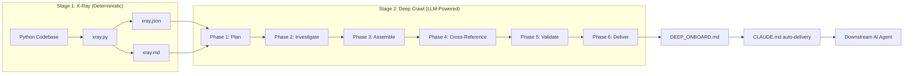

# Methodology: From Code to Onboarding Document

This document is the authoritative technical reference for the claude-repo-xray pipeline. It describes the two-stage process that transforms a codebase (Python or TypeScript/JavaScript) into a comprehensive AI onboarding document: a deterministic scanner (xray.py) produces structural intelligence, then an LLM-powered deep crawl uses that intelligence to investigate and produce a DEEP_ONBOARD.md.

**Core metric:** File-reads saved per onboarding token. Every token in the output should reduce the number of files a downstream AI agent needs to open before it can confidently make changes.

---

## 1. Pipeline Overview



**Stage 1 characteristics:**
- Deterministic — same input always produces same output
- Fast — ~5 seconds on a 500-file codebase
- Zero dependencies — Python 3.8+ stdlib only
- Reproducible — safe to run in CI on every commit

**Stage 2 characteristics:**
- LLM-powered — uses Claude to read code, trace paths, discover semantics
- Non-deterministic — two runs produce different documents
- Expensive — amortized across many future agent sessions
- Unlimited budget — depth over brevity, no token ceilings on output

**Design philosophy:** The scanner exists because a map is not understanding. It extracts 42+ signals from AST, import graph, git history, and code patterns without interpreting them. The deep crawl agent uses those signals as a prioritized investigation roadmap, spending tokens on reading actual code to discover behavioral semantics, implicit assumptions, and counterintuitive gotchas that static analysis cannot see.

---

## 2. Stage 1: X-Ray (Deterministic Analysis)

### 2.1 Orchestration

**Source:** `xray.py:run_analysis()` (line 247), `xray.py:main()` (line 605)

The pipeline executes analysis modules in a fixed order, where each step may depend on results from prior steps:

| Step | Module | Function | Depends On |
|------|--------|----------|------------|
| 1 | File Discovery | `discover_python_files()` | — |
| 2 | AST Analysis | `analyze_codebase()` | Step 1 (file list) |
| 3 | Import Analysis | `analyze_imports()` | Step 1 (file list) |
| 4 | Call Analysis | `analyze_calls()` | Steps 1, 2 (file list + AST results) |
| 5 | Git Analysis | `analyze_risk()`, `analyze_coupling()`, `analyze_freshness()`, `analyze_function_churn()`, `analyze_coupling_clusters()`, `analyze_velocity()` | Step 1 (file list) |
| 6 | Test Analysis | `analyze_tests()` | — |
| 7 | Tech Debt | `analyze_tech_debt()` | Step 1 (file list) |
| 8 | Investigation Targets | `compute_investigation_targets()` | Steps 2-5 (all prior results) |

Investigation targets (Step 8) **must** run last because it reads combined results from all other analyses.

**Config loading:** `config_loader.load_config()` checks, in order: explicit `--config` path, `--preset` mapping, `.xray.json` in target directory, then `configs/default_config.json`. The `config_to_gap_features()` function bridges config sections to the formatter's gap_features dict.

**Preset system** (`configs/presets.json`):

| Preset | Analyses | Typical Output |
|--------|----------|----------------|
| `minimal` | skeleton, imports | ~2K tokens |
| `standard` | skeleton, complexity, git, imports, calls, side-effects, tests, tech-debt | ~8K tokens |
| `full` (default) | All 12 switches | ~15K tokens |

---

### 2.2 File Discovery

**Source:** `lib/file_discovery.py`

**Algorithm:** `os.walk()` with in-place directory filtering via `dirs[:] = [...]`. Only `.py` files are collected. Ignore patterns loaded from `configs/ignore_patterns.json`.

**Ignore categories:**
- Directories: `__pycache__`, `.git`, `node_modules`, `.venv`, `venv`, `.pytest_cache`, `.mypy_cache`, `dist`, `build`, etc.
- Extensions: `.pyc`, `.pyo`, `.so`, `.dylib`, `.log`, `.pkl`
- Files: `*.log`, `*.jsonl`, `.DS_Store`

**Token estimation:** `file_size_bytes // 4` — a simple heuristic assuming ~4 characters per token for code (`estimate_tokens()`, line 127).

**Size categories** (`get_size_category()`, line 173):

| Category | Token Range |
|----------|-------------|
| TINY | ≤ 5,000 |
| SMALL | 5,001 – 10,000 |
| MEDIUM | 10,001 – 20,000 |
| LARGE | 20,001 – 50,000 |
| HUGE | > 50,000 |

**Project detection:** `detect_project_name()` tries `pyproject.toml` name field → `setup.py` name field → directory name. `detect_source_dir()` checks `<project_name>/`, `src/`, `src/<project_name>/`, `lib/` for Python files.

**Value to downstream AI:** File discovery determines the analysis scope. Size categories identify hazard files (HUGE/LARGE) that would waste context if read in full.

---

### 2.3 AST Analysis

**Source:** `lib/ast_analysis.py`

**Design principle:** Parse each file exactly once. The `analyze_file()` function (line 585) parses source with `ast.parse()`, then `_analyze_tree()` walks the AST once via `ast.walk()`, extracting all structural and behavioral information in a single pass.

**Extracted signals per file:**

| Signal | Extraction Method |
|--------|-------------------|
| Classes | `ast.ClassDef` at col_offset 0 → `_extract_class_info()` |
| Functions | `ast.FunctionDef`/`ast.AsyncFunctionDef` at col_offset 0 → `_extract_function_info()` |
| Constants | `ast.Assign` at col_offset 0 where target is `UPPER_CASE` |
| Complexity | `_calculate_function_cc()` per function |
| Type coverage | `has_type_hints` check per function |
| Decorators | `_extract_decorator_name()` per class/function |
| Async patterns | Counts of `AsyncFunctionDef`, `AsyncFor`, `AsyncWith` |
| Side effects | `_detect_side_effect()` per `ast.Call` node |
| Internal calls | Call text matching against `all_function_names` set |
| Security concerns | `_detect_security_concern()` per `ast.Call` — exec/eval/compile only |
| Silent failures | `_detect_silent_failure()` per `ast.ExceptHandler` — bare except, except-pass, log-and-swallow |
| Async violations | `_detect_async_violations()` per `ast.AsyncFunctionDef` — blocking calls in async context |
| SQL strings | `_detect_sql_strings()` — SQL/Cypher keyword regex on string literals |
| Deprecation markers | Decorator-based `@deprecated` detection during class/function extraction |
| Skeleton | `generate_skeleton()` from parsed AST |

#### Cyclomatic Complexity Formula

**Function:** `_calculate_function_cc()` (line 268)

```
CC = 1 (base)
   + 1 per If, While, For, AsyncFor
   + 1 per ExceptHandler
   + (len(values) - 1) per BoolOp (and/or)
   + len(generator.ifs) per comprehension (ListComp, SetComp, DictComp, GeneratorExp)
```

Functions with CC > 3 are flagged as hotspots (`analyze_file()`, line 663).

#### Side Effect Detection

**5 categories** defined in `SIDE_EFFECT_PATTERNS` (line 33):

| Category | Pattern Examples |
|----------|-----------------|
| `db` | `db.save`, `db.commit`, `session.commit`, `cursor.execute`, `insert(`, `update(`, `delete(`, `query(` |
| `api` | `requests.`, `httpx.`, `aiohttp.`, `.post(`, `.put(`, `.patch(`, `fetch(`, `api.send` |
| `file` | `file.write`, `.write(`, `json.dump`, `pickle.dump`, `export(` |
| `env` | `os.environ`, `setenv`, `putenv` |
| `subprocess` | `subprocess.`, `os.system`, `os.exec`, `Popen(` |

Safe patterns excluded: `.get(`, `ast.get_`, `isupper`, `islower`, `startswith`, `endswith`, `.read(`.

#### Type Coverage

Per function: counted as "typed" if `returns` annotation exists OR any non-self/cls argument has a type annotation. Per codebase: `typed_functions / total_functions × 100`.

#### v3.2 Detection Categories

Six new detectors added in v3.2, all extracted during the single AST pass:

**Security Concerns** — `_detect_security_concern()` (line 300)

Flags `exec()`, `eval()`, `compile()` builtins as code injection vectors. Only bare builtins are flagged — `cursor.execute()`, `pool.execute()`, etc. are NOT flagged because the detection checks `isinstance(node.func, ast.Name)` (bare name call), not `ast.Attribute` (method call). Output: `{"category": "code_execution", "call": "exec", "line": N}`.

**Silent Failures** — `_detect_silent_failure()` (line 310)

Inspects every `ast.ExceptHandler` node. Classifies the except type (`bare` if no type specified, `broad` if `Exception` or `BaseException`). Classifies the body pattern (`except_pass` if body is a single `Pass`, `log_and_swallow` if body is a single logging/print call). Reports both dimensions. Output: `{"line": N, "pattern": "except_pass", "except_type": "broad"}`.

**Async/Sync Violations** — `_detect_async_violations()` (line 346)

Walks the body of every `AsyncFunctionDef` looking for blocking calls. Patterns checked via `BLOCKING_CALL_PATTERNS` dict (line 60): `time.sleep` → `blocking_sleep`, `requests.get/post/put/delete/patch/head` → `blocking_http`. Also detects `run_until_complete` calls → `nested_event_loop`. Output: `{"violation_type": "blocking_sleep", "call": "time.sleep", "function": "my_async_fn", "line": N}`.

**SQL String Literals** — `_detect_sql_strings()` (line 371)

Walks the entire AST for `ast.Constant` string nodes longer than 5 characters. Tests against 6 regex patterns: `SELECT ... FROM`, `INSERT INTO`, `DELETE FROM`, `UPDATE ... SET`, `CREATE TABLE/INDEX/VIEW`, `MATCH ... RETURN` (Cypher). First match wins. Output: `{"query": "SELECT name FROM ...", "line": N}`. Known limitation: can flag docstrings containing SQL-like keywords.

**Deprecation Markers** — detected during class/function extraction in `_analyze_tree()` and separately by `tech_debt_analysis.py:analyze_deprecation_markers()`. Decorator-based: `@deprecated` in decorator list. Comment-based: regex scan for `# deprecated`, `DeprecationWarning`, `warnings.warn`. Output: `{"type": "decorator|comment", "file": "...", "line": N, "text": "..."}`.

**DB Side Effects (expanded)** — The existing `_detect_side_effect()` (line 252) `db` category was expanded to include ORM patterns: `.filter(`, `.objects.get(`, `.objects.filter(`, `.objects.create(`. These join the existing patterns (`db.save`, `session.commit`, `cursor.execute`, etc.).

**Value to downstream AI:** Security concerns identify code injection vectors for safety review. Silent failures reveal error-swallowing patterns that hide bugs. Async violations catch blocking calls that degrade async performance. SQL strings flag raw query construction (injection risk). Deprecation markers identify APIs scheduled for removal. These signals feed directly into the deep crawl's Protocol C (cross-cutting concern investigation).

**Value to downstream AI:** Skeleton extraction provides a compressed structural view (typically 10-15% of original token count). CC hotspots direct investigation to the most complex logic. Side effect detection identifies functions with external impact. Type coverage reveals where signatures alone are insufficient to understand behavior.

---

### 2.4 Import Analysis

**Source:** `lib/import_analysis.py`

#### Graph Construction

**Function:** `build_import_graph()` (line 242)

Two-pass algorithm:
1. **Module discovery:** Convert each file path to a module name via `module_path_to_name()`. Build a leaf-name lookup (`leaf_to_modules`) for ambiguous resolution.
2. **Import resolution:** For each module, parse imports with `parse_imports_with_aliases()`. Resolve absolute imports by exact match → prefix match → leaf name match. Resolve relative imports via `resolve_relative_import()`. Record internal edges and external dependencies.

Circular dependencies detected by checking if edge (A→B) has a reverse edge (B→A) in the edge set.

**Return structure:**
```python
{
    "graph": {module_name: {"imports": [...], "imported_by": [...]}},
    "layers": {"foundation": [...], "core": [...], "orchestration": [...], "leaf": [...]},
    "aliases": [...],
    "orphans": [...],
    "circular": [(a, b), ...],
    "external_deps": [...],
    "distances": {"max_depth": int, "avg_depth": float, "tightly_coupled": [...], "hub_modules": [...]}
}
```

#### Layer Classification

**Function:** `identify_layers()` (line 516)

Classification uses keyword matching first, then import ratio heuristics:

| Layer | Detection Rule |
|-------|---------------|
| Orchestration | Name contains: `manager`, `orchestrator`, `coordinator`, `workflow`, `pipeline`, `factory`, `runner` |
| Foundation | Name contains: `util`, `utils`, `base`, `common`, `helper`, `abstract`, `config`, `constants` |
| Leaf | `imported_by == 0` AND `imports == 0` |
| Foundation (ratio) | `imported_by / (imports + 1) > 2` |
| Orchestration (ratio) | `imported_by / (imports + 1) < 0.5` AND `imports > 2` |
| Core | Everything else |

#### Dependency Distance (BFS)

**Function:** `calculate_dependency_distance()` (line 370)

BFS from every module, recording hop count and path. Produces:
- **Max/avg depth** across all reachable pairs
- **Tightly coupled modules:** bidirectional with distance ≤ 2
- **Hub modules:** top 10 by total connections (`len(imports) + len(imported_by)`)

#### Orphan Detection

**Function:** `find_orphans()` (line 582)

Files with zero importers that aren't entry points. Entry point exclusions: `main.py`, `__main__.py`, `cli.py`, `app.py`, `wsgi.py`, `asgi.py`, `setup.py`, `manage.py`, `conftest.py`, `test_*` files, files containing `if __name__ ==`. Confidence scoring: deprecated/legacy names → 0.95, default → 0.9, scripts → 0.6, util/helper → 0.7.

**Value to downstream AI:** The import graph reveals architectural structure without reading code. Hub modules are investigation priorities. Orphans may be dead code. Circular dependencies indicate design tension. Layer classification helps agents understand code organization.

---

### 2.5 Call Analysis

**Source:** `lib/call_analysis.py`

#### Call Extraction

**Class:** `CallVisitor(ast.NodeVisitor)` (line 34)

Visits every `ast.Call` node, tracking the current function and class context. Extracts:
- `call`: function name or attribute chain (e.g., `module.Class.method`)
- `type`: "function" or "method"
- `line`: source line number
- `caller`: enclosing function name or "(module level)"
- `file`: source file path

#### Function Registry

**Function:** `build_function_registry()` (line 132)

Built from AST results. Registers each function under multiple keys:
- `module_name.function_name` (qualified)
- `function_name` (simple)
- `Class.method_name` (for methods)
- `module_name.Class.method_name` (fully qualified)

#### Cross-Module Detection

**Function:** `analyze_cross_module_calls()` (line 194)

For each call site, matches against the function registry. A call is cross-module when the caller's module stem differs from the target's module stem. Aggregates per function: call count, calling modules set, call site examples (capped at 10).

#### Impact Rating

**Function:** `build_reverse_lookup()` (line 321)

| Rating | Condition |
|--------|-----------|
| High | `module_count ≥ 5` OR `caller_count ≥ 10` |
| Medium | `module_count ≥ 2` OR `caller_count ≥ 5` |
| Low | Everything else |

**Return structure:**
```python
{
    "cross_module": {qualified_name: {"call_count": int, "calling_modules": int, "call_sites": [...]}},
    "reverse_lookup": {qualified_name: {"callers": [...], "caller_count": int, "module_count": int, "impact_rating": str}},
    "most_called": [...],  # top 15 by call sites
    "most_callers": [...],  # top 15 by calls made
    "isolated_functions": [...],  # top 20 never called cross-module
    "high_impact": [...]  # filtered to impact_rating == "high"
}
```

**Value to downstream AI:** Reverse lookup identifies blast radius — changing a high-impact function affects many modules. Isolated functions may be dead code or entry points. Most-called functions are the API surface the agent needs to understand.

---

### 2.6 Git Analysis

**Source:** `lib/git_analysis.py`

Git analysis extracts 6 signals from `git log` output, all parsed via subprocess calls to the git CLI.

#### 2.6.1 Risk Scoring

**Function:** `analyze_risk()` (line 72)

Parses `git log --since=6.months --name-only --pretty=format:COMMIT::%an::%s` to collect per-file: commit count, unique authors, hotfix count.

**Hotfix keywords:** `fix`, `bug`, `urgent`, `revert`, `hotfix`, `patch`, `emergency`

**Risk formula:**
```
churn_norm = commits / max_commits_across_all_files
author_score = min(unique_authors, 5) / 5.0
hotfix_score = min(hotfixes, 3) / 3.0

risk = (churn_norm × 0.4) + (hotfix_score × 0.4) + (author_score × 0.2)
```

**Threshold:** Only files with `risk > 0.1` are included. Results sorted by risk descending.

**Why these weights:** Churn and hotfixes are weighted equally at 40% each because both indicate instability — frequent changes suggest complexity, and hotfixes indicate bugs. Author entropy gets 20% because many authors touching a file increases coordination risk but is less directly indicative of problems than churn or bugs.

#### 2.6.2 Co-Modification Coupling

**Function:** `analyze_coupling()` (line 142)

Parses `git log -n 200 --name-only --pretty=format:COMMIT`. Builds a co-occurrence matrix of Python file pairs that appear in the same commit. Skips commits touching >20 files (bulk refactors). Reports pairs with ≥3 co-occurrences, top 20 by count.

**Why skip >20-file commits:** Large commits (dependency upgrades, renames, linting passes) create false coupling signals between unrelated files.

**Why min 3 co-occurrences:** A single co-occurrence is noise. Three or more suggest a real coupling pattern.

#### 2.6.3 Freshness

**Function:** `analyze_freshness()` (line 192)

Parses `git log --name-only --pretty=format:COMMIT::%ct` (Unix timestamp). Records the most recent commit timestamp per file.

| Category | Days Since Last Commit | Interpretation |
|----------|----------------------|----------------|
| Active | < 30 | Being maintained |
| Aging | 30 – 89 | May need attention |
| Stale | 90 – 179 | Possibly neglected |
| Dormant | ≥ 180 | Stable or abandoned |

#### 2.6.4 Function-Level Churn

**Function:** `analyze_function_churn()` (line 341)

Parses `git log --since=6.months -p --pretty=format:COMMIT::%an::%s` (full diff output). Extracts function names from unified diff hunk headers:

```
@@ -291,18 +291,26 @@ def run_with_progress(...)
```

Regex: `^@@ .+ @@\s+(?:(?:async\s+)?def|class)\s+(\w+)`

Aggregates per `(file, function)`: commit set (deduplicated), unique authors, hotfix count. Applies the same risk formula as file-level risk. Top 20 results by risk score.

**Value:** Identifies the specific functions within high-risk files that are actually volatile, rather than flagging entire files.

#### 2.6.5 Coupling Clusters

**Function:** `analyze_coupling_clusters()` (line 432)

Takes the coupling pairs from `analyze_coupling()` and builds an undirected adjacency graph. Finds connected components via BFS. Each cluster contains ≥2 files and is annotated with total co-change count.

**Value:** Groups of files that change together form a "coupling cluster" — modifying any file in the cluster likely requires changes to others. This is essential for change impact analysis.

#### 2.6.6 Velocity

**Function:** `analyze_velocity()` (line 487)

Parses `git log --since=6.months --format=format:%ct --name-only`. Buckets commits by `(year, month)` per file.

**Trend classification:**
```
mid = len(monthly_slots) // 2
avg_first = average(monthly[:mid])
avg_second = average(monthly[mid:])

if avg_first > 0 and avg_second > avg_first × 1.5:     trend = "accelerating"
elif avg_second > 0 and avg_first > avg_second × 1.5:   trend = "decelerating"
elif avg_first == 0 and avg_second > 0:                  trend = "accelerating"
elif avg_second == 0 and avg_first > 0:                  trend = "decelerating"
else:                                                     trend = "stable"
```

The zero-guards on the first two conditions prevent false classification when one half has no commits — those cases are handled explicitly by conditions 3 and 4.

Top 20 files by total commit count. Files with <2 commits are excluded.

**Value to downstream AI:** Accelerating files are active development fronts. Decelerating files may be stabilizing. Combined with risk, this tells the deep crawl which files to prioritize for investigation.

---

### 2.7 Investigation Targets

**Source:** `lib/investigation_targets.py`

Investigation targets are the bridge between Stage 1 and Stage 2. They identify specific areas where the deep crawl agent should spend its reading budget — places where static signals suggest the code will be confusing or dangerous without deeper analysis.

**Master function:** `compute_investigation_targets()` (line 765)

#### 2.7.1 Ambiguous Interfaces

**Function:** `compute_ambiguous_interfaces()` (line 64)

Finds functions whose names are generic and whose signatures lack sufficient type information.

**Generic function names** (60 names including): `process`, `handle`, `run`, `execute`, `validate`, `transform`, `convert`, `dispatch`, `apply`, `update`, `get`, `set`, `parse`, `format`, `load`, `save`, `send`, `check`, `verify`, `compute`, `calculate`, `evaluate`, etc.

**Scoring formula:**
```
ambiguity_score = (max(cross_module_callers, 1) × max(cc, 1)) / max(type_coverage, 0.1)
```

Where `type_coverage = (typed_args + has_return_type) / (non_self_args + 1)`.

**Flagging criteria:** Generic name, OR (type coverage < 0.5 AND cross-module callers ≥ 2). Private/dunder methods excluded. Top 30 by score.

#### 2.7.2 Entry-to-Side-Effect Paths

**Function:** `compute_entry_side_effect_paths()` (line 157)

For each detected entry point, BFS through a simplified call graph (module-level granularity) to find reachable side effects. Maximum 8 hops. Returns paths sorted by hop count descending.

**Call graph construction:** From `call_results.cross_module`, builds `caller_stem → set(callee_stem)` adjacency. Side effects collected from `ast_results.files[filepath].side_effects`.

**Value:** Gives the deep crawl agent a roadmap: "trace from this entry point to these side effects." Longer paths reveal more cross-module behavior.

#### 2.7.3 Coupling Anomalies

**Function:** `compute_coupling_anomalies()` (line 252)

Files frequently co-modified (from git coupling) but with no import relationship — neither direct nor 1-hop transitive. Score threshold: ≥ 0.7 (normalized from co-occurrence count: `min(count / 5.0, 1.0)`).

**Value:** Hidden coupling is invisible to static analysis. These file pairs likely share an implicit dependency (shared database schema, config, protocol) that the deep crawl should investigate.

#### 2.7.4 Convention Deviations

**Function:** `compute_convention_deviations()` (line 327)

Detects the dominant coding pattern and flags outliers at ≤30% prevalence:
- **Class `__init__` patterns:** Classified as `no_args`, `typed_injection`, or `untyped_args`. The dominant pattern becomes the convention; minority patterns are deviations.
- **Return type annotations:** If >70% of public functions have return types, those without are flagged.

#### 2.7.5 Shared Mutable State

**Function:** `compute_shared_mutable_state()` (line 434)

Re-parses files to find module-level variables mutated inside functions. Detection methods:
- Augmented assignment (`var += x`)
- Mutation method calls (`.append`, `.extend`, `.update`, `.clear`, `.pop`, `.remove`, `.add`, `.discard`, `.insert`, `.setdefault`)
- Subscript assignment (`var[key] = x`)

Constants (ALL_CAPS) and dunder variables are excluded. Risk classification: `concurrent_modification` if mutated by >1 function, `hidden_state` otherwise.

#### 2.7.6 High Uncertainty Modules

**Function:** `compute_high_uncertainty_modules()` (line 546)

Composite score from 7 factors, normalized to 0–1:

| Factor | Score | Condition |
|--------|-------|-----------|
| Generic name | 1.0 | Module name in `GENERIC_MODULE_NAMES` (30 names: `utils`, `helpers`, `common`, `base`, `core`, `service`, `handler`, `manager`, `processor`, `worker`, etc.) |
| Low type coverage | 1.0 | Coverage < 30% |
| Moderate type coverage | 0.5 | Coverage 30–59% |
| High fan-in | 1.0 | Cross-module call count ≥ 5 |
| Moderate fan-in | 0.5 | Cross-module call count 3–4 |
| No docstrings | 1.0 | No docstrings on any class or function |
| High complexity | 1.0 | Max CC in any function > 15 |
| Has `**kwargs` | 0.5 | Any public function accepts `**kwargs` |
| No return annotations | 0.5 | Zero public functions have return type |

**Normalization:** `score / 6.0`. **Threshold:** ≥ 0.3.

**Value:** These modules are where the deep crawl agent should spend its reading budget. The name and signature alone don't tell the story — investigation is needed to understand behavior.

#### 2.7.7 Domain Entities

**Function:** `compute_domain_entities()` (line 677)

Two sources:
1. Data models from gap_features (Pydantic, dataclass, TypedDict detections)
2. Classes that appear in type annotations across ≥3 different files (excluding builtins like `str`, `int`, `Optional`, `List`, `Dict`, etc.)

**Value:** Domain entities define the vocabulary of the codebase. The deep crawl needs to understand what these types represent and how they flow between modules.

---

### 2.8 Gap Features

**Source:** `lib/gap_features.py` (2900+ lines)

Gap features are computed during formatting, not during `run_analysis()`. They take combined results from multiple analysis modules and produce additional signals. The `config_to_gap_features()` function in `xray.py` (line 504) bridges config sections to gap feature flags.

#### Priority Score Formula

**Function:** `calculate_priority_scores()` (line 288)

```
score = (CC_normalized × 0.25)
      + (ImportWeight_normalized × 0.20)
      + (GitRisk_normalized × 0.30)
      + (Freshness_normalized × 0.15)
      + (Untested × 0.10)
```

Each signal is min-max normalized to 0–1 across all files. Freshness weights: active=0.0, aging=0.3, stale=0.6, dormant=1.0. Untested=1.0 if no matching test file exists, 0.0 otherwise.

**Why git risk is weighted highest (30%):** Files with frequent hotfixes and high churn are the ones developers need to understand most — they're where bugs live and where changes are riskiest.

**Fallback:** High-risk files (risk > 0.7) are force-included in top 20 even if their composite score is low, to ensure git-volatile files aren't hidden by low complexity.

#### Other Gap Features

| Feature | What It Produces |
|---------|-----------------|
| Mermaid diagrams | Architecture visualization from import graph + layer detection |
| Data models | Pydantic, dataclass, TypedDict, NamedTuple extraction via AST |
| Entry points | `if __name__`, CLI frameworks (argparse, click, typer), web frameworks (Flask, FastAPI) |
| Logic maps | Control flow visualization for top-N complex functions |
| Hazards | Large files (>10K tokens) that would waste context |
| State mutations | Module-level attribute modifications tracked via AST |
| Environment variables | `os.environ`, `os.getenv` extraction with defaults |
| CLI arguments | argparse, click, typer argument extraction |
| GitHub about | Repo description and topics via `gh` CLI or GitHub API |

---

### 2.9 Test Analysis + Tech Debt

#### Test Analysis

**Source:** `lib/test_analysis.py`

**Test file detection patterns:**
- `test_*.py`
- `*_test.py`
- `tests.py` / `test.py`

**Test directories:** `tests/`, `test/`, `testing/`

**Fixture extraction:** Regex scan of `conftest.py` files for `@pytest.fixture` and `@fixture` decorated functions.

**Test example selection** (`get_test_example()`): Scores test files by: fixture usage (+20), mocking (+15), assertions (+10), pytest import (+5), async tests (+10), docstrings (+5). Penalizes: conftest files (-100), very long files (>50 lines, -10), very short files (<10 lines, score=0). Returns the highest-scoring file under 50 lines as a representative example.

#### Tech Debt Analysis

**Source:** `lib/tech_debt_analysis.py`

**Marker regex:** `#\s*(TODO|FIXME|HACK|XXX|BUG|OPTIMIZE)\b[:\s]*(.*)`

**Priority ordering** (`get_priority_debt()`, line 118): `BUG > FIXME > HACK > TODO > OPTIMIZE > XXX`

**Value to downstream AI:** Test coverage gaps identify modules where changes are riskier. Tech debt markers flag known issues the original developers left behind.

---

### 2.10 Output Formatting

#### JSON Format

**Source:** `formatters/json_formatter.py`

Complete structured output containing all analysis results. This is the primary input for Stage 2 (deep crawl). Contains every signal produced by every analysis module.

#### Markdown Format

**Source:** `formatters/markdown_formatter.py` (50K+ lines — the largest file)

Curated human/AI-readable output. 38 conditional sections, each enabled/disabled via config. v3.2 added 6 new sections: Security Concerns, Database Queries (String Literals), Silent Failures, Deprecated APIs, Async/Sync Violations, and Environment Variables (with fallback detection). Section ordering and token budget management happen here. The `format_markdown()` function assembles sections from analysis results and gap features.

**Config-to-gap-features bridge:** `xray.py:config_to_gap_features()` converts config section flags into the gap_features dict that the markdown formatter expects. Each section can be disabled via `--no-{section}` CLI flags.

---

## 3. Stage 2: Deep Crawl (LLM-Powered Investigation)

**Source:** `.claude/skills/deep-crawl/SKILL.md`

### 3.1 Design Philosophy

The deep crawl exists because a map is not understanding. The scanner can tell you that a function has CC=25 and 8 callers. It cannot tell you whether that complexity is essential business logic or accidental tech debt. Only reading the code can tell you that.

Key principles:
- **Unlimited budget** — no token ceilings on output. Depth over brevity.
- **Evidence-based only** — every claim must be a [FACT], [PATTERN], or [ABSENCE] with citations.
- **Amortized cost** — generation cost is high but the document is read by many future sessions.
- **File-reads saved per token** — the core metric. Every output token should reduce downstream agent file-opens.

### 3.2 Prerequisites

Before starting, xray output must exist:
- `/tmp/xray/xray.json` — complete structured output
- `/tmp/xray/xray.md` — curated markdown output

If missing, user must run: `python xray.py . --output both --out /tmp/xray`

### 3.3 Phase 0 + 0b: Setup and Pre-flight

**Disk state:** All intermediate state lives on disk at `/tmp/deep_crawl/`, not in conversation context.

```
/tmp/deep_crawl/
├── findings/
│   ├── traces/          # Protocol A outputs
│   ├── modules/         # Protocol B outputs
│   ├── cross_cutting/   # Protocol C outputs
│   ├── conventions/     # Protocol D outputs
│   ├── impact/          # Protocol E outputs
│   ├── playbooks/       # Protocol F outputs
│   └── calibration/     # Phase 1b calibration exemplars
├── batch_status/        # Sentinel files (.done)
├── sections/            # Phase 3 assembly outputs
├── CRAWL_PLAN.md
├── PREFLIGHT.md
├── SYNTHESIS_INPUT.md
├── DRAFT_ONBOARD.md
├── DEEP_ONBOARD.md
├── REFINE_LOG.md
└── VALIDATION_REPORT.md
```

**Pre-flight checks:**
1. **Xray freshness:** Compare `git_commit` field in xray.json against `git rev-parse HEAD`. Prefix match handles short-vs-full hash. Halt if mismatch.
2. **Repo characteristics:** Python file count, test file count. Warn if >5000 files or 0 test files.
3. **Framework detection:** Grep for known framework imports (fastapi, flask, django, click, typer, torch, etc.) to guide domain facet matching in Phase 1.

### 3.4 Phase 1 + 1b: Planning and Calibration

#### Crawl Agenda Construction

**Input:** `investigation_targets` from xray.json, `git.function_churn`, `git.velocity`

**Priority levels:**

| Priority | Task Type | Rationale |
|----------|-----------|-----------|
| P1 | Request traces | Highest file-reads-saved per output token |
| P2 | High-uncertainty module deep reads | Name and signature tell you nothing |
| P3 | Pillar behavioral summaries | Most-depended-on modules |
| P4 | Cross-cutting concerns | Learn once, apply everywhere |
| P5 | Conventions and patterns | Prevents style violations |
| P6 | Gap investigation | Catches what xray missed |
| P7 | Change impact analysis | Blast radius documentation |

**Within each priority level:** P1 ordered by estimated hop count descending. P2 ordered by uncertainty score descending. P7 runs after earlier batches to benefit from accumulated findings.

#### Domain Facet Matching

**Config:** `.claude/skills/deep-crawl/configs/domain_profiles.json`

9 domain facets, each with indicators (frameworks, patterns, directories), additional investigation tasks, output sections, and grep patterns:

| Facet | Indicators | Primary Entity |
|-------|-----------|----------------|
| `web_api` | fastapi, flask, django, starlette; `@app.route`, `APIRouter` | API endpoint |
| `cli_tool` | argparse, click, typer; `add_argument`, `@click.command` | CLI command |
| `ml_pipeline` | torch, tensorflow, keras; `nn.Module`, `model.fit` | Model or training experiment |
| `data_pipeline` | airflow, dagster, prefect; `@dag`, `@task` | Pipeline stage or DAG |
| `library` | `__all__`, `setup.py`, `pyproject.toml` | Public API function or class |
| `scientific_computation` | numpy, scipy, matplotlib; `np.array` | Computation or transformation |
| `async_service` | asyncio, aiohttp, uvloop; `async def`, `await` | Async handler or coroutine |
| `infrastructure_automation` | subprocess, paramiko, boto3; `subprocess.run` | Automation operation |
| `plugin_system` | pluggy, stevedore, importlib; `entry_points`, `hookimpl` | Plugin or extension |

A repo can match multiple facets. Matched facets union their `additional_investigation` tasks into the crawl plan at P4 priority.

#### Module Coverage Formula

```
target = max(10, file_count // 40)
```

P2+P3 tasks must meet this target. If insufficient, modules with `imported_by` count ≥ 3 are added as P3 tasks, sorted by importer count. Modules that appear as intermediate hops in P1 trace descriptions are also promoted to P3.

#### Calibration (Phase 1b)

Before bulk investigation, 1–3 high-value targets are investigated at elevated depth to produce repo-specific quality exemplars.

**Scope by repo size:**

| Files | Calibration |
|-------|-------------|
| ≤ 10 | Skip |
| 11–30 | 1 target (CAL_B only) |
| ≥ 31 | 3 targets (CAL_A, CAL_B, CAL_C) |

**Target selection (deterministic):**
- CAL_A: First P1 task (longest trace) → Protocol A
- CAL_B: First P2 task (highest uncertainty) → Protocol B
- CAL_C: First P4 task (error handling) → Protocol C

**Elevated quality floor:** 400 words, 10 [FACT], 6.0 density per 100 words (vs normal: 200w, 5 FACT, 5.0 density). Calibration findings are copied into standard finding directories and the targets marked complete so Phase 2 doesn't re-investigate them.

### 3.5 Phase 2: Orchestrated Investigation

#### Batch Structure

| Batch | Tasks | Protocol | Max Agents | Dependencies |
|-------|-------|----------|------------|--------------|
| 1 | All P1 (request traces) | A | 5 | None |
| 2 | All P2 + P3 (modules) | B | 1 per task | None |
| 3 | All P4 (cross-cutting) | C | 6 | None |
| 4 | P5 + P6 (conventions + gaps) | D + mixed | 4 | Batches 1–3 |
| 5 | P7 (change impact) + coverage gaps | E + mixed | 8 | Batches 1–4 |
| 6 | Change scenarios | F | 3 | Batches 1–5 |

Batches 1–3 launch concurrently. Batch 4 waits for 1–3 (conventions need earlier findings). Batch 5 waits for 1–4 (impact analysis reads module findings). Batch 6 waits for 1–5 (playbooks reference impact findings).

**Batch 2 unbatching rule:** One agent per P2/P3 task — never batch multiple modules into one agent. Each module gets its own investigation context.

**Batch 2 elevated floor:** 400 words, 10 [FACT], ≥ 5.0 density (since each agent has a single module to investigate deeply).

#### Investigation Protocols

**Protocol A: Request Trace**
1. Read entry point function (full source)
2. Follow calls to other modules (no hop limit)
3. Record chain: `entry → function → function → [SIDE EFFECT]` with file:line at each hop
4. Note branching (error paths, conditional logic), data transformations, gotchas

**Protocol B: Module Deep Read**
1. Read the entire module
2. Document: behavior summary, non-obvious aspects, blast radius, runtime dependencies
3. For each public function/method: behavioral description, preconditions, side effects, error behavior

**Protocol C: Cross-Cutting Concern**
1. Grep for relevant patterns across the codebase
2. Read representative examples: `max(3, result_count / 5)` from different subsystems
3. Identify dominant strategy and flag deviations

**Protocol D: Convention Documentation**
1. Read examples from xray pillar/hotspot list: `max(5, pillar_count / 3)` from different layers
2. Identify common structure, state as directive ("always X", "never Y")
3. Read each flagged deviation, assess: intentional variation or oversight

**Protocol E: Reverse Dependency & Change Impact**
1. Read xray reverse dependency data: `imports.graph`, `imports.distances.hub_modules`, `calls.reverse_lookup`, `calls.high_impact`
2. Read 2–3 representative callers for each hub module
3. Classify changes as safe vs dangerous
4. Document signature-change consequences, behavior-change consequences, blast radius

**Protocol F: Change Scenario Walkthrough**
1. Read Protocol E impact findings and Protocol B module findings
2. Derive scenarios from domain profile's `primary_entity` + extension points
3. Build step-by-step checklists with file:line targets, validation commands, common mistakes

#### Evidence Standards

| Tag | Standard | Example |
|-----|----------|---------|
| `[FACT]` | Read specific code, cite file:line | "3x retry with backoff [FACT] (stripe.py:89)" |
| `[PATTERN]` | Observed in ≥3 examples, state count | "DI via __init__ [PATTERN: 12/14 services]" |
| `[ABSENCE]` | Searched and confirmed non-existence | "No rate limiting [ABSENCE: grep — 0 hits]" |

No inferences or unverified signals in the output.

#### Quality Gates (Investigation)

**Source:** `.claude/skills/deep-crawl/configs/quality_gates.json`

| Level | Min Words | Min [FACT] | Density/100w |
|-------|-----------|------------|--------------|
| Standard findings | 200 | 5 | 5.0 |
| Calibration findings | 400 | 10 | 6.0 |
| Batch 2 (single module) | 400 | 10 | 5.0 |

Failing findings trigger re-spawn with corrective instructions. Maximum 1 re-spawn for calibration.

#### Stopping Criteria

All must be true:
1. All P1–P7 tasks complete
2. Findings can answer all 12 standard questions
3. Coverage: ≥50% subsystems have ≥1 module deep-read, modules read ≥ `max(10, file_count/40)`, traces ≥ entry points, each cross-cutting concern has examples from ≥3 subsystems, ≥1 impact card per hub module cluster, ≥1 change playbook

### 3.6 Phase 3: Assembly

Phase 3 delegates assembly to 6 parallel sub-agents (S1–S6), each producing specific template sections from assigned findings.

#### Value Hierarchy

- **Tier 1 (MUST include, never cut):** Bugs, security issues, data loss risks, crashes, dead code
- **Tier 2 (MUST include, cut only if literally duplicated):** Behavioral gotchas, non-obvious side effects, error handling deviations, state leakage risks
- **Tier 3 (include unless redundant):** Patterns with N/M counts, conventions, configuration details
- **Tier 4 (include unless literally duplicated):** Class skeletons, import graphs, file listings

#### Sub-Agent Assignments

| Agent | Sections | Input |
|-------|----------|-------|
| S1 | Critical Paths | `findings/traces/*.md` |
| S2 | Module Behavioral Index, Domain Glossary | `findings/modules/*.md` |
| S3a | Key Interfaces | `findings/modules/*.md` (public API extraction) |
| S3b | Error Handling, Shared State | `findings/cross_cutting/{error_handling,shared_state,...}.md` + module findings |
| S4 | Configuration Surface, Conventions | `findings/cross_cutting/{configuration,...}.md` + `findings/conventions/*.md` |
| S5 | Gotchas, Hazards, Extension Points, Reading Order | `sections/gotcha_extracts.md` + gotchas from S1–S4 |
| S6 | Change Impact Index, Data Contracts, Change Playbooks | `findings/impact/*.md` + `findings/playbooks/*.md` |

S1–S4 + S3a launch in parallel. S5 + S6 launch after S1–S4 complete (S5 needs gotcha outputs from earlier agents).

#### Structural Skeleton

Before spawning assembly agents, the orchestrator generates a prescribed `_skeleton.md` from investigation findings:
- S1: One `###` per trace finding file
- S2: One `###` per module finding file
- S5: Gotcha cluster headers derived from module directory groupings

S1 and S2 must follow the skeleton exactly. S3b and S5 use it as guidance.

#### Assembly Rules

- **80% retention floor:** Output word count must be ≥80% of input findings word count.
- **S2 git risk annotation:** Each module's subsection gets a `> **Git risk:**` blockquote if the module appears in `git.risk`, `git.function_churn`, or `git.velocity` from xray.json.
- **S6 coupling clusters:** Change Impact Index includes `git.coupling_clusters` from xray.json — co-modified file pairs with no import relationship.

#### Assembly Quality Gates

**Citation density tiers** (from `quality_gates.json:assembly_sections.density_tiers`):

| Tier | Sections | Floor/100w |
|------|----------|-----------|
| High evidence | change_impact_index, gotchas, data_contracts | 3.0 |
| Medium evidence | module_index, key_interfaces, shared_state, change_playbooks, error_handling, hazards | 2.0 |
| Narrative | critical_paths, config_surface, conventions, extension_points | 1.0 |
| Structural | domain_glossary, reading_order, environment_bootstrap | 0 (no floor) |

**Playbook quality floor** (per playbook individually, from `quality_gates.json:playbooks`):
- Minimum 800 words
- Minimum 30 [FACT] citations
- Minimum 8 common mistakes with behavioral explanations
- Citation density ≥ 3.0/100w

**Structural navigability** (from `quality_gates.json:structural_navigability`):
- Minimum 150 `###` sections across the document
- Maximum 20 `##` sections (template sections)
- Module Index: ≥1 `###` per investigated module
- Gotcha clusters: `distinct_subsystems - 1`, floor of 3

### 3.7 Phase 4: Cross-Reference

Strictly additive — may NOT delete, merge, summarize, or compress any content.

**9 cross-reference types:**
1. Module Index entries in Critical Paths → `(see Module Index)`
2. Gotchas relating to traced paths → `(see Critical Path N)`
3. Critical Path hops with Module Index entries → `(see Module Index: {module})`
4. Error Handling deviations in Gotchas → cross-links
5. Change Impact entries → `(see Module Index)` links
6. Change Playbook steps referencing gotchas → `(see Gotcha #N)`
7. Data Contracts in Critical Paths → `(see Data Contracts)`
8. Environment Bootstrap services → `(see Configuration Surface)`
9. No rewriting — only parenthetical cross-references added

**Min-tokens floor check:** Reads `min_tokens` from `compression_targets.json`. If draft is below floor, assembly agents dropped findings — re-spawn before proceeding.

**Caching structure verification:** Stable sections (Identity, Critical Paths, Module Index) must come before volatile sections (Gotchas, Gaps) to maximize prompt cache prefix hits.

### 3.8 Phase 5: Validation

#### 5a. Standard Questions Test

12 standard questions, each rated YES / NO / PARTIAL:

| # | Code | Question |
|---|------|----------|
| Q1 | PURPOSE | What does this codebase do? |
| Q2 | ENTRY | Where does a request/command enter the system? |
| Q3 | FLOW | What's the critical path from input to output? |
| Q4 | HAZARDS | What files should I never read? |
| Q5 | ERRORS | What happens when the main operation fails? |
| Q6 | EXTERNAL | What external systems does this talk to? |
| Q7 | STATE | What shared state exists that could cause bugs? |
| Q8 | TESTING | What are the testing conventions? |
| Q9 | GOTCHAS | What are the 3 most counterintuitive things? |
| Q10 | EXTENSION | If I need to add a new [primary entity], where do I start? |
| Q11 | IMPACT | If I change the most-connected module, what files are affected? |
| Q12 | BOOTSTRAP | How do I set up a dev environment and run tests from scratch? |

Each NO/PARTIAL triggers a gap investigation protocol mapping (see Remediation Loop in SKILL.md).

#### 5b. Spot-Check Verification

10 [FACT] claims selected (priority: Gotchas first, then Critical Paths). Each verified by reading the actual source at the cited file:line. Verdicts: CONFIRMED / INACCURATE / STALE. **Pass floor: 9/10.**

#### 5c. Redundancy Check

Content is redundant ONLY if literally duplicated within the document. Synthesized information is NOT redundant just because the raw data is grepable — the synthesis is the value.

#### 5d. Adversarial Simulation

1. Determine the most common modification task for the domain
2. Write a concrete 5-step implementation plan using ONLY DEEP_ONBOARD.md
3. Verify each step against actual codebase
4. Score: PASS (5/5), PARTIAL (3–4/5), FAIL (≤2/5)

#### 5e. Caching Structure Verification

Confirm stable sections precede volatile sections for prompt cache optimization.

**Validation thresholds** (from `quality_gates.json:validation`):

| Check | Threshold |
|-------|-----------|
| Standard questions | 12 total |
| Spot checks | 10, pass floor 9/10 |
| Adversarial simulation | 5/5 for PASS |

### 3.9 Phase 6: Delivery

1. Copy `DEEP_ONBOARD.md` to `docs/`
2. Update or create `CLAUDE.md` with auto-load reference
3. Copy `VALIDATION_REPORT.md` to `docs/DEEP_ONBOARD_VALIDATION.md`
4. Report metrics to user: file count, token coverage, tasks completed, questions answerable, claims verified, adversarial test result

---

## 4. Signal Flow: X-Ray → Deep Crawl

This table maps each xray signal to the deep crawl phase and protocol that consumes it.

| X-Ray Signal | Source Module | Consuming Phase | Consuming Protocol | How It's Used |
|-------------|--------------|-----------------|-------------------|---------------|
| `investigation_targets.ambiguous_interfaces` | `investigation_targets.py` | Phase 1 | Crawl agenda | P2 tasks — module deep reads |
| `investigation_targets.entry_to_side_effect_paths` | `investigation_targets.py` | Phase 1 | Crawl agenda | P1 tasks — request traces with hop roadmaps |
| `investigation_targets.coupling_anomalies` | `investigation_targets.py` | Phase 1 | Crawl agenda | P6 tasks — hidden coupling investigation |
| `investigation_targets.convention_deviations` | `investigation_targets.py` | Phase 1 | Crawl agenda | P5 tasks — convention documentation |
| `investigation_targets.shared_mutable_state` | `investigation_targets.py` | Phase 1 | Crawl agenda | P4 tasks — shared state cross-cutting |
| `investigation_targets.high_uncertainty_modules` | `investigation_targets.py` | Phase 1 | Crawl agenda | P2 tasks — ordered by uncertainty score |
| `investigation_targets.domain_entities` | `investigation_targets.py` | Phase 3 (S6) | Assembly | Data Contracts section |
| `git.risk` | `git_analysis.py` | Phase 3 (S2) | Assembly | Module behavioral index git risk annotations |
| `git.function_churn` | `git_analysis.py` | Phase 1 | Task prioritization | Files with high function churn prioritized |
| `git.velocity` | `git_analysis.py` | Phase 1, Phase 3 (S2) | Prioritization + Assembly | Accelerating files prioritized; trend in annotations |
| `git.coupling` | `git_analysis.py` | Phase 2 (Batch 5) | Protocol E | Hidden coupling documentation |
| `git.coupling_clusters` | `git_analysis.py` | Phase 3 (S6) | Assembly | Change Impact Index hidden coupling rows |
| `git.freshness` | `git_analysis.py` | Phase 1 | Crawl agenda | Dormant files deprioritized |
| `imports.graph` | `import_analysis.py` | Phase 1 | Coverage pre-check | Modules with `imported_by ≥ 3` added as P3 |
| `imports.hub_modules` | `import_analysis.py` | Phase 2 (Batch 5) | Protocol E | Impact analysis targets |
| `imports.layers` | `import_analysis.py` | Phase 1 | Crawl agenda | Layer structure informs task organization |
| `imports.orphans` | `import_analysis.py` | Phase 1 | Crawl agenda | Potential dead code investigation |
| `imports.circular` | `import_analysis.py` | Phase 2 | Protocol C | Design tension investigation |
| `calls.reverse_lookup` | `call_analysis.py` | Phase 2 (Batch 5) | Protocol E | Caller enumeration for impact analysis |
| `calls.high_impact` | `call_analysis.py` | Phase 2 (Batch 5) | Protocol E | Pre-filtered high-impact functions |
| `calls.most_called` | `call_analysis.py` | Phase 3 (S3a) | Assembly | Key interfaces selection |
| `structure.files` | `ast_analysis.py` | Phase 1 | Coverage target | `file_count // 40` module coverage formula |
| `hotspots` | `ast_analysis.py` | Phase 1 | Crawl agenda | Complex functions targeted for investigation |
| `side_effects` | `ast_analysis.py` | Phase 2 | Protocol A | Side effect destinations in trace roadmaps |
| Domain facet indicators | `domain_profiles.json` | Phase 1 | Crawl agenda | Additional investigation tasks + grep patterns |

---

## 5. Quality Assurance Mechanisms

All quality thresholds are codified in `.claude/skills/deep-crawl/configs/quality_gates.json`.

### Investigation Quality Gates

| Level | Min Words | Min [FACT] | Density/100w | Applied To |
|-------|-----------|------------|--------------|------------|
| Standard | 200 | 5 | 5.0 | All Phase 2 findings |
| Calibration | 400 | 10 | 6.0 | Phase 1b calibration targets |
| Batch 2 elevated | 400 | 10 | 5.0 | Single-module investigations |

### Assembly Quality Gates

| Gate | Threshold | Enforcement |
|------|-----------|-------------|
| Retention floor | ≥80% of input word count | Per assembly agent |
| Fact citation retention | 100% of [FACT] file:line citations | Mechanical check (Step 8b) |
| Section existence | All 12+ required sections present | Pre-concatenation check |
| Citation density (high) | ≥3.0/100w | change_impact_index, gotchas, data_contracts |
| Citation density (medium) | ≥2.0/100w | module_index, key_interfaces, shared_state, change_playbooks, error_handling, hazards |
| Citation density (narrative) | ≥1.0/100w | critical_paths, config_surface, conventions, extension_points |
| Citation density (structural) | No floor | domain_glossary, reading_order, environment_bootstrap |
| Playbook quality | ≥800w, ≥30 [FACT], ≥8 common mistakes, ≥3.0 density | Per playbook individually |
| Structural navigability | ≥150 `###` sections | Whole document |
| Cross-reference additive | Output words ≥ input words | Phase 4 completion gate |
| Traceability | Every completed task has content in assembled sections | Step 5c gate |

### Validation Quality Gates

| Gate | Threshold |
|------|-----------|
| Standard questions | 12 total, all must be YES for PASS |
| Spot checks | 10 claims verified, 9/10 must confirm |
| Adversarial simulation | 5/5 steps correct for PASS |
| Redundancy | No literal duplicates between sections |
| Caching structure | Stable sections before volatile sections |

### Document Size Floors

**Source:** `quality_gates.json:document_size_floors`

| Repo Size | Max Files | Min Words |
|-----------|-----------|-----------|
| Small | ≤ 100 | 4,600 |
| Medium | ≤ 500 | 7,700 |
| Large | ≤ 2,000 | 10,000 |
| Very large | > 2,000 | 11,500 |

**Source:** `compression_targets.json:targets` (token-based)

| Repo Size | Max Files | Min Tokens |
|-----------|-----------|------------|
| Small | ≤ 100 | 6,000 |
| Medium | ≤ 500 | 10,000 |
| Large | ≤ 2,000 | 13,000 |
| Very large | > 2,000 | 15,000 |

These are tripwires, not targets — if the document is below the floor, assembly agents dropped findings.

---

## 6. Output Document Structure

The DEEP_ONBOARD.md template has 18 sections, ordered for prompt caching optimization (stable sections first, volatile sections last).

**Source:** `.claude/skills/deep-crawl/templates/DEEP_ONBOARD.md.template`

| # | Section | Contains | Source Data | Caching Stability |
|---|---------|----------|-------------|-------------------|
| — | Header | File count, token count, timestamp, git hash, crawl stats | Metadata | High |
| 1 | Identity | What this is, what it does, stack (1–3 sentences) | xray.md + investigation | High |
| 2 | Critical Paths | Verified call chains from entry to terminal side effect | Protocol A traces | High |
| 3 | Module Behavioral Index | Per-module behavior, runtime deps, danger, git risk | Protocol B + git signals | High |
| 4 | Change Impact Index | Hub module blast radius by cluster, hidden coupling | Protocol E + coupling_clusters | High |
| 5 | Key Interfaces | Most important class/function signatures | Protocol B (public API extraction) | High |
| 6 | Data Contracts | Pydantic, dataclass, TypedDict crossing module boundaries | Protocol B + domain_entities | High |
| 7 | Error Handling Strategy | Dominant pattern + deviations + retry strategy | Protocol C | High |
| 8 | Shared State | Module-level mutables, singletons, caches, registries | Protocol C + shared_mutable_state | High |
| 9 | Domain Glossary | Codebase-specific term definitions | Protocol B synthesis | Medium |
| 10 | Configuration Surface | Every knob that changes runtime behavior | Protocol C (config/env) | Medium |
| 11 | Conventions | Implicit rules as directives with evidence counts | Protocol D | High |
| 12 | Gotchas | Counterintuitive behaviors by domain cluster, severity-tagged | All protocols (collected) | Low |
| 13 | Hazards — Do Not Read | Files that waste context (large, generated, etc.) | Xray hazard detection | Low |
| 14 | Extension Points | Task → start file → also touch → watch out | Protocol B + Protocol E | Low |
| 15 | Change Playbooks | Step-by-step modification checklists | Protocol F | Medium |
| 16 | Reading Order | Recommended file reading sequence for orientation | Investigation synthesis | Low |
| 17 | Environment Bootstrap | Setup commands, required services, verification | Protocol C (config/env) | High |
| 18 | Gaps | Specific knowledge gaps the crawl could not fill | Phase 5 validation results | Low |

**Section ordering rationale:** Sections are ordered by caching stability (high first) to maximize prompt cache prefix hits. When the document is loaded via CLAUDE.md, the first N tokens form a stable prefix that remains cached across sessions. Volatile sections (Gotchas, Gaps) are at the end so changes don't invalidate the prefix.

**Section budgets** (from `compression_targets.json:section_budgets`):

| Priority | Sections |
|----------|----------|
| Required | identity, critical_paths, module_behavioral_index, change_impact_index, key_interfaces, data_contracts, error_handling, shared_state, config_surface, conventions, gotchas, hazards, gaps |
| Recommended | domain_glossary, extension_points, change_playbooks, reading_order, environment_bootstrap |

---

## 7. Configuration Reference

### X-Ray Configs

| File | Purpose |
|------|---------|
| `configs/default_config.json` | Default section-level configuration. All sections enabled. |
| `configs/presets.json` | Preset definitions: `minimal`, `standard`, `full` with included analysis switches. |
| `configs/ignore_patterns.json` | Directory, extension, and file ignore patterns for file discovery. |
| `.xray.json` (user-created) | Per-project override. Auto-detected in target directory. |

### Deep Crawl Configs

| File | Purpose |
|------|---------|
| `.claude/skills/deep-crawl/configs/quality_gates.json` | All quality thresholds: investigation findings, calibration, assembly density tiers, playbooks, structural navigability, validation, document size floors. |
| `.claude/skills/deep-crawl/configs/domain_profiles.json` | 9 domain facets with indicators, investigation tasks, output sections, grep patterns. Used in Phase 1 for facet matching. |
| `.claude/skills/deep-crawl/configs/compression_targets.json` | Document size floors (token-based) and section budget metadata (priority, stability). Used as tripwire in Phase 4. |

### Deep Crawl Templates

| File | Purpose |
|------|---------|
| `.claude/skills/deep-crawl/templates/DEEP_ONBOARD.md.template` | Structural template for the output document. 18 sections with placeholder format and assembly instructions as HTML comments. |

---

## 8. Post-Processing Tools

### enrich_onboard.py

**Source:** `tools/enrich_onboard.py`

Post-hoc enrichment tool that injects git signals from xray JSON into an existing DEEP_ONBOARD document.

```bash
python tools/enrich_onboard.py \
    --xray output/xray.json \
    --onboard output/DEEP_ONBOARD.md \
    --output output/DEEP_ONBOARD_enriched.md
```

**What it adds:**
- Risk scores from `git.risk` as blockquotes on matching module sections
- Function churn from `git.function_churn` — volatile functions per module
- Velocity trends from `git.velocity` — accelerating/decelerating/stable
- Coupling cluster information from `git.coupling_clusters`

**Properties:** Idempotent — safe to run multiple times. Only adds blockquotes, never modifies existing content. Uses basename matching with disambiguation for file path resolution between xray and DEEP_ONBOARD references.
