# kosmos: Semantic Hot Start (Pass 2: Behavioral Analysis)

> **Source**: https://github.com/jimmc414/Kosmos
>
> Semantic analysis companion to WARM_START.md
> Generated: 2025-12-13T14:45:02.329810
> Priority files analyzed: 10
> Detail level: 4 (full)
>
> **Pass 2** extracts behavioral metadata: control flow, logic maps, method signatures, and module relationships.
> See **WARM_START.md** for Pass 1 (structural analysis).

---

## 1. System Dynamics

High-density logic maps of the system's critical paths.

### Targeting Summary

| Rank | File | Priority Score | Factors |
|------|------|----------------|---------|
| 1 | `kosmos/agents/research_director.py` | 0.667 | CC:235 Imp:0.15 Risk:0.82 |
| 2 | `kosmos/execution/executor.py` | 0.452 | CC:129 Imp:0.06 Risk:0.68 |
| 3 | `kosmos/core/llm.py` | 0.425 | CC:84 Imp:0.19 Risk:0.71 |
| 4 | `kosmos-claude-scientific-skills/scientific-skills/document-skills/docx/scripts/document.py` | 0.416 | CC:229 Imp:0 Risk:0 |
| 5 | `kosmos/agents/literature_analyzer.py` | 0.397 | CC:119 Imp:0.03 Risk:0.55 |
| 6 | `kosmos/config.py` | 0.396 | CC:52 Imp:0.01 Risk:0.96 |
| 7 | `kosmos/core/logging.py` | 0.391 | CC:26 Imp:1.0 Risk:0.11 |
| 8 | `kosmos/core/providers/anthropic.py` | 0.384 | CC:88 Imp:0.05 Risk:0.66 |
| 9 | `kosmos-claude-scientific-skills/scientific-skills/document-skills/pptx/scripts/inventory.py` | 0.381 | CC:203 Imp:0.01 Risk:0 |
| 10 | `kosmos/core/async_llm.py` | 0.38 | CC:93 Imp:0.04 Risk:0.62 |

**Factor Legend**: CC=Cyclomatic Complexity, Imp=Import Weight (how many modules depend on this), Risk=Git churn risk score, Untested=No test coverage detected

### Architecture Overview

```mermaid
graph TD
    subgraph ORCHESTRATION
        kosmos_core_workflow[workflow]
        kosmos_workflow_research_loop[research_loop]
        kosmos_world_model_factory[factory]
        kosmos_agents_literature_analyzer[literature_analyzer]
        kosmos_core_cache_manager[cache_manager]
        kosmos_hypothesis_novelty_checker[novelty_checker]
        kosmos_agents_experiment_designer[experiment_designer]
        kosmos_claude_skills_kosmos_e2e_testing_lib_config_manager[config_manager]
    end
    subgraph CORE
        kosmos_agents_research_director[research_director]
        kosmos_knowledge_vector_db[vector_db]
        kosmos_execution_executor[executor]
        kosmos_knowledge_graph[graph]
        kosmos_safety_code_validator[code_validator]
        kosmos_core_providers_anthropic[anthropic]
        kosmos_agents_hypothesis_generator[hypothesis_generator]
        kosmos_cli_main[main]
    end
    subgraph FOUNDATION
        kosmos_core_logging[logging]
        kosmos_config[config]
        kosmos_models_hypothesis[hypothesis]
        kosmos_literature_base_client[base_client]
        kosmos_models_experiment[experiment]
        kosmos_core_llm[llm]
        kosmos[kosmos]
        kosmos_models_result[result]
    end
    kosmos_claude_skills_kosmos_e2e_testing_lib_config_manager --> kosmos_claude_skills_kosmos_e2e_testing_lib_provider_detector
    kosmos_claude_skills_kosmos_e2e_testing_lib_report_generator --> kosmos_claude_skills_kosmos_e2e_testing_lib_provider_detector
    kosmos_claude_skills_kosmos_e2e_testing_lib_test_runner --> kosmos_claude_skills_kosmos_e2e_testing_lib_config_manager
    kosmos_claude_skills_kosmos_e2e_testing_lib_test_runner --> kosmos_claude_skills_kosmos_e2e_testing_lib_provider_detector
    kosmos_claude_skills_kosmos_e2e_testing_lib --> kosmos
    kosmos_claude_skills_kosmos_e2e_testing_templates_benchmark --> kosmos_claude_skills_kosmos_e2e_testing_lib_config_manager
    kosmos_claude_skills_kosmos_e2e_testing_templates_benchmark --> kosmos_core_llm
    kosmos_claude_skills_kosmos_e2e_testing_templates_benchmark --> kosmos_claude_skills_kosmos_e2e_testing_lib_provider_detector
    kosmos_claude_skills_kosmos_e2e_testing_templates_e2e_runner --> kosmos_workflow_research_loop
    kosmos_claude_skills_kosmos_e2e_testing_templates_e2e_runner --> kosmos_compression_compressor
    kosmos_claude_skills_kosmos_e2e_testing_templates_e2e_runner --> kosmos_world_model_artifacts
    kosmos_claude_skills_kosmos_e2e_testing_templates_e2e_runner --> kosmos_execution_production_executor
    kosmos_claude_skills_kosmos_e2e_testing_templates_e2e_runner --> kosmos_validation_scholar_eval
    kosmos_claude_skills_kosmos_e2e_testing_templates_e2e_runner --> kosmos_orchestration_plan_creator
    kosmos_claude_skills_kosmos_e2e_testing_templates_e2e_runner --> kosmos_agents_skill_loader
    kosmos_claude_skills_kosmos_e2e_testing_templates_e2e_runner --> kosmos_claude_skills_kosmos_e2e_testing_lib_provider_detector
    kosmos_claude_skills_kosmos_e2e_testing_templates_sanity_test --> kosmos
    kosmos_claude_skills_kosmos_e2e_testing_templates_sanity_test --> kosmos_config
    kosmos_claude_skills_kosmos_e2e_testing_templates_sanity_test --> kosmos_workflow_research_loop
    kosmos_claude_skills_kosmos_e2e_testing_templates_sanity_test --> kosmos_core_llm
```



---

## 2. Logic Maps

### _do_execute_action

```python
async def _do_execute_action(self, action: NextAction)
```

> Internal async method to execute action (wrapped by stage tracking).

**Entry Point**: `kosmos/agents/research_director.py:_do_execute_action` (L1788)
**Complexity**: CC=31
**Priority Score**: 0.667

#### Data Flow
```
_do_execute_action():
  -> action == NextAction.GENERATE_HYPOTHESIS?
    -> action == NextAction.DESIGN_EXPERIMENT?
      -> untested?
        -> self.enable_concurrent and self.async_llm_client and len(untested) > 1?
          try:
            -> evaluations?
              * for eval_result in evaluations:
                -> eval_result.get('recommendation') == 'proceed'?
          ! except Exception
          ! except Exception
      -> action == NextAction.EXECUTE_EXPERIMENT?
        -> experiment_queue?
          -> self.enable_concurrent and self.parallel_executor and len(experiment_queue) > 1?
        -> action == NextAction.ANALYZE_RESULT?
          -> results?
            -> self.enable_concurrent and self.async_llm_client and len(results) > 1?
              try:
                -> analyses?
                  * for analysis in analyses:
                    -> result_id?
              ! except Exception
              ! except Exception
          -> action == NextAction.REFINE_HYPOTHESIS?
            -> tested?
            {self._actions_this_iteration}
            -> action == NextAction.CONVERGE?
              -> action == NextAction.PAUSE?
```

#### State Mutations
- `self._actions_this_iteration`

---

### decide_next_action

```python
def decide_next_action(self) -> NextAction
```

> Decide what to do next based on current workflow state and research plan.

**Entry Point**: `kosmos/agents/research_director.py:decide_next_action` (L1603)
**Complexity**: CC=23
**Priority Score**: 0.667

#### Data Flow
```
decide_next_action():
  try:
    -> metrics.budget_enabled?
    -> Return(NextAction.CONVERGE)
  ! except BudgetExceededError
  ! except ImportError
  -> self._check_runtime_exceeded(...)?
    -> Return(NextAction.CONVERGE)
  -> not hasattr(self, '_actions_this_iterat...')?
    {self._actions_this_iteration}
  -> self._actions_this_iteration > MAX_ACTIONS_PER_ITERATION?
    -> Return(NextAction.CONVERGE)
  -> self._should_check_convergence(...)?
    -> Return(NextAction.CONVERGE)
  -> current_state == WorkflowState.GENERATING_HYPOTHESES?
    -> Return(NextAction.GENERATE_HYPOTHESIS)
    -> current_state == WorkflowState.DESIGNING_EXPERIMENTS?
      -> untested?
        -> Return(NextAction.DESIGN_EXPERIMENT)
        -> self.research_plan.experiment_queue?
          -> Return(NextAction.EXECUTE_EXPERIMENT)
          -> self.research_plan.results?
            -> Return(NextAction.ANALYZE_RESULT)
            -> Return(NextAction.CONVERGE)
      -> current_state == WorkflowState.EXECUTING?
        -> self.research_plan.experiment_queue?
          -> Return(NextAction.EXECUTE_EXPERIMENT)
          -> self.research_plan.results?
            -> Return(NextAction.ANALYZE_RESULT)
            -> Return(NextAction.REFINE_HYPOTHESIS)
        -> current_state == WorkflowState.ANALYZING?
          -> not self.research_plan.results?
            -> self.research_plan.experiment_queue?
              -> Return(NextAction.EXECUTE_EXPERIMENT)
              -> Return(NextAction.REFINE_HYPOTHESIS)
          -> Return(NextAction.ANALYZE_RESULT)
          -> current_state == WorkflowState.REFINING?
            -> self.research_plan.tested_hypotheses?
              -> Return(NextAction.REFINE_HYPOTHESIS)
              -> Return(NextAction.GENERATE_HYPOTHESIS)
            -> current_state == WorkflowState.CONVERGED?
              -> Return(NextAction.CONVERGE)
              -> current_state == WorkflowState.ERROR?
                -> Return(NextAction.ERROR_RECOVERY)
                -> Return(NextAction.GENERATE_HYPOTHESIS)
```

#### State Mutations
- `self._actions_this_iteration`

---

### execute

```python
def execute(self, code: str, local_vars: Optional[Dict[str, Any]]=None, retry_on_error: bool=False, llm_client: Optional[Any]=None, language: Optional[str]=None) -> ExecutionResult
```

> Execute code and capture results with self-correcting retry (Issue #54).

**Entry Point**: `kosmos/execution/executor.py:execute` (L148)
**Complexity**: CC=23
**Priority Score**: 0.452

#### Data Flow
```
execute():
  -> language is None?
    -> R_EXECUTOR_AVAILABLE and self.r_executor?
  -> language == 'r'?
    -> Return(self._execute_r(code))
  * while attempt < ...:
    try:
      -> result.success?
        -> current_code != code and attempt > 1?
        -> Return(result)
        -> retry_on_error and attempt < self.max_retries?
          -> fixed_code and fixed_code != current_code?
          -> current_code != code?
          -> Return(result)
      -> retry_on_error and attempt < self.max_retries?
        -> fixed_code and fixed_code != current_code?
        -> Return(ExecutionResult(...))
    ! except Exception
  -> Return(ExecutionResult(...))
```

---

### modify_code_for_retry

```python
def modify_code_for_retry(self, original_code: str, error: str, error_type: str, traceback_str: str='', attempt: int=1, llm_client: Optional[Any]=None) -> Optional[str]
```

> Modify code based on error for retry (Issue #54 - Enhanced).

**Entry Point**: `kosmos/execution/executor.py:modify_code_for_retry` (L692)
**Complexity**: CC=18
**Priority Score**: 0.452

#### Data Flow
```
modify_code_for_retry():
  -> llm_client and attempt <= 2?
    try:
      -> fixed and fixed != original_code?
        -> Return(fixed)
    ! except Exception
  -> 'KeyError' in error_type?
    -> Return(self._fix_key_error(original_code, error))
    -> 'FileNotFoundError' in error_type?
      -> Return(self._fix_file_not_found(original_code, error))
      -> 'NameError' in error_type?
        -> Return(self._fix_name_error(original_code, error))
        -> 'TypeError' in error_type?
          -> Return(self._fix_type_error(original_code, error))
          -> 'IndexError' in error_type?
            -> Return(self._fix_index_error(original_code, error))
            -> 'AttributeError' in error_type?
              -> Return(self._fix_attribute_error(original_code, error))
              -> 'ValueError' in error_type?
                -> Return(self._fix_value_error(original_code, error))
                -> 'ZeroDivisionError' in error_type?
                  -> Return(self._fix_zero_division(original_code, error))
                  -> 'ImportError' in error_type or 'ModuleNotFoundError' in error_type?
                    -> Return(self._fix_import_error(original_code, error))
                    -> 'PermissionError' in error_type?
                      -> Return(self._fix_permission_error(original_code, error))
                      -> 'MemoryError' in error_type?
                        -> Return(self._fix_memory_error(original_code, error))
  -> Return(None)
```

---

### generate

```python
def generate(self, prompt: str, system: Optional[str]=None, max_tokens: Optional[int]=None, temperature: Optional[float]=None, stop_sequences: Optional[List[str]]=None, bypass_cache: bool=False, model_override: Optional[str]=None) -> str
```

> Generate text from Claude.

**Entry Point**: `kosmos/core/llm.py:generate` (L206)
**Complexity**: CC=35
**Priority Score**: 0.425

#### Data Flow
```
generate():
  try:
    -> model_override?
      -> self.enable_auto_model_selection and not self.is_cli_mode?
        -> complexity_analysis['recommendation'] == 'haiku'?
        -> 'haiku' in selected_model.lower(...)?
          -> 'sonnet' in selected_model.lower(...)?
    -> self.cache and not bypass_cache?
      -> cached_response is not None?
        -> Return(response_text)
    -> hasattr(response, 'usage') and response.usage?
      -> hasattr(..., 'input_tokens')?
      -> hasattr(..., 'output_tokens')?
    -> stop_reason == 'max_tokens'?
    -> self.cache and not bypass_cache?
      -> hasattr(response, 'usage') and response.usage?
        -> hasattr(..., 'input_tokens') and hasattr(..., 'output_tokens')?
    -> Return(text)
  ! except Exception
```

---

### get_client

```python
def get_client(reset: bool=False, use_provider_system: bool=True) -> Union[ClaudeClient, LLMProvider]
```

> Get or create default LLM client singleton.

**Entry Point**: `kosmos/core/llm.py:get_client` (L612)
**Complexity**: CC=9
**Priority Score**: 0.425

#### Data Flow
```
get_client():
  -> _default_client is not None and not reset?
    -> Return(_default_client)
  -> _default_client is not None and not reset?
    -> Return(_default_client)
  -> _default_client is None or reset?
    -> use_provider_system?
      try:
      ! except Exception
  -> Return(_default_client)
```

---

### _inject_attributes_to_nodes

```python
def _inject_attributes_to_nodes(self, nodes)
```

> Inject RSID, author, and date attributes into DOM nodes where applicable.

**Entry Point**: `kosmos-claude-scientific-skills/scientific-skills/document-skills/docx/scripts/document.py:_inject_attributes_to_nodes` (L116)
**Complexity**: CC=42
**Priority Score**: 0.416

#### Data Flow
```
_inject_attributes_to_nodes():
  * while parent:
    -> parent.nodeType == parent.ELEMENT_NODE and parent.tagName == 'w:del'?
      -> Return(True)
  -> Return(False)
  -> not elem.hasAttribute('w:rsidR')?
  -> not elem.hasAttribute('w:rsidRDefault')?
  -> not elem.hasAttribute('w:rsidP')?
  -> not elem.hasAttribute('w14:paraId')?
  -> not elem.hasAttribute('w14:textId')?
  -> is_inside_deletion(elem)?
    -> not elem.hasAttribute('w:rsidDel')?
    -> not elem.hasAttribute('w:rsidR')?
  -> not elem.hasAttribute('w:id')?
  -> not elem.hasAttribute('w:author')?
  -> not elem.hasAttribute('w:date')?
  -> elem.tagName in ('w:ins', 'w:del') and not elem.hasAttribute('w16du:dateUtc')?
  -> not elem.hasAttribute('w:author')?
  -> not elem.hasAttribute('w:date')?
  -> not elem.hasAttribute('w:initials')?
  -> not elem.hasAttribute('w16cex:dateUtc')?
  -> elem.firstChild and elem.firstChild.nodeType == elem.firstChild.TEXT_NODE?
    -> text and text[0].isspace(...) or text[...].isspace(...)?
      -> not elem.hasAttribute('xml:space')?
  * for node in nodes:
    -> node.nodeType != node.ELEMENT_NODE?
    -> node.tagName == 'w:p'?
      -> node.tagName == 'w:r'?
        -> node.tagName == 'w:t'?
          -> node.tagName in ('w:ins', 'w:del')?
            -> node.tagName == 'w:comment'?
              -> node.tagName == 'w16cex:commentExtensible'?
    * for elem in node.getElementsByTagName('w:p'):
    * for elem in node.getElementsByTagName('w:r'):
    * for elem in node.getElementsByTagName('w:t'):
    * for tag in ('w:ins', 'w:del'):
      * for elem in node.getElementsByTagName(tag):
    * for elem in node.getElementsByTagName('w:comment'):
    * for elem in node.getElementsByTagName('w16cex:commentExtens...'):
```

---

### suggest_deletion

```python
def suggest_deletion(self, elem)
```

> Mark a w:r or w:p element as deleted with tracked changes (in-place DOM manipulation).

**Entry Point**: `kosmos-claude-scientific-skills/scientific-skills/document-skills/docx/scripts/document.py:suggest_deletion` (L482)
**Complexity**: CC=22
**Priority Score**: 0.416

#### Data Flow
```
suggest_deletion():
  -> elem.nodeName == 'w:r'?
    -> elem.getElementsByTagName('w:delText')?
    * for t_elem in list(...):
      * while t_elem.firstChild:
      * for i in range(...):
    -> elem.hasAttribute('w:rsidR')?
      -> not elem.hasAttribute('w:rsidDel')?
    -> Return(del_wrapper)
    -> elem.nodeName == 'w:p'?
      -> elem.getElementsByTagName('w:ins') or elem.getElementsByTagName('w:del')?
      -> is_numbered?
        -> not rPr_list?
      * for t_elem in list(...):
        * while t_elem.firstChild:
        * for i in range(...):
      * for run in elem.getElementsByTagName('w:r'):
        -> run.hasAttribute('w:rsidR')?
          -> not run.hasAttribute('w:rsidDel')?
      * for child in ...:
      -> Return(elem)
```

---

### analyze_corpus

```python
def analyze_corpus(self, papers: List[PaperMetadata], generate_insights: bool=True) -> Dict[str, Any]
```

> Analyze a corpus of papers collectively.

**Entry Point**: `kosmos/agents/literature_analyzer.py:analyze_corpus` (L658)
**Complexity**: CC=13
**Priority Score**: 0.397

#### Data Flow
```
analyze_corpus():
  -> not papers?
    -> Return(analysis)
  * for paper in papers:
    -> paper.year?
  -> self.extract_concepts?
    * for paper in papers[...]:
      try:
        * for concept in extraction.concepts:
      ! except Exception
  -> generate_insights?
    try:
      [DB: analysis.update(insights)]
    ! except Exception
  -> Return(analysis)
```

#### Side Effects
- DB: analysis.update(insights)

---

### find_related_papers

```python
def find_related_papers(self, paper: PaperMetadata, max_results: int=10, similarity_threshold: float=0.7) -> List[Dict[str, Any]]
```

> Find papers related through multiple pathways.

**Entry Point**: `kosmos/agents/literature_analyzer.py:find_related_papers` (L574)
**Complexity**: CC=12
**Priority Score**: 0.397

#### Data Flow
```
find_related_papers():
  -> self.use_semantic_similarity?
    try:
      * for result in similar:
        -> result['score'] >= similarity_threshold?
    ! except Exception
  -> self.use_knowledge_graph and self.knowledge_graph?
    try:
      * for item in graph_related:
    ! except Exception
  * for item in related:
    -> paper_id not in seen_ids?
  -> Return(unique_related[...])
```

---

## 3. Dependency Verification

**Summary**: 20 passed, 0 failed

### Verified Modules
- `alembic/env.py`
- `alembic/versions/2ec489a3eb6b_initial_schema.py`
- `alembic/versions/dc24ead48293_add_profiling_tables.py`
- `alembic/versions/fb9e61f33cbf_add_performance_indexes.py`
- `docs/conf.py`
- `examples/01_biology_metabolic_pathways.py`
- `examples/02_biology_gene_expression.py`
- `examples/03_placeholder.py`
- `examples/04_placeholder.py`
- `examples/05_placeholder.py`

### Broken Paths
*None detected*

### Warnings
- `alembic/env.py`: Potential missing imports: alembic, kosmos.db.models, kosmos.config
- `alembic/env.py`: External dependencies: sqlalchemy, sqlalchemy
- `alembic/versions/2ec489a3eb6b_initial_schema.py`: Potential missing imports: alembic
- `alembic/versions/2ec489a3eb6b_initial_schema.py`: External dependencies: sqlalchemy
- `alembic/versions/dc24ead48293_add_profiling_tables.py`: Potential missing imports: alembic
- `alembic/versions/dc24ead48293_add_profiling_tables.py`: External dependencies: sqlalchemy, sqlalchemy.dialects
- `alembic/versions/fb9e61f33cbf_add_performance_indexes.py`: Potential missing imports: alembic
- `alembic/versions/fb9e61f33cbf_add_performance_indexes.py`: External dependencies: sqlalchemy
- `examples/01_biology_metabolic_pathways.py`: Potential missing imports: kosmos, kosmos.config, kosmos.cli.views.results_viewer, kosmos.cli.utils

---

## 4. Hidden Dependencies

### Environment Variables

| Variable | Required |
|----------|----------|
| `AGENT_MODEL` | ? |
| `ALERT_EMAIL_ENABLED` | ? |
| `ALERT_EMAIL_FROM` | ? |
| `ALERT_EMAIL_TO` | ? |
| `ALERT_PAGERDUTY_ENABLED` | ? |
| `ALERT_SLACK_ENABLED` | ? |
| `ANTHROPIC_API_KEY` | ? |
| `API_KEY` | ? |
| `AZURE_DOCUMENT_INTELLIGENCE_ENDPOINT` | ? |
| `AZURE_DOCUMENT_INTELLIGENCE_KEY` | ? |
| `CLAUDE_BASE_URL` | ? |
| `CODING_MODEL` | ? |
| `DEEPSEEK_API_KEY` | ? |
| `DEFAULT_MODEL` | ? |
| `DISABLE_NETWORK_ACCESS` | ? |
| `EDITOR` | ? |
| `FDA_API_KEY` | ? |
| `KOSMOS_SKILLS_DIR` | ? |
| `LITELLM_API_BASE` | ? |
| `LITELLM_API_KEY` | ? |
| `LITELLM_LOG` | ? |
| `LITELLM_MAX_TOKENS` | ? |
| `LITELLM_MODEL` | ? |
| `LITELLM_TEMPERATURE` | ? |
| `LITELLM_TIMEOUT` | ? |
| `LLM_PROVIDER` | ? |
| `MP_API_KEY` | ? |
| `NEO4J_DATABASE` | ? |
| `NEO4J_PASSWORD` | ? |
| `NEO4J_URI` | ? |
| `NEO4J_USER` | ? |
| `OPENAI_API_KEY` | ? |
| `OPENAI_BASE_URL` | ? |
| `OPENAI_MODEL` | ? |
| `OPENAI_ORGANIZATION` | ? |
| `OPENROUTER_API_BASE` | ? |
| `OPENROUTER_API_KEY` | ? |
| `OR_APP_NAME` | ? |
| `OR_SITE_URL` | ? |
| `PAGERDUTY_INTEGRATION_KEY` | ? |
| `PATH` | ? |
| `REDIS_ENABLED` | ? |
| `REDIS_URL` | ? |
| `REVIEW_MODEL` | ? |
| `SEMANTIC_SCHOLAR_API_KEY` | ? |
| `SLACK_WEBHOOK_URL` | ? |
| `SMTP_HOST` | ? |
| `SMTP_PASSWORD` | ? |
| `SMTP_PORT` | ? |
| `SMTP_USER` | ? |
| `TEST_VAR_XYZ` | ? |
| `TWINE_PASSWORD` | ? |
| `USPTO_API_KEY` | ? |
| `UV_PUBLISH_TOKEN` | ? |

### External Services

| Service | Purpose |
|---------|---------|
| api | - |
| cache | - |
| database | - |

### Configuration Files
- `export.json`

---

## 5. Module Dependencies

### Foundation Modules

Modules imported by multiple other modules (high import weight):

| Module | Imported By |
|--------|-------------|
| `kosmos.core.logging` | 136 modules |
| `kosmos.config` | 51 modules |
| `kosmos.models.hypothesis` | 46 modules |
| `kosmos.literature.base_client` | 34 modules |
| `kosmos.models.experiment` | 27 modules |
| `kosmos.core.llm` | 26 modules |
| `kosmos` | 25 modules |
| `kosmos.models.result` | 25 modules |
| `kosmos.core.workflow` | 23 modules |
| `kosmos.agents.research_director` | 20 modules |
| `kosmos-reference.kosmos-agentic-data-scientist.src.agentic_data_scientist` | 20 modules |
| `kosmos.world_model.models` | 16 modules |
| `kosmos.utils.compat` | 15 modules |
| `kosmos.agents.base` | 15 modules |
| `kosmos.experiments.templates.base` | 14 modules |

### Internal Dependencies

How modules connect (A imports B):

```
kosmos -> config, research_director
validate -> validation
docx -> base
pptx -> base
document -> utilities
check_bounding_boxes_test -> check_bounding_boxes
fill_fillable_fields -> extract_form_field_info
validate -> validation
docx -> base
pptx -> base
inventory -> pptx
rearrange -> pptx
replace -> inventory, pptx
thumbnail -> inventory, pptx
fda_examples -> fda_query
batch_convert -> openai
query_helpers -> openalex_client
adk -> agentic_data_scientist
agent -> logging, agentic_data_scientist
event_compression -> logging, agentic_data_scientist
implementation_loop -> logging, agentic_data_scientist
loop_detection -> logging
review_confirmation -> logging, agentic_data_scientist
stage_orchestrator -> logging, agentic_data_scientist
utils -> logging
claude_code -> agentic_data_scientist
agent -> logging, agentic_data_scientist
templates -> logging, agentic_data_scientist
cli -> agentic_data_scientist
main -> logging, agentic_data_scientist
core -> agentic_data_scientist
api -> logging, agentic_data_scientist
tools -> agentic_data_scientist
file_ops -> logging
test_adk_workflow -> agentic_data_scientist
test_claude_code -> agentic_data_scientist
test_agents -> agentic_data_scientist
test_core_api -> agentic_data_scientist
test_events -> agentic_data_scientist
test_tools -> agentic_data_scientist
validate -> validation
docx -> base
pptx -> base
document -> utilities
check_bounding_boxes_test -> check_bounding_boxes
fill_fillable_fields -> extract_form_field_info
validate -> validation
docx -> base
pptx -> base
inventory -> pptx
rearrange -> pptx
replace -> inventory, pptx
thumbnail -> inventory, pptx
convert_with_ai -> openai
examples -> research_lookup
lookup -> research_lookup
validate_presentation -> pptx
example_api_usage -> scientific_writer
validate -> validation
validation -> scientific_writer
docx -> base
pptx -> base
document -> utilities
check_bounding_boxes_test -> check_bounding_boxes
fill_fillable_fields -> extract_form_field_info
validate -> validation
validation -> scientific_writer
docx -> base
pptx -> base
inventory -> pptx
rearrange -> pptx
replace -> inventory, pptx
thumbnail -> inventory, pptx
convert_with_ai -> openai
examples -> research_lookup
lookup -> research_lookup
validate_presentation -> pptx
api -> core, models, utils
cli -> core, utils
__main__ -> http_server, config
config -> logging
http_server -> logging, search_engine, skill_loader, config, update_checker, scheduler, mcp_handlers
mcp_handlers -> logging, search_engine
scheduler -> logging
search_engine -> logging, skill_loader
skill_loader -> logging
state_manager -> logging
update_checker -> logging, state_manager
conftest -> claude_skills_mcp_backend
test_background_loading -> claude_skills_mcp_backend
test_config -> claude_skills_mcp_backend
test_document_loading -> claude_skills_mcp_backend
test_eda_skill_search -> claude_skills_mcp_backend
test_github_url_parsing -> claude_skills_mcp_backend
test_integration -> claude_skills_mcp_backend
test_lazy_loading -> claude_skills_mcp_backend
test_scheduler -> claude_skills_mcp_backend
test_search_engine -> claude_skills_mcp_backend
test_skill_loader -> claude_skills_mcp_backend
test_update_checker -> claude_skills_mcp_backend
__main__ -> logging, mcp_proxy
backend_manager -> logging
mcp_proxy -> logging, backend_manager
test_backend_http -> claude_skills_mcp_backend
test_full_flow -> claude_skills_mcp
agent -> tools, utils
tools -> utils
start -> karpathy
agents -> kosmos
base -> logging, config
data_analyst -> logging, base, llm, result, hypothesis
experiment_designer -> logging, base, llm, prompts, compat, hypothesis, experiment, base, models, db
hypothesis_generator -> logging, base, llm, compat, prompts, hypothesis, unified_search, base_client, models, db
literature_analyzer -> logging, base, llm, graph, vector_db, embeddings, semantic_search, unified_search, base_client, concept_extractor, semantic_scholar
registry -> base, logging
research_director -> logging, base, compat, rollout_tracker, workflow, llm, stage_tracker, hypothesis, world_model, db, operations, skill_loader, async_llm, metrics, parallel, models
skill_loader -> logging
env -> logging, models, config
plotly_viz -> logging
statistics -> logging
summarizer -> logging, llm, result, hypothesis
visualization -> logging, result
api -> health
health -> logging, db, kosmos
streaming -> logging, event_bus, events
websocket -> logging, event_bus, events
lib -> kosmos
config_manager -> provider_detector
report_generator -> provider_detector
test_runner -> config_manager, provider_detector
benchmark -> config_manager, llm, provider_detector
e2e-runner -> research_loop, compressor, artifacts, production_executor, scholar_eval, plan_creator, skill_loader, provider_detector
sanity-test -> kosmos, config, research_loop, llm, provider_detector
smoke-test -> llm, research_loop, providers
workflow-test -> research_loop
cache -> utils, cache_manager
config -> utils, config
graph -> utils, world_model
history -> utils, results_viewer, models
profile -> compat, profiling
run -> logging, utils, interactive, results_viewer, stage_tracker, research_director, config, registry, streaming, db, operations, workflow
status -> utils, results_viewer, models
interactive -> utils, themes
main -> logging, utils, themes, kosmos, anthropic, config, db, setup, commands
streaming -> logging, event_bus, events
utils -> themes, db, config
results_viewer -> utils, themes
compression -> kosmos
compressor -> logging, config
config -> compat
async_llm -> logging, config, base, anthropic
cache -> logging
cache_manager -> logging, cache, config
claude_cache -> logging, cache, cache_manager
convergence -> logging, workflow, hypothesis, result, compat
domain_router -> logging, config, llm, domain
event_bus -> logging, events
experiment_cache -> logging, cache_manager
feedback -> logging, result, hypothesis, compat
llm -> logging, config, claude_cache, json_parser, base, anthropic, providers
logging -> config
memory -> logging, hypothesis, result, experiment, compat
metrics -> logging, cache_manager
profiling -> logging
providers -> base, factory, litellm_provider
anthropic -> logging, base, json_parser, claude_cache, config, events, event_bus, llm
base -> logging
factory -> logging, base, anthropic, openai, litellm_provider
litellm_provider -> logging, base, config
openai -> logging, base, json_parser, config
rollout_tracker -> logging
stage_tracker -> logging, events, event_bus, config
utils -> json_parser
json_parser -> logging
workflow -> logging, config
db -> models, logging, config, setup, operations
operations -> models, logging
biology -> apis, metabolomics, genomics, ontology
apis -> logging
genomics -> apis
metabolomics -> apis, compat
materials -> apis, optimization, ontology
apis -> logging
optimization -> logging
neuroscience -> apis, connectomics, neurodegeneration, ontology
ontology -> ontology
01_biology_metabolic_pathways -> kosmos, config, results_viewer, utils
execution -> kosmos
code_generator -> logging, experiment, hypothesis, llm, prompts
data_analysis -> logging
docker_manager -> logging
executor -> compat, logging, sandbox, r_executor, profiling
figure_manager -> logging, visualization
jupyter_client -> logging
ml_experiments -> logging
notebook_generator -> logging
package_resolver -> logging
parallel -> logging, executor
production_executor -> logging, docker_manager, jupyter_client, package_resolver
provenance -> logging
r_executor -> logging
result_collector -> logging, result, compat, experiment, db
sandbox -> logging
statistics -> logging
experiments -> base
resource_estimator -> logging, hypothesis, experiment
statistical_power -> logging
templates -> base
base -> experiment, hypothesis
biology -> metabolomics_comparison, gwas_multimodal
gwas_multimodal -> base, experiment, hypothesis
metabolomics_comparison -> base, experiment, hypothesis
computational -> hypothesis, experiment, base
data_analysis -> hypothesis, experiment, base
literature_synthesis -> hypothesis, experiment, base
materials -> parameter_correlation, optimization, shap_analysis
optimization -> base, experiment, hypothesis
parameter_correlation -> base, experiment, hypothesis
shap_analysis -> base, experiment, hypothesis
neuroscience -> connectome_scaling, differential_expression
connectome_scaling -> base, experiment, hypothesis
differential_expression -> base, experiment, hypothesis
validator -> logging, experiment, statistical_power
novelty_checker -> logging, hypothesis, unified_search, base_client, embeddings, vector_db, models, db
prioritizer -> logging, hypothesis, novelty_checker, testability, llm
refiner -> logging, hypothesis, result, llm, vector_db
testability -> logging, hypothesis, llm
knowledge -> embeddings, vector_db, semantic_search, graph, concept_extractor, graph_builder, graph_visualizer, domain_kb
concept_extractor -> logging, anthropic, config, base_client
domain_kb -> ontology, ontology, ontology
embeddings -> logging, base_client
graph -> logging, config, base_client
graph_builder -> logging, base_client, graph, concept_extractor, vector_db, embeddings
graph_visualizer -> logging, graph
semantic_search -> logging, base_client, unified_search, vector_db, embeddings
vector_db -> logging, base_client, embeddings, config
arxiv_client -> logging, base_client, cache, config, arxiv_http_client
arxiv_http_client -> logging, base_client, cache, config
base_client -> logging
cache -> logging
citations -> logging, base_client, graph
pdf_extractor -> logging, base_client, config
pubmed_client -> base_client, cache, config
reference_manager -> logging, base_client, citations
semantic_scholar -> base_client, cache, config
unified_search -> logging, base_client, arxiv_client, semantic_scholar, pubmed_client, pdf_extractor, config
models -> domain
domain -> config
experiment -> hypothesis, config
hypothesis -> config
result -> compat
monitoring -> metrics, alerts
alerts -> logging, health
metrics -> logging, kosmos
orchestration -> kosmos
delegation -> logging, base
novelty_detector -> logging
plan_creator -> logging, config
plan_reviewer -> logging, config
oversight -> human_review, notifications
human_review -> logging, safety
notifications -> logging
safety -> code_validator, guardrails, verifier, reproducibility
code_validator -> logging, safety, compat, config
guardrails -> logging, safety, compat, code_validator, config
reproducibility -> compat, logging
verifier -> logging, result
baseline_workflow -> llm, hypothesis_generator, experiment_designer, metrics
smoke_test -> compressor, artifacts, plan_creator, plan_reviewer, novelty_detector, scholar_eval, research_loop, skill_loader
verify_e2e -> logging, research_loop
conftest -> base_client, graph, vector_db, embeddings, concept_extractor, reference_manager, factory, anthropic
conftest -> metrics, async_llm, in_memory, convergence, workflow, models, hypothesis, result, factory
factories -> hypothesis, experiment, result, workflow, models
test_autonomous_research -> anthropic, research_loop
test_budget_enforcement -> metrics, tests
test_cli_workflows -> main
test_convergence -> convergence, workflow, tests
test_error_recovery -> async_llm, base
test_full_research_workflow -> research_director, experiment_designer, hypothesis, data_analyst, result, async_llm, metrics, main, db, operations
test_smoke -> tests, config, db, factory, metrics, in_memory, main
test_system_sanity -> llm, hypothesis_generator, experiment_designer, hypothesis, code_generator, experiment, code_validator, executor, sandbox, data_analysis, data_analyst, result, db, models, knowledge, base_client
test_world_model -> models, tests, factory
conftest -> config
test_code_provenance_pipeline -> provenance, notebook_generator, artifacts
test_statistics_real_data -> statistics
test_analysis_pipeline -> data_analyst, visualization, plotly_viz, summarizer, statistics, result, hypothesis, llm
test_async_message_passing -> base, registry, research_director, run
test_cli -> main, interactive, results_viewer, commands
test_compression_pipeline -> compressor
test_concurrent_research -> research_director, async_llm
test_data_formats -> data_analysis
test_end_to_end_research -> research_director, workflow, convergence, hypothesis, result
test_execution_pipeline -> experiment, code_generator, executor, result_collector, result
test_figure_generation -> figure_manager, visualization, artifacts, code_generator, experiment
test_iterative_loop -> research_director, workflow, hypothesis, result, experiment, base, feedback, memory, convergence
test_multi_domain -> domain_kb, domain_router, domain
test_notebook_generation -> notebook_generator, jupyter_client, artifacts
test_orchestration_flow -> plan_creator, plan_reviewer, delegation, novelty_detector
test_parallel_execution -> parallel
test_phase2_e2e -> embeddings, vector_db, graph, literature_analyzer, llm
test_phase3_e2e -> hypothesis_generator, novelty_checker, testability, prioritizer, hypothesis, llm
test_r_execution -> r_executor, executor
test_research_workflow -> research_loop, plan_creator, plan_reviewer
test_streaming_e2e -> events, event_bus, stage_tracker, streaming, streaming
test_validation_pipeline -> scholar_eval
test_visual_regression -> visualization
test_world_model_persistence -> research_director, base, world_model, hypothesis, experiment
test_accuracy_validation_pipeline -> accuracy_tracker, benchmark_dataset, artifacts
test_failure_detection_pipeline -> validation
test_null_validation -> validation, artifacts
test_ensemble_convergence -> ensemble
test_basic_generation -> llm, providers, base
test_ollama -> providers, base
test_provider_switching -> providers, base, config
test_req_configuration -> config, llm
test_req_environment -> config, kosmos, llm, logging
test_req_llm -> logging, llm, config
test_req_logging -> logging, config
test_req_daa_capabilities -> data_analysis
test_req_daa_execution -> sandbox, code_validator, executor
test_req_daa_generation -> kosmos, sandbox, code_validator
test_req_daa_safety -> code_validator, sandbox, kosmos
test_req_daa_summarization -> kosmos
test_req_integration -> world_model, data_analyst, kosmos, literature_analyzer, hypothesis_generator
test_req_literature -> literature_analyzer, pubmed_client, semantic_scholar, unified_search, pdf_extractor, base_client, citations, reference_manager, cache
test_req_orch_cycle -> workflow, research_director
test_req_orch_errors -> workflow, research_director, base
test_req_orch_iteration -> workflow, research_director, base
test_req_orch_lifecycle -> workflow, research_director, base
test_req_orch_resources -> research_director
test_req_orch_tasks -> workflow, research_director, base
test_req_output_artifacts -> kosmos
test_req_output_classification -> kosmos
test_req_output_discovery -> kosmos, world_model
test_req_output_provenance -> models, kosmos
test_req_output_reports -> kosmos
test_req_perf_resources -> research_director, workflow, metrics, metrics
test_req_perf_scale -> research_director, workflow, metrics, metrics
test_req_perf_stability -> research_director, workflow, metrics, metrics
test_req_perf_time -> research_director, hypothesis_generator, workflow, world_model, metrics, metrics
test_req_sci_analysis -> statistics
test_req_sci_hypothesis -> hypothesis, testability, novelty_checker, embeddings, base_client
test_req_sci_reproducibility -> reproducibility
test_req_security_api -> config
test_req_security_data -> logging, config, executor
test_req_security_execution -> sandbox, code_validator, safety
test_req_dataset -> kosmos, config
test_req_domain -> config, workflow, domain_router, domain_kb
test_req_limitations -> workflow, config, semantic_scholar, kosmos, result_collector
test_req_wm_concurrency -> models, world_model
test_req_wm_crud -> models, interface, world_model
test_req_wm_persistence -> models, world_model
test_req_wm_query -> models, world_model
test_req_wm_schema -> models, world_model
test_data_analyst -> data_analyst, result, hypothesis
test_hypothesis_generator -> hypothesis_generator, hypothesis, base_client, base
test_literature_analyzer -> literature_analyzer, base_client, llm
test_research_director -> research_director, base, workflow
test_research_director_loops -> research_director, workflow
test_skill_loader -> skill_loader
test_visualization -> visualization, result
test_commands -> main
test_graph_commands -> main
test_compressor -> compressor
test_async_llm -> async_llm
test_cache -> cache
test_convergence -> convergence, workflow, hypothesis, result
test_domain_router -> domain_router, domain
test_event_bus -> events, event_bus
test_events -> events
test_feedback -> feedback, hypothesis, result
test_litellm_provider -> litellm_provider, base
test_llm -> llm, base
test_memory -> memory, hypothesis, result, experiment
test_profiling -> profiling
test_workflow -> workflow
test_database -> models, db
test_apis -> apis
test_genomics -> genomics, apis
test_metabolomics -> metabolomics, apis
test_ontology -> ontology
test_apis -> apis
test_ontology -> ontology
test_optimization -> optimization
test_apis -> apis
test_connectomics -> connectomics
test_neurodegeneration -> neurodegeneration
test_ontology -> ontology, ontology
test_code_generator -> code_generator, experiment
test_data_analysis -> data_analysis, execution
test_docker_manager -> docker_manager
test_executor -> executor
test_figure_manager -> figure_manager
test_ml_experiments -> ml_experiments
test_notebook_generator -> notebook_generator
test_package_resolver -> package_resolver
test_production_executor -> production_executor, jupyter_client
test_provenance -> provenance
test_r_executor -> r_executor, executor
test_result_collector -> result_collector, result, experiment
test_sandbox -> sandbox
test_statistics -> statistics
test_phase4_basic -> hypothesis, experiment, base, data_analysis, resource_estimator, statistical_power, validator
test_novelty_checker -> novelty_checker, hypothesis
test_prioritizer -> prioritizer, hypothesis
test_refiner -> refiner, hypothesis, result
test_testability -> testability, hypothesis
test_concept_extractor -> concept_extractor, base_client
test_domain_kb -> domain_kb, ontology, ontology, ontology
test_embeddings -> embeddings, base_client
test_graph -> graph, base_client
test_vector_db -> vector_db, base_client
test_arxiv_client -> arxiv_client, base_client
test_arxiv_http_client -> arxiv_http_client, base_client, arxiv_client
test_citations -> citations, base_client
test_pubmed_client -> pubmed_client, base_client
test_semantic_scholar -> semantic_scholar, base_client
test_unified_search -> unified_search, base_client
test_delegation -> delegation
test_novelty_detector -> novelty_detector
test_plan_creator -> plan_creator
test_plan_reviewer -> plan_reviewer
test_oversight_modules -> human_review, notifications, safety
test_code_validator -> code_validator, safety
test_guardrails -> guardrails, safety
test_reproducibility -> reproducibility
test_verifier -> verifier, result
test_accuracy_tracker -> accuracy_tracker
test_benchmark_dataset -> benchmark_dataset
test_failure_detector -> failure_detector
test_null_model -> null_model
test_scholar_eval -> scholar_eval
test_ensemble -> ensemble
test_research_loop -> research_loop, plan_creator, plan_reviewer, scholar_eval
test_artifacts -> artifacts
test_factory -> factory, interface, simple, world_model
test_interface -> interface, models
test_models -> models
utils -> kosmos
setup -> logging
validation -> kosmos
accuracy_tracker -> logging
benchmark_dataset -> logging
failure_detector -> logging
null_model -> logging
scholar_eval -> logging, config, null_model
workflow -> kosmos
ensemble -> logging, research_loop, reproducibility
research_loop -> logging, compression, artifacts, orchestration, validation, agents, reproducibility, event_bus, events
world_model -> interface, models, factory, artifacts
artifacts -> logging, world_model
factory -> logging, interface, config, simple
in_memory -> interface, models
interface -> models
simple -> logging, knowledge, base_client, interface, models
```

### External Dependencies

Third-party packages detected (inferred from imports):

`Bio, PIL, PyPDF2, alembic, anndata, arboreto, arviz, arxiv, ase, atexit, bibtexparser, bioservices, cProfile, chembl_webresource_client, chromadb, claude_agent_sdk, cryptography, csv, datamol, deepchem, defusedxml, difflib, docker, dotenv, drugbank_downloader, email, esm, ete3, fake_domain_lib, fitz, gc, getpass, gget, google, gseapy, gymnasium, h5py, html, importlib, labarchivespy, lifelines, lightning, litellm, lxml, markitdown, matplotlib, mcp, medchem, mimetypes, mp_api, mpl_toolkits, nbformat, neo4j, networkx, ooxml, openpyxl, opentrons, pdf2image, pickle, pkgutil, platform, plotly, prometheus_client, pstats, psutil, pubchempy, pufferlib, pwlf, py2neo, pyarrow, pydantic_settings, pydeseq2, pydicom, pymatgen, pymc, pymoo, pyopenms, pypdf, rdkit, reportlab, rpy2, scanpy, schemdraw, scholarly, scipy, seaborn, semanticscholar, sentence_transformers, shap, signal, simpy, six, sklearn, smtplib, socket, sqlite3, stable_baselines3, starlette, stat, statsmodels, string, tarfile, tdc, tenacity, tensorflow, tooluniverse, torch, torch_geometric, tqdm, tracemalloc, types, typing_extensions, urllib, uspto, uuid, weakref, xgboost, xml, zipfile`

### Circular Dependencies ⚠️

| Module A | Module B |
|----------|----------|
| `world_model` | `artifacts` |
| `llm` | `anthropic` |

### Orphan Candidates

Files with zero importers (may be entry points, dead code, or utility scripts):

| File | Confidence | Notes |
|------|------------|-------|
| `/mnt/c/python/kosmos/examples/03_placeholder.py` | 0.95 | Name suggests superseded |
| `/mnt/c/python/kosmos/examples/04_placeholder.py` | 0.95 | Name suggests superseded |
| `/mnt/c/python/kosmos/examples/05_placeholder.py` | 0.95 | Name suggests superseded |
| `/mnt/c/python/kosmos/examples/06_placeholder.py` | 0.95 | Name suggests superseded |
| `/mnt/c/python/kosmos/examples/07_placeholder.py` | 0.95 | Name suggests superseded |
| `/mnt/c/python/kosmos/examples/10_placeholder.py` | 0.95 | Name suggests superseded |
| `/mnt/c/python/kosmos/.claude/skills/kosmos-e2e-testing/lib/__init__.py` | 0.90 | No imports, not entry point pattern |
| `/mnt/c/python/kosmos/alembic/env.py` | 0.90 | No imports, not entry point pattern |
| `/mnt/c/python/kosmos/alembic/versions/2ec489a3eb6b_initial_schema.py` | 0.90 | No imports, not entry point pattern |
| `/mnt/c/python/kosmos/alembic/versions/dc24ead48293_add_profiling_tables.py` | 0.90 | No imports, not entry point pattern |

---

## 5.5 Git Analysis

### High-Risk Files

Files with high churn and hotfix density (volatile):

| Risk | File | Factors |
|------|------|---------|
| 0.96 | `kosmos/config.py` | churn:23 hotfix:14 authors:4 |
| 0.82 | `kosmos/agents/research_director.py` | churn:17 hotfix:13 authors:3 |
| 0.71 | `kosmos/core/llm.py` | churn:11 hotfix:5 authors:3 |
| 0.68 | `kosmos/execution/executor.py` | churn:9 hotfix:5 authors:3 |
| 0.67 | `kosmos/cli/commands/run.py` | churn:11 hotfix:9 authors:2 |
| 0.66 | `kosmos/core/providers/anthropic.py` | churn:8 hotfix:4 authors:3 |
| 0.65 | `kosmos/cli/main.py` | churn:10 hotfix:6 authors:2 |
| 0.62 | `kosmos/core/async_llm.py` | churn:6 hotfix:3 authors:3 |
| 0.62 | `kosmos/core/providers/openai.py` | churn:8 hotfix:4 authors:2 |
| 0.62 | `kosmos/execution/sandbox.py` | churn:6 hotfix:3 authors:3 |
| 0.61 | `kosmos/execution/code_generator.py` | churn:5 hotfix:3 authors:3 |
| 0.61 | `kosmos/core/providers/litellm_provider.py` | churn:5 hotfix:3 authors:3 |
| 0.61 | `kosmos/execution/result_collector.py` | churn:5 hotfix:4 authors:3 |
| 0.61 | `kosmos/safety/code_validator.py` | churn:5 hotfix:4 authors:3 |
| 0.61 | `kosmos/safety/guardrails.py` | churn:5 hotfix:4 authors:3 |

### Hidden Coupling

Files that change together (hidden dependencies):

| File A | File B | Co-commits |
|--------|--------|------------|
| `kosmos/config.py` | `kosmos/core/providers/anthropic.py` | 5 |
| `kosmos/core/providers/anthropic.py` | `kosmos/core/providers/openai.py` | 4 |
| `kosmos/config.py` | `kosmos/core/providers/litellm_provider.py` | 4 |
| `kosmos/validation/__init__.py` | `kosmos/world_model/artifacts.py` | 3 |
| `kosmos/agents/research_director.py` | `kosmos/cli/commands/run.py` | 3 |
| `kosmos/config.py` | `kosmos/core/providers/openai.py` | 3 |
| `kosmos/core/providers/anthropic.py` | `kosmos/core/providers/litellm_provider.py` | 3 |
| `kosmos/cli/commands/config.py` | `kosmos/config.py` | 3 |
| `kosmos/config.py` | `kosmos/core/providers/factory.py` | 3 |

### Freshness Summary

| Category | Count | Description |
|----------|-------|-------------|
| Active | 674 | Changed in last 30 days |
| Aging | 130 | Changed 30-90 days ago |
| Stale | 0 | Changed 90-180 days ago |
| Dormant | 0 | Not changed in 180+ days |

---

## 6. Logic Map Legend

```
->    : Control flow
[X]   : Side effect (DB write, API call, file I/O)
<X>   : External input (user input, API response)
{X}   : State mutation (object modification)
?     : Conditional branch
*     : Loop iteration
!     : Exception/error path
```

---

## 7. Developer Activity

*Coming soon: Behavioral analysis from Claude Code sessions*

This section will show:
- **Reference Hotspots**: Files most frequently read for context
- **Change Hotspots**: Files most frequently edited
- **Behavioral Coupling**: Files modified together across sessions
- **Iteration Intensity**: Files with many revisions during development

---

## 8. Reference

This document complements:
- WARM_START.md (structural architecture)
- Phase 1 tools (repo-xray)

To refresh: `python generate_hot_start.py . -v`

---

*Generated by repo-investigator*