# Codebase Analysis: Kosmos

Generated: 2026-04-02T20:31:46.089122Z | Preset: None | Files: 802

## Summary

| Metric | Value |
|--------|-------|
| Python files | 802 |
| Total lines | 284,471 |
| Functions | 2189 |
| Classes | 1558 |
| Type coverage | 36.6% |
| Est. tokens | 2,455,608 |

## Architecture Overview

**Kosmos** is a Python application with agent-based architecture, workflow orchestration, REST/HTTP API. The codebase contains **802** Python files with **2189** functions and **1558** classes, organized across 4 architectural layers (94 foundation, 302 core, 147 orchestration, 259 leaf).

**Key Components:**
- **56 agent modules** for autonomous task execution
- **47 workflow modules** for process coordination
- **20 API handlers** for external integration
- **63 CLI modules** for user interaction
- **43 data model definitions**
- **249 test modules** for validation


## Architecture Diagram

> **How to read:** FOUNDATION modules are at the bottom (no dependencies).
> CORE modules build on foundation. ORCHESTRATION modules coordinate others.
> Arrows show import direction. Dotted arrows (<-.->) indicate circular dependencies.

```mermaid
graph TD
    subgraph ORCHESTRATION
        kosmos_core_workflow[workflow]
        kosmos_workflow_research_loop[research_loop]
        kosmos_world_model_factory[factory]
        kosmos_agents_experiment_designer[experiment_designer]
        kosmos_agents_literature_analyzer[literature_analyzer]
        kosmos_core_cache_manager[cache_manager]
        kosmos_claude_skills_kosmos_e2e_testing_lib_config_manager[config_manager]
        kosmos_analysis_summarizer[summarizer]
        kosmos_core_feedback[feedback]
        kosmos_core_memory[memory]
    end
    subgraph CORE
        kosmos_agents_research_director[research_director]
        kosmos_execution_executor[executor]
        kosmos_agents_hypothesis_generator[hypothesis_generator]
        kosmos_knowledge_vector_db[vector_db]
        kosmos_safety_code_validator[code_validator]
        kosmos_core_convergence[convergence]
        kosmos_knowledge_graph[graph]
        kosmos_agents_data_analyst[data_analyst]
        kosmos_core_providers_anthropic[anthropic]
        kosmos_execution_code_generator[code_generator]
    end
    subgraph FOUNDATION
        kosmos_core_logging[logging]
        kosmos_config[config]
        kosmos_models_hypothesis[hypothesis]
        kosmos_literature_base_client[base_client]
        kosmos_models_experiment[experiment]
        kosmos_core_llm[llm]
        kosmos_models_result[result]
        kosmos[kosmos]
        kosmos_reference_kosmos_agentic_data_scientist_src_agentic_data_scientist[agentic_data_scientist]
        kosmos_world_model_models[models]
    end
    kosmos_core_workflow --> kosmos_core_logging
    kosmos_core_workflow --> kosmos_config
    kosmos_workflow_research_loop --> kosmos_core_logging
    kosmos_world_model_factory --> kosmos_core_logging
    kosmos_world_model_factory --> kosmos_config
    kosmos_agents_experiment_designer --> kosmos_core_logging
    kosmos_agents_experiment_designer --> kosmos_core_llm
    kosmos_agents_literature_analyzer --> kosmos_core_logging
    kosmos_agents_literature_analyzer --> kosmos_core_llm
    kosmos_world_model <-.-> kosmos_world_model_artifacts
    kosmos_core_llm <-.-> kosmos_core_providers_anthropic
```



## Architectural Pillars

> **How to use:** These are the most-imported files in the codebase. Changes here
> ripple outward, so understand them first. High import counts indicate core
> abstractions that many modules depend on.

*Foundation files that many modules depend on - understand these first:*

| # | File | Imported By | Key Dependents |
|---|------|-------------|----------------|
| 1 | `logging.py` | 140 modules | kosmos.alembic.env, kosmos.evaluation.scientific_evaluation, kosmos-reference.kosmos-agentic-data-scientist.src.agentic_data_scientist.agents.adk.agent... |
| 2 | `hypothesis.py` | 48 modules | kosmos.evaluation.run_phase2_tests, kosmos.agents.data_analyst, kosmos.agents.experiment_designer... |
| 3 | `base_client.py` | 35 modules | kosmos.agents.hypothesis_generator, kosmos.agents.literature_analyzer, kosmos.hypothesis.novelty_checker... |
| 4 | `experiment.py` | 30 modules | kosmos.evaluation.run_phase2_tests, kosmos.agents.experiment_designer, kosmos.agents.research_director... |
| 5 | `llm.py` | 27 modules | kosmos.claude.skills.kosmos-e2e-testing.templates.benchmark, kosmos.claude.skills.kosmos-e2e-testing.templates.sanity-test, kosmos.claude.skills.kosmos-e2e-testing.templates.smoke-test... |
| 6 | `result.py` | 27 modules | kosmos.evaluation.run_phase2_tests, kosmos.agents.data_analyst, kosmos.agents.research_director... |
| 7 | `workflow.py` | 26 modules | kosmos.evaluation.run_phase2_tests, kosmos.evaluation.scientific_evaluation, kosmos.agents.research_director... |
| 8 | `__init__.py` | 25 modules | kosmos.claude.skills.kosmos-e2e-testing.lib, kosmos.claude.skills.kosmos-e2e-testing.templates.sanity-test, kosmos.examples.01_biology_metabolic_pathways... |
| 9 | `research_director.py` | 22 modules | kosmos.evaluation.scientific_evaluation, kosmos, kosmos.cli.commands.run... |
| 10 | `__init__.py` | 20 modules | kosmos-reference.kosmos-agentic-data-scientist.src.agentic_data_scientist.agents.adk, kosmos-reference.kosmos-agentic-data-scientist.src.agentic_data_scientist.agents.adk.agent, kosmos-reference.kosmos-agentic-data-scientist.src.agentic_data_scientist.agents.adk.event_compression... |

## Maintenance Hotspots

> **How to use:** These files have high git churn, hotfix frequency, or author entropy.
> They represent areas of instability. Be extra careful when modifying these files
> and consider adding tests before changes.

*Files with high churn/risk - handle with care:*

| # | File | Risk | Factors |
|---|------|------|---------|
| 1 | `config.py` | 0.96 | churn:27, hotfixes:18, authors:4 |
| 2 | `research_director.py` | 0.83 | churn:21, hotfixes:17 |
| 3 | `llm.py` | 0.70 | churn:12, hotfixes:6 |
| 4 | `executor.py` | 0.70 | churn:12, hotfixes:8 |
| 5 | `code_generator.py` | 0.67 | churn:10, hotfixes:8 |
| 6 | `run.py` | 0.66 | churn:12, hotfixes:10 |
| 7 | `anthropic.py` | 0.65 | churn:9, hotfixes:5 |
| 8 | `experiment_designer.py` | 0.64 | churn:11, hotfixes:10 |
| 9 | `main.py` | 0.63 | churn:10, hotfixes:6 |
| 10 | `sandbox.py` | 0.62 | churn:7, hotfixes:4 |

## Entry Points

| Entry Point | File | Usage |
|-------------|------|-------|
| `main()` | ./.claude/skills/kosmos-e2e-testing/templates/benchmark.py | `python ./.claude/skills/kosmos-e2e-testing/templates/benchmark.py` |
| `main()` | ./.claude/skills/kosmos-e2e-testing/templates/e2e-runner.py | `python ./.claude/skills/kosmos-e2e-testing/templates/e2e-runner.py` |
| `main()` | ./.claude/skills/kosmos-e2e-testing/templates/sanity-test.py | `python ./.claude/skills/kosmos-e2e-testing/templates/sanity-test.py` |
| `main()` | ./.claude/skills/kosmos-e2e-testing/templates/smoke-test.py | `python ./.claude/skills/kosmos-e2e-testing/templates/smoke-test.py` |
| `main()` | ./.claude/skills/kosmos-e2e-testing/templates/workflow-test.py | `python ./.claude/skills/kosmos-e2e-testing/templates/workflow-test.py` |
| `main()` | ./evaluation/personas/compare_runs.py | `python ./evaluation/personas/compare_runs.py` |
| `main()` | ./evaluation/personas/run_persona_eval.py | `python ./evaluation/personas/run_persona_eval.py` |
| `main()` | ./evaluation/scientific_evaluation.py | `python ./evaluation/scientific_evaluation.py` |
| `main()` | ./examples/01_biology_metabolic_pathways.py | `python ./examples/01_biology_metabolic_pathways.py` |
| `main()` | ./kosmos-claude-scientific-skills/scientific-skills/biomni/scripts/generate_report.py | `python ./kosmos-claude-scientific-skills/scientific-skills/biomni/scripts/generate_report.py` |

### CLI Arguments

**compare_runs.py:**

| Argument | Required | Default | Help |
|----------|----------|---------|------|
| `--persona` | Yes | - | Persona name (e.g., 001_enzyme_kinetics_biologist) |
| `--v1` | Yes | - | Baseline version directory name (e.g., v001_202... |
| `--v2` | Yes | - | Current version directory name (e.g., v002_2026... |
| `--output` | No | None | Output file path (default: regression/{v1}_vs_{... |

**run_persona_eval.py:**

| Argument | Required | Default | Help |
|----------|----------|---------|------|
| `--persona` | Yes | - | Persona name (e.g., 001_enzyme_kinetics_biologist) |
| `--tier` | No | 1 | Tier to run (currently only Tier 1 is automated) |
| `--dry-run` | No | - | Show what would execute without running |
| `--version` | No | None | Override version string (default: auto-increment) |

**scientific_evaluation.py:**

| Argument | Required | Default | Help |
|----------|----------|---------|------|
| `--output-dir` | No | None | Write report to this directory instead of the d... |
| `--research-question` | No | None | Override research question for all phases |
| `--domain` | No | None | Override domain for all phases |
| `--data-path` | No | None | Override dataset path for Phase 4 |
| `--max-iterations` | No | None | Override max iterations for Phase 3 |

**generate_report.py:**

| Argument | Required | Default | Help |
|----------|----------|---------|------|
| `--input` | Yes | - | Input conversation history JSON file |
| `--output` | Yes | - | Output report file path |
| `--format` | No | "markdown" | Output format (default: markdown) |
| `--title` | No | - | Report title (optional) |

**biorxiv_search.py:**

| Argument | Required | Default | Help |
|----------|----------|---------|------|
| `--verbose` | No | - | Enable verbose logging |
| `--keywords` | No | - | Keywords to search for |
| `--author` | No | - | Author name to search for |
| `--doi` | No | - | Get details for specific DOI |
| `--start-date` | No | - | Start date (YYYY-MM-DD) |
| `--end-date` | No | - | End date (YYYY-MM-DD) |
| `--days-back` | No | - | Search N days back from today |
| `--category` | No | - | Filter by category |
| `--search-fields` | No | ... | Fields to search in for keywords |
| `--output` | No | - | Output file (default: stdout) |

## Critical Classes

> **How to use:** These classes are ranked by architectural importance: import weight,
> base class significance (Agent, Model, etc.), and method complexity. The skeleton
> shows the class interface without implementation details.

*Top 10 classes by architectural importance:*

### ResearchDirectorAgent(BaseAgent) (research_director.py:53)

> Master orchestrator for autonomous research.

```python
class ResearchDirectorAgent(BaseAgent):  # L53
    def __init__(self, research_question: str, domain: Optional[str], agent_id: Optional[str], config: Optional[Dict[str, Any]])

    # Instance variables:
    self.research_question = research_question
    self.domain = domain
    self.data_path = get(...)
    self.max_iterations = get(...)
    self.max_runtime_hours = get(...)
    self.mandatory_stopping_criteria = get(...)
    self.optional_stopping_criteria = get(...)
    self.research_plan = ResearchPlan(...)
    # ... and 25 more

    def _validate_domain(...)
    def _load_skills(...)
    def get_skills_context(...)
    def _on_start(...)
    def _check_runtime_exceeded(...)
    def get_elapsed_time_hours(...)
    def _on_stop(...)
    def _research_plan_context(...)
    def _strategy_stats_context(...)
    def _workflow_context(...)
    # ... and 44 more methods
```

### LiteratureAnalyzerAgent(BaseAgent) (literature_analyzer.py:49)

> Intelligent literature analysis agent with knowledge graph integration.

```python
class LiteratureAnalyzerAgent(BaseAgent):  # L49
    def __init__(self, agent_id: Optional[str], agent_type: Optional[str], config: Optional[Dict[str, Any]])

    # Instance variables:
    self.use_knowledge_graph = get(...)
    self.build_missing_citations = get(...)
    self.max_citation_depth = get(...)
    self.min_relevance_score = get(...)
    self.max_papers_per_analysis = get(...)
    self.extract_concepts = get(...)
    self.use_semantic_similarity = get(...)
    self.llm_client = get_client(...)
    # ... and 7 more

    def _on_start(...)
    def _on_stop(...)
    def execute(...)
    def summarize_paper(...)
    def extract_key_findings(...)
    def extract_methodology(...)
    def analyze_citation_network(...)
    def score_relevance(...)
    def find_related_papers(...)
    def analyze_corpus(...)
    # ... and 13 more methods
```

### ExperimentDesignerAgent(BaseAgent) (experiment_designer.py:48)

> Agent for designing experimental protocols.

```python
class ExperimentDesignerAgent(BaseAgent):  # L48
    def __init__(self, agent_id: Optional[str], agent_type: Optional[str], config: Optional[Dict[str, Any]])

    # Instance variables:
    self.require_control_group = get(...)
    self.require_power_analysis = get(...)
    self.min_rigor_score = get(...)
    self.use_templates = get(...)
    self.use_llm_enhancement = get(...)
    self.llm_client = get_client(...)
    self.template_registry = get_template_registry(...)

    def execute(...)
    def design_experiment(...)
    def design_experiments(...)
    def _load_hypothesis(...)
    def _select_experiment_type(...)
    def _generate_from_template(...)
    def _generate_with_claude(...)
    def _parse_claude_protocol(...)
    def _enhance_protocol_with_llm(...)
    def _validate_protocol(...)
    # ... and 7 more methods
```

### DataAnalystAgent(BaseAgent) (data_analyst.py:96)

> Agent for analyzing and interpreting experiment results using Claude.

```python
class DataAnalystAgent(BaseAgent):  # L96
    def __init__(self, agent_id: Optional[str], agent_type: Optional[str], config: Optional[Dict[str, Any]])

    # Instance variables:
    self.use_literature_context = get(...)
    self.detailed_interpretation = get(...)
    self.anomaly_detection_enabled = get(...)
    self.pattern_detection_enabled = get(...)
    self.significance_threshold_strict = get(...)
    self.significance_threshold_relaxed = get(...)
    self.effect_size_threshold = get(...)
    self.llm_client = get_client(...)

    def execute(...)
    def analyze(...)
    def _generate_synthesis(...)
    def interpret_results(...)
    def _extract_result_summary(...)
    def _build_interpretation_prompt(...)
    def _parse_interpretation_response(...)
    def _create_fallback_interpretation(...)
    def detect_anomalies(...)
    def detect_patterns_across_results(...)
    # ... and 1 more methods
```

### HypothesisGeneratorAgent(BaseAgent) (hypothesis_generator.py:33)

> Agent for generating scientific hypotheses.

```python
class HypothesisGeneratorAgent(BaseAgent):  # L33
    def __init__(self, agent_id: Optional[str], agent_type: Optional[str], config: Optional[Dict[str, Any]])

    # Instance variables:
    self.num_hypotheses = get(...)
    self.use_literature_context = get(...)
    self.max_papers_context = get(...)
    self.require_novelty_check = get(...)
    self.min_novelty_score = get(...)
    self.llm_client = get_client(...)
    self.literature_search = ...

    def execute(...)
    def generate_hypotheses(...)
    def _detect_domain(...)
    def _gather_literature_context(...)
    def _generate_with_claude(...)
    def _validate_hypothesis(...)
    def _store_hypothesis(...)
    def get_hypothesis_by_id(...)
    def list_hypotheses(...)
```

### LoopDetectionAgent(LlmAgent) (loop_detection.py:22)

> LlmAgent subclass with loop detection for streaming responses.

```python
class LoopDetectionAgent(LlmAgent):  # L22
    min_pattern_length: int
    max_pattern_length: int
    repetition_threshold: int
    window_size: int
    _content_buffer: str
    def _reset_detection_state(...)
    def _maybe_save_output_to_state(...)
    def _extract_text_from_event(...)
    def _detect_pattern_repetition(...)
    def _parse_unknown_tool_error(...)
    async def _run_async_impl(...)
    async def _run_live_impl(...)
```

### Hypothesis(BaseModel) (hypothesis.py:32)

> Runtime hypothesis model.

```python
class Hypothesis(BaseModel):  # L32
    id: Optional[str]
    research_question: str
    statement: str
    rationale: str
    domain: str
    def validate_statement(...)
    def validate_rationale(...)
    def to_dict(...)
    def is_testable(...)
    def is_novel(...)
```

### ClaudeCodeAgent(Agent) (agent.py:147)

> Agent that uses Claude Agent SDK for coding tasks.

```python
class ClaudeCodeAgent(Agent):  # L147
    def __init__(self, name: str, description: Optional[str], working_dir: Optional[str], output_key: str, after_agent_callback: Optional[Any])

    # Instance variables:
    self._working_dir = working_dir
    self._output_key = output_key

    model_config
    _working_dir: Optional[str]
    _output_key: str
    def working_dir(...)
    def output_key(...)
    def _truncate_summary(...)
    async def _run_async_impl(...)
```

### Neo4jWorldModel(WorldModelStorage, EntityManager) (simple.py:45)

> Simple Mode implementation using Neo4j.

```python
class Neo4jWorldModel(WorldModelStorage, EntityManager):  # L45
    def __init__(self, )

    # Instance variables:
    self.graph = get_knowledge_graph(...)

    def add_entity(...)
    def _add_paper_entity(...)
    def _add_concept_entity(...)
    def _add_author_entity(...)
    def _add_method_entity(...)
    def _add_generic_entity(...)
    def get_entity(...)
    def _node_to_entity(...)
    def update_entity(...)
    def delete_entity(...)
    # ... and 13 more methods
```

### HypothesisGenerationResponse(BaseModel) (hypothesis.py:199)

> Response from hypothesis generation.

```python
class HypothesisGenerationResponse(BaseModel):  # L199
    hypotheses: List[Hypothesis]
    research_question: str
    domain: str
    generation_time_seconds: float
    num_papers_analyzed: int
    def get_best_hypothesis(...)
    def filter_testable(...)
    def filter_novel(...)
```

## Data Models

> **How to use:** Data models define the structure of data flowing through the system.
> They're grouped by domain: API models, Config, Agents, etc. Understanding these
> helps you know what data shapes to expect when calling functions.

*192 Pydantic/dataclass models found:*

### API

**AflowMaterial** [dataclass] (apis.py)

```python
class AflowMaterial:  # L71
    auid: str
    compound: str
    prototype: Optional[str]
    space_group: Optional[int]
    energy_per_atom: Optional[float]
    band_gap: Optional[float]
    density: Optional[float]
    properties: Optional[Dict[str, Any]]
```

**ApprovalRequest** [Pydantic] (safety.py)

| Field | Type | Constraints |
|-------|------|-------------|
| `model_config` |  | - |
| `request_id` | str | - |
| `timestamp` | datetime | - |
| `operation_type` | str | - |
| `operation_description` | str | - |
| `risk_level` | RiskLevel | - |
| `reason_for_approval` | str | - |
| `status` | ApprovalStatus | - |

**BatchRequest** [dataclass] (async_llm.py)

```python
class BatchRequest:  # L173
    id: str
    prompt: str
    system: Optional[str]
    max_tokens: Optional[int]
    temperature: Optional[float]
    model_override: Optional[str]
    metadata: Dict[str, Any]
```

**BatchResponse** [dataclass] (async_llm.py)

```python
class BatchResponse:  # L185
    id: str
    success: bool
    response: Optional[str]
    error: Optional[str]
    input_tokens: int
    output_tokens: int
    execution_time: float
```

**CitrinationData** [dataclass] (apis.py)

```python
class CitrinationData:  # L84
    dataset_id: str
    material_name: str
    properties: Dict[str, float]
    conditions: Optional[Dict[str, Any]]
    metadata: Optional[Dict[str, Any]]
```

**ConnectomeDataset** [dataclass] (apis.py)

```python
class ConnectomeDataset:  # L60
    dataset_id: str
    species: str
    n_neurons: int
    n_synapses: Optional[int]
    data_type: str
    resolution_nm: Optional[float]
    brain_region: Optional[str]
    url: Optional[str]
```

**DifferentialExpressionResult** [dataclass] (apis.py)

```python
class DifferentialExpressionResult:  # L73
    gene: str
    log2_fold_change: float
    p_value: float
    adjusted_p_value: float
    base_mean: Optional[float]
    significant: bool
```

**ExperimentDesignRequest** [Pydantic] (experiment.py)

| Field | Type | Constraints |
|-------|------|-------------|
| `hypothesis_id` | str | description=Hypothesis to design experiment for |
| `preferred_experiment_type` | Optional[ExperimentType] | - |
| `domain` | Optional[str] | - |
| `max_cost_usd` | Optional[float] | ge=0 |
| `max_duration_days` | Optional[float] | ge=0 |
| `max_compute_hours` | Optional[float] | ge=0 |
| `require_control_group` | bool | default=True |
| `require_power_analysis` | bool | default=True |

**ExperimentDesignResponse** [Pydantic] (experiment.py)

| Field | Type | Constraints |
|-------|------|-------------|
| `protocol` | ExperimentProtocol | - |
| `hypothesis_id` | str | - |
| `design_time_seconds` | float | - |
| `model_used` | str | - |
| `template_used` | Optional[str] | - |
| `validation_passed` | bool | - |
| `validation_warnings` | List[str] | default_factory=list |
| `validation_errors` | List[str] | default_factory=list |

**GWASVariant** [dataclass] (apis.py)

```python
class GWASVariant:  # L37
    snp_id: str
    chr: str
    position: int
    p_value: float
    beta: float
    trait: str
    sample_size: int
```

**GeneExpressionData** [dataclass] (apis.py)

```python
class GeneExpressionData:  # L48
    gene_symbol: str
    gene_id: Optional[str]
    expression_level: Optional[float]
    brain_region: Optional[str]
    tissue: Optional[str]
    experiment_id: Optional[str]
    metadata: Optional[Dict[str, Any]]
```

**HypothesisGenerationRequest** [Pydantic] (hypothesis.py)

| Field | Type | Constraints |
|-------|------|-------------|
| `research_question` | str | min_length=10, description=Research question to generate hypotheses for |
| `domain` | Optional[str] | description=Scientific domain (auto-detected if not provided) |
| `num_hypotheses` | int | default=3, ge=1, le=10, description=Number of hypotheses to generate |
| `context` | Optional[Dict[str, Any]] | description=Additional context (literature, data, etc.) |
| `related_paper_ids` | List[str] | default_factory=list, description=Relevant paper IDs for context |
| `max_iterations` | int | default=1, ge=1, le=5, description=Max refinement iterations |
| `require_novelty_check` | bool | default=True, description=Run novelty check before returning |
| `min_novelty_score` | float | default=0.5, ge=0.0, le=1.0, description=Minimum novelty score |

*Validators:* `validate_question`

**HypothesisGenerationResponse** [Pydantic] (hypothesis.py)

```python
class HypothesisGenerationResponse(BaseModel):  # L199
    hypotheses: List[Hypothesis]
    research_question: str
    domain: str
    generation_time_seconds: float
    num_papers_analyzed: int
    model_used: str
    avg_novelty_score: Optional[float]
    avg_testability_score: Optional[float]
```

**KEGGPathway** [dataclass] (apis.py)

```python
class KEGGPathway:  # L27
    pathway_id: str
    name: str
    category: str
    compounds: List[str]
    genes: List[str]
```

**LLMResponse** [dataclass] (base.py)

```python
class LLMResponse:  # L58
    content: str
    usage: UsageStats
    model: str
    finish_reason: Optional[str]
    raw_response: Optional[Any]
    metadata: Optional[Dict[str, Any]]
```

*...and 177 more models*
## Context Hazards

### Patterns to Exclude

*Use these glob patterns to skip large files:*

- `kosmos/agents/research_director.py` (1 files, ~30K tokens)
- `kosmos/execution/*.py` (2 files, ~20K tokens)
- `evaluation/scientific_evaluation.py` (1 files, ~14K tokens)
- `kosmos-claude-scientific-skills/scientific-skills/document-skills/docx/scripts/document.py` (1 files, ~12K tokens)
- `kosmos/workflow/ensemble.py` (1 files, ~10K tokens)
- `tests/requirements/core/test_req_llm.py` (1 files, ~10K tokens)
- `tests/requirements/literature/test_req_literature.py` (1 files, ~10K tokens)
- `tests/requirements/scientific/test_req_sci_analysis.py` (1 files, ~10K tokens)
- `kosmos/world_model/simple.py` (1 files, ~10K tokens)

### Large Files

*DO NOT read these files directly - use skeleton view:*

| Tokens | File | Recommendation |
|--------|------|----------------|
| 30,715 | `research_director.py` | Use skeleton view |
| 14,334 | `scientific_evaluation.py` | Use skeleton view |
| 12,598 | `document.py` | Use skeleton view |
| 10,747 | `ensemble.py` | Use skeleton view |
| 10,684 | `test_req_llm.py` | Skip unless debugging tests |
| 10,664 | `test_req_literature.py` | Skip unless debugging tests |
| 10,624 | `data_analysis.py` | Use skeleton view |
| 10,481 | `test_req_sci_analysis.py` | Skip unless debugging tests |
| 10,367 | `code_generator.py` | Use skeleton view |
| 10,247 | `simple.py` | Use skeleton view |

### Skip Directories

*These directories waste context - always skip:*

- `.git/` - Git internals - use git commands instead
- `.pytest_cache/` - Pytest cache - skip
- `alembic/__pycache__/` - Python bytecode cache - always skip
- `artifacts/` - Generated artifacts - skip unless debugging
- `htmlcov/` - Coverage reports - skip
- `kosmos_ai_scientist.egg-info/` - Package metadata - skip
- `venv/` - Python virtual environment - skip

## Logic Maps

> **How to read:** These are control flow visualizations for complex functions.
> `->` = conditional branch, `*` = loop, `try:` = exception handling,
> `!` = except handler, `[X]` = side effect, `{X}` = state mutation.
> CC (Cyclomatic Complexity) indicates the number of independent paths.

*Control flow visualization for complex functions:*

### main() - cli.py:29 (CC:67)

> Main CLI loop for the scientific writer.

**Summary:** Iterates over 6 collections. 41 decision branches. handles 4 exception types.

```
-> env_file.exists(...)?
try:
! except ValueError
* while True:
  try:
    -> user_input.lower(...) in ...?
    -> user_input.lower(...) == 'help'?
    -> not user_input?
    -> not is_new_paper_request?
      -> detected_paper_path and str(...) != current_paper_path?
        -> detected_paper_path and str(...) == current_paper_path?
    -> data_files and not current_paper_path and is_new_paper_request or not current_paper_path?
      * for message in query(...):
        -> hasattr(...) and message.content?
          * for block in message.content:
            -> hasattr(...)?
      try:
        -> paper_dirs?
          -> time_since_modification < 15?
      ! except Exception
      -> current_paper_path?
        -> processed_info?
          -> manuscript_count > 0?
          -> source_count > 0?
          -> data_count > 0?
          -> image_count > 0?
      -> data_files and current_paper_path and not is_new_paper_request?
        -> processed_info?
          -> manuscript_count > 0?
          -> source_count > 0?
... (26 more lines)
```

### load_from_github() - skill_loader.py:719 (CC:36)

> Load skills from a GitHub repository.

**Summary:** Iterates over 4 collections. 23 decision branches. handles 4 exception types. returns early on error.

```
-> config is None?
try:
  -> len(...) < 2?
    -> Return(skills)
  -> len(...) > 3 and path_parts[...] == 'tree'?
    -> len(...) > 4?
      -> not subpath?
  -> subpath?
  -> tree_data is None?
    [API: httpx.Client(...)]
  * for item in tree_data.get(...):
    -> item[...] == 'blob' and item[...].endswith(...)?
      -> subpath?
        -> item[...].startswith(...)?
  * for skill_path in skill_paths:
    try:
      [API: httpx.Client(...)]
      -> skill?
        -> load_documents?
          -> skill_dir_path == '.'?
          -> documents?
    ! except Exception
  -> e.response.status_code == 404?
    try:
      -> tree_data is None?
        [API: httpx.Client(...)]
      * for item in tree_data.get(...):
        -> item[...] == 'blob' and item[...].endswith(...)?
          -> subpath?
            -> item[...].startswith(...)?
... (12 more lines)
```
**Side Effects:** API: httpx.Client(...), API: httpx.Client(...), API: httpx.Client(...), API: httpx.Client(...)

### create_compression_callback() - event_compression.py:281 (CC:34)

**Summary:** Iterates over 8 collections. 16 decision branches. handles 1 exception type. returns early on error.

```
-> model_name is None?
* for ... in enumerate(...):
  -> event.content and event.content.parts?
    * for part in event.content.parts:
      -> hasattr(...) and part.text?
      -> hasattr(...)?
      -> hasattr(...)?
  -> has_content?
  -> event_chars > 10000?
-> event_sizes?
  * for size_info in event_sizes[...]:
-> event_count <= event_threshold?
  -> Return(None)
-> end_idx <= 0?
  -> Return(None)
* for i in range(...):
  -> events[...].actions and events[...].actions.compaction?
-> start_idx >= end_idx?
  -> Return(None)
* for event in events_to_compress:
  -> event.content and event.content.parts?
    * for part in event.content.parts:
      -> hasattr(...) and part.text?
* for event in events_to_compress:
  -> event.content and event.content.parts?
    * for part in event.content.parts:
      -> hasattr(...) and part.text?
try:
! except Exception
-> Return(None)
... (1 more lines)
```

### handle_read_skill_document() - mcp_handlers.py:669 (CC:29)

> Handle read_skill_document tool calls (standalone version for HTTP server).

**Summary:** Iterates over 5 collections. 21 decision branches. returns early on error.

```
-> not skill_name?
* for s in search_engine.skills:
  -> s.name == skill_name?
-> not skill?
  -> Return(...)
-> not document_path?
  -> not skill.documents?
    -> Return(...)
  * for ... in sorted(...):
  -> Return(...)
* for ... in skill.documents.items(...):
  -> fnmatch.fnmatch(...) or doc_path == document_path?
-> not matching_docs?
  -> Return(...)
* for doc_path in matching_docs:
  -> not doc_info.get(...) and 'content' not in doc_info?
    -> content?
-> len(...) == 1?
  -> doc_type == 'text'?
    -> doc_type == 'image'?
      -> doc_info.get(...)?
        -> include_base64?
          -> 'url' in doc_info?
          -> 'content' in doc_info?
  * for ... in sorted(...):
    -> doc_type == 'text'?
      -> doc_type == 'image'?
        -> doc_info.get(...)?
          -> include_base64?
            -> 'url' in doc_info?
... (1 more lines)
```

### run_phase6_rigor_scorecard() - scientific_evaluation.py:816 (CC:28)

> Score each scientific rigor feature from the paper.

**Summary:** 1 decision branch. handles 8 exception types. single return point.

```
try:
! except Exception
try:
! except Exception
try:
! except Exception
try:
! except Exception
try:
! except Exception
try:
! except Exception
try:
! except Exception
try:
! except Exception
-> failed > 0?
-> Return(result)
```

### Logic Map Legend

```
->    : Control flow / conditional branch
*     : Loop iteration (for/while)
try:  : Try block start
!     : Exception handler (except)
[X]   : Side effect (DB, API, file I/O)
{X}   : State mutation
```

## Method Signatures (Hotspots)

### main() - cli.py:29

```python
async def main()
```
> Main CLI loop for the scientific writer.

### load_from_github() - skill_loader.py:719

```python
def load_from_github(url: str, subpath: str = '', config: dict[str, Any] | None = None) -> list[Skill]
```
> Load skills from a GitHub repository.

### create_compression_callback() - event_compression.py:281

```python
def create_compression_callback(event_threshold: int = DEFAULT_EVENT_THRESHOLD, overlap_size: int = DEFAULT_OVERLAP_SIZE, model_name: Optional[str] = None)
```
> Factory function to create an event compression callback.

### handle_read_skill_document() - mcp_handlers.py:669

```python
async def handle_read_skill_document(arguments: dict[str, Any], search_engine) -> list[TextContent]
```
> Handle read_skill_document tool calls (standalone version for HTTP server).

### run_phase6_rigor_scorecard() - scientific_evaluation.py:816

```python
def run_phase6_rigor_scorecard() -> PhaseResult
```
> Score each scientific rigor feature from the paper.

### recalc() - recalc.py:53

```python
def recalc(filename, timeout = 30)
```
> Recalculate formulas in Excel file and report any errors

### recalc() - recalc.py:53

```python
def recalc(filename, timeout = 30)
```
> Recalculate formulas in Excel file and report any errors

### recalc() - recalc.py:53

```python
def recalc(filename, timeout = 30)
```
> Recalculate formulas in Excel file and report any errors

### test_anthropic_specific_skills() - test_integration.py:593

```python
def test_anthropic_specific_skills()
```
> Test specific skills from Anthropic repository including large skills and binary handling.

### validate_csv() - prepare_batch_csv.py:61

```python
def validate_csv(csv_path, base_dir = None)
```
> Validate a DiffDock batch input CSV file.

## Side Effects (Detailed)

### config_manager.py

| Line | Type | Call |
|------|------|------|
| 46 | env | `os.environ.get` |
| 72 | env | `os.environ.get` |
| 73 | env | `os.environ.get` |
| 74 | env | `os.environ.get` |
| 122 | env | `os.environ.get` |
| 127 | env | `os.environ.get` |
| 221 | env | `os.environ.get` |
| 255 | env | `os.environ.get` |

### fda_examples.py

| Line | Type | Call |
|------|------|------|
| 299 | env | `os.environ.get` |

### fda_query.py

| Line | Type | Call |
|------|------|------|
| 38 | api | `self.requests.popleft` |
| 46 | api | `self.requests.popleft` |
| 48 | api | `self.requests.append` |
| 61 | file | `json.dumps` |
| 81 | file | `json.dump` |
| 135 | api | `requests.get` |
| 408 | env | `os.environ.get` |

### perplexity_search.py

| Line | Type | Call |
|------|------|------|
| 39 | env | `os.environ.get` |
| 270 | file | `json.dump` |

### setup_env.py

| Line | Type | Call |
|------|------|------|
| 72 | env | `os.environ.get` |

### phase_diagram_generator.py

| Line | Type | Call |
|------|------|------|
| 39 | env | `os.environ.get` |

### agent.py

| Line | Type | Call |
|------|------|------|
| 72 | subprocess | `subprocess.run` |
| 338 | env | `os.environ.copy` |

### convert_with_ai.py

| Line | Type | Call |
|------|------|------|
| 130 | file | `output_file.write_text` |
| 217 | env | `os.environ.get` |

### examples.py

| Line | Type | Call |
|------|------|------|
| 152 | env | `os.environ.setdefault` |

### convert_with_ai.py

| Line | Type | Call |
|------|------|------|
| 130 | file | `output_file.write_text` |
| 217 | env | `os.environ.get` |

## Import Verification

**Summary:** 1175 passed, 0 failed

## Quick Verification

```bash
# Check import health
python -c "import Kosmos; print('OK')"

# Run tests
pytest tests/ -x -q

# CLI help
python -m Kosmos --help
```

## Investigation Targets (for Deep Crawl)

**High-uncertainty modules (20):** base.py (0.5), extract_form_field_info.py (0.5), base.py (0.5), base.py (0.5), extract_form_field_info.py (0.5), base.py (0.5)

**Ambiguous interfaces (30):** main() in 30 modules

**Traced entry→side-effect paths (10):** compare_runs.py → 1 module hops → file, env, api; scientific_evaluation.py → 1 module hops → file, env, api; eda_analyzer.py → 1 module hops → file, api; build_decision_tree.py → 1 module hops → file; build_decision_tree.py → 1 module hops → file
  *(Note: hop counts are module-level estimates; actual function call depth may differ)*

**Coupling anomalies (6):** config.py ↔ anthropic.py (no imports, 100% co-modified), experiment_designer.py ↔ research_director.py (no imports, 80% co-modified), research_director.py ↔ code_generator.py (no imports, 80% co-modified), research_director.py ↔ run.py (no imports, 80% co-modified)

**Shared mutable state (1):** results in run_phase2_tests.py

**Convention deviations (1):** class_init_typed_injection (36 violations)

**Domain entities (20):** AflowMaterial, ApprovalRequest, BatchRequest, BatchResponse, CitrinationData, ConnectomeDataset, DifferentialExpressionResult, ExperimentDesignRequest

## Complexity Hotspots

*Functions with highest cyclomatic complexity:*

| CC | Function | File |
|----|----------|------|
| 67 | `main` | kosmos-claude-scientific-writer/scientific_writer/cli.py |
| 36 | `load_from_github` | src/claude_skills_mcp_backend/skill_loader.py |
| 34 | `create_compression_callback` | agents/adk/event_compression.py |
| 29 | `handle_read_skill_document` | src/claude_skills_mcp_backend/mcp_handlers.py |
| 28 | `run_phase6_rigor_scorecard` | Kosmos/evaluation/scientific_evaluation.py |
| 28 | `recalc` | document-skills/xlsx/recalc.py |
| 27 | `test_anthropic_specific_skills` | backend/tests/test_integration.py |
| 26 | `validate_csv` | diffdock/scripts/prepare_batch_csv.py |
| 25 | `main` | agentic_data_scientist/cli/main.py |
| 25 | `scan_paper_directory` | kosmos-claude-scientific-writer/scientific_writer/utils.py |

## Import Analysis

### Architectural Layers

**FOUNDATION** (94 modules)

| Module | Imported By | Imports |
|--------|-------------|---------|
| `kosmos.core.logging` | 140 | 1 |
| `kosmos.config` | 53 | 1 |
| `kosmos.models.hypothesis` | 48 | 1 |
| `kosmos.literature.base_client` | 35 | 1 |
| `kosmos.models.experiment` | 30 | 3 |
| `kosmos.core.llm` | 27 | 8 |
| `kosmos.models.result` | 27 | 1 |
| `kosmos` | 25 | 2 |
| `kosmos-reference.kosmos-agentic-data-scientist.src.agentic_data_scientist` | 20 | 0 |
| `kosmos.world_model.models` | 16 | 0 |
| *...and 84 more* | | |

**CORE** (302 modules)

| Module | Imported By | Imports |
|--------|-------------|---------|
| `kosmos.agents.research_director` | 22 | 28 |
| `kosmos.execution.executor` | 10 | 7 |
| `kosmos.agents.hypothesis_generator` | 9 | 11 |
| `kosmos.knowledge.vector_db` | 9 | 4 |
| `kosmos.safety.code_validator` | 9 | 4 |
| `kosmos.core.convergence` | 8 | 5 |
| `kosmos.knowledge.graph` | 8 | 3 |
| `kosmos.agents.data_analyst` | 7 | 5 |
| `kosmos.core.providers.anthropic` | 7 | 9 |
| `kosmos.execution.code_generator` | 7 | 7 |
| *...and 292 more* | | |

**ORCHESTRATION** (147 modules)

| Module | Imported By | Imports |
|--------|-------------|---------|
| `kosmos.core.workflow` | 26 | 2 |
| `kosmos.workflow.research_loop` | 10 | 9 |
| `kosmos.world_model.factory` | 7 | 5 |
| `kosmos.agents.experiment_designer` | 6 | 12 |
| `kosmos.agents.literature_analyzer` | 5 | 11 |
| `kosmos.core.cache_manager` | 5 | 3 |
| `kosmos.claude.skills.kosmos-e2e-testing.lib.config_manager` | 2 | 1 |
| `kosmos.analysis.summarizer` | 2 | 4 |
| `kosmos.core.feedback` | 2 | 4 |
| `kosmos.core.memory` | 2 | 5 |
| *...and 137 more* | | |

**LEAF** (259 modules)

| Module | Imported By | Imports |
|--------|-------------|---------|
| `kosmos.alembic.versions.2ec489a3eb6b_initial_schema` | 0 | 0 |
| `kosmos.alembic.versions.dc24ead48293_add_profiling_tables` | 0 | 0 |
| `kosmos.alembic.versions.fb9e61f33cbf_add_performance_indexes` | 0 | 0 |
| `kosmos.docs.conf` | 0 | 0 |
| `kosmos.evaluation.personas.compare_runs` | 0 | 0 |
| `kosmos.evaluation.personas.run_persona_eval` | 0 | 0 |
| `kosmos.examples.02_biology_gene_expression` | 0 | 0 |
| `kosmos.examples.03_placeholder` | 0 | 0 |
| `kosmos.examples.04_placeholder` | 0 | 0 |
| `kosmos.examples.05_placeholder` | 0 | 0 |
| *...and 249 more* | | |

### Circular Dependencies

- `kosmos.world_model` <-> `kosmos.world_model.artifacts`
- `kosmos.core.llm` <-> `kosmos.core.providers.anthropic`

### Orphan Candidates

*Files with no importers (may be entry points or dead code):*

- `03_placeholder.py`
- `04_placeholder.py`
- `05_placeholder.py`
- `06_placeholder.py`
- `07_placeholder.py`

### External Dependencies

*121 third-party packages:*

`Bio`, `PIL`, `PyPDF2`, `__future__`, `alembic`, `anndata`, `arboreto`, `arviz`, `arxiv`, `ase`, `atexit`, `bibtexparser`, `bioservices`, `cProfile`, `chembl_webresource_client`, `chromadb`, `claude_agent_sdk`, `contextvars`, `cryptography`, `csv`, `datamol`, `deepchem`, `defusedxml`, `difflib`, `docker`, `dotenv`, `drugbank_downloader`, `email`, `esm`, `ete3`
*...and 91 more*

## Cross-Module Calls

*Most called functions across modules:*

| Function | Call Sites | Modules |
|----------|------------|---------|
| `fda_query.FDACache.set` | 277 | 79 |
| `main` | 206 | 135 |
| `get_config` | 90 | 41 |
| `reset_config` | 82 | 7 |
| `get_world_model` | 59 | 14 |
| `reset_world_model` | 42 | 10 |
| `get_icon` | 36 | 10 |
| `print_error` | 33 | 9 |
| `model_to_dict` | 32 | 14 |
| `get_session` | 31 | 13 |

## Git History Analysis

> **How to use:** Git analysis reveals patterns invisible in code alone. High-risk files
> have frequent changes (churn), bug fixes (hotfixes), or many authors (entropy).
> Hidden coupling shows files that change together without import relationships.

### High-Risk Files

*Files with high churn, hotfixes, or author entropy:*

| Risk | File | Factors |
|------|------|---------|
| 0.96 | `config.py` | churn:27 hotfix:18 authors:4 |
| 0.83 | `research_director.py` | churn:21 hotfix:17 authors:3 |
| 0.70 | `llm.py` | churn:12 hotfix:6 authors:3 |
| 0.70 | `executor.py` | churn:12 hotfix:8 authors:3 |
| 0.67 | `code_generator.py` | churn:10 hotfix:8 authors:3 |

### Freshness

- **Active** (< 30 days): 142 files
- **Aging** (30-90 days): 57 files
- **Stale** (90-180 days): 602 files
- **Dormant** (> 180 days): 0 files

**Notable aging files:**

| File | Status | Age | Commits |
|------|--------|-----|---------|
| `__init__.py` | stale | 127d | 2 |
| `config_manager.py` | stale | 126d | - |
| `provider_detector.py` | stale | 126d | - |
| `report_generator.py` | stale | 126d | - |
| `test_runner.py` | stale | 126d | - |
| `compare_runs.py` | aging | 53d | 1 |
| `run_persona_eval.py` | aging | 52d | 3 |
| `run_phase2_tests.py` | aging | 52d | 3 |
| `scientific_evaluation.py` | aging | 52d | 4 |
| `__init__.py` | aging | 48d | 2 |

### Hidden Coupling

*Files that change together (without import relationship):*

| File A | File B | Co-changes |
|--------|--------|------------|
| `config.py` | `anthropic.py` | 5 |
| `experiment_designer.py` | `research_director.py` | 4 |
| `research_director.py` | `code_generator.py` | 4 |
| `research_director.py` | `run.py` | 4 |
| `anthropic.py` | `openai.py` | 4 |
| `config.py` | `litellm_provider.py` | 4 |
| `experiment_designer.py` | `code_generator.py` | 3 |
| `experiment_designer.py` | `config.py` | 3 |
| `hypothesis_generator.py` | `config.py` | 3 |
| `research_director.py` | `config.py` | 3 |

### Function-Level Hotspots

*Most volatile functions (by commit frequency):*

| Risk | Function | File | Commits | Hotfixes |
|------|----------|------|---------|----------|
| 0.88 | `ResearchDirectorAgent` | research_director.py | 15 | 46 |
| 0.83 | `KosmosConfig` | config.py | 13 | 13 |
| 0.75 | `ClaudeClient` | llm.py | 10 | 12 |
| 0.73 | `AnthropicProvider` | anthropic.py | 8 | 11 |
| 0.67 | `TTestComparisonCodeTemplate` | code_generator.py | 7 | 10 |
| 0.67 | `run_with_progress` | run.py | 7 | 14 |
| 0.67 | `OpenAIProvider` | openai.py | 7 | 9 |
| 0.65 | `ExperimentDesignerAgent` | experiment_designer.py | 8 | 12 |
| 0.64 | `DockerSandbox` | sandbox.py | 6 | 4 |
| 0.64 | `CorrelationAnalysisCodeTemplate` | code_generator.py | 6 | 9 |

### Change Clusters

*Files that form change groups (modify one → check all):*

| Cluster | Files | Co-changes |
|---------|-------|------------|
| 1 | `experiment_designer.py`, `hypothesis_generator.py`, `research_director.py`, `config.py`, `run.py`, `config.py`, `anthropic.py`, `factory.py`, `litellm_provider.py`, `openai.py`, `code_generator.py`, `executor.py` | 52 |
| 2 | `__init__.py`, `artifacts.py` | 3 |

### Velocity Trends

*Files with accelerating or decelerating churn:*

| File | Trend | Monthly |
|------|-------|---------|
| `config.py` | decelerating | [22, 1, 0, 4, 0, 0] |
| `research_director.py` | decelerating | [12, 5, 1, 3, 0, 0] |
| `llm.py` | decelerating | [9, 2, 0, 1, 0, 0] |
| `executor.py` | decelerating | [4, 5, 1, 2, 0, 0] |
| `run.py` | decelerating | [9, 2, 0, 1, 0, 0] |
| `experiment_designer.py` | decelerating | [7, 0, 0, 4, 0, 0] |
| `main.py` | decelerating | [9, 1, 0, 0, 0, 0] |
| `anthropic.py` | decelerating | [6, 2, 0, 1, 0, 0] |
| `artifacts.py` | decelerating | [2, 7, 0, 0, 0, 0] |
| `convergence.py` | decelerating | [5, 0, 0, 3, 0, 0] |

## Side Effects

*Functions with external I/O operations:*

### ENV
- `os.environ.get` in config_manager.py:73
- `os.environ.get` in config_manager.py:74
- `os.environ.get` in config_manager.py:72
- `os.environ.get` in config_manager.py:122
- `os.environ.get` in config_manager.py:255

### SUBPROCESS
- `subprocess.run` in provider_detector.py:46
- `subprocess.run` in provider_detector.py:59
- `subprocess.run` in test_runner.py:120
- `subprocess.run` in test_runner.py:186
- `subprocess.run` in run_persona_eval.py:196

### FILE
- `json.dumps` in report_generator.py:105
- `json.dump` in compare_runs.py:282
- `json.dumps` in run_persona_eval.py:101
- `json.dump` in run_persona_eval.py:143
- `json.dump` in run_phase2_tests.py:569

### DB
- `cursor.execute` in smoke-test.py:138
- `molecule.filter` in example_queries.py:41
- `molecule.filter` in example_queries.py:68
- `target.filter` in example_queries.py:97
- `activity.filter` in example_queries.py:117

### API
- `requests.Session` in biorxiv_search.py:40
- `requests.get` in query_clinicaltrials.py:87
- `requests.get` in query_clinicaltrials.py:110
- `requests.get` in query_clinpgx.py:36
- `requests.get` in query_clinpgx.py:55

## Security Concerns

*Code injection vectors detected (exec/eval/compile):*

- **exec()** in `profiling.py:272`
- **exec()** in `executor.py:617`
- **compile()** in `test_req_daa_generation.py:152`
- **exec()** in `test_req_daa_generation.py:157`

## Database Queries (String Literals)

| Query | Location |
|-------|----------|
| `SELECT name FROM sqlite_master WHERE type='table'` | smoke-test.py:138 |
| `Get a DOM element by tag and identifier.          Finds an e` | utilities.py:83 |
| `Search drugs by name          Args:             name: Drug n` | drugbank_helper.py:278 |
| `Search for entries by keywords or molecular properties.     ` | kegg_api.py:72 |
| `Filter molecules based on substructure patterns.      Args: ` | substructure_filter.py:113 |
| `Search for files matching a pattern.      Parameters     ---` | file_ops.py:509 |
| `Get a DOM element by tag and identifier.          Finds an e` | utilities.py:83 |
| `Examples:   # Convert all PDFs in a directory   python conve` | convert_literature.py:184 |
| `Get a DOM element by tag and identifier.          Finds an e` | utilities.py:83 |
| `Examples:   # Convert all PDFs in a directory   python conve` | convert_literature.py:184 |
| `Path or pattern to match documents. Examples: 'scripts/examp` | mcp_handlers.py:202 |
| `Path or pattern to match documents. Examples: 'scripts/examp` | mcp_proxy.py:78 |
| `Update version in a file using regex pattern.      Parameter` | sync-version.py:41 |
| `Delete from both caches.` | cache.py:658 |
| `Invalidate cache entries matching a pattern.          Args:` | claude_cache.py:337 |

## Environment Variables

*Environment variables used in the codebase:*

| Variable | Default | Required | Location |
|----------|---------|----------|----------|
| `AGENT_MODEL` | - | **Yes** | agent.py:13 |
| `AZURE_DOCUMENT_INTELLIGENCE_ENDPOINT` | - | **Yes** | batch_convert.py:300 |
| `AZURE_DOCUMENT_INTELLIGENCE_KEY` | - | **Yes** | batch_convert.py:301 |
| `CLAUDE_BASE_URL` | - | **Yes** | anthropic.py:107 |
| `DEEPSEEK_API_KEY` | - | **Yes** | test_litellm_provider.py:62 |
| `FDA_API_KEY` | - | **Yes** | fda_examples.py:299 |
| `KOSMOS_SKILLS_DIR` | - | **Yes** | skill_loader.py:149 |
| `LITELLM_API_BASE` | - | **Yes** | factory.py:166 |
| `LITELLM_API_KEY` | - | **Yes** | factory.py:165 |
| `LITELLM_LOG` | - | **Yes** | main.py:26 |
| `MP_API_KEY` | - | **Yes** | phase_diagram_generator.py:39 |
| `NEO4J_DATABASE` | - | **Yes** | conftest.py:18 |
| `NEO4J_PASSWORD` | - | **Yes** | health.py:338 |
| `OPENAI_ORGANIZATION` | - | **Yes** | openai.py:117 |
| `OPENROUTER_API_KEY` | - | **Yes** | setup_env.py:72 |
| `PAGERDUTY_INTEGRATION_KEY` | - | **Yes** | alerts.py:493 |
| `SEMANTIC_SCHOLAR_API_KEY` | - | **Yes** | provider_detector.py:143 |
| `SLACK_WEBHOOK_URL` | - | **Yes** | alerts.py:421 |
| `SMTP_PASSWORD` | - | **Yes** | alerts.py:393 |
| `SMTP_USER` | - | **Yes** | alerts.py:392 |

## Test Coverage

**207** test files, **~3721** test functions

| Type | Files |
|------|-------|
| `unit/` | 100 |
| `requirements/` | 58 |
| `integration/` | 32 |
| `e2e/` | 12 |
| `manual/` | 3 |

**Tested:** `agents`, `analysis`, `biology`, `cli`, `compression`, `core`, `data_analysis`, `db`

## Technical Debt

**22** markers found:

- **TODO**: 14
- **BUG**: 5
- **OPTIMIZE**: 3

## Silent Failures

*Exception handlers that may hide errors:*

| Pattern | Exception Type | Location |
|---------|---------------|----------|
| - | broad | `provider_detector.py:25` |
| - | broad | `provider_detector.py:39` |
| - | broad | `provider_detector.py:52` |
| - | broad | `provider_detector.py:65` |
| - | broad | `provider_detector.py:100` |
| - | broad | `provider_detector.py:127` |
| - | broad | `benchmark.py:93` |
| - | broad | `e2e-runner.py:65` |
| - | broad | `e2e-runner.py:111` |
| - | broad | `e2e-runner.py:152` |
| - | broad | `e2e-runner.py:201` |
| - | broad | `e2e-runner.py:241` |
| - | broad | `e2e-runner.py:279` |
| - | broad | `e2e-runner.py:310` |
| log_and_swallow | broad | `e2e-runner.py:332` |
| - | broad | `sanity-test.py:60` |
| - | broad | `sanity-test.py:98` |
| - | broad | `smoke-test.py:26` |
| - | broad | `smoke-test.py:44` |
| except_pass | - | `smoke-test.py:57` |

## Deprecated APIs

*Functions, classes, or code marked as deprecated:*

- # DEPRECATED: Use review_confirmation agents instead (comment) — utils.py:98

## Decorator Usage

- `@patch`: 509
- `@fixture`: 389
- `@requirement`: 335
- `@priority`: 330
- `@asyncio`: 209
- `@unit`: 159
- `@dataclass`: 115
- `@staticmethod`: 95
- `@classmethod`: 44
- `@property`: 42

## Async Patterns

- Async functions: 440
- Sync functions: 8944
- Async for loops: 22
- Async context managers: 21

### Async/Sync Violations

*Blocking calls detected inside async functions:*

- **blocking_sleep**: `time.sleep` in `main` — cli.py:227

## Testing Idioms

> **How to use:** Use this test as a template for writing new tests.
> It demonstrates the mocking and assertion patterns used in this codebase.

**Patterns used:** `pytest.fixture`, `unittest.mock`, `pytest.mark`

**Example:** `tests/unit/hypothesis/test_testability.py` (40 lines)

```python
"""Tests for testability analyzer."""

import pytest
from unittest.mock import Mock, patch
from kosmos.hypothesis.testability import TestabilityAnalyzer
from kosmos.models.hypothesis import Hypothesis, ExperimentType

@pytest.fixture
def testability_analyzer():
    return TestabilityAnalyzer(testability_threshold=0.3, use_llm_for_assessment=False)

@pytest.fixture
def testable_hypothesis():
    return Hypothesis(
        research_question="How does X affect Y?",
        statement="Increasing parameter X will improve metric Y by 20%",
        rationale="Prior work shows X affects Y through mechanism Z with measurable effects",
        domain="machine_learning"
    )

@pytest.mark.unit
class TestTestabilityAnalyzer:
    def test_init(self, testability_analyzer):
        assert testability_analyzer.testability_threshold == 0.3

    def test_analyze_testable_hypothesis(self, testability_analyzer, testable_hypothesis):
        report = testability_analyzer.analyze_testability(testable_hypothesis)

        assert report.testability_score > 0.3
        assert report.is_testable is True
        assert len(report.suggested_experiments) > 0
        assert report.primary_experiment_type in [ExperimentType.COMPUTATIONAL, ExperimentType.DATA_ANALYSIS]

    def test_suggest_experiment_types(self, testability_analyzer, testable_hypothesis):
        experiments = testability_analyzer._suggest_experiment_types(testable_hypothesis)

        assert len(experiments) == 3  # All 3 types scored
        assert all("score" in exp for exp in experiments)
        assert experiments[0]["score"] >= experiments[1]["score"]  # Sorted by score

```

## Project Idioms

> **How to use:** Follow these rules to ensure your code passes CI.
> The linter configuration defines the coding style for this project.

**Linter:** ruff (from `pyproject.toml`)

| Rule | Value |
|------|-------|
| line_length | 100 |
| select | E, W, F, I, B |
| ignore | E501, B008, C901 |
| target_version | py311, py312 |
| pyupgrade | True |

---

*Generated by Repo X-Ray v3.1.0*