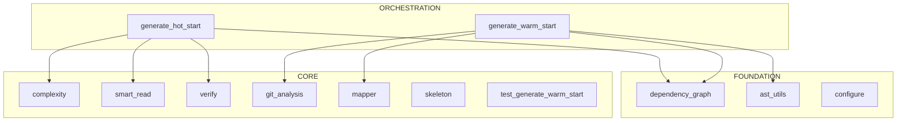

# skills: Developer Warm Start (Pass 1: Structural Analysis)

> Context-efficient onboarding guide for AI programmers.
> Generated: 2025-12-13
> Token budget: ~69K tokens
>
> **Pass 1** extracts structural metadata: architecture layers, dependencies, entry points, and interfaces.
> See **HOT_START.md** for Pass 2 (semantic/behavioral analysis).

---

## 1. System Context

### Architecture View


### Workflow-Centric View (Optional)
*Use `dependency_graph.py --focus workflow` for a focused view*

> Generated with: `python .claude/skills/repo-xray/scripts/dependency_graph.py . --mermaid`

---

## 2. Architecture Overview

<!-- CONFIDENCE: 0.5 - Pattern-based generation, may benefit from enhancement -->

**skills** is a Python application.

The codebase contains 12 modules organized in three architectural layers:

- **Foundation** (3 modules): Core utilities, configuration, data models
- **Core** (7 modules): Business logic and domain services
- **Orchestration** (2 modules): High-level coordination and entry points

**Key architectural patterns:**
- Standard Python package structure


<!-- /CONFIDENCE -->

---

## 3. Critical Classes

### Entry Points
*No entry points detected*

### Core Components
**repo-investigator.scripts.generate_hot_start** (`generate_hot_start.py`)
```python
"""Repo Investigator: HOT_START.md Generator..."""

DETAIL_LEVELS = {...}  # L37
DETAIL_LEVEL_HELP = "\nDetail levels (name or number):\n  1/compact ..."  # L48
SCRIPT_DIR = ...  # L57
SKILL_ROOT = ...  # L58
REPO_XRAY_SCRIPTS = ...  # L59
class LogicMapGenerator:  # L93
    """Generates Logic Maps from Python AST...."""
    SIDE_EFFECT_PATTERNS = {...}  # L97
    SAFE_PATTERNS = [...]  # L108
    INPUT_PATTERNS = [...]  # L128
    def __init__(self, filepath: str, detail_level: int = 2): ...  # L130
    def parse(self) -> bool: ...  # L137
        """Parse the source file...."""
    def generate_logic_map(self, method_name: str) -> Optional[Dict]: ...  # L148
        """Generate a Logic Map for a specific method...."""

def generate_logic_map_text(logic_map: Dict) -> str: ...  # L428
    """Convert a logic map dictionary to arrow notation text...."""
def ensure_phase1_data(directory: str, phase1_dir: Optional[str], verbose: bool = False) -> Tuple[str, str, Optional[str]]: ...  # L445
    """Ensure Phase 1 data exists, generating if necessary...."""
def collect_analysis_data(directory: str, deps_path: str, git_path: str, warm_start_debug: Optional[str], top_n: int = 10, verbose: bool = False, detail_level: int = 2) -> Dict[str, Any]: ...  # L483
    """Collect all analysis data for HOT_START generation...."""
def detect_hidden_dependencies(files: List[str], verbose: bool = False) -> Dict: ...  # L695
    """Detect environment variables, external services, and config files...."""
def generate_hot_start_md(data: Dict, detail_level: int = 2) -> str: ...  # L758
    """Generate HOT_START.md content from collected data...."""
def write_debug_output(data: Dict, output_dir: str, verbose: bool = False): ...  # L1043
    """Write debug output to HOT_START_debug/ directory...."""
# ... (truncated)
```


### Data Models
*No Pydantic/dataclass models detected*

### Execution Layer (if present)
*Use skeleton.py to find Executor/Runner classes*

---

## 4. Data Flow

```
User Input
    │
    ▼
[1] Main.__init__(...)
    │
    ▼
[2] Main.run(...)
    │
    ├──▶ [3] Initialize state/context
    │
    ├──▶ [4] Core processing
    │         │
    │         └──▶ Sub-components
    │
    ├──▶ [5] Validation/Analysis
    │
    └──▶ [6] Generate output
              │
              ▼
         Final Results
```

---

## 5. Entry Points

### CLI Commands
```bash
# Run the main entry point
python -m repo-investigator
```

### Python API
```python
from repo-investigator import main
# See entry points above for specific imports
```

### Key Imports
```python
from repo-investigator import *
```

---

## 6. Context Hazards

**DO NOT READ these directories/files** - they consume context without providing architectural insight:

### Large Data Directories
- `__pycache__/`, `.git/`, `venv/`, `node_modules/`
- `artifacts/`, `data/`, `logs/`

### Large Files
| Tokens | File | Note |
|--------|------|------|
| 10.7K | `repo-investigator/scripts/generate_hot_start.py` | Consider skeleton |
| 10.5K | `repo-xray/scripts/generate_warm_start.py` | Consider skeleton |

### File Extensions to Skip
`.pyc`, `.pkl`, `.log`, `.jsonl`, `.csv`, `.h5`

---

## 7. Quick Verification

```bash
# Check system health (customize for your project)
python -m repo-investigator --help

# Run quick sanity tests
pytest tests/ -x -q

# Verify imports
python -c "import repo-investigator; print('OK')"
```

---

## 8. X-Ray Commands

Use these scripts to explore further without consuming full context:

```bash
# Map directory structure with token estimates
python .claude/skills/repo-xray/scripts/mapper.py . --summary

# Extract class/method skeletons (95% token reduction)
python .claude/skills/repo-xray/scripts/skeleton.py .

# Filter by priority level (critical, high, medium, low)
python .claude/skills/repo-xray/scripts/skeleton.py . --priority critical

# Analyze import dependencies
python .claude/skills/repo-xray/scripts/dependency_graph.py .

# Generate Mermaid diagram for documentation
python .claude/skills/repo-xray/scripts/dependency_graph.py . --mermaid

# Focus on specific area
python .claude/skills/repo-xray/scripts/dependency_graph.py . --focus core
```

### Enhanced Skeleton Features
The skeleton output includes:
- **Pydantic/dataclass fields** - `name: str = Field(...)` visible
- **Decorators** - `@dataclass`, `@property`, `@tool`
- **Global constants** - `CONFIG_VAR = "value"`
- **Line numbers** - `def method(): ...  # L42`

### Token Budget Reference
| Operation | Tokens | Use When |
|-----------|--------|----------|
| mapper.py --summary | ~500 | First exploration |
| skeleton.py (1 file) | ~200-500 | Understanding interface |
| skeleton.py --priority critical | ~5K | Core architecture |
| dependency_graph.py | ~3K | Import relationships |
| dependency_graph.py --mermaid | ~500 | Documentation diagrams |

---

## 9. Architecture Layers

### Foundation (Most Imported)
| Module | Imported By | Imports |
|--------|-------------|---------|
| `dependency_graph` | 3 | 0 |
| `ast_utils` | 2 | 0 |
| `configure` | 0 | 0 |

### Core
| Module | Imported By | Imports |
|--------|-------------|---------|
| `complexity` | 1 | 0 |
| `smart_read` | 1 | 0 |
| `verify` | 1 | 0 |
| `git_analysis` | 1 | 0 |
| `mapper` | 1 | 0 |
| `skeleton` | 0 | 1 |
| `test_generate_warm_start` | 0 | 1 |

### Orchestration (Most Imports)
| Module | Imported By | Imports |
|--------|-------------|---------|
| `generate_hot_start` | 0 | 4 |
| `generate_warm_start` | 0 | 4 |

---

## 10. Risk Assessment

### High-Risk Files (volatile in past 6 months)
*No risk data available (no git history or no commits in analysis period)*

*Risk factors: churn (commit frequency), hotfixes (bug-fix commits), author entropy (coordination overhead)*

> Generated with: `python .claude/skills/repo-xray/scripts/git_analysis.py . --risk`

---

## 11. Hidden Coupling

### Files That Change Together
*No significant coupling pairs detected in recent history.*

This indicates clean module boundaries - files are generally modified independently.

*These files have no import relationship but are historically coupled. Changes to one often require changes to the other.*

> Generated with: `python .claude/skills/repo-xray/scripts/git_analysis.py . --coupling`

---

## 12. Potential Dead Code

### Orphan Files (zero importers)
| File | Confidence | Notes |
|------|------------|-------|
| .claude/skills/repo-xray/lib/token_estimator.py | 0.90 | No imports, not entry point pattern |
| .claude/skills/repo-xray/lib/__init__.py | 0.90 | No imports, not entry point pattern |
| .claude/skills/repo-xray/tests/__init__.py | 0.90 | No imports, not entry point pattern |

### Dormant Files (no changes in 180+ days)
*No dormant files detected - all files active within 180 days*

### Freshness Summary
| Category | File Count | Description |
|----------|------------|-------------|
| Active | 11 | Changed in last 30 days |
| Aging | 0 | Changed 30-90 days ago |
| Stale | 0 | Changed 90-180 days ago |
| Dormant | 0 | Not changed in 180+ days |

*Candidates for removal or archival. Verify before deleting.*

> Generated with: `python .claude/skills/repo-xray/scripts/dependency_graph.py . --orphans`
> Generated with: `python .claude/skills/repo-xray/scripts/git_analysis.py . --freshness`

---

## 13. Test Coverage

*No test directory found*

*Metadata only - test content not analyzed to preserve token budget.*

---

*This document was generated by the repo_architect agent using the repo-xray skill.*
*To refresh: `@repo_architect refresh`*
