# Codebase Analysis: claude-repo-xray

Generated: 2025-12-15T07:34:08.378188Z | Preset: None | Files: 30

## Summary

| Metric | Value |
|--------|-------|
| Python files | 30 |
| Total lines | 16,999 |
| Functions | 275 |
| Classes | 29 |
| Type coverage | 92.7% |
| Est. tokens | 150,092 |

## Architecture Overview

**claude-repo-xray** is a Python application. The codebase contains **30** Python files with **275** functions and **29** classes, organized across 4 architectural layers (6 foundation, 18 core, 3 orchestration, 3 leaf).

**Key Components:**
- **4 test modules** for validation


## Architecture Diagram

> **How to read:** FOUNDATION modules are at the bottom (no dependencies).
> CORE modules build on foundation. ORCHESTRATION modules coordinate others.
> Arrows show import direction. Dotted arrows (<-.->) indicate circular dependencies.

```mermaid
graph TD
    subgraph ORCHESTRATION
        lib_claude_skills_repo_investigator_scripts_generate_hot_start[generate_hot_start]
        lib_claude_skills_repo_xray_scripts_generate_warm_start[generate_warm_start]
        lib_xray[xray]
    end
    subgraph CORE
        lib_gap_features[gap_features]
        lib_test_analysis[test_analysis]
        lib_claude_skills_repo_investigator_scripts_complexity[complexity]
        lib_claude_skills_repo_investigator_scripts_smart_read[smart_read]
        lib_claude_skills_repo_investigator_scripts_verify[verify]
        lib_claude_skills_repo_xray_scripts_mapper[mapper]
        lib_claude_skills_repo_xray_scripts_skeleton[skeleton]
        lib_formatters_json_formatter[json_formatter]
        lib_formatters_markdown_formatter[markdown_formatter]
        lib_ast_analysis[ast_analysis]
    end
    subgraph FOUNDATION
        lib[lib]
        lib_claude_skills_repo_xray_scripts_dependency_graph[dependency_graph]
        lib_claude_skills_repo_xray_scripts_git_analysis[git_analysis]
        lib_config_loader[config_loader]
        lib_claude_skills_repo_xray_lib_ast_utils[ast_utils]
        lib_claude_skills_repo_xray_scripts_configure[configure]
    end
    lib_claude_skills_repo_investigator_scripts_generate_hot_start --> lib_claude_skills_repo_investigator_scripts_complexity
    lib_claude_skills_repo_investigator_scripts_generate_hot_start --> lib_claude_skills_repo_investigator_scripts_smart_read
    lib_claude_skills_repo_investigator_scripts_generate_hot_start --> lib_claude_skills_repo_investigator_scripts_verify
    lib_claude_skills_repo_xray_scripts_generate_warm_start --> lib_claude_skills_repo_xray_scripts_dependency_graph
    lib_claude_skills_repo_xray_scripts_generate_warm_start --> lib_claude_skills_repo_xray_scripts_git_analysis
    lib_claude_skills_repo_xray_scripts_generate_warm_start --> lib_claude_skills_repo_xray_scripts_mapper
    lib_xray --> lib_ast_analysis
```



## Architectural Pillars

> **How to use:** These are the most-imported files in the codebase. Changes here
> ripple outward, so understand them first. High import counts indicate core
> abstractions that many modules depend on.

*Foundation files that many modules depend on - understand these first:*

| # | File | Imported By | Key Dependents |
|---|------|-------------|----------------|
| 1 | `__init__.py` | 4 modules | lib.claude.skills.repo-xray.lib, lib.claude.skills.repo-xray.scripts.generate_warm_start, lib.claude.skills.repo-xray.scripts.skeleton... |
| 2 | `lib.claude.skills.repo-xray.scripts.dependency_graph` | 3 modules | lib.claude.skills.repo-investigator.scripts.generate_hot_start, lib.claude.skills.repo-xray.scripts.generate_warm_start, lib.claude.skills.repo-xray.tests.test_generate_warm_start |
| 3 | `lib.claude.skills.repo-xray.scripts.git_analysis` | 3 modules | lib.claude.skills.repo-investigator.scripts.generate_hot_start, lib.claude.skills.repo-xray.scripts.generate_warm_start, lib.xray |
| 4 | `gap_features.py` | 2 modules | lib.formatters.markdown_formatter, lib.tests.test_gap_features |
| 5 | `test_analysis.py` | 2 modules | lib.formatters.markdown_formatter, lib.xray |
| 6 | `lib.claude.skills.repo-investigator.scripts.complexity` | 1 modules | lib.claude.skills.repo-investigator.scripts.generate_hot_start |
| 7 | `lib.claude.skills.repo-investigator.scripts.smart_read` | 1 modules | lib.claude.skills.repo-investigator.scripts.generate_hot_start |
| 8 | `lib.claude.skills.repo-investigator.scripts.verify` | 1 modules | lib.claude.skills.repo-investigator.scripts.generate_hot_start |
| 9 | `lib.claude.skills.repo-xray.scripts.mapper` | 1 modules | lib.claude.skills.repo-xray.scripts.generate_warm_start |
| 10 | `lib.claude.skills.repo-xray.scripts.skeleton` | 1 modules | lib.claude.skills.repo-investigator.scripts.generate_hot_start |

## Maintenance Hotspots

> **How to use:** These files have high git churn, hotfix frequency, or author entropy.
> They represent areas of instability. Be extra careful when modifying these files
> and consider adding tests before changes.

*Files with high churn/risk - handle with care:*

| # | File | Risk | Factors |
|---|------|------|---------|
| 1 | `git_analysis.py` | 0.71 | hotfixes:2 |
| 2 | `generate_warm_start.py` | 0.61 | hotfixes:2 |
| 3 | `dependency_graph.py` | 0.41 | hotfixes:1 |
| 4 | `mapper.py` | 0.41 | hotfixes:1 |
| 5 | `generate_hot_start.py` | 0.34 | moderate risk |
| 6 | `skeleton.py` | 0.28 | moderate risk |
| 7 | `__init__.py` | 0.27 | hotfixes:1 |
| 8 | `test_generate_warm_start.py` | 0.27 | hotfixes:1 |
| 9 | `xray.py` | 0.24 | moderate risk |
| 10 | `complexity.py` | 0.24 | moderate risk |

## Entry Points

| Entry Point | File | Usage |
|-------------|------|-------|
| `main()` | ./complexity.py | `python /mnt/c/python/claude-repo-xray/.claude/skills/repo-investigator/scripts/complexity.py` |
| `main()` | ./generate_hot_start.py | `python /mnt/c/python/claude-repo-xray/.claude/skills/repo-investigator/scripts/generate_hot_start.py` |
| `main()` | ./smart_read.py | `python /mnt/c/python/claude-repo-xray/.claude/skills/repo-investigator/scripts/smart_read.py` |
| `main()` | ./verify.py | `python /mnt/c/python/claude-repo-xray/.claude/skills/repo-investigator/scripts/verify.py` |
| `main()` | ./configure.py | `python /mnt/c/python/claude-repo-xray/.claude/skills/repo-xray/scripts/configure.py` |
| `main()` | ./dependency_graph.py | `python /mnt/c/python/claude-repo-xray/.claude/skills/repo-xray/scripts/dependency_graph.py` |
| `main()` | ./generate_warm_start.py | `python /mnt/c/python/claude-repo-xray/.claude/skills/repo-xray/scripts/generate_warm_start.py` |
| `main()` | ./git_analysis.py | `python /mnt/c/python/claude-repo-xray/.claude/skills/repo-xray/scripts/git_analysis.py` |
| `main()` | ./mapper.py | `python /mnt/c/python/claude-repo-xray/.claude/skills/repo-xray/scripts/mapper.py` |
| `main()` | ./skeleton.py | `python /mnt/c/python/claude-repo-xray/.claude/skills/repo-xray/scripts/skeleton.py` |

### CLI Arguments

**complexity.py:**

| Argument | Required | Default | Help |
|----------|----------|---------|------|
| `directory` | Yes | "." | Directory to analyze (default: current) |
| `--unified` | No | - | Phase 1 JSON outputs for unified scoring |
| `--warm-start-debug` | No | - | Path to WARM_START_debug/ for test coverage sig... |
| `--top` | No | 10 | Number of top results to show (default: 10) |
| `--json` | No | - | Output as JSON |
| `--min-score` | No | 0.0 | Minimum score to include (default: 0) |
| `-v` | No | - | Show progress messages |
| `--debug` | No | - | Write debug output to PRIORITY_debug/ |

**generate_hot_start.py:**

| Argument | Required | Default | Help |
|----------|----------|---------|------|
| `directory` | Yes | "." | Directory to analyze (default: current) |
| `-o` | No | "HOT_START.md" | Output file path (default: HOT_START.md) |
| `--phase1-dir` | No | - | Directory containing Phase 1 outputs (deps.json... |
| `--top` | No | 10 | Number of top priority files to analyze (defaul... |
| `-v` | No | - | Show progress messages |
| `--debug` | No | - | Write debug output to HOT_START_debug/ |
| `--json` | No | - | Output raw data as JSON instead of markdown |
| `-d` | No | "full" | Detail level: compact/1, normal/2, verbose/3, f... |

**smart_read.py:**

| Argument | Required | Default | Help |
|----------|----------|---------|------|
| `files` | Yes | - | Python file(s) to read |
| `--focus-top` | No | 3 | Auto-expand top N complex methods (default: 3) |
| `--focus` | No | ... | Specific method names to expand |
| `--coupled` | No | - | Treat input files as historically coupled, show... |
| `-v` | No | - | Show progress messages |
| `--debug` | No | - | Write debug output to SMART_READ_debug/ |

**verify.py:**

| Argument | Required | Default | Help |
|----------|----------|---------|------|
| `path` | Yes | - | File path, module path, or directory to verify |
| `--mode` | No | "safe" | Verification mode (default: safe) |
| `--prioritize-untested` | No | - | Verify untested modules first (requires --warm-... |
| `--warm-start-debug` | No | - | Path to WARM_START_debug/ for test coverage data |
| `-v` | No | - | Show progress messages |
| `--debug` | No | - | Write debug output to VERIFY_debug/ |
| `--json` | No | - | Output as JSON |

**configure.py:**

| Argument | Required | Default | Help |
|----------|----------|---------|------|
| `directory` | Yes | "." | Project directory to analyze (default: current) |
| `--force` | No | - | Overwrite existing config files without prompting |
| `--dry-run` | No | - | Show what would be generated without writing files |
| `--backup` | No | - | Create .bak files before overwriting |

## Critical Classes

> **How to use:** These classes are ranked by architectural importance: import weight,
> base class significance (Agent, Model, etc.), and method complexity. The skeleton
> shows the class interface without implementation details.

*Top 10 classes by architectural importance:*

### LogicMapGenerator (generate_hot_start.py:111)

> Generates Logic Maps from Python AST.

```python
class LogicMapGenerator:  # L111
    def __init__(self, filepath: str, detail_level: int)

    # Instance variables:
    self.filepath = filepath
    self.detail_level = detail_level
    self.source = ""
    self.tree = None
    self.lines = []

    SIDE_EFFECT_PATTERNS
    SAFE_PATTERNS
    INPUT_PATTERNS
    def parse(...)
    def generate_logic_map(...)
    def _analyze_node(...)
    def _get_condition_text(...)
    def _node_to_text(...)
    def _get_call_text(...)
    def _op_to_text(...)
    def _detect_side_effect(...)
    def _is_external_input(...)
    def _extract_signature(...)
    # ... and 1 more methods
```

### LogicMapGenerator (gap_features.py:1217)

> Generates control flow logic maps from Python AST.

```python
class LogicMapGenerator:  # L1217
    def __init__(self, source: str, detail_level: int)

    # Instance variables:
    self.source = source
    self.detail_level = detail_level
    self.tree = None

    SIDE_EFFECT_PATTERNS
    SAFE_PATTERNS
    INPUT_PATTERNS
    def parse(...)
    def generate_logic_map(...)
    def _analyze_node(...)
    def _get_condition_text(...)
    def _node_to_text(...)
    def _get_call_text(...)
    def _detect_side_effect(...)
    def _is_external_input(...)
```

### CallVisitor(ast.NodeVisitor) (call_analysis.py:34)

> AST visitor that extracts all function calls with context.

```python
class CallVisitor(ast.NodeVisitor):  # L34
    def __init__(self, filepath: str)

    # Instance variables:
    self.filepath = filepath

    def visit_ClassDef(...)
    def visit_FunctionDef(...)
    def visit_AsyncFunctionDef(...)
    def _visit_function(...)
    def visit_Call(...)
    def _extract_call_info(...)
    def _get_attr_chain(...)
```

### TestCalculatePriorityScores (test_gap_features.py:186)

> Tests for priority score calculation.

```python
class TestCalculatePriorityScores:  # L186
    def test_empty_results_returns_empty_list(...)
    def test_files_with_high_cc_rank_higher(...)
    def test_files_with_high_git_risk_rank_higher(...)
    def test_no_duplicate_files(...)
    def test_reasons_populated(...)
    def test_scores_are_normalized(...)
```

### CallGraphVisitor(ast.NodeVisitor) (generate_hot_start.py:459)

> Build call graph from AST.

```python
class CallGraphVisitor(ast.NodeVisitor):  # L459
    def __init__(self, )

    # Instance variables:
    self.current_function = None
    self.current_class = None
    self.calls = []
    self.functions = set(...)

    visit_AsyncFunctionDef
    def visit_ClassDef(...)
    def visit_FunctionDef(...)
    def visit_Call(...)
```

### TestGenerateHeuristicSummary (test_gap_features.py:832)

> Tests for heuristic summary generation.

```python
class TestGenerateHeuristicSummary:  # L832
    def test_counts_loops(...)
    def test_counts_conditionals(...)
    def test_counts_try_except(...)
    def test_detects_early_return(...)
    def test_returns_empty_for_simple_function(...)
```

### TestModuleDetection (test_generate_warm_start.py:84)

> Test that all modules are detected.

```python
class TestModuleDetection:  # L84
    def test_all_scripts_detected(...)
    def test_lib_modules_detected(...)
    def test_module_names_clean(...)
    def test_imports_detected(...)
```

### TestGetMaintenanceHotspots (test_gap_features.py:648)

> Tests for maintenance hotspots extraction.

```python
class TestGetMaintenanceHotspots:  # L648
    def test_empty_git_data_returns_empty_list(...)
    def test_returns_top_n_by_risk_score(...)
    def test_deduplication_by_filename(...)
    def test_reason_includes_factors(...)
```

### TestExtractDataModels (test_gap_features.py:350)

> Tests for data model extraction.

```python
class TestExtractDataModels:  # L350
    def test_pydantic_models_detected(...)
    def test_dataclasses_detected(...)
    def test_regular_classes_not_included(...)
    def test_fields_extracted(...)
```

### TestFormatInlineSkeletons (test_gap_features.py:536)

> Tests for inline skeleton formatting.

```python
class TestFormatInlineSkeletons:  # L536
    def test_returns_top_n_classes(...)
    def test_classes_sorted_by_importance(...)
    def test_includes_method_info(...)
    def test_includes_line_numbers(...)
```

## Context Hazards

### Patterns to Exclude

*Use these glob patterns to skip large files:*

- `lib/gap_features.py` (1 files, ~27K tokens)
- `.claude/skills/repo-investigator/scripts/generate_hot_start.py` (1 files, ~16K tokens)
- `formatters/markdown_formatter.py` (1 files, ~12K tokens)
- `.claude/skills/repo-xray/scripts/generate_warm_start.py` (1 files, ~10K tokens)

### Large Files

*DO NOT read these files directly - use skeleton view:*

| Tokens | File | Recommendation |
|--------|------|----------------|
| 27,642 | `gap_features.py` | Use skeleton view |
| 16,042 | `generate_hot_start.py` | Use skeleton view |
| 12,694 | `markdown_formatter.py` | Use skeleton view |
| 10,462 | `generate_warm_start.py` | Use skeleton view |

### Skip Directories

*These directories waste context - always skip:*

- `.git/` - Git internals - use git commands instead
- `.pytest_cache/` - Pytest cache - skip
- `formatters/__pycache__/` - Python bytecode cache - always skip

## Logic Maps

> **How to read:** These are control flow visualizations for complex functions.
> `->` = conditional branch, `*` = loop, `try:` = exception handling,
> `!` = except handler, `[X]` = side effect, `{X}` = state mutation.
> CC (Cyclomatic Complexity) indicates the number of independent paths.

*Control flow visualization for complex functions:*

### format_markdown() - markdown_formatter.py:18 (CC:226)

**Summary:** Iterates over 57 collections. 127 decision branches. handles 22 exception types. returns early on error.

```
-> gap.get(...)?
  try:
    -> about.get(...)?
    -> about.get(...)?
    -> about.get(...)?
  ! except Exception
-> summary.get(...)?
-> summary.get(...)?
-> gap.get(...)?
  try:
  ! except Exception
-> gap.get(...)?
  try:
    -> imports?
      -> gap.get(...)?
  ! except Exception
-> gap.get(...)?
  try:
    -> pillars?
      -> gap.get(...)?
      * for ... in enumerate(...):
        -> len(...) > 3?
    -> hotspots?
      -> gap.get(...)?
      * for ... in enumerate(...):
  ! except Exception
-> gap.get(...)?
  try:
    -> entry_pts?
      * for ep in entry_pts[...]:
... (201 more lines)
```

### generate_hot_start_md() - generate_hot_start.py:1000 (CC:87)

> Generate HOT_START.md content from collected data.

**Summary:** Iterates over 31 collections. 44 decision branches. returns early on error.

```
* for ... in enumerate(...):
  -> m.get(...) is not None?
-> edges or layers?
  -> layers?
    * for layer_name in ...:
      -> layer_modules?
        * for mod in layer_modules[...]:
  * for ... in edges[...]:
    -> edge_key not in shown_edges?
-> detail_level == 1?
  -> Return('\n'.join(...))
-> data[...]?
  * for lm in data[...]:
    -> detail_level >= 4?
      -> lm.get(...)?
      -> lm.get(...)?
    -> lm[...]?
      * for se in lm[...]:
    -> lm[...]?
      * for sm in lm[...]:
-> verified?
  * for v in verified[...]:
-> broken?
  * for v in broken:
-> warnings?
  * for v in warnings[...]:
    * for w in v[...]:
-> data[...][...]?
  * for var in data[...][...]:
-> data[...][...]?
... (48 more lines)
```
**Side Effects:** DB: all_external.update(...)

### collect_analysis_data() - generate_hot_start.py:586 (CC:64)

> Collect all analysis data for HOT_START generation.

**Summary:** Iterates over 12 collections. 41 decision branches. handles 3 exception types. returns early on error.

```
-> PHASE1_AVAILABLE?
  -> verbose?
  try:
    * for ... in modules.items(...):
      * for imp in info.get(...):
    * for ... in modules.items(...):
      -> filepath?
        -> short_name not in mod_to_file?
    -> import_weights?
      * for ... in import_weights.items(...):
        -> mod_name in mod_to_file?
        -> short_name in mod_to_file?
    try:
    ! except Exception
    -> verbose?
      -> data[...][...]?
    -> verbose?
  ! except Exception
-> GIT_ANALYSIS_AVAILABLE?
  -> verbose?
  try:
    * for r in risk_data:
    -> verbose?
    -> verbose?
  ! except Exception
-> not imports and deps_path and os.path.exists(...) and git_path and os.path.exists(...)?
  -> verbose?
-> verbose?
-> not files?
  -> verbose?
... (31 more lines)
```

### build_dependency_graph() - dependency_graph.py:279 (CC:47)

**Summary:** Iterates over 12 collections. 23 decision branches. single return point.

```
-> root_package is None and auto_detect?
  -> root_package?
-> source_dir is None and root_package is None?
  -> source_dir and source_dir != directory?
* for ... in os.walk(...):
  * for filename in files:
    -> not filename.endswith(...)?
    -> source_dir and filepath.startswith(...)?
    * while module_name.startswith(...):
    -> root_package and not module_name.startswith(...)?
* for mod_name in modules:
* for ... in modules.items(...):
  * for imp in abs_imports:
    -> imp in modules?
    -> not target?
      * for known_module in modules:
        -> known_module.startswith(...)?
    -> not target?
      * for known_module in modules:
        -> imp.startswith(...)?
    -> not target and base in leaf_to_modules?
      -> len(...) == 1?
        -> candidates?
          * for cand in candidates:
            -> os.path.dirname(...) == module_dir?
          -> not target?
    -> target and target != module_name?
      -> target not in info[...]?
      -> not target and base not in EXTERNAL_PACKAGES?
  * for rel_imp in rel_imports:
... (6 more lines)
```

### extract_linter_rules() - gap_features.py:2474 (CC:42)

**Summary:** Iterates over 1 collection. 30 decision branches. handles 5 exception types. single return point.

```
-> pyproject.exists(...)?
  try:
    try:
    ! except ImportError
    -> 'tool.ruff' in data?
      -> 'tool' in data and isinstance(...)?
        -> 'ruff' in data[...]?
    -> ruff_config?
      -> 'line-length' in ruff_config?
      -> 'select' in ruff_config?
      -> 'ignore' in ruff_config?
    -> 'tool.black' in data?
      -> 'tool' in data and isinstance(...)?
        -> 'black' in data[...]?
    -> black_config?
      -> not result[...]?
      -> 'line-length' in black_config?
      -> 'target-version' in black_config?
    -> 'tool.isort' in data?
      -> 'tool' in data and isinstance(...)?
        -> 'isort' in data[...]?
    -> isort_config?
      -> 'profile' in isort_config?
  ! except Exception
-> ruff_toml.exists(...) and not result[...]?
  try:
    -> 'line-length' in data?
    -> 'select' in data?
  ! except Exception
-> flake8.exists(...) and not result[...]?
... (12 more lines)
```

### Logic Map Legend

```
->    : Control flow / conditional branch
*     : Loop iteration (for/while)
try:  : Try block start
!     : Exception handler (except)
[X]   : Side effect (DB, API, file I/O)
{X}   : State mutation
```

## Method Signatures (Hotspots)

### format_markdown() - markdown_formatter.py:18

```python
def format_markdown(results: Dict[str, Any], project_name: Optional[str] = None, gap_features: Optional[Dict[str, Any]] = None) -> str
```
> Format analysis results as Markdown.

### generate_hot_start_md() - generate_hot_start.py:1000

```python
def generate_hot_start_md(data: Dict, detail_level: int = 2) -> str
```
> Generate HOT_START.md content from collected data.

### collect_analysis_data() - generate_hot_start.py:586

```python
def collect_analysis_data(directory: str, deps_path: str, git_path: str, warm_start_debug: Optional[str], top_n: int = 10, verbose: bool = False, detail_level: int = 2) -> Dict[str, Any]
```
> Collect all analysis data for HOT_START generation.

### build_dependency_graph() - dependency_graph.py:279

```python
def build_dependency_graph(directory: str, root_package: Optional[str] = None, auto_detect: bool = True, source_dir: Optional[str] = None) -> Dict
```
> Build a dependency graph for all Python files.

### extract_linter_rules() - gap_features.py:2474

```python
def extract_linter_rules(target_dir: str) -> Dict[str, Any]
```
> Extract linter rules from project configuration files.

### generate_skeleton() - ast_analysis.py:441

```python
def generate_skeleton(tree: ast.Module, include_private: bool = False, include_line_numbers: bool = True) -> str
```
> Generate skeleton text from parsed AST.

### run_analysis() - xray.py:246

```python
def run_analysis(target: str, analyses: List[str], verbose: bool = False) -> Dict[str, Any]
```
> Run the specified analyses on the target directory.

### build_import_graph() - import_analysis.py:242

```python
def build_import_graph(files: List[str], root_dir: str, root_package: Optional[str] = None) -> Dict[str, Any]
```
> Build a dependency graph for Python files.

### find_agent_prompts() - gap_features.py:2811

```python
def find_agent_prompts(target_dir: str, results: Dict[str, Any]) -> List[Dict[str, Any]]
```
> Find agent prompts and personas in the codebase.

### calculate_priority_scores() - gap_features.py:288

```python
def calculate_priority_scores(results: Dict[str, Any]) -> List[Dict[str, Any]]
```
> Calculate composite priority scores for files.

## Side Effects (Detailed)

### complexity.py

| Line | Type | Call |
|------|------|------|
| 279 | file | `json.dump` |
| 292 | file | `json.dump` |
| 462 | file | `json.dumps` |

### generate_hot_start.py

| Line | Type | Call |
|------|------|------|
| 1575 | file | `json.dumps` |
| 1576 | file | `json.dump` |
| 1580 | file | `json.dump` |
| 1584 | file | `json.dump` |
| 1588 | file | `json.dump` |
| 1678 | file | `json.dumps` |

### smart_read.py

| Line | Type | Call |
|------|------|------|
| 355 | file | `json.dump` |

### verify.py

| Line | Type | Call |
|------|------|------|
| 314 | file | `json.dump` |
| 329 | file | `json.dump` |
| 395 | file | `json.dumps` |
| 440 | file | `json.dumps` |
| 457 | file | `json.dumps` |

### configure.py

| Line | Type | Call |
|------|------|------|
| 463 | file | `json.dumps` |
| 465 | file | `json.dumps` |
| 477 | file | `json.dump` |
| 487 | file | `json.dump` |

### dependency_graph.py

| Line | Type | Call |
|------|------|------|
| 844 | file | `json.dumps` |
| 852 | file | `json.dumps` |
| 878 | file | `json.dumps` |

### generate_warm_start.py

| Line | Type | Call |
|------|------|------|
| 961 | file | `json.dumps` |
| 1008 | file | `json.dumps` |
| 1110 | file | `json.dumps` |

### git_analysis.py

| Line | Type | Call |
|------|------|------|
| 44 | subprocess | `subprocess.run` |
| 470 | file | `json.dumps` |

### mapper.py

| Line | Type | Call |
|------|------|------|
| 243 | file | `json.dumps` |

### skeleton.py

| Line | Type | Call |
|------|------|------|
| 303 | file | `json.dumps` |

## Import Verification

**Summary:** 27 passed, 0 failed

## Quick Verification

```bash
# Check import health
python -c "import claude-repo-xray; print('OK')"

# Run tests
pytest tests/ -x -q

```

## Complexity Hotspots

*Functions with highest cyclomatic complexity:*

| CC | Function | File |
|----|----------|------|
| 226 | `format_markdown` | claude-repo-xray/formatters/markdown_formatter.py |
| 87 | `generate_hot_start_md` | repo-investigator/scripts/generate_hot_start.py |
| 64 | `collect_analysis_data` | repo-investigator/scripts/generate_hot_start.py |
| 47 | `build_dependency_graph` | repo-xray/scripts/dependency_graph.py |
| 42 | `extract_linter_rules` | claude-repo-xray/lib/gap_features.py |
| 38 | `generate_skeleton` | claude-repo-xray/lib/ast_analysis.py |
| 37 | `run_analysis` | python/claude-repo-xray/xray.py |
| 33 | `build_import_graph` | claude-repo-xray/lib/import_analysis.py |
| 32 | `find_agent_prompts` | claude-repo-xray/lib/gap_features.py |
| 29 | `calculate_priority_scores` | claude-repo-xray/lib/gap_features.py |

## Import Analysis

### Architectural Layers

**FOUNDATION** (6 modules)

| Module | Imported By | Imports |
|--------|-------------|---------|
| `lib` | 4 | 0 |
| `lib.claude.skills.repo-xray.scripts.dependency_graph` | 3 | 0 |
| `lib.claude.skills.repo-xray.scripts.git_analysis` | 3 | 0 |
| `lib.config_loader` | 1 | 0 |
| `lib.claude.skills.repo-xray.lib.ast_utils` | 0 | 0 |
| `lib.claude.skills.repo-xray.scripts.configure` | 0 | 0 |

**CORE** (18 modules)

| Module | Imported By | Imports |
|--------|-------------|---------|
| `lib.gap_features` | 2 | 0 |
| `lib.test_analysis` | 2 | 0 |
| `lib.claude.skills.repo-investigator.scripts.complexity` | 1 | 0 |
| `lib.claude.skills.repo-investigator.scripts.smart_read` | 1 | 0 |
| `lib.claude.skills.repo-investigator.scripts.verify` | 1 | 0 |
| `lib.claude.skills.repo-xray.scripts.mapper` | 1 | 0 |
| `lib.claude.skills.repo-xray.scripts.skeleton` | 1 | 1 |
| `lib.formatters.json_formatter` | 1 | 0 |
| `lib.formatters.markdown_formatter` | 1 | 2 |
| `lib.ast_analysis` | 1 | 0 |
| *...and 8 more* | | |

**ORCHESTRATION** (3 modules)

| Module | Imported By | Imports |
|--------|-------------|---------|
| `lib.claude.skills.repo-investigator.scripts.generate_hot_start` | 0 | 6 |
| `lib.claude.skills.repo-xray.scripts.generate_warm_start` | 0 | 4 |
| `lib.xray` | 0 | 10 |

**LEAF** (3 modules)

| Module | Imported By | Imports |
|--------|-------------|---------|
| `lib.claude.skills.repo-xray.lib.token_estimator` | 0 | 0 |
| `lib.claude.skills.repo-xray.tests` | 0 | 0 |
| `lib.git_analysis` | 0 | 0 |

### Orphan Candidates

*Files with no importers (may be entry points or dead code):*

- `__init__.py`
- `token_estimator.py`
- `__init__.py`
- `__init__.py`
- `ast_utils.py`

### External Dependencies

*3 third-party packages:*

`importlib`, `tomllib`, `urllib`

## Cross-Module Calls

*Most called functions across modules:*

| Function | Call Sites | Modules |
|----------|------------|---------|
| `main` | 11 | 10 |
| `_get_annotation` | 11 | 1 |
| `_get_name` | 9 | 1 |
| `load_ignore_patterns` | 7 | 5 |
| `identify_layers` | 6 | 4 |
| `extract_data_models` | 6 | 3 |
| `calculate_priority_scores` | 6 | 1 |
| `write_debug_output` | 5 | 4 |
| `generate_prose` | 5 | 2 |
| `generate_mermaid_diagram` | 5 | 2 |

## Git History Analysis

> **How to use:** Git analysis reveals patterns invisible in code alone. High-risk files
> have frequent changes (churn), bug fixes (hotfixes), or many authors (entropy).
> Hidden coupling shows files that change together without import relationships.

### High-Risk Files

*Files with high churn, hotfixes, or author entropy:*

| Risk | File | Factors |
|------|------|---------|
| 0.71 | `git_analysis.py` | churn:4 hotfix:2 authors:1 |
| 0.61 | `generate_warm_start.py` | churn:3 hotfix:2 authors:1 |
| 0.41 | `dependency_graph.py` | churn:2 hotfix:1 authors:2 |
| 0.41 | `mapper.py` | churn:2 hotfix:1 authors:2 |
| 0.34 | `generate_hot_start.py` | churn:3 hotfix:0 authors:1 |

### Freshness

- **Active** (< 30 days): 30 files
- **Aging** (30-90 days): 0 files
- **Stale** (90-180 days): 0 files
- **Dormant** (> 180 days): 0 files

## Side Effects

*Functions with external I/O operations:*

### FILE
- `json.dump` in complexity.py:279
- `json.dump` in complexity.py:292
- `json.dumps` in complexity.py:462
- `json.dump` in generate_hot_start.py:1576
- `json.dump` in generate_hot_start.py:1580

### SUBPROCESS
- `subprocess.run` in git_analysis.py:44
- `subprocess.run` in gap_features.py:96
- `subprocess.run` in git_analysis.py:44

## Test Coverage

**1** test files, **~62** test functions


## Decorator Usage

- `@fixture`: 8

---

*Generated by Repo X-Ray v3.1.0*