# Codebase Analysis: kosmos

Generated: 2025-12-15T04:27:44.492101Z | Preset: full | Files: 793

## Summary

| Metric | Value |
|--------|-------|
| Python files | 793 |
| Total lines | 278,390 |
| Functions | 2147 |
| Classes | 1542 |
| Type coverage | 36.1% |
| Est. tokens | 2,394,233 |

## Architecture Overview

**kosmos** is a Python application with agent-based architecture, workflow orchestration, REST/HTTP API. The codebase contains **793** Python files with **2147** functions and **1542** classes, organized across 4 architectural layers (92 foundation, 298 core, 146 orchestration, 257 leaf).

**Key Components:**
- **54 agent modules** for autonomous task execution
- **47 workflow modules** for process coordination
- **20 API handlers** for external integration
- **63 CLI modules** for user interaction
- **43 data model definitions**
- **246 test modules** for validation


## Architecture Diagram

> **How to read:** FOUNDATION modules are at the bottom (no dependencies).
> CORE modules build on foundation. ORCHESTRATION modules coordinate others.
> Arrows show import direction. Dotted arrows (<-.->) indicate circular dependencies.

```mermaid
graph TD
    subgraph ORCHESTRATION
        kosmos_core_workflow[workflow]
        kosmos_workflow_research_loop[research_loop]
        kosmos_world_model_factory[factory]
        kosmos_agents_literature_analyzer[literature_analyzer]
        kosmos_core_cache_manager[cache_manager]
        kosmos_hypothesis_novelty_checker[novelty_checker]
        kosmos_agents_experiment_designer[experiment_designer]
        kosmos_claude_skills_kosmos_e2e_testing_lib_config_manager[config_manager]
        kosmos_core_feedback[feedback]
        kosmos_core_memory[memory]
    end
    subgraph CORE
        kosmos_agents_research_director[research_director]
        kosmos_knowledge_vector_db[vector_db]
        kosmos_execution_executor[executor]
        kosmos_knowledge_graph[graph]
        kosmos_safety_code_validator[code_validator]
        kosmos_core_providers_anthropic[anthropic]
        kosmos_agents_hypothesis_generator[hypothesis_generator]
        kosmos_cli_main[main]
        kosmos_core_async_llm[async_llm]
        kosmos_literature_unified_search[unified_search]
    end
    subgraph FOUNDATION
        kosmos_core_logging[logging]
        kosmos_config[config]
        kosmos_models_hypothesis[hypothesis]
        kosmos_literature_base_client[base_client]
        kosmos_models_experiment[experiment]
        kosmos_core_llm[llm]
        kosmos[kosmos]
        kosmos_models_result[result]
        kosmos_reference_kosmos_agentic_data_scientist_src_agentic_data_scientist[agentic_data_scientist]
        kosmos_world_model_models[models]
    end
    kosmos_core_workflow --> kosmos_core_logging
    kosmos_core_workflow --> kosmos_config
    kosmos_workflow_research_loop --> kosmos_core_logging
    kosmos_world_model_factory --> kosmos_core_logging
    kosmos_world_model_factory --> kosmos_config
    kosmos_agents_literature_analyzer --> kosmos_core_logging
    kosmos_agents_literature_analyzer --> kosmos_core_llm
    kosmos_core_cache_manager --> kosmos_core_logging
    kosmos_core_cache_manager --> kosmos_config
    kosmos_world_model <-.-> kosmos_world_model_artifacts
    kosmos_core_llm <-.-> kosmos_core_providers_anthropic
```



## Architectural Pillars

> **How to use:** These are the most-imported files in the codebase. Changes here
> ripple outward, so understand them first. High import counts indicate core
> abstractions that many modules depend on.

*Foundation files that many modules depend on - understand these first:*

| # | File | Imported By | Key Dependents |
|---|------|-------------|----------------|
| 1 | `logging.py` | 136 modules | kosmos.alembic.env, kosmos-reference.kosmos-agentic-data-scientist.src.agentic_data_scientist.agents.adk.agent, kosmos-reference.kosmos-agentic-data-scientist.src.agentic_data_scientist.agents.adk.event_compression... |
| 2 | `hypothesis.py` | 46 modules | kosmos.agents.data_analyst, kosmos.agents.experiment_designer, kosmos.agents.hypothesis_generator... |
| 3 | `base_client.py` | 34 modules | kosmos.agents.hypothesis_generator, kosmos.agents.literature_analyzer, kosmos.hypothesis.novelty_checker... |
| 4 | `experiment.py` | 27 modules | kosmos.agents.experiment_designer, kosmos.core.memory, kosmos.execution.code_generator... |
| 5 | `llm.py` | 26 modules | kosmos.claude.skills.kosmos-e2e-testing.templates.benchmark, kosmos.claude.skills.kosmos-e2e-testing.templates.sanity-test, kosmos.claude.skills.kosmos-e2e-testing.templates.smoke-test... |
| 6 | `__init__.py` | 25 modules | kosmos.claude.skills.kosmos-e2e-testing.lib, kosmos.claude.skills.kosmos-e2e-testing.templates.sanity-test, kosmos.examples.01_biology_metabolic_pathways... |
| 7 | `result.py` | 25 modules | kosmos.agents.data_analyst, kosmos.analysis.summarizer, kosmos.analysis.visualization... |
| 8 | `workflow.py` | 23 modules | kosmos.agents.research_director, kosmos.cli.commands.run, kosmos.core.convergence... |
| 9 | `__init__.py` | 20 modules | kosmos-reference.kosmos-agentic-data-scientist.src.agentic_data_scientist.agents.adk, kosmos-reference.kosmos-agentic-data-scientist.src.agentic_data_scientist.agents.adk.agent, kosmos-reference.kosmos-agentic-data-scientist.src.agentic_data_scientist.agents.adk.event_compression... |
| 10 | `research_director.py` | 20 modules | kosmos, kosmos.cli.commands.run, kosmos.tests.e2e.test_full_research_workflow... |

## Maintenance Hotspots

> **How to use:** These files have high git churn, hotfix frequency, or author entropy.
> They represent areas of instability. Be extra careful when modifying these files
> and consider adding tests before changes.

*Files with high churn/risk - handle with care:*

| # | File | Risk | Factors |
|---|------|------|---------|
| 1 | `config.py` | 0.96 | churn:23, hotfixes:14, authors:4 |
| 2 | `research_director.py` | 0.82 | churn:17, hotfixes:13 |
| 3 | `llm.py` | 0.71 | churn:11, hotfixes:5 |
| 4 | `executor.py` | 0.68 | churn:9, hotfixes:5 |
| 5 | `run.py` | 0.67 | churn:11, hotfixes:9 |
| 6 | `anthropic.py` | 0.66 | churn:8, hotfixes:4 |
| 7 | `main.py` | 0.65 | churn:10, hotfixes:6 |
| 8 | `async_llm.py` | 0.62 | churn:6, hotfixes:3 |
| 9 | `openai.py` | 0.62 | churn:8, hotfixes:4 |
| 10 | `sandbox.py` | 0.62 | churn:6, hotfixes:3 |

## Entry Points

| Entry Point | File | Usage |
|-------------|------|-------|
| `main()` | ./.claude/skills/kosmos-e2e-testing/templates/benchmark.py | `python ./.claude/skills/kosmos-e2e-testing/templates/benchmark.py` |
| `main()` | ./.claude/skills/kosmos-e2e-testing/templates/e2e-runner.py | `python ./.claude/skills/kosmos-e2e-testing/templates/e2e-runner.py` |
| `main()` | ./.claude/skills/kosmos-e2e-testing/templates/sanity-test.py | `python ./.claude/skills/kosmos-e2e-testing/templates/sanity-test.py` |
| `main()` | ./.claude/skills/kosmos-e2e-testing/templates/smoke-test.py | `python ./.claude/skills/kosmos-e2e-testing/templates/smoke-test.py` |
| `main()` | ./.claude/skills/kosmos-e2e-testing/templates/workflow-test.py | `python ./.claude/skills/kosmos-e2e-testing/templates/workflow-test.py` |
| `main()` | ./examples/01_biology_metabolic_pathways.py | `python ./examples/01_biology_metabolic_pathways.py` |
| `main()` | ./kosmos-claude-scientific-skills/scientific-skills/biomni/scripts/generate_report.py | `python ./kosmos-claude-scientific-skills/scientific-skills/biomni/scripts/generate_report.py` |
| `main()` | ./kosmos-claude-scientific-skills/scientific-skills/biomni/scripts/setup_environment.py | `python ./kosmos-claude-scientific-skills/scientific-skills/biomni/scripts/setup_environment.py` |
| `main()` | ./kosmos-claude-scientific-skills/scientific-skills/biorxiv-database/scripts/biorxiv_search.py | `python ./kosmos-claude-scientific-skills/scientific-skills/biorxiv-database/scripts/biorxiv_search.py` |
| `main()` | ./kosmos-claude-scientific-skills/scientific-skills/bioservices/scripts/batch_id_converter.py | `python ./kosmos-claude-scientific-skills/scientific-skills/bioservices/scripts/batch_id_converter.py` |

## Critical Classes

> **How to use:** These classes are ranked by architectural importance: import weight,
> base class significance (Agent, Model, etc.), and method complexity. The skeleton
> shows the class interface without implementation details.

*Top 10 classes by architectural importance:*

### ResearchDirectorAgent(BaseAgent) (research_director.py:52)

> Master orchestrator for autonomous research.

```python
class ResearchDirectorAgent(BaseAgent):  # L52
    def __init__(self, research_question: str, domain: Optional[str], agent_id: Optional[str], config: Optional[Dict[str, Any]])

    def _validate_domain(...)
    def _load_skills(...)
    def get_skills_context(...)
    def _on_start(...)
    def _check_runtime_exceeded(...)
    def get_elapsed_time_hours(...)
    def _on_stop(...)
    def _research_plan_context(...)
    def _strategy_stats_context(...)
    def _workflow_context(...)
    # ... and 36 more methods
```

### LiteratureAnalyzerAgent(BaseAgent) (literature_analyzer.py:49)

> Intelligent literature analysis agent with knowledge graph integration.

```python
class LiteratureAnalyzerAgent(BaseAgent):  # L49
    def __init__(self, agent_id: Optional[str], agent_type: Optional[str], config: Optional[Dict[str, Any]])

    def _on_start(...)
    def _on_stop(...)
    def execute(...)
    def summarize_paper(...)
    def extract_key_findings(...)
    def extract_methodology(...)
    def analyze_citation_network(...)
    def score_relevance(...)
    def find_related_papers(...)
    def analyze_corpus(...)
    # ... and 13 more methods
```

### ExperimentDesignerAgent(BaseAgent) (experiment_designer.py:48)

> Agent for designing experimental protocols.

```python
class ExperimentDesignerAgent(BaseAgent):  # L48
    def __init__(self, agent_id: Optional[str], agent_type: Optional[str], config: Optional[Dict[str, Any]])

    def execute(...)
    def design_experiment(...)
    def design_experiments(...)
    def _load_hypothesis(...)
    def _select_experiment_type(...)
    def _generate_from_template(...)
    def _generate_with_claude(...)
    def _parse_claude_protocol(...)
    def _enhance_protocol_with_llm(...)
    def _validate_protocol(...)
    # ... and 6 more methods
```

### DataAnalystAgent(BaseAgent) (data_analyst.py:96)

> Agent for analyzing and interpreting experiment results using Claude.

```python
class DataAnalystAgent(BaseAgent):  # L96
    def __init__(self, agent_id: Optional[str], agent_type: Optional[str], config: Optional[Dict[str, Any]])

    def execute(...)
    def analyze(...)
    def _generate_synthesis(...)
    def interpret_results(...)
    def _extract_result_summary(...)
    def _build_interpretation_prompt(...)
    def _parse_interpretation_response(...)
    def _create_fallback_interpretation(...)
    def detect_anomalies(...)
    def detect_patterns_across_results(...)
    # ... and 1 more methods
```

### HypothesisGeneratorAgent(BaseAgent) (hypothesis_generator.py:33)

> Agent for generating scientific hypotheses.

```python
class HypothesisGeneratorAgent(BaseAgent):  # L33
    def __init__(self, agent_id: Optional[str], agent_type: Optional[str], config: Optional[Dict[str, Any]])

    def execute(...)
    def generate_hypotheses(...)
    def _detect_domain(...)
    def _gather_literature_context(...)
    def _generate_with_claude(...)
    def _validate_hypothesis(...)
    def _store_hypothesis(...)
    def get_hypothesis_by_id(...)
    def list_hypotheses(...)
```

### LoopDetectionAgent(LlmAgent) (loop_detection.py:22)

> LlmAgent subclass with loop detection for streaming responses.

```python
class LoopDetectionAgent(LlmAgent):  # L22
    min_pattern_length: int
    max_pattern_length: int
    repetition_threshold: int
    window_size: int
    _content_buffer: str
    def _reset_detection_state(...)
    def _maybe_save_output_to_state(...)
    def _extract_text_from_event(...)
    def _detect_pattern_repetition(...)
    def _parse_unknown_tool_error(...)
    async def _run_async_impl(...)
    async def _run_live_impl(...)
```

### ClaudeCodeAgent(Agent) (agent.py:147)

> Agent that uses Claude Agent SDK for coding tasks.

```python
class ClaudeCodeAgent(Agent):  # L147
    def __init__(self, name: str, description: Optional[str], working_dir: Optional[str], output_key: str, after_agent_callback: Optional[Any])

    model_config
    _working_dir: Optional[str]
    _output_key: str
    def working_dir(...)
    def output_key(...)
    def _truncate_summary(...)
    async def _run_async_impl(...)
```

### StageOrchestratorAgent(BaseAgent) (stage_orchestrator.py:56)

> Custom orchestrator that manages stage-by-stage implementation.

```python
class StageOrchestratorAgent(BaseAgent):  # L56
    def __init__(self, implementation_loop: BaseAgent, criteria_checker: BaseAgent, stage_reflector: BaseAgent, name: str, description: str)

    _implementation_loop: Any
    _criteria_checker: Any
    _stage_reflector: Any
    def implementation_loop(...)
    def criteria_checker(...)
    def stage_reflector(...)
    async def _run_async_impl(...)
    async def _run_live_impl(...)
```

### Neo4jWorldModel(WorldModelStorage, EntityManager) (simple.py:45)

> Simple Mode implementation using Neo4j.

```python
class Neo4jWorldModel(WorldModelStorage, EntityManager):  # L45
    def __init__(self, )

    def add_entity(...)
    def _add_paper_entity(...)
    def _add_concept_entity(...)
    def _add_author_entity(...)
    def _add_method_entity(...)
    def _add_generic_entity(...)
    def get_entity(...)
    def _node_to_entity(...)
    def update_entity(...)
    def delete_entity(...)
    # ... and 13 more methods
```

### NonEscalatingLoopAgent(LoopAgent) (agent.py:379)

> A loop agent that does not propagate escalate flags upward.

```python
class NonEscalatingLoopAgent(LoopAgent):  # L379
    async def _run_async_impl(...)
```

## Data Models

> **How to use:** Data models define the structure of data flowing through the system.
> They're grouped by domain: API models, Config, Agents, etc. Understanding these
> helps you know what data shapes to expect when calling functions.

*188 Pydantic/dataclass models found:*

### API

**AflowMaterial** [dataclass] (apis.py)

```python
class AflowMaterial:  # L71
    auid: str
    compound: str
    prototype: Optional[str]
    space_group: Optional[int]
    energy_per_atom: Optional[float]
    band_gap: Optional[float]
    density: Optional[float]
    properties: Optional[Dict[str, Any]]
```

**ApprovalRequest** [Pydantic] (safety.py)

```python
class ApprovalRequest(BaseModel):  # L128
    model_config
    request_id: str
    timestamp: datetime
    operation_type: str
    operation_description: str
    risk_level: RiskLevel
    reason_for_approval: str
    status: ApprovalStatus
```

**BatchRequest** [dataclass] (async_llm.py)

```python
class BatchRequest:  # L173
    id: str
    prompt: str
    system: Optional[str]
    max_tokens: Optional[int]
    temperature: Optional[float]
    model_override: Optional[str]
    metadata: Dict[str, Any]
```

**BatchResponse** [dataclass] (async_llm.py)

```python
class BatchResponse:  # L185
    id: str
    success: bool
    response: Optional[str]
    error: Optional[str]
    input_tokens: int
    output_tokens: int
    execution_time: float
```

**CitrinationData** [dataclass] (apis.py)

```python
class CitrinationData:  # L84
    dataset_id: str
    material_name: str
    properties: Dict[str, float]
    conditions: Optional[Dict[str, Any]]
    metadata: Optional[Dict[str, Any]]
```

**ConnectomeDataset** [dataclass] (apis.py)

```python
class ConnectomeDataset:  # L60
    dataset_id: str
    species: str
    n_neurons: int
    n_synapses: Optional[int]
    data_type: str
    resolution_nm: Optional[float]
    brain_region: Optional[str]
    url: Optional[str]
```

**DifferentialExpressionResult** [dataclass] (apis.py)

```python
class DifferentialExpressionResult:  # L73
    gene: str
    log2_fold_change: float
    p_value: float
    adjusted_p_value: float
    base_mean: Optional[float]
    significant: bool
```

**ExperimentDesignRequest** [Pydantic] (experiment.py)

```python
class ExperimentDesignRequest(BaseModel):  # L513
    hypothesis_id: str
    preferred_experiment_type: Optional[ExperimentType]
    domain: Optional[str]
    max_cost_usd: Optional[float]
    max_duration_days: Optional[float]
    max_compute_hours: Optional[float]
    require_control_group: bool
    require_power_analysis: bool
```

**ExperimentDesignResponse** [Pydantic] (experiment.py)

```python
class ExperimentDesignResponse(BaseModel):  # L551
    protocol: ExperimentProtocol
    hypothesis_id: str
    design_time_seconds: float
    model_used: str
    template_used: Optional[str]
    validation_passed: bool
    validation_warnings: List[str]
    validation_errors: List[str]
```

**GWASVariant** [dataclass] (apis.py)

```python
class GWASVariant:  # L37
    snp_id: str
    chr: str
    position: int
    p_value: float
    beta: float
    trait: str
    sample_size: int
```

**GeneExpressionData** [dataclass] (apis.py)

```python
class GeneExpressionData:  # L48
    gene_symbol: str
    gene_id: Optional[str]
    expression_level: Optional[float]
    brain_region: Optional[str]
    tissue: Optional[str]
    experiment_id: Optional[str]
    metadata: Optional[Dict[str, Any]]
```

**HypothesisGenerationRequest** [Pydantic] (hypothesis.py)

```python
class HypothesisGenerationRequest(BaseModel):  # L159
    research_question: str
    domain: Optional[str]
    num_hypotheses: int
    context: Optional[Dict[str, Any]]
    related_paper_ids: List[str]
    max_iterations: int
    require_novelty_check: bool
    min_novelty_score: float
```

**HypothesisGenerationResponse** [Pydantic] (hypothesis.py)

```python
class HypothesisGenerationResponse(BaseModel):  # L199
    hypotheses: List[Hypothesis]
    research_question: str
    domain: str
    generation_time_seconds: float
    num_papers_analyzed: int
    model_used: str
    avg_novelty_score: Optional[float]
    avg_testability_score: Optional[float]
```

**KEGGPathway** [dataclass] (apis.py)

```python
class KEGGPathway:  # L27
    pathway_id: str
    name: str
    category: str
    compounds: List[str]
    genes: List[str]
```

**LLMResponse** [dataclass] (base.py)

```python
class LLMResponse:  # L58
    content: str
    usage: UsageStats
    model: str
    finish_reason: Optional[str]
    raw_response: Optional[Any]
    metadata: Optional[Dict[str, Any]]
```

*...and 173 more models*
## Context Hazards

### Large Files

*DO NOT read these files directly - use skeleton view:*

| Tokens | File | Recommendation |
|--------|------|----------------|
| 21,274 | `research_director.py` | Use skeleton view |
| 12,598 | `document.py` | Use skeleton view |
| 10,747 | `ensemble.py` | Use skeleton view |
| 10,684 | `test_req_llm.py` | Skip unless debugging tests |
| 10,664 | `test_req_literature.py` | Skip unless debugging tests |
| 10,624 | `data_analysis.py` | Use skeleton view |
| 10,481 | `test_req_sci_analysis.py` | Skip unless debugging tests |

### Skip Directories

*These directories waste context - always skip:*

- `.git/` - Git internals - use git commands instead
- `.pytest_cache/` - Pytest cache - skip
- `alembic/__pycache__/` - Python bytecode cache - always skip
- `artifacts/` - Generated artifacts - skip unless debugging
- `htmlcov/` - Coverage reports - skip
- `kosmos_ai_scientist.egg-info/` - Package metadata - skip
- `venv/` - Python virtual environment - skip

## Logic Maps

> **How to read:** These are control flow visualizations for complex functions.
> `->` = conditional branch, `*` = loop, `try:` = exception handling,
> `!` = except handler, `[X]` = side effect, `{X}` = state mutation.
> CC (Cyclomatic Complexity) indicates the number of independent paths.

*Control flow visualization for complex functions:*

### main() - cli.py:29 (CC:67)

> Main CLI loop for the scientific writer.

**Summary:** Iterates over 6 collections. 41 decision branches. handles 4 exception types.

```
-> env_file.exists(...)?
try:
! except ValueError
* while True:
  try:
    -> user_input.lower(...) in ...?
    -> user_input.lower(...) == 'help'?
    -> not user_input?
    -> not is_new_paper_request?
      -> detected_paper_path and str(...) != current_paper_path?
        -> detected_paper_path and str(...) == current_paper_path?
    -> data_files and not current_paper_path and is_new_paper_request or not current_paper_path?
      * for message in query(...):
        -> hasattr(...) and message.content?
          * for block in message.content:
            -> hasattr(...)?
      try:
        -> paper_dirs?
          -> time_since_modification < 15?
      ! except Exception
      -> current_paper_path?
        -> processed_info?
          -> manuscript_count > 0?
          -> source_count > 0?
          -> data_count > 0?
          -> image_count > 0?
      -> data_files and current_paper_path and not is_new_paper_request?
        -> processed_info?
          -> manuscript_count > 0?
          -> source_count > 0?
... (26 more lines)
```

### load_from_github() - skill_loader.py:719 (CC:36)

> Load skills from a GitHub repository.

**Summary:** Iterates over 4 collections. 23 decision branches. handles 4 exception types. returns early on error.

```
-> config is None?
try:
  -> len(...) < 2?
    -> Return(skills)
  -> len(...) > 3 and path_parts[...] == 'tree'?
    -> len(...) > 4?
      -> not subpath?
  -> subpath?
  -> tree_data is None?
    [API: httpx.Client(...)]
  * for item in tree_data.get(...):
    -> item[...] == 'blob' and item[...].endswith(...)?
      -> subpath?
        -> item[...].startswith(...)?
  * for skill_path in skill_paths:
    try:
      [API: httpx.Client(...)]
      -> skill?
        -> load_documents?
          -> skill_dir_path == '.'?
          -> documents?
    ! except Exception
  -> e.response.status_code == 404?
    try:
      -> tree_data is None?
        [API: httpx.Client(...)]
      * for item in tree_data.get(...):
        -> item[...] == 'blob' and item[...].endswith(...)?
          -> subpath?
            -> item[...].startswith(...)?
... (12 more lines)
```
**Side Effects:** API: httpx.Client(...), API: httpx.Client(...), API: httpx.Client(...), API: httpx.Client(...)

### create_compression_callback() - event_compression.py:281 (CC:34)

**Summary:** Iterates over 8 collections. 16 decision branches. handles 1 exception type. returns early on error.

```
-> model_name is None?
* for ... in enumerate(...):
  -> event.content and event.content.parts?
    * for part in event.content.parts:
      -> hasattr(...) and part.text?
      -> hasattr(...)?
      -> hasattr(...)?
  -> has_content?
  -> event_chars > 10000?
-> event_sizes?
  * for size_info in event_sizes[...]:
-> event_count <= event_threshold?
  -> Return(None)
-> end_idx <= 0?
  -> Return(None)
* for i in range(...):
  -> events[...].actions and events[...].actions.compaction?
-> start_idx >= end_idx?
  -> Return(None)
* for event in events_to_compress:
  -> event.content and event.content.parts?
    * for part in event.content.parts:
      -> hasattr(...) and part.text?
* for event in events_to_compress:
  -> event.content and event.content.parts?
    * for part in event.content.parts:
      -> hasattr(...) and part.text?
try:
! except Exception
-> Return(None)
... (1 more lines)
```

### handle_read_skill_document() - mcp_handlers.py:669 (CC:29)

> Handle read_skill_document tool calls (standalone version for HTTP server).

**Summary:** Iterates over 5 collections. 21 decision branches. returns early on error.

```
-> not skill_name?
* for s in search_engine.skills:
  -> s.name == skill_name?
-> not skill?
  -> Return(...)
-> not document_path?
  -> not skill.documents?
    -> Return(...)
  * for ... in sorted(...):
  -> Return(...)
* for ... in skill.documents.items(...):
  -> fnmatch.fnmatch(...) or doc_path == document_path?
-> not matching_docs?
  -> Return(...)
* for doc_path in matching_docs:
  -> not doc_info.get(...) and 'content' not in doc_info?
    -> content?
-> len(...) == 1?
  -> doc_type == 'text'?
    -> doc_type == 'image'?
      -> doc_info.get(...)?
        -> include_base64?
          -> 'url' in doc_info?
          -> 'content' in doc_info?
  * for ... in sorted(...):
    -> doc_type == 'text'?
      -> doc_type == 'image'?
        -> doc_info.get(...)?
          -> include_base64?
            -> 'url' in doc_info?
... (1 more lines)
```

### recalc() - recalc.py:53 (CC:28)

**Summary:** Iterates over 8 collections. 11 decision branches. handles 2 exception types. returns early on error.

```
-> not Path(...).exists(...)?
  -> Return(...)
-> not setup_libreoffice_macro(...)?
  -> Return(...)
-> platform.system(...) != 'Windows'?
  -> platform.system(...) == 'Darwin'?
    try:
    ! except Exception
  -> timeout_cmd?
-> result.returncode != 0 and result.returncode != 124?
  -> 'Module1' in error_msg or 'RecalculateAndSave' not in error_msg?
    -> Return(...)
    -> Return(...)
try:
  * for sheet_name in wb.sheetnames:
    * for row in ws.iter_rows(...):
      * for cell in row:
        -> cell.value is not None and isinstance(...)?
          * for err in excel_errors:
            -> err in cell.value?
  * for ... in error_details.items(...):
    -> locations?
  * for sheet_name in wb_formulas.sheetnames:
    * for row in ws.iter_rows(...):
      * for cell in row:
        -> cell.value and isinstance(...) and cell.value.startswith(...)?
  -> Return(result)
  -> Return(...)
! except Exception
```

### Logic Map Legend

```
->    : Control flow / conditional branch
*     : Loop iteration (for/while)
try:  : Try block start
!     : Exception handler (except)
[X]   : Side effect (DB, API, file I/O)
{X}   : State mutation
```

## Method Signatures (Hotspots)

### main() - cli.py:29

```python
async def main()
```
> Main CLI loop for the scientific writer.

### load_from_github() - skill_loader.py:719

```python
def load_from_github(url: str, subpath: str = '', config: dict[str, Any] | None = None) -> list[Skill]
```
> Load skills from a GitHub repository.

### create_compression_callback() - event_compression.py:281

```python
def create_compression_callback(event_threshold: int = DEFAULT_EVENT_THRESHOLD, overlap_size: int = DEFAULT_OVERLAP_SIZE, model_name: Optional[str] = None)
```
> Factory function to create an event compression callback.

### handle_read_skill_document() - mcp_handlers.py:669

```python
async def handle_read_skill_document(arguments: dict[str, Any], search_engine) -> list[TextContent]
```
> Handle read_skill_document tool calls (standalone version for HTTP server).

### recalc() - recalc.py:53

```python
def recalc(filename, timeout = 30)
```
> Recalculate formulas in Excel file and report any errors

### recalc() - recalc.py:53

```python
def recalc(filename, timeout = 30)
```
> Recalculate formulas in Excel file and report any errors

### recalc() - recalc.py:53

```python
def recalc(filename, timeout = 30)
```
> Recalculate formulas in Excel file and report any errors

### test_anthropic_specific_skills() - test_integration.py:593

```python
def test_anthropic_specific_skills()
```
> Test specific skills from Anthropic repository including large skills and binary handling.

### validate_csv() - prepare_batch_csv.py:61

```python
def validate_csv(csv_path, base_dir = None)
```
> Validate a DiffDock batch input CSV file.

### main() - main.py:79

```python
def main(query: Optional[str], files: tuple, mode: str, working_dir: Optional[str], temp_dir: bool, keep_files: bool, verbose: bool, log_file: Optional[str])
```
> Run Agentic Data Scientist with a query.

## Import Verification

**Summary:** 1106 passed, 0 failed

## Quick Verification

```bash
# Check import health
python -c "import kosmos; print('OK')"

# Run tests
pytest tests/ -x -q

# CLI help
python -m kosmos --help
```

## Complexity Hotspots

*Functions with highest cyclomatic complexity:*

| CC | Function | File |
|----|----------|------|
| 67 | `main` | kosmos-claude-scientific-writer/scientific_writer/cli.py |
| 36 | `load_from_github` | src/claude_skills_mcp_backend/skill_loader.py |
| 34 | `create_compression_callback` | agents/adk/event_compression.py |
| 29 | `handle_read_skill_document` | src/claude_skills_mcp_backend/mcp_handlers.py |
| 28 | `recalc` | document-skills/xlsx/recalc.py |
| 27 | `test_anthropic_specific_skills` | backend/tests/test_integration.py |
| 26 | `validate_csv` | diffdock/scripts/prepare_batch_csv.py |
| 25 | `main` | agentic_data_scientist/cli/main.py |
| 25 | `scan_paper_directory` | kosmos-claude-scientific-writer/scientific_writer/utils.py |
| 25 | `run_with_progress_async` | cli/commands/run.py |

## Import Analysis

### Architectural Layers

**FOUNDATION** (92 modules)

| Module | Imported By | Imports |
|--------|-------------|---------|
| `kosmos.core.logging` | 136 | 1 |
| `kosmos.config` | 51 | 1 |
| `kosmos.models.hypothesis` | 46 | 1 |
| `kosmos.literature.base_client` | 34 | 1 |
| `kosmos.models.experiment` | 27 | 2 |
| `kosmos.core.llm` | 26 | 7 |
| `kosmos` | 25 | 2 |
| `kosmos.models.result` | 25 | 1 |
| `kosmos-reference.kosmos-agentic-data-scientist.src.agentic_data_scientist` | 20 | 0 |
| `kosmos.world_model.models` | 16 | 0 |
| *...and 82 more* | | |

**CORE** (298 modules)

| Module | Imported By | Imports |
|--------|-------------|---------|
| `kosmos.agents.research_director` | 20 | 16 |
| `kosmos.knowledge.vector_db` | 9 | 4 |
| `kosmos.execution.executor` | 8 | 5 |
| `kosmos.knowledge.graph` | 8 | 3 |
| `kosmos.safety.code_validator` | 8 | 4 |
| `kosmos.core.providers.anthropic` | 7 | 8 |
| `kosmos.agents.hypothesis_generator` | 6 | 10 |
| `kosmos.cli.main` | 6 | 9 |
| `kosmos.core.async_llm` | 6 | 4 |
| `kosmos.literature.unified_search` | 6 | 7 |
| *...and 288 more* | | |

**ORCHESTRATION** (146 modules)

| Module | Imported By | Imports |
|--------|-------------|---------|
| `kosmos.core.workflow` | 23 | 2 |
| `kosmos.workflow.research_loop` | 10 | 9 |
| `kosmos.world_model.factory` | 6 | 4 |
| `kosmos.agents.literature_analyzer` | 4 | 11 |
| `kosmos.core.cache_manager` | 4 | 3 |
| `kosmos.hypothesis.novelty_checker` | 4 | 8 |
| `kosmos.agents.experiment_designer` | 3 | 10 |
| `kosmos.claude.skills.kosmos-e2e-testing.lib.config_manager` | 2 | 1 |
| `kosmos.core.feedback` | 2 | 4 |
| `kosmos.core.memory` | 2 | 5 |
| *...and 136 more* | | |

**LEAF** (257 modules)

| Module | Imported By | Imports |
|--------|-------------|---------|
| `kosmos.alembic.versions.2ec489a3eb6b_initial_schema` | 0 | 0 |
| `kosmos.alembic.versions.dc24ead48293_add_profiling_tables` | 0 | 0 |
| `kosmos.alembic.versions.fb9e61f33cbf_add_performance_indexes` | 0 | 0 |
| `kosmos.docs.conf` | 0 | 0 |
| `kosmos.examples.02_biology_gene_expression` | 0 | 0 |
| `kosmos.examples.03_placeholder` | 0 | 0 |
| `kosmos.examples.04_placeholder` | 0 | 0 |
| `kosmos.examples.05_placeholder` | 0 | 0 |
| `kosmos.examples.06_placeholder` | 0 | 0 |
| `kosmos.examples.07_placeholder` | 0 | 0 |
| *...and 247 more* | | |

### Circular Dependencies

- `kosmos.world_model` <-> `kosmos.world_model.artifacts`
- `kosmos.core.llm` <-> `kosmos.core.providers.anthropic`

### Orphan Candidates

*Files with no importers (may be entry points or dead code):*

- `03_placeholder.py`
- `04_placeholder.py`
- `05_placeholder.py`
- `06_placeholder.py`
- `07_placeholder.py`

### External Dependencies

*119 third-party packages:*

`Bio`, `PIL`, `PyPDF2`, `alembic`, `anndata`, `arboreto`, `arviz`, `arxiv`, `ase`, `atexit`, `bibtexparser`, `bioservices`, `cProfile`, `chembl_webresource_client`, `chromadb`, `claude_agent_sdk`, `cryptography`, `csv`, `datamol`, `deepchem`, `defusedxml`, `difflib`, `docker`, `dotenv`, `drugbank_downloader`, `email`, `esm`, `ete3`, `fake_domain_lib`, `fitz`
*...and 89 more*

## Cross-Module Calls

*Most called functions across modules:*

| Function | Call Sites | Modules |
|----------|------------|---------|
| `fda_query.FDACache.set` | 267 | 76 |
| `main` | 203 | 132 |
| `get_config` | 85 | 39 |
| `reset_config` | 82 | 7 |
| `get_world_model` | 58 | 13 |
| `reset_world_model` | 41 | 9 |
| `get_icon` | 36 | 10 |
| `model_to_dict` | 33 | 15 |
| `print_error` | 32 | 9 |
| `get_bounding_box_messages` | 30 | 1 |

## Git History Analysis

> **How to use:** Git analysis reveals patterns invisible in code alone. High-risk files
> have frequent changes (churn), bug fixes (hotfixes), or many authors (entropy).
> Hidden coupling shows files that change together without import relationships.

### High-Risk Files

*Files with high churn, hotfixes, or author entropy:*

| Risk | File | Factors |
|------|------|---------|
| 0.96 | `config.py` | churn:23 hotfix:14 authors:4 |
| 0.82 | `research_director.py` | churn:17 hotfix:13 authors:3 |
| 0.71 | `llm.py` | churn:11 hotfix:5 authors:3 |
| 0.68 | `executor.py` | churn:9 hotfix:5 authors:3 |
| 0.67 | `run.py` | churn:11 hotfix:9 authors:2 |

### Freshness

- **Active** (< 30 days): 672 files
- **Aging** (30-90 days): 132 files
- **Stale** (90-180 days): 0 files
- **Dormant** (> 180 days): 0 files

**Notable aging files:**

| File | Status | Age | Commits |
|------|--------|-----|---------|
| `env.py` | aging | 37d | - |
| `2ec489a3eb6b_initial_schema.py` | aging | 32d | - |
| `dc24ead48293_add_profiling_tables.py` | aging | 31d | - |
| `fb9e61f33cbf_add_performance_indexes.py` | aging | 32d | - |
| `conf.py` | aging | 32d | - |

### Hidden Coupling

*Files that change together (without import relationship):*

| File A | File B | Co-changes |
|--------|--------|------------|
| `config.py` | `anthropic.py` | 5 |
| `anthropic.py` | `openai.py` | 4 |
| `config.py` | `litellm_provider.py` | 4 |
| `__init__.py` | `artifacts.py` | 3 |
| `research_director.py` | `run.py` | 3 |
| `config.py` | `openai.py` | 3 |
| `anthropic.py` | `litellm_provider.py` | 3 |
| `config.py` | `config.py` | 3 |
| `config.py` | `factory.py` | 3 |

## Side Effects

*Functions with external I/O operations:*

### ENV
- `os.environ.get` in config_manager.py:73
- `os.environ.get` in config_manager.py:74
- `os.environ.get` in config_manager.py:72
- `os.environ.get` in config_manager.py:122
- `os.environ.get` in config_manager.py:255

### SUBPROCESS
- `subprocess.run` in provider_detector.py:46
- `subprocess.run` in provider_detector.py:59
- `subprocess.run` in test_runner.py:120
- `subprocess.run` in test_runner.py:186
- `subprocess.run` in setup_environment.py:47

### FILE
- `json.dumps` in report_generator.py:105
- `json.dumps` in biorxiv_search.py:432
- `json.dumps` in query_clinicaltrials.py:215
- `json.dump` in query_clinpgx.py:106
- `xml_file.write_bytes` in unpack.py:24

### DB
- `cursor.execute` in smoke-test.py:138
- `session.commit` in experiment_designer.py:783
- `session.commit` in hypothesis_generator.py:469
- `cursor.execute` in experiment_cache.py:247
- `cursor.execute` in experiment_cache.py:264

### API
- `requests.Session` in biorxiv_search.py:40
- `requests.get` in query_clinicaltrials.py:87
- `requests.get` in query_clinicaltrials.py:110
- `requests.get` in query_clinpgx.py:36
- `requests.get` in query_clinpgx.py:55

## Environment Variables

*Environment variables used in the codebase:*

| Variable | File | Line |
|----------|------|------|
| `ANTHROPIC_API_KEY` | test_llm.py | 19 |
| `CLAUDE_BASE_URL` | anthropic.py | 106 |
| `CODING_MODEL` | agent.py | 198 |
| `DEEPSEEK_API_KEY` | conftest.py | 714 |
| `EDITOR` | config.py | 313 |
| `FDA_API_KEY` | fda_query.py | 408 |
| `LLM_PROVIDER` | test_basic_generation.py | 246 |
| `MP_API_KEY` | phase_diagram_generator.py | 39 |
| `NEO4J_URI` | conftest.py | 434 |
| `OPENAI_API_KEY` | test_basic_generation.py | 264 |
| `OPENAI_BASE_URL` | test_basic_generation.py | 270 |
| `OPENAI_MODEL` | config_manager.py | 74 |
| `OPENAI_ORGANIZATION` | openai.py | 117 |
| `OPENROUTER_API_KEY` | convert_with_ai.py | 217 |
| `PATH` | test_req_daa_execution.py | 359 |
| `REDIS_URL` | provider_detector.py | 106 |
| `SEMANTIC_SCHOLAR_API_KEY` | conftest.py | 433 |
| `TEST_VAR_XYZ` | test_req_daa_execution.py | 364 |

## Test Coverage

**205** test files, **~3693** test functions

| Type | Files |
|------|-------|
| `unit/` | 98 |
| `requirements/` | 58 |
| `integration/` | 32 |
| `e2e/` | 12 |
| `manual/` | 3 |

**Tested:** `agents`, `analysis`, `biology`, `cli`, `compression`, `core`, `data_analysis`, `db`

## Technical Debt

**22** markers found:

- **TODO**: 14
- **BUG**: 5
- **OPTIMIZE**: 3

## Decorator Usage

- `@patch`: 506
- `@fixture`: 386
- `@requirement`: 335
- `@priority`: 330
- `@asyncio`: 202
- `@unit`: 155
- `@dataclass`: 111
- `@staticmethod`: 94
- `@integration`: 42
- `@property`: 40

## Async Patterns

- Async functions: 423
- Sync functions: 8821
- Async for loops: 22
- Async context managers: 21

---

*Generated by Repo X-Ray v2.0.0*