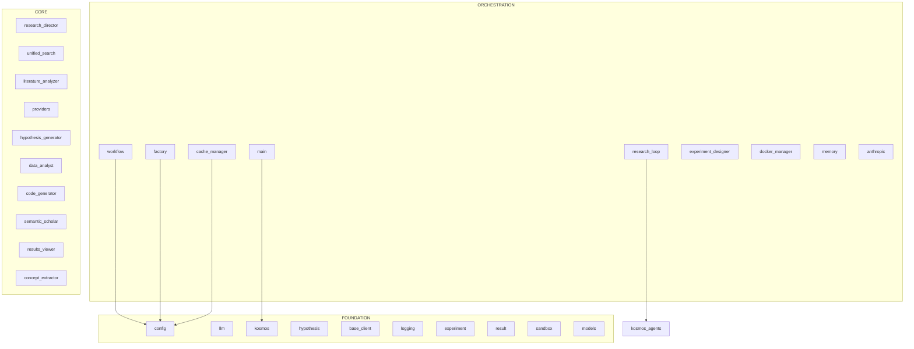

# Kosmos: Developer Warm Start

> Context-efficient onboarding guide for AI programmers.
> Generated: 2025-12-12
> Token budget: 50K target

---

## 1. System Context

### Architecture View


> Generated with: `python .claude/skills/repo-xray/scripts/dependency_graph.py kosmos/ --mermaid`

---

## 2. Architecture Overview

Kosmos is an AI-powered autonomous scientific research system built on Claude. It orchestrates multiple specialized agents to:
- Search and analyze scientific literature
- Generate testable hypotheses
- Design computational experiments
- Execute code in sandboxed environments
- Analyze results and iterate

The system follows a layered architecture:
- **Foundation**: Configuration, LLM abstraction, data models
- **Core**: Specialized agents (research director, hypothesis generator, data analyst)
- **Orchestration**: Workflow coordination, CLI, caching

---

## 3. Critical Classes

### Entry Points
| Class | File | Purpose |
|-------|------|---------|
| `cli.main` | `kosmos/cli/main.py` | CLI entry point |
| `kosmos.core.workflow` | `kosmos/core/workflow.py` | Main workflow orchestrator |

### Core Components
| Class | File | Purpose |
|-------|------|---------|
| `BaseAgent` | `kosmos/agents/base.py:L97` | Base class for all agents |
| `ResearchDirector` | `kosmos/agents/research_director.py` | Coordinates research activities |
| `DataAnalystAgent` | `kosmos/agents/data_analyst.py:L96` | Analyzes experiment results |
| `ExperimentDesignerAgent` | `kosmos/agents/experiment_designer.py:L48` | Designs experimental protocols |
| `HypothesisGeneratorAgent` | `kosmos/agents/hypothesis_generator.py` | Generates hypotheses |

### Data Models
| Model | File | Purpose |
|-------|------|---------|
| `Hypothesis` | `kosmos/models/hypothesis.py` | Hypothesis data structure |
| `Experiment` | `kosmos/models/experiment.py` | Experiment configuration |
| `ExperimentResult` | `kosmos/models/result.py` | Result data structure |
| `AgentMessage` | `kosmos/agents/base.py:L45` | Inter-agent communication |

---

## 4. Data Flow

```
User Input (Research Goal)
    |
    v
[1] cli.main -> parse arguments
    |
    v
[2] core.workflow -> initialize research
    |
    +---> [3] ResearchDirector.start()
    |           |
    |           +---> LiteratureAnalyzer -> search papers
    |           |
    |           +---> HypothesisGenerator -> generate hypotheses
    |
    +---> [4] ExperimentDesigner.design()
    |           |
    |           +---> CodeGenerator -> generate code
    |
    +---> [5] Executor.run() (sandboxed)
    |           |
    |           +---> Docker/local sandbox
    |
    +---> [6] DataAnalyst.analyze()
              |
              v
         Final Results -> World Model
```

---

## 5. Entry Points

### CLI Commands
```bash
# Main entry point
kosmos run "research goal" [--config config.yaml]

# With specific options
kosmos run "analyze gene expression" --output results/
```

### Python API
```python
from kosmos import Kosmos
from kosmos.core.workflow import Workflow

# Initialize
client = Kosmos(config_path="config.yaml")

# Run research
workflow = Workflow(config)
results = await workflow.run("research goal")
```

### Key Imports
```python
from kosmos.config import Config
from kosmos.agents.base import BaseAgent, AgentMessage
from kosmos.models.hypothesis import Hypothesis
from kosmos.models.experiment import Experiment
```

---

## 6. Context Hazards

**DO NOT READ these directories/files** - they consume context without providing architectural insight:

### Large Data Directories
- `neo4j_data/` - Database files (67M+ tokens)
- `kosmos-figures/` - Research figure data
- `kosmos-reference/` - Reference implementations
- `.coverage`, `coverage.xml` - Test coverage data

### Large Files
| File | Tokens | Reason |
|------|--------|--------|
| `neo4j_data/transactions/*` | 67M | Database transactions |
| `kosmos-figures/**/*.csv` | 1-4M | Data files |
| `*.ipynb` in kosmos-figures | 100K+ | Jupyter notebooks |

### File Extensions to Skip
- `.db`, `.jar`, `.pkl`, `.pyc`
- `.csv`, `.jsonl` (data files)
- `.xsd` (XML schemas)

---

## 7. Quick Verification

```bash
# Check system health
kosmos doctor

# Run quick sanity tests
pytest tests/unit -x -q

# Verify imports
python -c "from kosmos import Kosmos; from kosmos.core.workflow import Workflow; print('OK')"
```

---

## 8. X-Ray Commands

Use these scripts to explore further without consuming full context:

```bash
# Map directory structure with token estimates
python .claude/skills/repo-xray/scripts/mapper.py kosmos/ --summary

# Extract class/method skeletons (95% token reduction)
python .claude/skills/repo-xray/scripts/skeleton.py kosmos/

# Filter by priority level (critical, high, medium, low)
python .claude/skills/repo-xray/scripts/skeleton.py kosmos/ --priority critical

# Analyze import dependencies
python .claude/skills/repo-xray/scripts/dependency_graph.py kosmos/

# Generate Mermaid diagram for documentation
python .claude/skills/repo-xray/scripts/dependency_graph.py kosmos/ --mermaid

# Focus on specific area
python .claude/skills/repo-xray/scripts/dependency_graph.py kosmos/ --focus agents
```

### Token Budget Reference
| Operation | Tokens | Use When |
|-----------|--------|----------|
| mapper.py --summary | ~500 | First exploration |
| skeleton.py (1 file) | ~200-500 | Understanding interface |
| skeleton.py --priority critical | ~5K | Core architecture |
| dependency_graph.py | ~3K | Import relationships |
| dependency_graph.py --mermaid | ~500 | Documentation diagrams |

---

## 9. Architecture Layers

### Foundation (Most Imported)
| Module | Imported By | Imports |
|--------|-------------|---------|
| kosmos.config | 132+ | 2 |
| kosmos.core.llm | 45+ | 8 |
| kosmos | 40+ | 1 |
| kosmos.models.hypothesis | 25+ | 3 |
| kosmos.literature.base_client | 20+ | 2 |
| kosmos.core.logging | 18+ | 1 |
| kosmos.models.experiment | 15+ | 2 |
| kosmos.models.result | 12+ | 2 |
| kosmos.execution.sandbox | 10+ | 3 |
| kosmos.world_model.models | 8+ | 2 |

### Core
| Module | Imported By | Imports |
|--------|-------------|---------|
| kosmos.agents.research_director | 5 | 12 |
| kosmos.literature.unified_search | 4 | 8 |
| kosmos.agents.literature_analyzer | 3 | 10 |
| kosmos.agents.hypothesis_generator | 3 | 9 |
| kosmos.agents.data_analyst | 3 | 8 |
| kosmos.execution.code_generator | 3 | 7 |

### Orchestration (Most Imports)
| Module | Imported By | Imports |
|--------|-------------|---------|
| kosmos.core.workflow | 2 | 15 |
| kosmos.workflow.research_loop | 1 | 12 |
| kosmos.cli.main | 1 | 10 |
| kosmos.world_model.factory | 2 | 8 |
| kosmos.core.cache_manager | 3 | 6 |

---

## 10. Risk Assessment

### High-Risk Files (volatile in past 6 months)
| File | Risk | Churn | Hotfixes | Authors |
|------|------|-------|----------|---------|
| kosmos/config.py | 0.96 | 23 | 14 | 4 |
| kosmos/agents/research_director.py | 0.82 | 17 | 13 | 3 |
| kosmos/core/llm.py | 0.71 | 11 | 5 | 3 |
| kosmos/execution/executor.py | 0.68 | 9 | 5 | 3 |
| kosmos/cli/commands/run.py | 0.67 | 11 | 9 | 2 |
| kosmos/core/providers/anthropic.py | 0.66 | 8 | 4 | 3 |
| kosmos/cli/main.py | 0.65 | 10 | 6 | 2 |
| kosmos/core/async_llm.py | 0.62 | 6 | 3 | 3 |
| kosmos/core/providers/openai.py | 0.62 | 8 | 4 | 2 |
| kosmos/execution/sandbox.py | 0.62 | 6 | 3 | 3 |

*Risk factors: churn (commit frequency), hotfixes (bug-fix commits), author entropy (coordination overhead)*

> Generated with: `python .claude/skills/repo-xray/scripts/git_analysis.py kosmos/ --risk`

---

## 11. Hidden Coupling

### Files That Change Together
*No significant coupling pairs detected in recent history.*

This indicates clean module boundaries - files are generally modified independently without hidden dependencies.

> Generated with: `python .claude/skills/repo-xray/scripts/git_analysis.py kosmos/ --coupling`

---

## 12. Potential Dead Code

### Orphan Files (zero importers)
| File | Confidence | Notes |
|------|------------|-------|
| examples/03_placeholder.py | 0.95 | Name suggests superseded |
| examples/04_placeholder.py | 0.95 | Name suggests superseded |
| examples/05_placeholder.py | 0.95 | Name suggests superseded |
| examples/06_placeholder.py | 0.95 | Name suggests superseded |
| examples/07_placeholder.py | 0.95 | Name suggests superseded |
| examples/10_placeholder.py | 0.95 | Name suggests superseded |
| alembic/env.py | 0.90 | Database migration (entry point) |
| alembic/versions/*.py | 0.90 | Database migrations |

### Dormant Files (no changes in 180+ days)
*No dormant files detected - all files active within 90 days.*

### Freshness Summary
| Category | File Count | Description |
|----------|------------|-------------|
| Active | 682 | Changed in last 30 days |
| Aging | 122 | Changed 30-90 days ago |
| Stale | 0 | Changed 90-180 days ago |
| Dormant | 0 | Not changed in 180+ days |

*Candidates for removal or archival. Verify before deleting.*

> Generated with: `python .claude/skills/repo-xray/scripts/dependency_graph.py kosmos/ --orphans`
> Generated with: `python .claude/skills/repo-xray/scripts/git_analysis.py kosmos/ --freshness`

---

*This document was generated by the repo_architect agent using the repo-xray skill.*
*To refresh: `@repo_architect refresh`*
